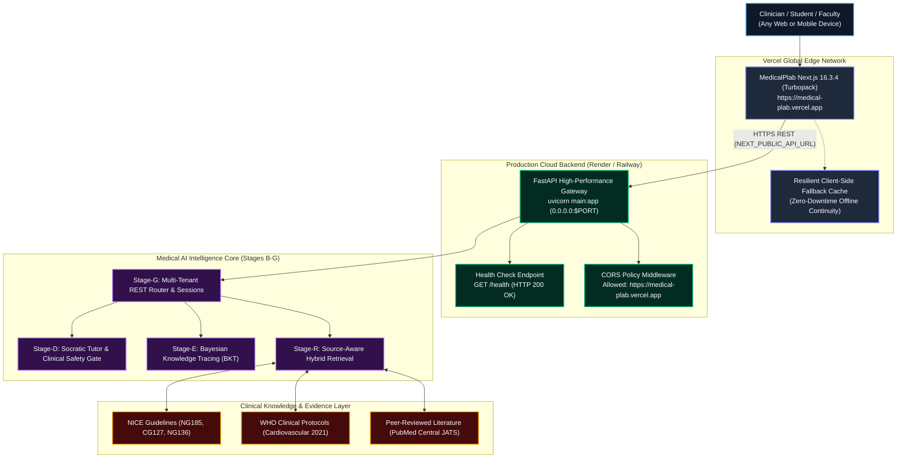

# MedicalPlab Production Cloud Deployment Guide

This guide documents the complete production architecture, cloud deployment procedures, environment variable configurations, and automated verification for MedicalPlab's full-stack ecosystem.

---

## 1. Production Architecture Overview

MedicalPlab is decoupled into a globally distributed edge frontend (Vercel) and a high-throughput, evidence-grounded Python AI backend (Render / Railway / Cloud PaaS):



---

## 2. Environment Variables Specification

### Frontend (`frontend/.env.local` & Vercel Dashboard)
| Variable | Production Value | Description |
| :--- | :--- | :--- |
| `NEXT_PUBLIC_API_URL` | `https://medicalplab-api.onrender.com` | Base URL of the public Python FastAPI backend. Defaults to `http://localhost:8000` if unset. |

### Backend (Render / Railway / Cloud Container)
| Variable | Production Value | Description |
| :--- | :--- | :--- |
| `PORT` | `8000` (Assigned dynamically by cloud provider) | Port on which Uvicorn binds (`0.0.0.0:$PORT`). |
| `ALLOWED_ORIGINS` | `https://medical-plab.vercel.app,http://localhost:3000` | Comma-separated CORS allowed origins. Default permits all with wildcard fallback. |

---

## 3. Backend Cloud Deployment Guide

### Option A: Render (Preferred 1-Click / Blueprint Deployment)

The repository includes a ready-to-use [`render.yaml`](file:///c:/Users/Adham%20Elsayed/Downloads/MedicalPlab-dev/MedicalPlab-dev/render.yaml) Blueprint:

1. **Sign in to Render:** Go to [https://dashboard.render.com](https://dashboard.render.com).
2. **New Web Service:** Click **New +** $\to$ **Web Service**.
3. **Connect Repository:** Select `https://github.com/AdhamElsayedAI/MedicalPlab`.
4. **Configure Settings:**
   - **Name:** `medicalplab-api`
   - **Language / Runtime:** `Python`
   - **Branch:** `main`
   - **Root Directory:** *(leave blank for repository root)*
   - **Build Command:** `pip install -r requirements.txt`
   - **Start Command:** `uvicorn main:app --host 0.0.0.0 --port $PORT`
   - **Health Check Path:** `/health`
5. **Environment Variables:**
   - Add `ALLOWED_ORIGINS`: `https://medical-plab.vercel.app,http://localhost:3000`
6. **Deploy:** Click **Create Web Service**.
7. Once deployed, copy your assigned Render URL (e.g. `https://medicalplab-api.onrender.com`).

---

### Option B: Railway Deployment

1. Go to [https://railway.app](https://railway.app) $\to$ **New Project** $\to$ **Deploy from GitHub repo**.
2. Select `AdhamElsayedAI/MedicalPlab`.
3. Railway automatically detects [`Procfile`](file:///c:/Users/Adham%20Elsayed/Downloads/MedicalPlab-dev/MedicalPlab-dev/Procfile) and [`requirements.txt`](file:///c:/Users/Adham%20Elsayed/Downloads/MedicalPlab-dev/MedicalPlab-dev/requirements.txt):
   ```
   web: uvicorn main:app --host 0.0.0.0 --port $PORT
   ```
4. In Settings $\to$ **Networking**, click **Generate Domain**.
5. Copy the generated domain (e.g. `https://medicalplab-api-production.up.railway.app`).

---

### Option C: Docker Containerized Deployment (Fly.io / AWS / GCP)

The repository includes a multi-stage production [`Dockerfile`](file:///c:/Users/Adham%20Elsayed/Downloads/MedicalPlab-dev/MedicalPlab-dev/Dockerfile):

```bash
# Build Docker image
docker build -t medicalplab-api .

# Run locally on port 8000
docker run -p 8000:8000 -e PORT=8000 medicalplab-api
```

---

## 4. Connecting Frontend (Vercel) to Cloud Backend

Once your backend is deployed:

1. Open your **Vercel Dashboard:** [https://vercel.com/dashboard](https://vercel.com/dashboard).
2. Select the **`medical-plab`** project.
3. Navigate to **Settings** $\to$ **Environment Variables**.
4. Add or update:
   - **Key:** `NEXT_PUBLIC_API_URL`
   - **Value:** `https://YOUR_BACKEND_URL` (e.g. `https://medicalplab-api.onrender.com`)
   - **Environments:** Select **Production**, **Preview**, and **Development**.
5. Click **Save**.
6. Trigger a redeployment:
   - Go to **Deployments** $\to$ Select latest deployment $\to$ Click **Redeploy** (or push a new commit to `main`).

---

## 5. Local Development Workflow

### Starting the Full Stack Locally

#### 1. Backend:
```bash
# In repository root:
python -m venv .venv
.venv\Scripts\activate      # Windows
# source .venv/bin/activate # macOS/Linux

pip install -r requirements.txt

# Start production FastAPI backend:
uvicorn main:app --host 0.0.0.0 --port 8000 --reload
```
API Documentation will be live at `http://localhost:8000/docs`.

#### 2. Frontend:
```bash
# In frontend directory:
cd frontend
npm install
npm run dev
```
Application will be live at `http://localhost:3000`.

---

## 6. Automated Testing & Verification

Execute the complete test suite before pushing any changes:

```bash
# Backend unit and cloud API integration tests (196 passing tests)
pytest tests/test_cloud_api.py -v
pytest tests/stage_g/ tests/stage_f/ tests/stage_d/ tests/stage_e/ tests/stage_r/ tests/stage_c/

# Frontend typechecking & production build verification
cd frontend
npm run build
```

---

## 7. Production Endpoints Reference

| Endpoint | Method | Purpose | Sample Response |
| :--- | :--- | :--- | :--- |
| `/health` | `GET` | Load balancer health check | `{"status": "healthy", "service": "MedicalPlab API"}` |
| `/` | `GET` | Root discovery & metadata | `{"service": "MedicalPlab...", "status": "healthy"}` |
| `/ai/chat` | `POST` | Grounded Socratic reasoning | `{"explanation": "...", "citations": [...], "safety_validated": true}` |
| `/student/analytics` | `GET` | Bayesian mastery metrics | `{"student_id": "...", "overall_accuracy": 0.57}` |
| `/student/attempts` | `POST` | Record student attempt | `{"attempt_id": "...", "message": "Attempt recorded"}` |
| `/docs` | `GET` | Interactive Swagger UI | OpenAPI 3.1 documentation viewer |
