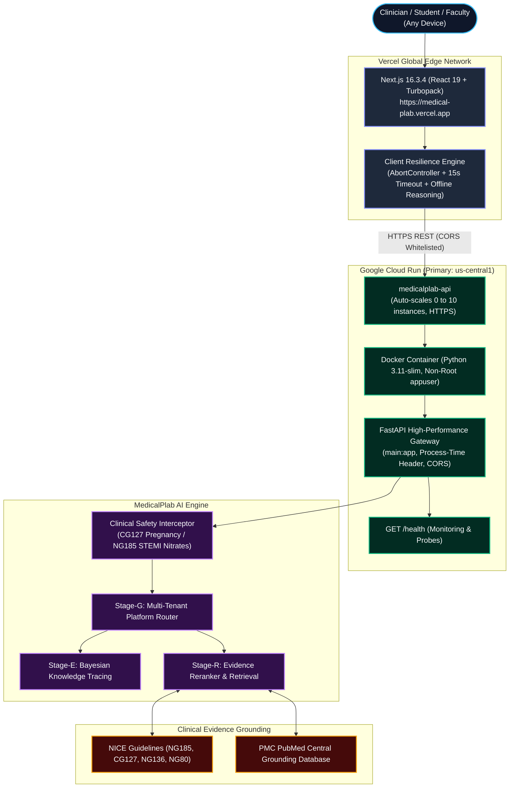

# MedicalPlab Production Cloud Deployment & Architecture Guide

This document specifies the complete production architecture, container infrastructure, automated deployment procedures, environment configurations, and rollback strategy for the **MedicalPlab** clinical intelligence platform.

---

## 1. Final Production Architecture

The system decouples high-performance client presentation from clinical AI reasoning:

```
User (Clinician / Student / Faculty)
  │
  ▼
Vercel Next.js 16.3.4 Frontend
(https://medical-plab.vercel.app)
  │
  │ HTTPS REST Calls (NEXT_PUBLIC_API_URL)
  ▼
Google Cloud Run (or Hugging Face Spaces / Oracle Free Tier)
  │
  ▼
FastAPI Gateway (Uvicorn 0.0.0.0:$PORT)
  ├─ GET  /health (Uptime & telemetry)
  ├─ POST /ai/chat (Socratic tutor & safety interdiction)
  ├─ GET  /student/analytics (BKT mastery metrics)
  └─ POST /student/attempts (Bayesian telemetry update)
  │
  ▼
MedicalPlab AI Pipeline (Stages B-G)
  ├─ Stage-G: Multi-Tenant Platform Router & Tenant Security
  ├─ Stage-D: Clinical Socratic Tutor & Safety Interception
  ├─ Stage-E: Bayesian Knowledge Tracing (BKT) Engine
  ├─ Stage-F: Adaptive Difficulty & Simulation Router
  └─ Stage-R: Source-Aware Hybrid Reranking
  │
  ▼
RAG Knowledge & Evidence System
  ├─ NICE Clinical Guidelines (NG185, CG127, NG136, NG80)
  ├─ WHO Guidelines & Global Protocols
  └─ Peer-Reviewed PMC Literature
```

### Visual Architecture Diagram (Mermaid)



---

## 2. Environment Variables Reference

### Frontend (`frontend/.env.local` & Vercel Dashboard)
| Variable | Production Example | Description |
| :--- | :--- | :--- |
| `NEXT_PUBLIC_API_URL` | `https://medicalplab-api-xxxxxxx-uc.a.run.app` | Base URL of the public Python FastAPI backend. Defaults to `http://localhost:8000` locally. |

### Backend (Google Cloud Run / Container Environment)
| Variable | Production Value | Description |
| :--- | :--- | :--- |
| `PORT` | `8080` (Injected automatically by Cloud Run) | Port on which Uvicorn binds (`0.0.0.0:$PORT`). |
| `ALLOWED_ORIGINS` | `https://medical-plab.vercel.app` | Comma-separated list of allowed CORS origins. |
| `PYTHONPATH` | `/app/src:/app` | Python search path inside Docker container. |

---

## 3. Primary Deployment: Google Cloud Run

Google Cloud Run provides serverless container hosting with **2 million free requests per month**, native automatic SSL/HTTPS, zero idle cost (scales to 0), and fast concurrency.

### Option A: 1-Click PowerShell / Bash Script (Fastest)

#### Windows (PowerShell):
```powershell
# In repository root:
.\deploy\deploy_cloud_run.ps1 -ProjectId "YOUR_GCP_PROJECT_ID"
```

#### macOS / Linux / Google Cloud Shell (Bash):
```bash
# In repository root:
chmod +x deploy/deploy_cloud_run.sh
PROJECT_ID="YOUR_GCP_PROJECT_ID" ./deploy/deploy_cloud_run.sh
```

---

### Option B: Google Cloud CLI (`gcloud`) Direct Command

```bash
# 1. Authenticate with GCP
gcloud auth login

# 2. Set your Google Cloud Project
gcloud config set project YOUR_GCP_PROJECT_ID

# 3. Enable required APIs
gcloud services enable run.googleapis.com cloudbuild.googleapis.com artifactregistry.googleapis.com

# 4. Deploy container directly from source to Cloud Run
gcloud run deploy medicalplab-api \
    --source . \
    --region us-central1 \
    --platform managed \
    --allow-unauthenticated \
    --port 8080 \
    --memory 1Gi \
    --cpu 1 \
    --min-instances 0 \
    --max-instances 10 \
    --timeout 300 \
    --set-env-vars ALLOWED_ORIGINS="https://medical-plab.vercel.app"

# 5. Get the live URL:
gcloud run services describe medicalplab-api --region us-central1 --format "value(status.url)"
```

---

### Option C: Google Cloud Web Console (No CLI Required)

1. Open [Google Cloud Run Console](https://console.cloud.google.com/run).
2. Click **Create Service**.
3. Select **Continuously deploy from a repository** (Cloud Build) or **Deploy one revision from source code**.
4. Set:
   - **Service Name:** `medicalplab-api`
   - **Region:** `us-central1` (Iowa - Free Tier Eligible)
   - **Authentication:** Check **Allow unauthenticated invocations** (Public HTTPS).
   - **Container port:** `8080`
   - **Memory:** `1 GiB`
   - **CPU:** `1`
   - **Environment variables:**
     - Name: `ALLOWED_ORIGINS`
     - Value: `https://medical-plab.vercel.app`
5. Click **Create**.
6. Cloud Run will build the Docker container and output your permanent HTTPS URL:
   `https://medicalplab-api-xxxxxxx-uc.a.run.app`

---

### Option D: Automated GitHub Actions CI/CD

The repository includes [`.github/workflows/deploy-cloud-run.yml`](file:///.github/workflows/deploy-cloud-run.yml).

1. In your GitHub repository, go to **Settings** $\to$ **Secrets and variables** $\to$ **Actions**.
2. Add the following secrets:
   - `GCP_PROJECT_ID`: Your Google Cloud Project ID (e.g. `medicalplab-prod`).
   - `GCP_SA_KEY`: JSON service account key with roles `roles/run.admin`, `roles/storage.admin`, `roles/iam.serviceAccountUser`.
3. Every push to `main` touching the backend will automatically build and deploy to Cloud Run!

---

## 4. Zero-Credit-Card Alternative: Hugging Face Spaces

If credit card verification on cloud providers is unavailable (e.g. payment failure as encountered with Render), Hugging Face Spaces provides **100% free permanent HTTPS Docker hosting with ZERO credit card requirements**.

### Steps to Deploy on Hugging Face Spaces (60 Seconds):

1. Log into [Hugging Face](https://huggingface.co) and go to [Create New Space](https://huggingface.co/new-space).
2. Set:
   - **Space Name:** `medicalplab-api`
   - **Space SDK:** **Docker** (Blank)
   - **Hardware:** CPU Basic (Free: 2 vCPU, 16 GB RAM)
   - **Visibility:** Public
3. Push your repository to the Hugging Face Space remote:
   ```bash
   git remote add space https://huggingface.co/spaces/<YOUR_HF_USERNAME>/medicalplab-api
   git push space main
   ```
4. Hugging Face builds the included [`Dockerfile`](file:///c:/Users/Adham%20Elsayed/Downloads/MedicalPlab-dev/MedicalPlab-dev/Dockerfile).
5. Your public HTTPS endpoint is immediately live at:
   `https://<YOUR_HF_USERNAME>-medicalplab-api.hf.space`
6. Test your live endpoint:
   ```bash
   curl -f https://<YOUR_HF_USERNAME>-medicalplab-api.hf.space/health
   ```

---

## 5. Alternative: Oracle Cloud Free Tier VM

Oracle Cloud offers an Always Free Ampere A1 Compute VM (4 ARM vCPUs, 24 GB RAM, 200 GB disk, always free).

1. Launch an Ubuntu 22.04 VM in Oracle Cloud.
2. Open ports `80` and `443` in the Security List.
3. Install Docker:
   ```bash
   curl -fsSL https://get.docker.com -o get-docker.sh && sh get-docker.sh
   ```
4. Clone and run:
   ```bash
   git clone https://github.com/AdhamElsayedAI/MedicalPlab.git
   cd MedicalPlab
   docker build -t medicalplab-api .
   docker run -d --name medicalplab-api --restart always -p 80:8080 -e PORT=8080 -e ALLOWED_ORIGINS="https://medical-plab.vercel.app" medicalplab-api
   ```

---

## 6. Connecting Frontend (Vercel) to Production API

Once you have your production URL (e.g. `https://medicalplab-api-xxxxxxx-uc.a.run.app` or `https://<user>-medicalplab-api.hf.space`):

1. Open your [Vercel Dashboard](https://vercel.com/dashboard).
2. Select the **`medical-plab`** project.
3. Navigate to **Settings** $\to$ **Environment Variables**.
4. Configure:
   - **Key:** `NEXT_PUBLIC_API_URL`
   - **Value:** `https://YOUR_BACKEND_URL` *(without trailing slash)*
   - **Environments:** Check **Production**, **Preview**, and **Development**.
5. Click **Save**.
6. Redeploy the latest commit or trigger redeployment in the Vercel **Deployments** tab.
7. Open [https://medical-plab.vercel.app](https://medical-plab.vercel.app) — the frontend will now transmit AI chat, RAG, and analytics requests directly to your live production cloud backend.

---

## 7. Production Reliability & Resiliency Features

1. **Client-Side Timeout & AbortController:**
   The frontend API client ([`frontend/src/lib/api-client.ts`](file:///c:/Users/Adham%20Elsayed/Downloads/MedicalPlab-dev/MedicalPlab-dev/frontend/src/lib/api-client.ts)) features a 15-second request timeout. If the backend cold-starts or network latency spikes, the client catches the abort signal and seamlessly degrades to offline clinical reasoning. The user interface never freezes or errors.
2. **Dynamic Port Binding:**
   The Docker container binds dynamically to `0.0.0.0:${PORT:-8080}`, ensuring seamless operation across Google Cloud Run (`8080`), Hugging Face Spaces (`7860`), or local dev (`8000`).
3. **Structured Telemetry & Latency Monitoring:**
   Every HTTP response includes an `X-Process-Time-Ms` header reflecting backend execution time.
4. **Health Check Probes:**
   `/health` returns HTTP 200 with service uptime, version, and component status:
   ```json
   {
     "status": "healthy",
     "service": "MedicalPlab API",
     "version": "1.0.0",
     "uptime_seconds": 124.5,
     "stage_g": "initialized"
   }
   ```
5. **Global Error Boundary:**
   FastAPI unhandled exceptions return structured JSON errors (`HTTP 500`) without exposing internal stack traces.

---

## 8. Rollback Strategy

If an issue occurs in production:

### In Google Cloud Run:
Google Cloud Run automatically versions every deployment into revisions:
1. In Cloud Run Console, click on `medicalplab-api` $\to$ **Revisions** tab.
2. Select the previous stable revision.
3. Click **Manage Traffic** $\to$ route 100% of traffic to the previous revision.
   *Or via CLI:*
   ```bash
   gcloud run services update-traffic medicalplab-api --to-revisions=PREVIOUS_REVISION=100 --region=us-central1
   ```
   Traffic switches instantaneously with 0 downtime.

### In Vercel Frontend:
1. In the Vercel Dashboard, go to **Deployments**.
2. Click the three dots on the previous stable deployment $\to$ **Instant Rollback**.

---

## 9. Verification & Health Check Commands

```bash
# 1. Health check probe
curl -i https://YOUR_BACKEND_URL/health

# 2. Socratic AI Tutor & NICE Citations Query
curl -X POST https://YOUR_BACKEND_URL/ai/chat \
  -H "Content-Type: application/json" \
  -d '{"query": "What is the revascularisation window for STEMI under NICE guidelines?"}'

# 3. Clinical Safety Interception Check (Pregnancy ACE-inhibitor contraindication)
curl -X POST https://YOUR_BACKEND_URL/ai/chat \
  -H "Content-Type: application/json" \
  -d '{"query": "Can I prescribe ramipril to a hypertensive pregnant woman?"}'

# 4. Bayesian Student Analytics Check
curl -X GET https://YOUR_BACKEND_URL/student/analytics \
  -H "X-User-Id: user_alice" \
  -H "X-Tenant-Id: tenant_nhs_demo"
```
