# MedicalPlab

### Adaptive Evidence-Grounded Medical Learning Platform

<p align="center">
  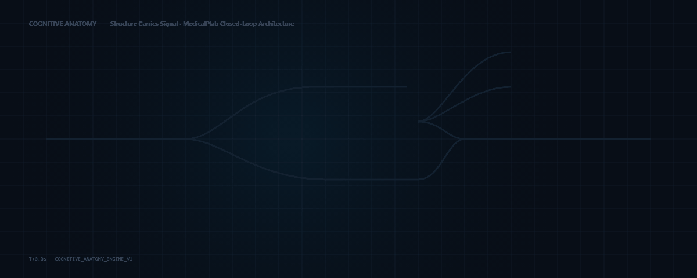
</p>

> **"MedicalPlab does not only answer students. It learns how students learn."**

MedicalPlab is an adaptive, evidence-grounded medical learning intelligence platform engineered to replace passive multiple-choice memorization and unconstrained medical chatbot wrappers. It couples evidence-grounded generative tutoring bounded by peer-reviewed literature, distractor-level reasoning pattern signals, multi-turn bounded Socratic remediation, independent held-out clinical transfer verification, interactive 3D spatial anatomy from the NIH HuBMAP Human Reference Atlas, and clinician-governed examination content into a unified, closed-loop educational system.

<p align="center">
  <a href="https://www.python.org/"></a>
  <a href="https://fastapi.tiangolo.com/"></a>
  <a href="https://nextjs.org/"></a>
  <a href="https://threejs.org/"></a>
  <a href="#engineering-confidence"></a>
  <a href="docs/mobile-handoff/API_CONTRACT.md"></a>
  <a href="#run-medicalplab-locally"></a>
</p>

---

### Quick Navigation

[Why MedicalPlab Is Different](#why-medicalplab-is-different) • [The Learning Loop](#the-medicalplab-learning-loop) • [Where GenAI Fits](#where-generative-ai-actually-fits) • [Product Capabilities](#product-capabilities) • [Evidence Architecture](#evidence-grounded-architecture) • [Cognitive Anatomy](#cognitive-anatomy) • [Engineering Confidence](#engineering-confidence) • [Demo Journey](#demo-journey) • [Run Locally](#run-medicalplab-locally) • [Safety by Design](#safety-by-design) • [Beyond LLM Wrappers](#why-this-is-more-than-an-llm-wrapper) • [Current Status](#current-project-status) • [Roadmap](#future-roadmap) • [Startup Evaluation](#startup--demo-evaluation) • [Documentation](#documentation-navigation) • [Product Brief](docs/handoff/FINAL_PRODUCT_BRIEF.md)

---

## Why MedicalPlab Is Different

MedicalPlab departs fundamentally from conventional medical education software and generic conversational AI wrappers across seven architectural boundaries:

### 1. Learner State, Not Stateless Chat
Most medical AI tools operate statelessly: prompt &rarr; answer &rarr; forget. MedicalPlab maintains persistent, multi-topic learner state machines. Learning history, mastery trajectories, and error distributions persist across preclinical curricular questions, AI tutor discussions, and 3D spatial anatomy challenges.

### 2. Wrong Answer &ne; Confirmed Misconception
In MedicalPlab, an incorrect response is treated as an informative signal rather than an automatic mark of incompetence. Selected distractors are mapped against a curated clinical taxonomy to identify *provisional heuristic reasoning signals*. They represent educational hypotheses to investigate through targeted scaffolding—never definitive diagnoses of learner ability.

### 3. Bounded Socratic Remediation
When a student selects a diagnostic distractor, the platform does not simply give away the answer or show a wall of text. It initiates a bounded 3-turn Socratic remediation sequence (Probe &rarr; Guide &rarr; Consolidate) that scaffolds physiological reasoning without disclosing the answer key.

### 4. Independent Transfer Verification
Dialogue alone does not confirm mastery. A student can easily parrot an explanation without understanding the underlying mechanism. MedicalPlab enforces an independent transfer firewall: the learner must successfully solve an unprompted, structurally distinct held-out clinical vignette before transfer is confirmed and learner state advances.

### 5. Evidence-Grounded Generative Tutoring
The generative model is never presented as the source of medical truth. The AI Tutor follows a strict verification pipeline:
$$\text{TutorService} \longrightarrow \text{Shared Evidence Engine} \longrightarrow \text{Retrieval} \longrightarrow \text{Rights/Provenance} \longrightarrow \text{NLI Verification} \longrightarrow \text{Grounded Output / Safe Fallback}$$
Medical statements are broken down into atomic propositions and verified for entailment against open-access PubMed Central literature. If evidence is insufficient, the system safely falls closed to procedural Socratic guidance with zero unverified claims.

### 6. Cognitive Anatomy: "Structure Carries Signal"
Anatomy is not an ornamental 3D viewer. Generative AI orchestrates educational intent and structured scene actions (`FOCUS_STRUCTURE`, `HIGHLIGHT_STRUCTURE`), while Three.js renders immutable, scientifically validated NIH HuBMAP Human Reference Atlas geometry. Structure identification challenges are scored deterministically by backend raycasting on anatomical ontology IDs.

### 7. Governed PLAB Exam Content
Candidate examination questions are structurally segregated under **Preview QA** governance. Candidate questions cannot self-promote into public production curriculum without independent clinician review panel sign-off (`PLAB_GOLDEN_PROMOTION_REQUIRED = YES`, Golden released = 0, Preview QA = 36).

---

## The MedicalPlab Learning Loop

The closed-loop cognitive learning spine connects diagnostic interaction directly to verified conceptual transfer:

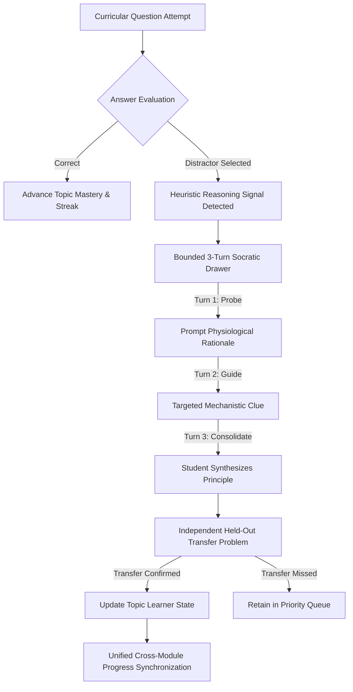

<p align="center">
  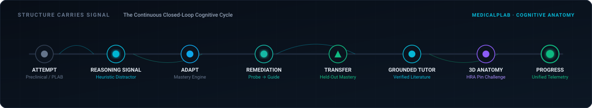
</p>

| Stage | Cognitive Objective | Pedagogical Mechanism |
| :--- | :--- | :--- |
| **1. Diagnostic Attempt** | Preclinical assessment | Clinical vignette with high-yield distractor taxonomy |
| **2. Reasoning Signal** | Misconception hypothesis | Distractor maps to heuristic reasoning pattern |
| **3. Socratic Scaffolding**| Guided self-correction | Bounded 3-turn dialogue: Probe &rarr; Guide &rarr; Consolidate |
| **4. Transfer Firewall** | Verification of generalization | Unprompted, held-out clinical item (`UNI-RENAL-001-T`) |
| **5. Grounded Tutoring** | Literature deep-dive | Hybrid BM25/Dense RAG with proposition-level NLI verification |
| **6. Spatial Grounding** | Physical organ architecture | Canonical HuBMAP 3D models with deterministic raycast challenge |
| **7. Unified Progress** | Longitudinal competence tracking | Synchronized progress across questions, tutor turns, and 3D tasks |

---

## Where Generative AI Actually Fits

MedicalPlab maintains an explicit, non-negotiable boundary between **Generative Intelligence** and **Deterministic Safety**:

```
┌────────────────────────────────────────────────────────────────────────┐
│               GENERATIVE CAPABILITIES (Educational AI)                 │
│  • Synthesizes multi-turn Socratic probing questions                   │
│  • Generates accessible mechanistic explanations from retrieved chunks  │
│  • Emits structured JSON scene actions (camera moves, highlights)      │
│  • Recommends adaptive curriculum pacing from learner state heuristics │
└───────────────────────────────────┬────────────────────────────────────┘
                                    │
                                    ▼ Passes through
┌────────────────────────────────────────────────────────────────────────┐
│           DETERMINISTIC VERIFICATION BOUNDARY (Medical Truth)          │
│  • Shared Evidence Engine verifies CC-BY open-access PMC provenance    │
│  • NLI Claim Verifier validates atomic propositions (Entailment Gate)  │
│  • Fail-closed SAFE_FALLBACK triggered if evidence is insufficient     │
│  • Three.js raycaster scores 3D structure clicks deterministically     │
│  • Transfer challenge correctness evaluated against immutable keys    │
│  • Clinician panel review strictly gates candidate PLAB exam content   │
└────────────────────────────────────────────────────────────────────────┘
```

<p align="center">
  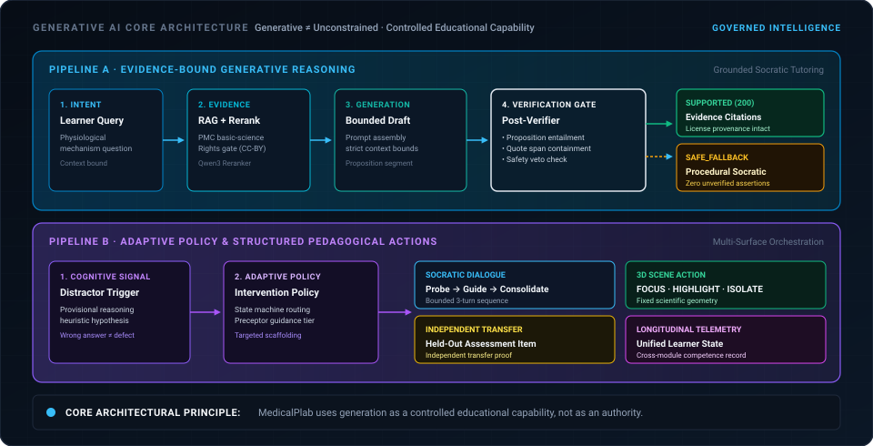
</p>

### What Generative AI Does
* Powers pedagogical dialogue during bounded Socratic remediation.
* Generates clear, concise clinical explanations bounded strictly by retrieved excerpts.
* Formulates structured scene orchestration payloads dispatched to the Three.js viewport.

### What Generative AI NEVER Controls
* **Medical Truth:** The language model is not the authority; peer-reviewed PMC literature is.
* **Challenge Scoring:** Transfer questions and 3D anatomy pins evaluate deterministically.
* **Anatomical Geometry:** 3D meshes are immutable NIH HuBMAP scientific assets; AI never generates or deforms geometry.
* **Examination Governance:** AI cannot promote candidate PLAB questions to released status.

---

## Product Capabilities

Every capability described below is fully implemented, certified by automated test suites, and runnable locally:

### 1. University Learning & Preclinical Assessment
Foundational preclinical curriculum featuring multi-choice items paired with explicit distractor reasoning taxonomies. Includes renal hemodynamics, glomerular filtration barrier dynamics, and RAAS physiology with immediate deterministic scoring.

<p align="center">
  
</p>

### 2. Adaptive Learning & Derived Learner State
Dynamic cognitive tracking that monitors topic-level error distributions, streaks, and distractor selections. Derives adaptive recommendations for targeted remediation rather than passive question repetition.

### 3. Socratic Remediation Drawer
When a student selects a reasoning distractor, a slide-over Socratic drawer opens. The preceptor probes physiological reasoning across a strictly bounded 3-turn sequence (Probe &rarr; Guide &rarr; Consolidate), scaffolding the student toward understanding without revealing the correct option.

<p align="center">
  
</p>

### 4. Independent Held-Out Transfer Assessment
Following Socratic remediation, the system presents an unprompted, structurally distinct held-out transfer clinical vignette (`UNI-RENAL-001-T`). Transfer competence is only recorded when the student correctly applies the reconciled principle independently.

### 5. Evidence-Grounded AI Tutor
Interactive medical tutor backed by indexed open-access PubMed Central basic-science literature. Employs hybrid BM25 + dense retrieval, neural cross-encoder reranking, and sentence-level proposition entailment verification. Every response includes verifiable PMCID and DOI citations with open-access license provenance.

<p align="center">
  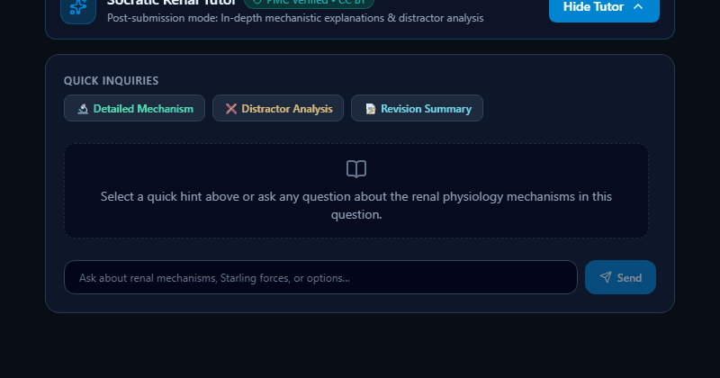
</p>

*Captured from the live MedicalPlab student practice experience during post-submission mechanistic analysis.*

### 6. Cognitive 3D Anatomy Lab
Interactive Three.js anatomical canvas rendering canonical NIH HuBMAP CCF kidney models. Features smooth camera transitions, guided anatomical tours (`renal_vein_left`), and deterministic structure identification challenges (`renal_artery_left`) evaluated via raycast ontology matching.

### 7. Unified Learner Progress
Cross-module telemetry engine that synchronizes preclinical question accuracy, Socratic completions, transfer problem success, tutor inquiries, and 3D anatomy pin scores into a unified learner profile.

<p align="center">
  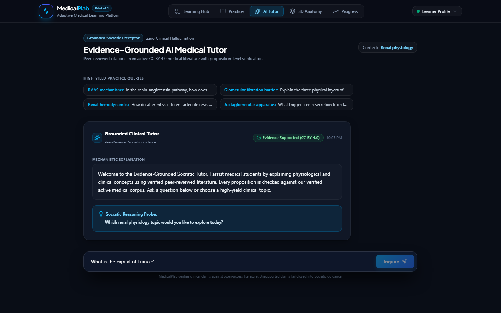
</p>

*When evidence is insufficient for proposition verification, the system falls closed into content-neutral procedural Socratic guidance with zero unverified claims.*

---

## Evidence-Grounded Architecture

MedicalPlab enforces a single, authoritative evidence retrieval and verification stack across all educational flows:

```
[Adaptive Layer / Tutor Interface]
                 │
                 ▼
          [TutorService]
                 │
                 ▼
     [Shared Evidence Engine]
                 │
  ┌──────────────┴──────────────┐
  │ Hybrid Retrieval            │ ──► BM25 Lexical + Dense Embeddings (RRF)
  │ Rights & License Gate       │ ──► Open-Access CC-BY PMC Literature Gating
  │ In-Domain Reranker          │ ──► Neural Cross-Encoder Reranking
  └──────────────┬──────────────┘
                 │ Top-k Chunks (Bounded Context)
                 ▼
     [Generative Reasoning Draft]
                 │ Unverified Draft
                 ▼
     [NLI Proposition Verifier]
                 │
        ┌────────┴────────┐
        │                 │
     [PASSED]          [FAILED]
        │                 │
        ▼                 ▼
  Grounded Output    SAFE_FALLBACK
  with Citations     (Content-neutral procedural
  (PMCID / DOI)       Socratic guidance; 0 claims)
```

<p align="center">
  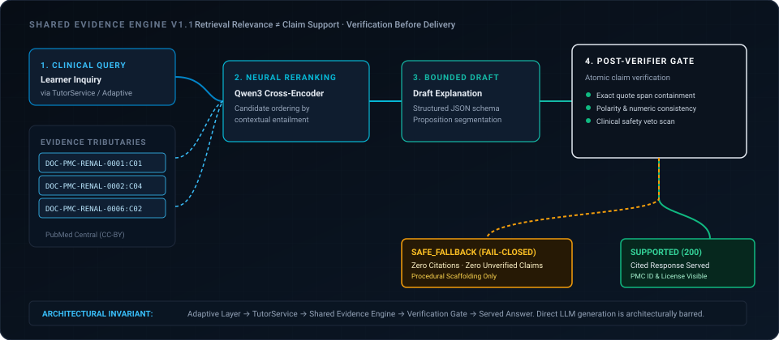
</p>

* **No Direct LLM Bypass:** The adaptive engine and question modules never access an unconstrained LLM directly; all generation routes through the verification and rights pipeline.
* **Unified Retrieval:** A single authoritative retrieval engine serves both preclinical tracks and clinical case discussions.
* **Fail-Closed Fallback:** When candidate support is insufficient or out of scope, the system safely triggers content-neutral procedural Socratic guidance (`SAFE_FALLBACK`) with zero substantive medical claims.

---

## Cognitive Anatomy

> **"Structure carries signal."**

In MedicalPlab, spatial anatomy is an active cognitive grounding instrument rather than an isolated cosmetic viewer:

<p align="center">
  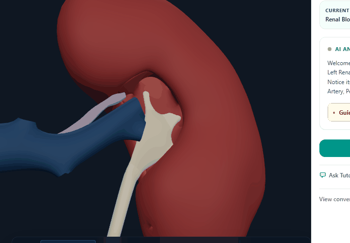
</p>

*Captured from the live MedicalPlab Three.js anatomy experience using licensed HuBMAP Human Reference Atlas assets.*

### Spatial Architecture & Boundaries
* **AI Orchestration vs. Immutable Geometry:** AI decides educational intent (`FOCUS_STRUCTURE`, `HIGHLIGHT_STRUCTURE`). The application validates structured actions. Three.js executes deterministic visual behavior. The model **never** generates or alters scientific anatomy geometry.
* **Scientific Provenance:** Meshes derive exclusively from the **NIH HuBMAP Human Reference Atlas (HRA)** registered to the Common Coordinate Framework (CCF v1.3/v2.0).
* **Guided Tour vs. Independent Challenge:**
  * **Guided Tour Target:** `renal_vein_left` (anterior hilar vascular relationship inspection).
  * **Independent Challenge Target:** `renal_artery_left` (independent structure identification).
  * The two targets are structurally separated and never conflated.
* **Deterministic Scoring:** Raycasted clicks from the Three.js viewport are verified on the backend against anatomical ontology IDs (`UBERON:0001120`).

<p align="center">
  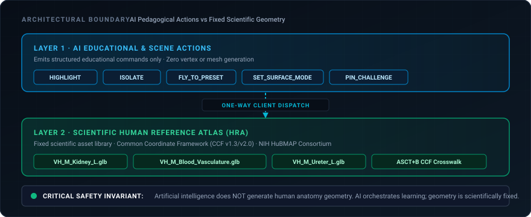
</p>

---

## Engineering Confidence

MedicalPlab functionality is certified through continuous deterministic testing, contract drift auditing, and production builds. Every figure below is verified against the current repository HEAD:

```
===================== CERTIFIED QUALITY GATE STATUS =====================
- Backend Integration Tests:       23 / 23 PASS (tests/integration/)
- Mobile API Contract Tests:       12 / 12 PASS (test_mobile_api_contract.py)
- OpenAPI Drift Verification:      PASS (43 paths, 44 operations matching)
- Staging Security Unit Gate:      15 / 15 PASS (tests/staging/test_staging_security.py)
- Frontend Production Build:       PASS (Next.js 16.3.4, React 19, Turbopack)
- Documentation Link Audit:        PASS (39 docs checked, 0 broken links)
- Clean Checkout Local Release:    PASS (verify_local_release.py)
- Docker Free-Memory Smoke:        PASS (512MB RAM limit, 0 ML model weights)
- GitHub Actions CI Workflows:     8 / 8 Jobs PASS (release branch HEAD)
=========================================================================
```

### Reproduce Local Verification
```powershell
# 1. Run one-command local release verification:
python Scripts/verify_local_release.py

# 2. Run backend integration suite:
python -m pytest tests/integration/ -v

# 3. Run mobile contract certification:
python -m pytest tests/integration/test_mobile_api_contract.py -v

# 4. Audit OpenAPI contract drift:
python Scripts/verify_mobile_contract_drift.py

# 5. Audit internal documentation links:
python Scripts/verify_repository_handoff.py
```

---

## Demo Journey

Follow this recommended 3-minute evaluation walkthrough to experience the full closed loop:

1. **Home (`/`):** Enter the unified Student Command Center and review available tracks.
2. **University Practice (`/university`):** Select *Renal physiology &rarr; RAAS mechanisms*. Review question `UNI-RENAL-001`.
3. **Trigger Distractor:** Select distractor `[B] Angiotensin II`. Observe instant deterministic evaluation capturing the cognitive inversion signal.
4. **Socratic Remediation Drawer:** Engage in the 3-turn remediation sequence:
   * *Turn 1 (Probe):* Preceptor asks to trace hydraulic pressure across the glomerular capillary bed.
   * *Turn 2 (Guide):* Preceptor guides focus to afferent vs efferent resistance mechanisms.
   * *Turn 3 (Consolidate):* Learner synthesizes the principle; system unlocks transfer.
5. **Independent Held-Out Transfer:** Click *Take Transfer Challenge*. System presents unprompted held-out clinical vignette `UNI-RENAL-001-T`. Answer `[A] Angiotensinogen` to confirm transfer.
6. **Evidence-Grounded Tutor (`/tutor`):** Ask *"Explain the role of renin in renal hemodynamics"*. Observe proposition verification and inspect verified PMC citations with license provenance.
7. **3D Spatial Anatomy (`/anatomy`):** Explore the HuBMAP CCF kidney model. Take the guided tour (`renal_vein_left`), then complete the independent pin challenge (`renal_artery_left`).
8. **Unified Progress (`/progress`):** Observe synchronized telemetry reflecting question accuracy, remediation completions, transfer problem success, and 3D anatomy scores.
9. **PLAB Preview QA (`/practice`):** Inspect candidate items under clinical governance (36 preview questions, 0 released golden items).

*For detailed click targets, consult the [Final Demo Runbook](docs/demo/FINAL_DEMO_RUNBOOK.md).*

---

## Run MedicalPlab Locally

MedicalPlab is **strictly local-first**. You can clone, configure, and run the entire product on standard CPU hardware without any cloud account, payment card, external staging server, or paid LLM API key.

### System Prerequisites
* **Python:** `3.11` or `3.12` (`pyproject.toml: ">=3.11,<3.13"`)
* **Node.js:** `>=20.9.0` (Recommended: `20 LTS` or `22 LTS`)
* **Hardware:** Standard CPU workstation (zero GPU or PyTorch CUDA setup required)

---

### Automated One-Command Launch (Fastest)

#### Windows (PowerShell)
```powershell
git clone https://github.com/AdhamElsayedAI/MedicalPlab.git
cd MedicalPlab
.\Scripts\start_local.ps1
```
*(If blocked by Windows execution policy, run: `powershell -ExecutionPolicy Bypass -File .\Scripts\start_local.ps1`)*

#### Linux / macOS (Bash)
```bash
git clone https://github.com/AdhamElsayedAI/MedicalPlab.git
cd MedicalPlab
./Scripts/start_local.sh
```

---

### Manual Setup (Two Terminals)

#### Terminal 1: Backend Service
```powershell
# Create & activate virtual environment
python -m venv .venv
.\.venv\Scripts\Activate.ps1    # On Unix: source .venv/bin/activate

# Install dependencies
python -m pip install --upgrade pip
pip install -r requirements.txt

# Bootstrap public-safe validation data & launch backend
python Scripts/bootstrap_local_data.py
uvicorn production_main:app --host 127.0.0.1 --port 8000
```

#### Terminal 2: Frontend Web Application
```powershell
cd frontend
npm install
npm run dev
```

---

### Authoritative Local Endpoints

| Service | Local URL | Purpose |
| :--- | :--- | :--- |
| **Frontend Web UI** | [http://localhost:3000](http://localhost:3000) | Complete student learning interface |
| **Backend API Health** | [http://127.0.0.1:8000/health](http://127.0.0.1:8000/health) | System health probe (returns HTTP 200) |
| **Readiness & Manifest** | [http://127.0.0.1:8000/ready](http://127.0.0.1:8000/ready) | Manifest verification & mode inspection |
| **Interactive OpenAPI Docs** | [http://127.0.0.1:8000/docs](http://127.0.0.1:8000/docs) | Swagger UI for interactive exploration |

*For advanced options, mobile emulator setup, and troubleshooting, consult the [Local Run Guide](docs/LOCAL_RUN_GUIDE.md) and [Mentor Runbook](docs/handoff/MENTOR_LOCAL_RUN.md).*

---

## Safety by Design

MedicalPlab is engineered for clinical education, prioritizing safety, truth boundaries, and verifiable evidence:

* **Evidence Insufficiency & Fail-Closed Fallback:** If candidate literature does not substantiate a generated proposition, the system triggers `SAFE_FALLBACK` rather than delivering unverified claims.
* **Reasoning Signals &ne; Incompetence:** Wrong answers represent provisional diagnostic hypotheses to guide dialogue, not immutable assessments of learner capability.
* **Deterministic Spatial Evaluation:** Raycasted clicks in the 3D canvas are evaluated deterministically against anatomical ontology IDs on the backend.
* **Strict Exam Segregation:** Candidate PLAB questions remain isolated behind Preview QA; zero candidate items self-promote to released golden curriculum without clinician panel review.
* **Open-Access Licensing Provenance:** Medical evidence chunks are admitted only from open-access PMC articles under verified Creative Commons licenses (`CC BY 4.0`, `CC BY 3.0`).
* **Educational Scope:** MedicalPlab is an educational and training platform, not a medical diagnostic device or clinical decision support system.

<p align="center">
  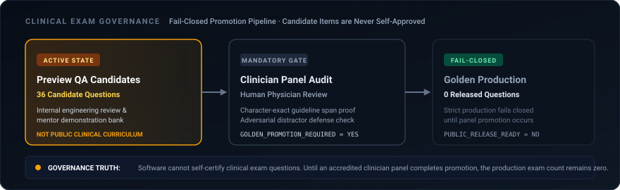
</p>

---

## Why This Is More Than an LLM Wrapper

MedicalPlab is fundamentally a **learning intelligence system**, not a thin API wrapper around a language model. The core value and product defensibility reside in the cognitive architecture surrounding the model:

1. **Persistent Cognitive State Machine:** Tracks topic-level mastery, error sequences, and distractor histories across disparate learning modalities.
2. **Proprietary Distractor Taxonomy:** Translates clinical errors into structured reasoning signals rather than generic wrong/right flags.
3. **Closed-Loop Socratic Remediation:** Bounded multi-turn dialogue that probes mechanism without disclosing the answer key.
4. **Independent Transfer Firewall:** Requires unprompted clinical generalization on unseen items before advancing mastery.
5. **Fail-Closed NLI Claim Verification:** Atomic proposition decomposition and entailment checking against retrieved evidence.
6. **Authoritative 3D Spatial Grounding:** NIH HuBMAP HRA anatomical meshes integrated directly with cognitive remediation and deterministic raycast scoring.
7. **Two-Tiered Clinical Content Governance:** Structural isolation between candidate preview items and clinician-approved golden content.

> **Defensibility Truth:** Replacing the underlying LLM with an alternate model does **not** recreate MedicalPlab. The product defensibility lies entirely in the learning loop, cognitive state machines, verification boundaries, and spatial grounding architecture.

---

## Current Project Status

MedicalPlab maintains complete transparency regarding verified capabilities versus production limitations:

### Ready Now (Certified Today)
* **Active Delivery Model:** `LOCAL-FIRST` (Authoritative clone-and-run delivery; external cloud not required).
* **Local Product Flow:** Complete E2E execution verified locally (University, Socratic remediation, transfer challenge, grounded tutor, 3D anatomy, progress).
* **Clean Checkout Readiness:** Standalone clone-and-run execution verified via `verify_local_release.py`.
* **Mentor / Evaluator Run:** 3-minute quick evaluation path certified ([docs/handoff/MENTOR_LOCAL_RUN.md](docs/handoff/MENTOR_LOCAL_RUN.md)).
* **Mobile Local Integration:** 12/12 mobile contract verified; Postman collections & Flutter/React Native examples ready.
* **Docker Local Runtime:** Optional 512MB-constrained containerized execution ([Dockerfile](Dockerfile)).
* **Automated CI Quality Gate:** 8/8 CI jobs passing on release branch HEAD.

### Intentionally Not Production-Ready (Honest Boundaries)
* **`MOBILE_PRODUCTION_AUTH_READY = NO`**: `X-User-Id` header provides synthetic learner partitioning for demo and local contract testing. It is **NOT** cryptographic user authentication.
* **`PLAB_PUBLIC_RELEASE_READY = NO`**: PLAB questions are candidate items under clinician panel review. In standard production (`MEDICALPLAB_PLAB_PREVIEW_QA=0`), candidate items fail closed to 0 released items.
* **`PLAB_GOLDEN_PROMOTION_REQUIRED = YES`**: Promotion of candidate items requires formal human clinician review panel sign-off.
* **`OFFLINE_SYNC_SUPPORTED = NO`**: Online REST API client architecture; offline local persistence is not supported.
* **`REAL_NATIVE_MOBILE_SOURCE_IN_REPO = NO`**: Mobile client specifications, OpenAPI contracts, and code snippets are provided; native mobile source repositories are separate.
* **`CLOUD_DEPLOYMENT_REQUIRED = NO`**: Cloud deployment to Render or Google Cloud Run is optional and not configured as a delivery prerequisite.

---

## Future Roadmap

The roadmap distinguishes what is built and verified today from future research and institutional expansion horizons:

<p align="center">
  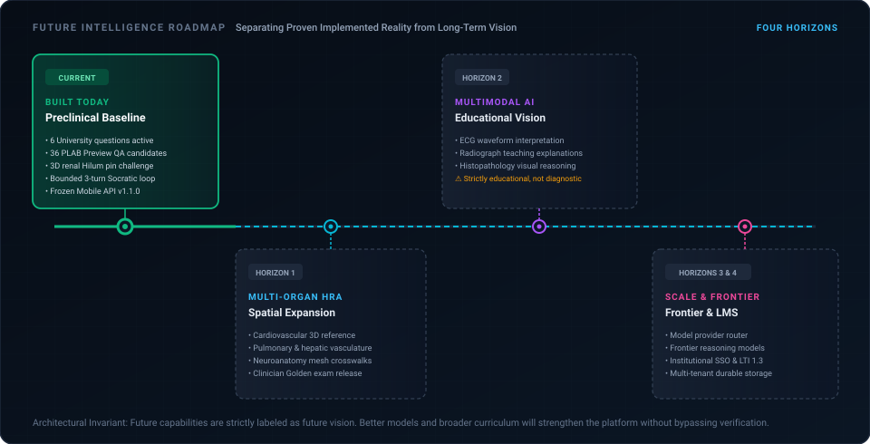
</p>

### Horizon 1: Multi-Organ Spatial Anatomy *(Future)*
Extend HuBMAP Human Reference Atlas 3D anatomical integration beyond renal structures into:
* **Cardiovascular System:** Coronary vasculature, cardiac chambers, valvular hemodynamics.
* **Respiratory System:** Bronchial tree, alveolar-capillary membrane, pulmonary perfusion.
* **Hepatic & Digestive System:** Portal venous circulation, biliary tree, hepatic lobules.
* **Neuroanatomy:** Cerebral arterial circle (Circle of Willis), ventricular system, cranial nerves.

### Horizon 2: Multimodal Generative Learning *(Future / Research)*
Integrate educational multimodal reasoning strictly for teaching and student inquiry (non-diagnostic):
* **Electrocardiogram (ECG) Interpretation:** Step-by-step Socratic rhythm and axis analysis.
* **Diagnostic Imaging Explanations:** Radiograph and ultrasound anatomical landmark identification.
* **Histopathology Reasoning:** Tissue architecture and cellular morphology education.

### Horizon 3: Frontier Model Router Orchestration *(Future / Design)*
Decouple generative intelligence behind a provider-agnostic model router while preserving the MedicalPlab safety contract:
* **Model Provider Abstraction:** Plug-and-play routing across frontier reasoning models (e.g., OpenAI o-series, Claude, Gemini, open weights).
* **Core Principle:** *"Better models should strengthen the system — not become the system."*
* **Immutable Safety Boundary:** Frontier models may increase reasoning depth, but **never** bypass evidence retrieval, rights gating, proposition verification, or fail-closed fallback.

### Horizon 4: Institutional Learning Platform *(Future / Enterprise)*
* **Enterprise Authentication:** University Single Sign-On (SAML / OAuth 2.0 / OIDC).
* **Faculty Review Portal:** Collaborative workflows for clinician panel question authoring and sign-off.
* **LMS Interoperability:** LTI 1.3 integration for Canvas, Blackboard, and Moodle.
* **Native Mobile Applications:** iOS and Android native apps with durable cloud learner synchronization.

---

## Startup / Demo Evaluation

For hackathon judges, startup reviewers, and ecosystem evaluators, the complete submission package is indexed in `docs/submission/`:

* **[Executive Summary](docs/submission/01_EXECUTIVE_SUMMARY.md)**: 1-page overview of problem, solution, learning loop, and operational status.
* **[Demo Day Scripts](docs/submission/05_DEMO_DAY_SCRIPT.md)**: 60-second, 3-minute, and 5-minute spoken pitch scripts with exact click targets.
* **[Startup & Technical Judge Q&A](docs/submission/06_JUDGE_QA.md)**: 31 direct answers covering AI boundaries, learning science, safety, and business defensibility.
* **[Startup Value Proposition](docs/submission/02_STARTUP_VALUE_PROPOSITION.md)**: Commercial thesis, learner vs. institutional demand, and market drivers.
* **[Technical Differentiators](docs/submission/04_TECHNICAL_DIFFERENTIATORS.md)**: Fourteen engineering moats and verified test metrics.
* **[Business Model & Market](docs/submission/07_BUSINESS_MODEL_AND_MARKET.md)**: Sustainable go-to-market strategy, B2C/B2B hypotheses, and defensibility.
* **[Product Roadmap & Scale](docs/submission/08_ROADMAP_AND_SCALE.md)**: Pragmatic engineering horizons (NOW $\rightarrow$ NEXT $\rightarrow$ THEN $\rightarrow$ LATER).
* **[Submission Checklist](docs/submission/09_SUBMISSION_CHECKLIST.md)** & **[Repo Handoff Message](docs/submission/10_REPO_HANDOFF_MESSAGE.md)**: Submission readiness and evaluator communications.

---

## Documentation Navigation

Access authoritative specifications, runbooks, and integration guides:

| Document | Purpose | Target Audience |
| :--- | :--- | :--- |
| **[Executive Summary](docs/submission/01_EXECUTIVE_SUMMARY.md)** | 1-page startup & product overview | Judges, Investors, Mentors |
| **[Demo Day Scripts](docs/submission/05_DEMO_DAY_SCRIPT.md)** | Spoken pitch scripts (60s, 3m, 5m) & click targets | Judges, Presenters |
| **[Final Product Brief](docs/handoff/FINAL_PRODUCT_BRIEF.md)** | Canonical comprehensive product & technical explanation | Mentors, Judges, Evaluators |
| **[Mentor Quick Runbook](docs/handoff/MENTOR_LOCAL_RUN.md)** | 3-minute fast-track evaluation guide | Evaluators, Technical Judges |
| **[Mentor In-Depth Briefing](docs/handoff/MENTOR_START_HERE.md)** | Architectural deep dive & background briefing | Mentors, Due Diligence |
| **[Local Run Guide](docs/LOCAL_RUN_GUIDE.md)** | Complete workstation setup & troubleshooting | Developers, Evaluators |
| **[Mobile Start Here](docs/mobile-handoff/START_HERE.md)** | 10-minute mobile client onboarding guide | Mobile Engineers |
| **[Mobile API Contract](docs/mobile-handoff/API_CONTRACT.md)** | Authoritative schema & endpoint contract | Mobile Engineers, Integrators |
| **[Client Code Examples](docs/mobile-handoff/CLIENT_EXAMPLES.md)** | Flutter & React Native production snippets | Mobile Developers |
| **[Final Demo Runbook](docs/demo/FINAL_DEMO_RUNBOOK.md)** | Step-by-step click targets & evaluation script | Presenters, Reviewers |
| **[Clinical Safety Policy](docs/CLINICAL_SAFETY.md)** | Medical boundaries & fail-closed mechanisms | Clinicians, Safety Auditors |
| **[PLAB Governance & Provenance](docs/PLAB_PROVENANCE_AND_DATA_GOVERNANCE.md)** | Licensing & question promotion rules | Content Reviewers, Legal |
| **[Third-Party Anatomy Attribution](THIRD_PARTY_NOTICES_ANATOMY.md)** | HuBMAP HRA CC BY 4.0 legal attribution | Compliance, Legal |

---

## Data Licensing & Attribution

* **Anatomical Models:** NIH HuBMAP Human Reference Atlas (HRA) 3D Reference Organs. Licensed under [Creative Commons Attribution 4.0 International (CC BY 4.0)](https://creativecommons.org/licenses/by/4.0/). See [THIRD_PARTY_NOTICES_ANATOMY.md](THIRD_PARTY_NOTICES_ANATOMY.md).
* **Medical Evidence Corpus:** Extracted from open-access basic-science and renal physiology articles in PubMed Central (PMC). Admitted only after source-level license verification, with license provenance preserved per document (`CC BY 4.0`, `CC BY 3.0`).
* **Clinical Questions:** University questions authored for foundational medical physiology education. PLAB candidate items are maintained under Preview QA governance and require formal clinician review panel Golden promotion before public release.

---

<p align="center">
  <b>MedicalPlab</b> — Adaptive Evidence-Grounded Medical Learning Platform<br>
  <i>"MedicalPlab does not only answer students. It learns how students learn."</i>
</p>
