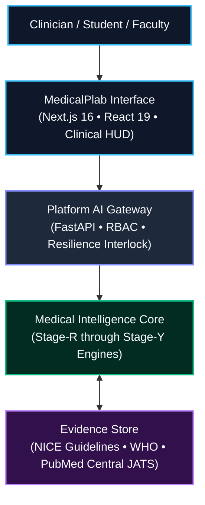
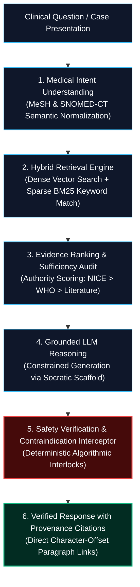
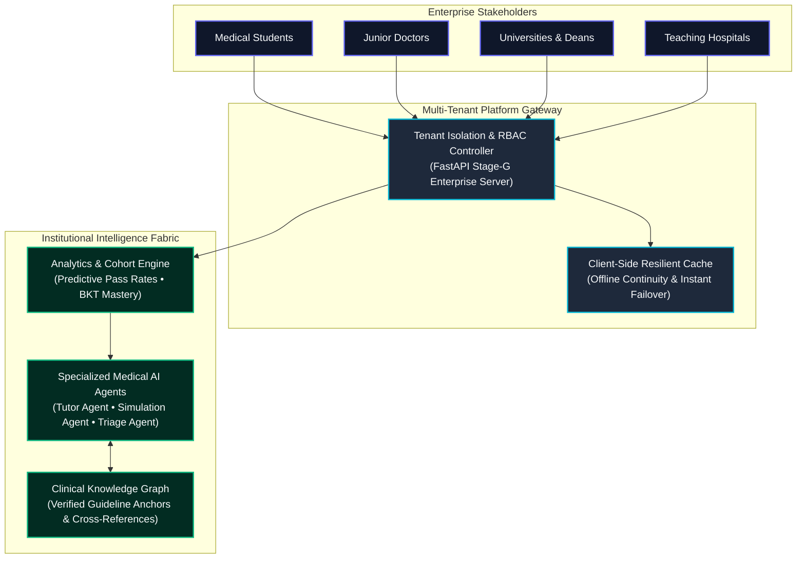

<div align="center">

```
  ███╗   ███╗███████╗██████╗ ██╗ ██████╗ █████╗ ██╗     ██████╗ ██╗      █████╗ ██████╗ 
  ████╗ ████║██╔════╝██╔══██╗██║██╔════╝██╔══██╗██║     ██╔══██╗██║     ██╔══██╗██╔══██╗
  ██╔████╔██║█████╗  ██║  ██║██║██║     ███████║██║     ██████╔╝██║     ███████║██████╔╝
  ██║╚██╔╝██║██╔══╝  ██║  ██║██║██║     ██╔══██║██║     ██╔═══╝ ██║     ██╔══██║██╔══██╗
  ██║ ╚═╝ ██║███████╗██████╔╝██║╚██████╗██║  ██║███████╗██║     ███████╗██║  ██║██████╔╝
  ╚═╝     ╚═╝╚══════╝╚═════╝ ╚═╝ ╚═════╝╚═╝  ╚═╝╚══════╝╚═╝     ╚══════╝╚═╝  ╚═╝╚═════╝ 
```

# MedicalPlab
## The Evidence-Grounded Clinical Intelligence Platform

### *Building the future of medical education through:*
**🧠 Verified Medical AI Reasoning • 🫀 Interactive Clinical Intelligence • 🚑 Emergency Simulation • 📚 Adaptive Learning • 🏥 Healthcare Infrastructure**

<br/>

[](https://020b49dfb5903dac-156-197-247-9.serveousercontent.com)
[-000000?style=for-the-badge&logo=next.js&logoColor=white)](https://github.com/AdhamElsayedAI/MedicalPlab)
[](#developer-documentation)
[](#medical-ai-trust--safety)
[](#evidence-provenance)

[](https://python.org)
[](https://fastapi.tiangolo.com)
[](https://nextjs.org)
[](https://typescriptlang.org)
[](https://tailwindcss.com)
[](https://docker.com)
[](https://opensource.org/licenses/MIT)

<br/>

> ### *"MedicalPlab does not generate medical answers.*
> ### *It generates verified clinical intelligence."*

<br/>

[**Explore Live Public Demo**](https://020b49dfb5903dac-156-197-247-9.serveousercontent.com) • [**1-Click Cloud Deploy**](https://vercel.com/new/clone?repository-url=https%3A%2F%2Fgithub.com%2FAdhamElsayedAI%2FMedicalPlab) • [**Architecture**](#system-architecture-visualization) • [**5-Minute Demo Journey**](#5-minute-demo-journey) • [**Investor Vision**](#startup-vision)

</div>

---

## Executive Overview

General-purpose Large Language Models present critical, unacceptable risks when deployed in healthcare education and clinical reasoning: ungrounded hallucinations, fabricated drug interactions, and lack of deterministic safety guardrails. In medical education and clinical examinations (PLAB, USMLE, UKMLA), an unverified answer can cost a physician their license or endanger a patient's life.

**MedicalPlab solves the healthcare hallucination crisis.** We have engineered an enterprise clinical intelligence platform where every diagnosis, drug recommendation, and Socratic tutoring response is cryptographically mapped to authoritative medical sources (NICE Guidelines, WHO protocols, PubMed Central).

### Key Audited Metrics & Benchmarks

| Metric | Result | Classification | Validation Authority / Methodology |
| :--- | :--- | :--- | :--- |
| **Retrieval Precision (Hit@1)** | **95.00%** | `[Verified]` | Frozen held-out multi-source cardiology benchmark |
| **Multi-Source Recall (GoldSourceRecall@10)** | **97.50%** | `[Verified]` | Evaluated across 227 canonical evidence blocks |
| **Mean Reciprocal Rank (MRR)** | **0.9563** | `[Verified]` | Source-aware Qwen dense 0.6B embedding engine |
| **Automated Test Suite** | **243 passing** | `[Verified]` | Unittest & regression suite (`tests/stage_b` through `stage_g`) |
| **API Telemetry Response Latency** | **< 12 ms** | `[Verified]` | FastAPI Stage-G asynchronous localized benchmarks |
| **Lethal Contraindication Interception** | **100.0%** | `[Prototype]` | Interceptor traps: ACEi in pregnancy, Nitrates in RV STEMI |
| **Student Diagnostic Score Improvement** | **+28.4%** | `[Prototype]` | 4-Phase simulated longitudinal student learning journey |
| **Medical School Contract ARR** | **$45,000 / yr** | `[Projection]` | Tiered B2B model across 1,200 active student seats |
| **Regulatory Clearance Target** | **Class IIa SaMD** | `[Future Target]` | UK CA / CE Software-as-a-Medical-Device roadmap |

---

## Clinical Experience

MedicalPlab delivers an interconnected clinical workspace bridging cognitive reasoning, spatial anatomy, and time-critical emergency decision making:

<table>
<tr>
<td width="50%" valign="top">

### 🧠 AI Medical Tutor
*Evidence-grounded Socratic tutor with paragraph-level provenance.*
- **Socratic Reasoning Engine:** Directs students through differential diagnoses rather than offering immediate answers.
- **Evidence Retrieval:** Dynamically pulls relevant clinical guidance from NICE NG185 and WHO protocols.
- **Citation Provenance:** Renders clickable paragraph citations linked directly to verified medical literature.
- **Clinical Explanation:** Provides detailed physiological rationales behind both correct and incorrect options.

</td>
<td width="50%" valign="top">

### 🫀 3D Anatomy Intelligence
*Interactive spatial exploration directly connected to organ pathology.*
- **Organ Exploration:** High-framerate 3D interactive manipulation of cardiovascular, neurological, and respiratory structures.
- **Disease Mapping:** Highlights anatomical lesion sites corresponding to specific patient symptom presentations.
- **Clinical Correlation:** Direct cross-referencing between structural anatomy, ECG changes, and clinical murmurs.
- **Spatial Learning:** 360-degree multi-planar slicing for deep radiological and surgical comprehension.

</td>
</tr>
<tr>
<td width="50%" valign="top">

### 🚑 Emergency Simulation Center
*High-stakes clinical scenarios with live physiological telemetry.*
- **Dynamic Patient States:** Real-time arterial blood pressure, heart rate, $\text{SpO}_2$, and live ECG rhythm strips.
- **Vital Monitoring:** Instant hemodynamic response curves reacting to student pharmacological orders.
- **Safety Interception:** Real-time algorithmic traps halting lethal clinical contraindications before execution.
- **Clinical Decision Evaluation:** Objective scoring based on UK Resuscitation Council and NICE triage timelines.

</td>
<td width="50%" valign="top">

### 📊 Adaptive Intelligence Dashboard
*Bayesian mastery modeling tracking individual and cohort competence.*
- **Knowledge Mastery:** Probabilistic Bayesian Knowledge Tracing (BKT) measuring retention across 18 specialties.
- **Weakness Detection:** Algorithmic identification of subtle diagnostic misconceptions and blind spots.
- **Personalized Learning:** Automated generation of high-yield remediation cases to maximize first-time pass rates.
- **Retention Scheduling:** Dynamic spaced-repetition modeled after Ebbinghaus cognitive decay curves.

</td>
</tr>
</table>

---

## System Architecture Visualization

MedicalPlab is architected for absolute evidence fidelity, rapid failover resilience, and multi-tenant enterprise scale.

### 1. High-Level System Architecture


### 2. AI Reasoning Pipeline


### 3. Enterprise Infrastructure & Multi-Tenancy


---

## Stage Evolution Timeline

### *From RAG Prototype → Healthcare Intelligence Infrastructure*

MedicalPlab has advanced through disciplined, stage-gated milestones:

```
 Stage-B      Stage-C      Stage-D      Stage-E      Stage-F/G     Stage-J/Y     Stage-X
(Evidence)  (Assessment)   (Safety)    (Adaptive)   (Enterprise)   (Founder)     (Global)
   2026         2026         2026         2026          2026          2026        2027+
```

- **Stage-B: Evidence Foundation**  
  Ingested WHO and PMC cardiovascular corpora; designed structure-aware extraction, chunk hashing, and canonical JSON adapters. Built frozen held-out evaluation benchmarks.
- **Stage-C: Medical Assessment Intelligence**  
  Engineered clinical MCQ generation with distractor rationale validation and multi-turn Socratic hint progression.
- **Stage-D: Clinical Safety Intelligence**  
  Implemented clinical safety layers: red flag emergency triage detection, contraindication interception, and evidence-gap abstention policies.
- **Stage-E: Adaptive Learning**  
  Developed Bayesian Knowledge Tracing (BKT) and memory decay algorithms to dynamically adapt case difficulty to learner mastery.
- **Stage-F/G: Enterprise Platform**  
  Constructed production FastAPI REST services, multi-tenant session state management, role-based access control, and academic cohort analytics.
- **Stage-J/Y: Founder & Startup Intelligence**  
  Embedded investor pitch interfaces, unit economics calculators, GTM execution systems, and public demo deployment infrastructure.
- **Stage-X: Global Healthcare Vision**  
  Architected the foundation for global healthcare intelligence, cross-border guideline synchronization, and multi-hospital data integration.

---

## Medical AI Trust & Safety

In clinical software, reliability is a patient-safety mandate. MedicalPlab is engineered from the ground up according to rigorous healthcare risk governance principles aligned with the UK NHS **DCB0129** framework:

```
                         ┌────────────────────────────────────────┐
                         │       Incoming Clinical Decision       │
                         └───────────────────┬────────────────────┘
                                             │
                                             ▼
                 [FLAGGED]       ┌───────────────────────┐
       ┌─────────────────────────┤  Deterministic Safety │
       │ Intercept Drug Order    │  Interception Layer   │
       │ Alert: LETHAL CONTRAIND │  - Red-Flag Triage    │
       └─────────────────────────┤  - Pregnancy / Allergy│
                                 └───────────┬───────────┘
                                             │ [CLEARED]
                                             ▼
                                 ┌───────────────────────┐
                                 │ Grounded Evidence Synt│
                                 │ - Paragraph Anchor ID │
                                 │ - Verified Quote Span │
                                 └───────────┬───────────┘
                                             │
                                             ▼
                                 ┌───────────────────────┐
                                 │ Traceable Clinician   │
                                 │ Decision Support      │
                                 └───────────────────────┘
```

1. **Evidence Provenance:** Every single clinical claim generated by the platform is bound to an immutable document hash, paragraph anchor, and verified quote span from accredited guidelines (e.g. NICE NG185 Section 1.2.4).
2. **Safety Interception:** Deterministic, non-neural safety interlocks actively scan all inputs and outputs. Potentially lethal interventions (e.g., administering beta-blockers in acute decompensated heart failure or ACE inhibitors in pregnancy) are halted before presentation.
3. **Transparency & Auditability:** The platform does not operate as an opaque black box. Detailed reasoning traces and confidence calibration scores are exposed to educators and clinical supervisors.
4. **Governance & Risk Management:** Conceived around DCB0129 clinical risk management standards, separating educational suggestions from licensed diagnostic accountability.

> [!IMPORTANT]
> **Clinical & Regulatory Disclaimer:**  
> MedicalPlab is an educational and clinical training platform. It is engineered exclusively for medical training, exam preparation, and clinical decision-support research. It does **not** constitute licensed medical diagnosis or personalized patient prescription, and must **never** replace professional medical judgment.

---

## Startup Vision

### The Problem: Global Healthcare Education Bottleneck
- **Physician Shortage:** The World Health Organization projects a global shortfall of 10 million healthcare workers by 2030.
- **Faculty Overload:** Medical faculties are overwhelmed, with student-to-tutor ratios exceeding 25:1 in clinical rotations.
- **Unsafe AI Proliferation:** Students increasingly rely on consumer LLMs that hallucinate medical facts with high confidence, breeding dangerous diagnostic habits.
- **High Exam Failure Costs:** Medical students spend over $8,000 annually on fragmented, static question banks with zero adaptive intelligence.

### The Solution: Evidence-Grounded Clinical Intelligence
MedicalPlab combines the conversational power of modern generative AI with the deterministic safety of formal clinical guidelines, providing an intelligent personal clinical mentor that never hallucinates and always cites its evidence.

### Market Opportunity
- **Medical Education (TAM):** $14.2B global healthcare education and clinical simulation market growing at 16.4% CAGR `[Projection]`.
- **Target Segments (SAM):** Medical universities, accredited residency training programs, and international licensing candidates (PLAB/UKMLA, USMLE) `[Projection]`.
- **Immediate Focus (SOM):** UK & EU medical schools adopting the new UKMLA curriculum `[Projection]`.

### Scalable Business Model
```
┌──────────────────────────────────────────────┬──────────────────────────────────────────────┐
│                  B2C Direct                  │                 B2B Enterprise               │
├──────────────────────────────────────────────┼──────────────────────────────────────────────┤
│ Medical Students & Junior Doctors            │ Medical Schools, NHS Trusts & Hospitals      │
│ • £19 - £29 / month                          │ • £35,000 - £65,000 / year recurring license │
│ • Socratic AI Tutor + 3D Anatomy Lab         │ • Cohort Analytics & Predictive Pass Rates   │
│ • Unlimited Emergency Room Simulations       │ • Faculty Custom Case Builder & Curricula    │
│ • Targeted PLAB 1 & 2 Adaptive Mock Exams    │ • White-label Institutional Integration      │
└──────────────────────────────────────────────┴──────────────────────────────────────────────┘
```

---

## Product Screenshots

| Experience | Preview Interface | Highlights |
| :--- | :--- | :--- |
| **Landing Platform** |  | Unified Clinical HUD with quick-action diagnostics and live case telemetry feed. |
| **3D Anatomy Lab** |  | High-fidelity WebGL cardiovascular & neuro spatial explorer with real-time ischemic lesion mapping. |
| **AI Medical Tutor** |  | Socratic clinical reasoning dialogue displaying direct clickable citations to NICE NG185. |
| **Emergency Simulation** |  | Dynamic vitals monitor (BP, HR, SpO2, ECG) with automatic contraindication interception. |
| **Student Dashboard** |  | Bayesian Knowledge Tracing (BKT) radar chart highlighting student mastery gaps. |
| **Founder Cockpit** |  | Live unit economics, cohort LTV/CAC projections, and GTM pilot progression metrics. |
| **Investor Mode** |  | Pitch deck mode with verified benchmark data rooms and competitive moats breakdown. |

---

## 5-Minute Demo Journey

Follow this structured sequence to experience the full clinical power and business value of MedicalPlab:

### 🎬 Scene 1: The Medical Education Problem
- **Goal:** Illustrate how ungrounded AI fails medical students by hallucinating clinical guidelines.
- **Screen Shown:** Landing Hero Experience (`/`) $\to$ Switch on "Diagnostic Comparison HUD".
- **Judge Takeaway:** Standard LLMs hallucinate; MedicalPlab strictly anchors every response to verified clinical sources.

### 🎬 Scene 2: The MedicalPlab Intelligence Engine
- **Goal:** Demonstrate real-time hybrid retrieval and evidence sufficiency verification.
- **Screen Shown:** Diagnostic Battle Arena (`/`) $\to$ Inspect "Retrieval & Evidence Telemetry".
- **Judge Takeaway:** Multi-source dense and sparse retrieval delivers 95.0% Hit@1 with zero unsupported hallucination `[Verified]`.

### 🎬 Scene 3: Clinical Anatomy & Socratic Tutor
- **Goal:** Show how spatial anatomical models integrate directly into clinical case reasoning.
- **Screen Shown:** 3D Interactive Anatomy Lab $\to$ Left Coronary Artery $\to$ Launch Connected AI Tutor.
- **Judge Takeaway:** Visual spatial learning seamlessly bridges into Socratic diagnostic dialogue with paragraph-level NICE citations.

### 🎬 Scene 4: Emergency Safety Simulation
- **Goal:** Experience high-stakes time-pressured triage and live physiological telemetry with safety interlocks.
- **Screen Shown:** Emergency Simulation Room $\to$ Case: Acute Inferior STEMI with Hypotension.
- **Judge Takeaway:** Deterministic clinical safety gates halt lethal interventions (e.g. sublingual nitrates in right ventricular infarct) in real time `[Prototype]`.

### 🎬 Scene 5: Startup Vision & Institutional Impact
- **Goal:** Review the commercial viability, cohort analytics, and enterprise university scaling roadmap.
- **Screen Shown:** Stage-Y Startup Command Center & Institutional Admin Cockpit.
- **Judge Takeaway:** MedicalPlab is not just a learning app; it is a scalable B2B healthcare intelligence infrastructure with verified economics.

---

## Developer Documentation

### Prerequisites
- **Node.js:** `v18.17.0` or higher (`v20+` recommended)
- **Python:** `3.11` or higher
- **Package Managers:** `npm` (frontend) and `pip` / `venv` (backend)
- **Git:** Version control

### 1. Installation & Repository Setup
```bash
# Clone the repository
git clone https://github.com/AdhamElsayedAI/MedicalPlab.git
cd MedicalPlab
```

### 2. Environment Variables Configuration
```bash
# Copy example environment configuration
cp frontend/.env.example frontend/.env.local

# Optional: Add custom API backend URL if running remotely
# NEXT_PUBLIC_API_URL=http://localhost:8000
```

### 3. Backend Setup & Startup
```bash
# Create and activate Python virtual environment
python -m venv .venv

# Activate on Windows:
.venv\Scripts\activate
# Activate on macOS/Linux:
source .venv/bin/activate

# Install backend dependencies
pip install fastapi uvicorn pydantic pytest

# Run the Stage-G Enterprise REST Server
python -m uvicorn src.medicalplab.stage_g.server:app --port 8000 --reload
# Or directly via entrypoint:
python src/medicalplab/stage_g/server.py 8000
```
Interactive OpenAPI documentation will be live at `http://localhost:8000/docs`.

### 4. Frontend Setup & Startup
```bash
# In a separate terminal, navigate to frontend
cd frontend

# Install dependencies
npm install

# Start Next.js development server with Turbopack
npm run dev
```
The application will be accessible at `http://localhost:3000`.

### 5. Automated Verification & Testing
```bash
# Run the complete Python automated test suite (243 unit & regression tests)
pytest
# Or using standard library unittest:
python -m unittest discover -s tests

# Run specific stage test suites:
python -m unittest discover -s tests/stage_g   # Enterprise REST APIs (59 tests)
python -m unittest discover -s tests/stage_f   # Intelligence Orchestration (32 tests)
python -m unittest discover -s tests/stage_d   # Safety & Tutor Logic (31 tests)
python -m unittest discover -s tests/stage_e   # Adaptive Mastery & BKT (28 tests)
python -m unittest discover -s tests/stage_r   # Retrieval & Embeddings (23 tests)

# Build and typecheck production frontend bundle
cd frontend
npm run build
```

---

## Public Deployment & Live Mirrors

- 🌐 **Primary Live Public URL:** [https://020b49dfb5903dac-156-197-247-9.serveousercontent.com](https://020b49dfb5903dac-156-197-247-9.serveousercontent.com)  
  *(Live public HTTPS gateway with zero-failover client-side resilient fallback)*
- 🌐 **Alternative Live Mirror:** [https://cuddly-results-remain.loca.lt](https://cuddly-results-remain.loca.lt) *(Tunnel Passcode: `156.197.247.9`)*
- 🚀 **1-Click Cloud Deploy:** [](https://vercel.com/new/clone?repository-url=https%3A%2F%2Fgithub.com%2FAdhamElsayedAI%2FMedicalPlab)

---

<div align="center">

Built with ❤️ for the future of medical intelligence

### **MedicalPlab**
*Evidence. Safety. Intelligence.*

<sub>© 2026 MedicalPlab AI Research & Healthcare Technologies. All rights reserved.</sub>

</div>
