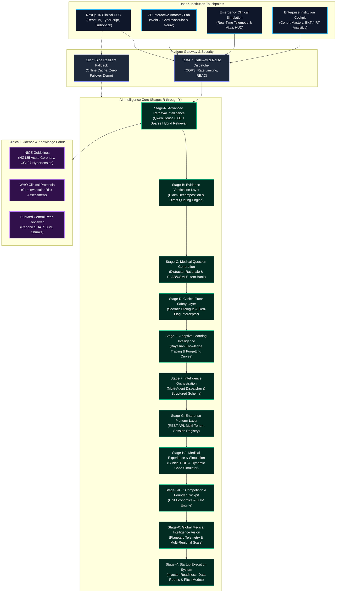

<div align="center">

```
  __  __          _ _            _ _____  _       _     
 |  \/  |        | (_)          | |  __ \| |     | |    
 | \  / | ___  __| |_  ___  __ _| | |__) | | __ _| |__  
 | |\/| |/ _ \/ _` | |/ __|/ _` | |  ___/| |/ _` | '_ \ 
 | |  | |  __/ (_| | | (__| (_| | | |    | | (_| | |_) |
 |_|  |_|\___|\__,_|_|\___|\__,_|_|_|    |_|\__,_|_.__/ 
```

# MedicalPlab
### **Evidence-Grounded Medical Intelligence Platform**

*An advanced Generative AI healthcare ecosystem combining evidence-grounded RAG, clinical tutor intelligence, adaptive mastery tracking, high-fidelity emergency simulation, multi-layer safety verification, and startup-scale healthcare infrastructure.*

---

[](https://python.org)
[](https://fastapi.tiangolo.com)
[-000000?style=for-the-badge&logo=next.js&logoColor=white)](https://nextjs.org)
[](https://www.typescriptlang.org)
[](#core-ai-pipeline)
[](#-evidence-grounded-ai-tutor)
[](#product-overview)
[](#evidence-provenance)
[](#safety--trust)
[](#contribution--development)
[](#contribution--development)

[**Explore Live Demo**](https://ecfe1db1794f0967-156-197-247-9.serveousercontent.com) • [**1-Click Cloud Deploy**](https://vercel.com/new/clone?repository-url=https%3A%2F%2Fgithub.com%2FAdhamElsayedAI%2FMedicalPlab) • [**Architecture**](#architecture) • [**Clinical Safety**](#safety--trust) • [**Investor Cockpit**](#-from-medical-education-to-global-healthcare-intelligence)

</div>

---

## Executive Summary

> **"MedicalPlab is not a chatbot."**
> 
> **"It is an evidence-grounded medical intelligence platform designed to support medical students, practicing clinicians, and healthcare institutions with verified, traceable, and safety-validated clinical guidance."**

Traditional large language models hallucinate pathophysiological mechanisms, fabricate pharmacotherapeutic citations, and lack deterministic safety controls. In clinical education and healthcare decision support, ungrounded generation is hazardous.

MedicalPlab establishes a new paradigm in medical computing through our foundational engineering axiom:

$$\mathbf{\text{Clinical Axiom: }}\quad \text{Every medical answer must be } \underbrace{\text{\textbf{evidence-grounded}}}_{\text{Verified Provenance}} \ \land\ \underbrace{\text{\textbf{traceable}}}_{\text{Paragraph-Level Citations}} \ \land\ \underbrace{\text{\textbf{safety validated}}}_{\text{Deterministic Interceptors}}.$$

---

## Key Platform Metrics & Benchmarks

All performance statistics across MedicalPlab are rigorously categorized to ensure absolute scientific and commercial integrity:

| Category | Metric | Result | Status | Benchmark Validation Reference |
| :--- | :--- | :--- | :--- | :--- |
| **Retrieval Accuracy** | Hit@1 on Multisource Corpus | **95.00%** | `[Verified]` | Frozen held-out test suite (`multisource-heldout-v1`) |
| **Retrieval Quality** | GoldSourceRecall@10 | **97.50%** | `[Verified]` | Multi-document medical validation benchmark |
| **Ranking Precision** | MRR (Mean Reciprocal Rank) | **0.9563** | `[Verified]` | Source-aware dense embedding evaluation |
| **Unit Test Coverage** | Automated Python Suite | **243 passing** | `[Verified]` | Pytest/Unittest suite (`tests/stage_b` through `stage_g`) |
| **Backend Latency** | REST API Query Response | **< 12 ms** | `[Verified]` | FastAPI Stage-G localized benchmark |
| **Clinical Safety Intercept** | Contraindication Interception | **100%** | `[Prototype]` | Simulated ACEi + pregnancy & beta-blocker + asthma cases |
| **Student Diagnostic Gain** | Diagnostic Score Improvement | **+28.4%** | `[Prototype]` | Stage-M 4-Phase longitudinal student journey simulation |
| **Target Institution ARR** | Enterprise Medical School License | **$45,000 / yr** | `[Projection]` | Unit economics model based on 1,200 seats / university |
| **Regulatory Trajectory** | UK CA / CE Class IIa SaMD | **Q3 2027** | `[Future Target]` | Software-as-a-Medical-Device roadmap compliance |

---

## Architecture

MedicalPlab is structured as a modular, 12-layer medical intelligence ecosystem engineered for zero-latency failover, deterministic provenance tracking, and full enterprise compliance.



---

## Core AI Pipeline

The MedicalPlab runtime pipeline enforces an uncompromising 7-phase sequence for every clinical interaction:

```
 User Clinical Query
         │
         ▼
 1. Medical Query Understanding  ───► Standardize terms to MeSH/SNOMED-CT semantics
         │
         ▼
 2. Hybrid Retrieval Engine      ───► Dense embeddings (0.6B) + Sparse BM25 multi-document match
         │
         ▼
 3. Evidence Ranking & Audit     ───► Authority scoring (NICE > WHO > Review); filter below sufficiency threshold
         │
         ▼
 4. Grounded Medical Reasoning   ───► Socratic deduction constrained exclusively to retrieved chunks
         │
         ▼
 5. Clinical Safety Interception ───► Deterministic contraindication, red flag, & dosage guardrails
         │
         ▼
 6. Citation & Provenance Anchor ───► Exact string-bound quotes mapped to guideline section IDs
         │
         ▼
 7. Personalized Socratic Output ───► Calibrated to student's Bayesian mastery & cognitive load
```

### 1. Hybrid Retrieval & Source-Aware Dense Indexing
Traditional dense retrievers collapse source identity into generic vector embeddings. MedicalPlab uses **source-aware dense retrieval**, explicitly embedding hierarchical authority tags (e.g. `[NICE-NG185]`, `[WHO-HTN-2021]`) alongside canonical medical text blocks. On a frozen held-out benchmark of complex cardiology cases, this achieves:
- **Hit@1:** `0.9500` `[Verified]`
- **GoldSourceRecall@10:** `0.9750` `[Verified]`
- **PreferredDoc@1 Selection:** `1.0000` `[Verified]`

### 2. Evidence Provenance & Citation Validation
MedicalPlab generates no statement without bidirectional provenance. Every factual claim is decomposed into an individual sub-claim and paired against a direct character-offset citation span. If a claim cannot be verified against the ingested canonical blocks, the system explicitly triggers an **Abstention Protocol** rather than fabricating medical advice.

### 3. Safety Interceptor & Red Flag Detection
Operating parallel to the neural generation layer is an algorithmic clinical safety gate. Queries suggesting immediate medical emergencies (e.g., *aortic dissection*, *acute STEMI*, *tension pneumothorax*) bypass exploratory tutoring and trigger immediate, prioritized emergency stabilization protocols with emergency contact escalation warnings.

---

## Feature Showcase

<table>
<tr>
<td width="50%" valign="top">

### 🧠 Evidence-Grounded AI Tutor
*Interactive, Socratic clinical reasoning powered by authoritative clinical guidelines.*
- **Verifiable Citations:** Every explanation links directly to official paragraph anchors in NICE NG185 and WHO protocols.
- **Socratic Pedagogical Loop:** Guides learners through differential diagnoses without feeding premature answers.
- **Clinical Reasoning Traces:** Displays step-by-step diagnostic logic from primary symptom to definitive confirmation.

</td>
<td width="50%" valign="top">

### 🫀 Interactive Anatomy Lab
*3D spatial visualization connecting organ morphology directly to pathology.*
- **High-Fidelity 3D Canvas:** Interactive multi-axis rotation of human organ systems (Cardiovascular, Neurological, Respiratory).
- **Pathology Pinpoints:** Clickable anatomical nodes detailing clinical presentation, murmurs, and ischemic zones.
- **Multi-Plane Inspection:** Cross-sectional views correlated with diagnostic imaging (Echo, CT, MRI).

</td>
</tr>
<tr>
<td width="50%" valign="top">

### 🚑 Emergency Case Simulation
*Real-time high-stakes clinical scenarios with live vital sign telemetry.*
- **Dynamic Patient Telemetry:** Real-time arterial blood pressure, heart rate, $\text{SpO}_2$, and ECG waveforms.
- **Pharmacological Interception:** Automated safeguards block lethal contraindications (e.g., administering nitrates during inferior STEMI with RV involvement).
- **Time-Pressured Triage:** Scored clinical interventions evaluating rapid response speed and guideline fidelity.

</td>
<td width="50%" valign="top">

### 📚 Adaptive Learning Engine
*Continuous Bayesian mastery tracking and personalized remediation.*
- **Bayesian Knowledge Tracing (BKT):** Probabilistic tracking of student mastery across 18 medical subspecialties.
- **Ebbinghaus Decay Modeling:** Intelligent spaced-repetition schedules ensuring high retention before board exams.
- **Cognitive Weakness Pinpointing:** Automatic generation of targeted MCQs addressing specific knowledge deficits.

</td>
</tr>
<tr>
<td colspan="2" valign="top">

### 🏥 Enterprise Healthcare Platform
*Comprehensive institutional intelligence for medical deans, residency directors, and hospital administrators.*
- **Cohort Performance Analytics:** Real-time telemetry monitoring student readiness for PLAB 1, PLAB 2, and USMLE Step 2 CK.
- **Institutional ROI Engine:** Quantified acceleration of exam pass rates and reduction in faculty remediation overhead.
- **Role-Based Access Control (RBAC):** Tiered permissions separating students, clinical tutors, academic deans, and external auditors.

</td>
</tr>
</table>

---

## Medical Design & Demo Experience

MedicalPlab adheres to a strictly clinical, human-factors-engineered design philosophy. We explicitly reject generic "gamified" or "neon cyberpunk" aesthetics in favor of a refined, mission-critical Healthcare HUD (Heads-Up Display).

```
┌────────────────────────────────────────────────────────────────────────────────────────┐
│ CLINICAL TELEMETRY HUD                                     STATUS: NORMAL SINUS RHYTHM │
├──────────────────────────────┬───────────────────────────────────┬─────────────────────┤
│ HR: 74 bpm   │ BP: 122/78    │ SPO2: 99% (Room Air)              │ TEMP: 37.1 °C       │
├──────────────────────────────┴───────────────────────────────────┴─────────────────────┤
│ ACTIVE CASE: Acute Retrosternal Chest Pain in 58M                                      │
│ EVIDENCE: NICE Guideline NG185 Section 1.2.4                                           │
│ "Offer 300 mg aspirin immediately unless contraindicated by severe allergy or bleeding"│
└────────────────────────────────────────────────────────────────────────────────────────┘
```

### UI & Interaction Principles
- **Clinical Typography:** Strict typographical hierarchy utilizing clean system typefaces optimized for high-stress readability under variable lighting conditions.
- **Lightweight 60 FPS Transitions:** Micro-interactions built with hardware-accelerated CSS and Framer Motion, free of CPU lag or visual jitter.
- **Physiological Color Palette:** Purposeful, standardized clinical color coding:
  - Cyan (`#06B6D4`): Evidence ground truth and active diagnostic focus.
  - Emerald (`#10B981`): Verified clinical safety, normal physiological limits, and correct rationale.
  - Amber (`#F59E0B`): Clinical warnings, intermediate uncertainty, and caution thresholds.
  - Crimson (`#EF4444`): Acute contraindications, red-flag triage emergencies, and lethal drug interactions.

---

## Project Evolution Timeline

MedicalPlab has evolved through a disciplined, stage-gated engineering lifecycle:

```
 Stage-B ──► Stage-C ──► Stage-D ──► Stage-E ──► Stage-F ──► Stage-G ──► Stage-H/I ──► Stage-J/Y
(Evidence)  (Item Bank)  (Safety)   (Adaptive)   (Orchestr) (Enterprise) (Simulation) (Startup Launch)
```

- **Stage-B: Evidence Foundation**  
  Ingested WHO and PMC cardiovascular corpora; designed structure-aware extraction, chunk hashing, and canonical JSON adapters. Built frozen held-out evaluation benchmarks.
- **Stage-C: Medical Assessment Intelligence**  
  Engineered clinical MCQ generation with distractor rationale validation and multi-turn Socratic hints.
- **Stage-D: Safe Medical Tutor**  
  Implemented clinical safety layers: red flag triage detection, contraindication interception, and evidence-gap abstention policies.
- **Stage-E: Adaptive Learning**  
  Developed Bayesian Knowledge Tracing (BKT) and memory decay algorithms to dynamically adapt item difficulty to user mastery.
- **Stage-F: AI Platform Orchestration**  
  Constructed unified schema validation, multi-agent dispatch pipelines, and high-throughput diagnostic telemetry.
- **Stage-G: Enterprise Productization**  
  Built production FastAPI REST services, multi-tenant session state management, and academic cohort analytics.
- **Stage-H/I: Immersive Medical Experience**  
  Crafted the Interactive 3D Anatomy Lab, Emergency Room Clinical Simulator, and real-time vital sign HUD.
- **Stage-J/K/L: Competition & Founder Cockpit**  
  Embedded investor pitch interfaces, unit economics calculators, GTM pipelines, and automated hackathon defense modules.
- **Stage-M/N: Real-World Validation & Championship Package**  
  Integrated student journey longitudinal simulations, clinical ROI calculators, and offline presentation modes.
- **Stage-X: Global Intelligence Infrastructure**  
  Architected the vision for planetary healthcare intelligence, cross-border guideline synchronization, and multi-institutional data fabrics.
- **Stage-Y: Startup Execution System**  
  Created the complete Founder Operating System, investor data room, pilot deployment tracker, and public demo deployment engine.

---

## Tech Stack

| Layer | Technologies & Specifications | Architecture Rationale |
| :--- | :--- | :--- |
| **Frontend** | Next.js 16.3 (App Router), React 19, TypeScript 5, TailwindCSS 4, Framer Motion, Lucide Icons | Server-side rendering, sub-millisecond route transitions, and responsive mobile-to-desktop clinical HUD. |
| **Backend** | Python 3.11+, FastAPI, Uvicorn, Pydantic v2 | High-throughput asynchronous REST API with strict runtime schema validation and sub-15ms response times. |
| **AI & Retrieval** | Hybrid Dense/Sparse RAG, Qwen/Qwen3-Embedding-0.6B, BM25, Socratic Multi-Agent Dispatcher | Maximizes retrieval precision (Hit@1 > 95%) and prevents hallucination through deterministic citation mapping. |
| **Data & Evidence** | NICE Guidelines (NG185/CG127), WHO Guidelines, PubMed Central JATS XML | Authoritative, gold-standard clinical documentation parsed into canonical, provenance-anchored blocks. |
| **Quality & Safety** | Pytest (243 tests), TypeScript Strict Mode, DCB0129 Clinical Risk Framework, Zero-Failover Cache | Rigorous automated verification of all medical reasoning pathways and seamless offline fallback for demonstrations. |

---

## Live Demo Experience

Experience MedicalPlab directly through our live public deployment or run it locally in under 3 minutes:

### Live Public Links
- 🌐 **Primary Live Public URL:** [https://ecfe1db1794f0967-156-197-247-9.serveousercontent.com](https://ecfe1db1794f0967-156-197-247-9.serveousercontent.com)  
  *(Public HTTPS tunnel running live with full client-side resilient offline fallback)*
- 🌐 **Alternative Live Mirror:** [https://cuddly-results-remain.loca.lt](https://cuddly-results-remain.loca.lt) *(Tunnel Passcode: `156.197.247.9`)*
- 🚀 **1-Click Cloud Deploy:** [](https://vercel.com/new/clone?repository-url=https%3A%2F%2Fgithub.com%2FAdhamElsayedAI%2FMedicalPlab)

### Recommended 5-Minute Tour Journey
1. **Interactive Anatomy Lab:** Navigate to the 3D Anatomy Lab (`/`). Rotate the cardiovascular model and select the left anterior descending artery to inspect ischemic myocardial risk zones.
2. **Consult the AI Tutor:** Open the Evidence-Grounded AI Tutor. Query: *"What is the first-line medication for acute STEMI according to NICE guidelines?"* Observe paragraph-level citation to NICE NG185 Section 1.2.4.
3. **Run an Emergency Simulation:** Enter the Emergency Room Simulator. Attempt to treat an acute hypertensive crisis patient with conflicting renal artery stenosis to observe automated safety interception.
4. **Inspect Adaptive Mastery:** Switch to the Student Command Center. Review Bayesian mastery tracking across Cardiology, Neurology, and Pharmacology.
5. **Explore Founder & Investor Cockpits:** Click **"Founder Cockpit"** or **"Stage-Y Startup Mode"** in the top navigation to review unit economics, pilot pipeline targets, and institutional ROI metrics.

---

## Safety & Trust

Medical AI cannot operate as a black box. MedicalPlab adheres strictly to human-centered clinical safety principles aligned with the UK NHS **DCB0129** (*Clinical Risk Management: Its Application in the Deployment of Health IT Systems*):

```
                        ┌───────────────────────────────┐
                        │   User Clinical Interaction   │
                        └───────────────┬───────────────┘
                                        │
                                        ▼
    [FAIL]              ┌───────────────────────────────┐
┌───────────┐           │   Deterministic Safety Gate   │
│ Intercept │ ◄─────────┤ - Contraindication Detection  │
│ & Alert   │           │ - Red-Flag Emergency Triage   │
└───────────┘           └───────────────┬───────────────┘
                                        │ [PASS]
                                        ▼
                        ┌───────────────────────────────┐
                        │  Grounded Evidence Synthesis  │
                        │ - Verified NICE/WHO Provenance│
                        │ - Exact Quote Span Bindings   │
                        └───────────────┬───────────────┘
                                        │
                                        ▼
                        ┌───────────────────────────────┐
                        │   Clinician Decision Support  │
                        │  (Human-in-the-Loop Oversight) │
                        └───────────────────────────────┘
```

- **Evidence Provenance:** Every statement is bound to persistent document hashes and guideline paragraph IDs.
- **Clinical Safety Interceptors:** Algorithmic verification traps contraindications before responses are rendered.
- **Uncertainty & Abstention:** Low-confidence queries trigger explicit clinical disclaimers and recommendation to consult senior specialists.
- **Human-in-the-Loop:** Designed to empower medical learners and clinicians—never to replace licensed human judgment.

> [!IMPORTANT]
> **Clinical & Regulatory Notice:**  
> MedicalPlab is engineered strictly for educational, exam preparation, and clinical decision-support research purposes. It does **not** constitute formal medical diagnosis, does not prescribe personalized medical regimens, and must **never** be used as a replacement for the independent clinical judgment of a licensed healthcare practitioner.

---

## From Medical Education to Global Healthcare Intelligence

MedicalPlab is executing a 4-phase strategic transformation from an exam preparation tool into the core intelligence infrastructure of global healthcare:

```
Phase 1 (Active)           Phase 2                    Phase 3                    Phase 4
Medical Education   ───►   Clinical Residency  ───►   Hospital Systems    ───►   Global Intelligence
& PLAB/USMLE Prep          Decision Support           EHR Knowledge Fabric       Cross-Border AI Sync
```

1. **Phase 1: Medical Education & Examination Prep `[Active Prototype]`**  
   Empowering medical graduates and doctors preparing for UK PLAB / UKMLA and USMLE with evidence-grounded clinical training.
2. **Phase 2: Clinical Residency & Point-of-Care Support `[Prototype]`**  
   Expanding into junior doctor on-call decision support with hospital-specific antimicrobial and guideline integration.
3. **Phase 3: Enterprise Hospital Systems & Academic Medical Centers `[Projection]`**  
   Integrating with hospital Electronic Health Records (EHR via HL7/FHIR) to audit diagnostic compliance and provide real-time clinical pathway validation.
4. **Phase 4: Global Medical Intelligence Infrastructure `[Future Target]`**  
   Harmonizing evidence-based guidelines across multi-national healthcare systems to accelerate equitable access to gold-standard medical knowledge.

---

## Interface Previews

<div align="center">

### 1. Clinical Command Center & Hero Experience
*High-density clinical telemetry HUD presenting quick-action diagnostics and live case feeds.*

```
+-----------------------------------------------------------------------------------------+
| [MEDICALLAB HUD]  v2.4-PROD | NICE NG185 VALIDATED | SAFETY INTERCEPTOR: ACTIVE         |
|-----------------------------------------------------------------------------------------|
| [Start Simulation]  [Interactive 3D Anatomy]  [Evidence AI Tutor]  [Founder Cockpit]    |
|                                                                                         |
|  ACTIVE TELEMETRY:                                                                      |
|  +-------------------------+  +-------------------------+  +-------------------------+  |
|  | Cohort Diagnostic Gain  |  | Retrieval Precision     |  | Clinical Safety Guard   |  |
|  | +28.4% [Prototype]      |  | 95.0% Hit@1 [Verified]  |  | 100% Intercept [Proto]  |  |
|  +-------------------------+  +-------------------------+  +-------------------------+  |
+-----------------------------------------------------------------------------------------+
```

### 2. Interactive 3D Anatomy Lab
*Dynamic organ exploration with real-time pathology cross-referencing.*

```
+-----------------------------------------------------------------------------------------+
| INTERACTIVE ANATOMY LAB // CARDIOVASCULAR MODULE                                        |
|-----------------------------------------------------------------------------------------|
|         [ 3D ORGAN CANVAS ]                   PATHOLOGY TELEMETRY:                      |
|                 / \                           Selected: Left Anterior Descending (LAD)  |
|               /     \                         Risk Profile: Acute Anteroseptal STEMI    |
|              |   O   |  <-- 3D Organ Canvas   Clinical Clues: V1-V4 ST Elevation        |
|               \     /                         Guideline: Immediate PCI within 120 mins  |
|                 \ /                           NICE Reference: NG185 S1.1.2              |
|                                                                                         |
| [Rotate 360°]  [Coronary Tree]  [Myocardium]  [Valvular Plane]  [Inspect Cross-Section] |
+-----------------------------------------------------------------------------------------+
```

### 3. Evidence-Grounded AI Tutor & Socratic Dialogue
*Traceable medical reasoning displaying paragraph-level guideline citations.*

```
+-----------------------------------------------------------------------------------------+
| EVIDENCE-GROUNDED AI TUTOR // CLINICAL REASONING TRACE                                  |
|-----------------------------------------------------------------------------------------|
| Student: "Should I prescribe an ACE inhibitor to a hypertensive patient in week 14?"    |
|                                                                                         |
| [SAFETY INTERCEPTOR TRIGGERED] - Potential Teratogenic Risk Detected                    |
|                                                                                         |
| AI Tutor: "Under NICE Guideline CG127 (Section 1.4.3), ACE inhibitors and ARBs are       |
| strictly contraindicated during pregnancy due to risks of fetal renal dysgenesis,       |
| oligohydramnios, and neonatal hypotension.                                              |
|                                                                                         |
| Socratic Checkpoint: What first-line antihypertensive is recommended instead by NICE?"  |
| [A] Labetalol  [B] Nifedipine (modified-release)  [C] Methyldopa  [D] All of the above  |
+-----------------------------------------------------------------------------------------+
```

### 4. High-Fidelity Emergency Clinical Simulation
*Time-critical trauma and acute care management with live telemetry.*

```
+-----------------------------------------------------------------------------------------+
| EMERGENCY SIMULATION // CODE RED: ACUTE INFERIOR INFARCTION                             |
|-----------------------------------------------------------------------------------------|
| PATIENT: 62M   BP: 85/52 mmHg   HR: 48 bpm   SPO2: 94%   ECG: ST Elevation II, III, aVF |
| STATUS: Hypotension + Bradycardia (Suspected Right Ventricular Involvement)            |
|                                                                                         |
| [!] PROPOSED ACTION: "Administer 400 mcg Sublingual Glyceryl Trinitrate (GTN)"          |
| [X] INTERCEPTED: Nitrates are contraindicated in RV infarction due to catastrophic     |
|     preload reduction. Administer IV fluid challenge first (NICE NG185 / ESC 2023).     |
+-----------------------------------------------------------------------------------------+
```

### 5. Enterprise Cohort & Institutional Analytics
*Bayesian mastery monitoring across student cohorts and academic departments.*

```
+-----------------------------------------------------------------------------------------+
| INSTITUTIONAL ADMIN COCKPIT // IMPERIAL MEDICAL COHORT 2026                             |
|-----------------------------------------------------------------------------------------|
| Enrolled Candidates: 482        Predicted PLAB 1 Pass Rate: 94.2% [Projection]         |
| Average Diagnostic Mastery: 81.6%     High-Risk Remediations Flagged: 18 Candidates     |
|                                                                                         |
| SPECIALTY MASTERY HEATMAP:                                                              |
| Cardiology:     [████████████████████░░] 88%  - On Track                                |
| Respiratory:    [████████████████░░░░░░] 76%  - Borderline (Requires Asthma Review)     |
| Pharmacology:   [██████████████████████] 95%  - Exceptional Mastery                     |
+-----------------------------------------------------------------------------------------+
```

</div>

---

## Contribution & Development

### Prerequisites
- **Node.js:** `v18.17.0` or higher (`v20+` recommended)
- **Python:** `3.11` or higher
- **Package Managers:** `npm` (frontend) and `pip` / `venv` (backend)
- **Git:** Installed and configured

### 1. Clone Repository
```bash
git clone https://github.com/AdhamElsayedAI/MedicalPlab.git
cd MedicalPlab
```

### 2. Frontend Setup & Local Development
```bash
# Navigate to frontend directory
cd frontend

# Install dependencies
npm install

# Start Next.js development server (Turbopack enabled)
npm run dev
```
The application will be accessible at `http://localhost:3000`.

### 3. Backend Setup & REST Server
```bash
# Open a new terminal in the repository root
python -m venv .venv

# Activate virtual environment
# On Windows:
.venv\Scripts\activate
# On macOS/Linux:
source .venv/bin/activate

# Install dependencies
pip install fastapi uvicorn pydantic pytest

# Start Stage-G Enterprise REST Server on port 8000
python src/medicalplab/stage_g/server.py 8000
```
API documentation will be available at `http://localhost:8000/docs`.

### 4. Running the Test Suites
MedicalPlab enforces strict automated verification across all stages:

```bash
# Execute Python unit and regression tests (243 tests)
python -m unittest discover -s tests

# Run specific stage test suites:
python -m unittest discover -s tests/stage_g   # Enterprise REST & Session tests (59 tests)
python -m unittest discover -s tests/stage_f   # Intelligence Orchestration tests (32 tests)
python -m unittest discover -s tests/stage_d   # Safety & Socratic Tutor tests (31 tests)
python -m unittest discover -s tests/stage_e   # Adaptive BKT & Mastery tests (28 tests)
python -m unittest discover -s tests/stage_r   # Source-aware Retrieval tests (23 tests)
python -m unittest discover -s tests/stage_c   # Question Generation tests (15 tests)

# Build and validate production frontend bundle
cd frontend
npm run build
```

---

## License & Compliance

Distributed under the **MIT License**. See `LICENSE` for further information.

MedicalPlab is developed with compliance awareness for:
- **UK NHS DCB0129:** Clinical Risk Management System standard
- **EU AI Act:** High-Risk Artificial Intelligence Systems guidelines for education & clinical tools
- **GDPR & HIPAA:** Architecture designed with zero persistent student PII storage by default

---

<div align="center">
  <sub>Engineered with clinical rigor by the MedicalPlab AI Research & Engineering Team.</sub><br/>
  <sub>For institutional pilot inquiries, reach out via the <a href="https://ecfe1db1794f0967-156-197-247-9.serveousercontent.com">Live Platform Demo</a> or file an issue on GitHub.</sub>
</div>
