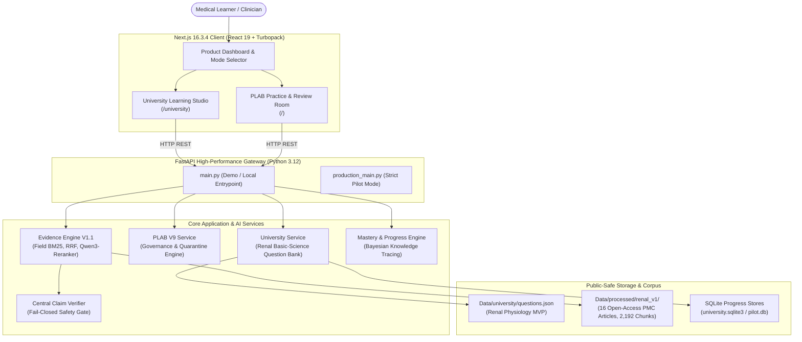
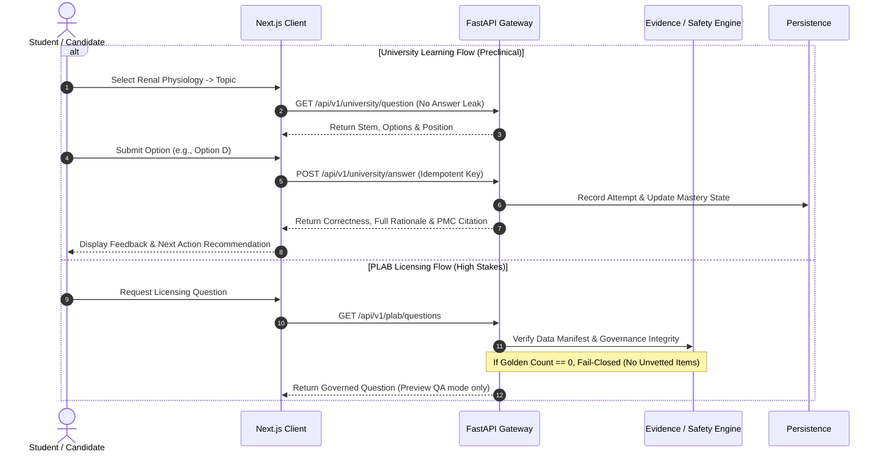
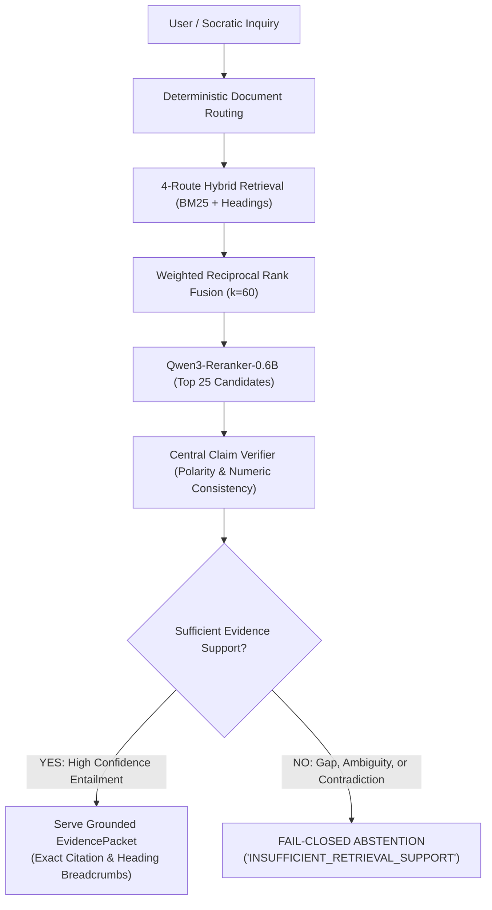

# MedicalPlab

> **An evidence-grounded medical learning platform combining adaptive undergraduate education with fail-closed licensing preparation.**

[](https://python.org)
[](https://fastapi.tiangolo.com)
[](https://nextjs.org)
[](https://react.dev)
[](docs/RAG_ARCHITECTURE.md)
[](reports/release/test_summary.md)

---

## What is MedicalPlab?

MedicalPlab is an AI-powered medical education platform designed to support clinicians across their training lifecycle. It bridges foundational basic science and high-stakes clinical licensing examination practice through two distinct, architecturally decoupled product lanes: **University Learning** and **PLAB / Licensing Preparation**. 

Rather than relying on unconstrained generative language models that confabulate clinical facts, MedicalPlab pairs targeted generative explanations with a deterministic, fail-closed **Evidence Engine (V1.1)**. Every explanation and distractor rejection is anchored to accredited medical literature and verified clinical guidelines with exact cryptographic provenance.

---

## The Problem

1. **Preclinical Comprehension Gap:** Undergraduate medical students struggle to bridge dense textbook physiology with mechanistic, board-style question application.
2. **Commercial Question Stagnation:** Legacy licensing question banks rely on static question pools that lag months behind clinical guideline updates and carry expensive recurring subscriptions.
3. **Unsafe LLM Confabulation:** General-purpose AI models frequently invent dosages, cite retracted literature, and generate convincing but dangerous clinical rationales. In medical education, ungrounded AI leads directly to diagnostic error and patient harm.

---

## The Product: Two Dedicated Learning Lanes

MedicalPlab enforces complete structural and behavioral separation between its two product lanes:

### 1. University Learning (Undergraduate Medical Education)
- **Target Learner:** Preclinical medical students and healthcare trainees.
- **Pedagogical Goal:** Mechanistic comprehension of foundational basic sciences.
- **Current Verified MVP:** **Renal Physiology** across two core syllabus topics:
  - *Glomerular filtration barrier* (fenestrated endothelium, basement membrane, podocyte slit diaphragms).
  - *Renin-Angiotensin-Aldosterone System (RAAS)* (renin cleavage of angiotensinogen, ACE conversion, AT1 receptor actions).
- **Core Loop:** Subject $\rightarrow$ Topic $\rightarrow$ Single-Best-Answer Question $\rightarrow$ Feedback & Mechanistic Rationale $\rightarrow$ BKT Mastery Update $\rightarrow$ Next Action Recommendation.
- **Security & Contract:** Zero answer key leakage in client payloads; anonymous learner device identity; fail-closed on corrupted content.

### 2. PLAB / Licensing Preparation (Clinical Licensing Practice)
- **Target Learner:** International Medical Graduates (IMGs) and final-year UK students sitting the GMC PLAB 1 / Medical Licensing Assessment (MLA).
- **Pedagogical Goal:** High-stakes diagnostic decision-making and guideline adherence.
- **Governance & Safety:** Bounded by UK clinical issuing bodies (NICE, BTS, RCUK, SIGN).
- **Fail-Closed Quarantine Policy:** Every question is audited against an explicit 9-point blocker taxonomy (Blockers A through I). In Cardiorespiratory Batch 1, **24 of 36 items are strictly quarantined** due to evidence currency or distractor ambiguity blockers. **Zero questions are published without GMC clinician sign-off.**

---

## What Works Today

- [x] **Next.js 16.3.4 Production Client:** Responsive learning interface with mode selection, question engine, instantaneous rationale drawer, and mastery telemetry (`frontend/`).
- [x] **FastAPI Application Gateway:** High-performance async backend supporting `/api/v1/university/*`, direct evidence retrieval `/api/v1/evidence/query`, Socratic chat `/ai/chat`, and platform routing (`main.py`).
- [x] **Canonical Evidence Engine V1.1:** Field-aware BM25 + deterministic document routing + section-local matching + weighted Reciprocal Rank Fusion + `Qwen3-Reranker-0.6B` cross-encoder (`src/medicalplab/evidence_engine/`).
- [x] **Central Claim Verification:** Deterministic polarity, numeric consistency, and high-risk claim safety checks enforcing fail-closed abstention.
- [x] **Bayesian Knowledge Tracing (BKT):** Dynamic student mastery tracking modeling knowledge state transitions and weak topic identification (`src/medicalplab/stage_e/`).
- [x] **PLAB V9 Governance Engine:** Mathematical verification of UTF-8 LF normalized hashes, exact span containment, and independent negative mutation rejection (`tests/plab/v9/`).

---

## Why MedicalPlab is Different

| Feature | Legacy Question Banks | Generic LLMs (ChatGPT/Claude) | MedicalPlab |
| :--- | :--- | :--- | :--- |
| **Evidence Grounding** | Text summaries; unverified provenance | Probabilistic recall; prone to hallucination | Cryptographically verified exact-span containment in accredited sources |
| **Adaptivity** | Static tags; linear difficulty | Conversational, but no learner state model | Bayesian Knowledge Tracing (BKT) with dynamic mastery tracking |
| **Safety Governance** | Infrequent manual reviews | No safety guarantees | NHS DCB0129-aligned fail-closed quarantine framework |
| **Out-of-Domain Query** | Hard 404 or out of scope | Generates convincing confabulations | **Fail-closed abstention** (`INSUFFICIENT_RETRIEVAL_SUPPORT`) |
| **Clinical Integrity** | Self-published | Ungrounded probabilistic output | Software cannot self-approve medical truth; clinician sign-off required |

---

## Generative AI & The Evidence Engine

MedicalPlab maintains total transparency on what is generative AI versus deterministic algorithms:

```
┌────────────────────────────────────────────────────────────────────────┐
│                        AI & Algorithmic Stack                          │
├──────────────────────────┬─────────────────────────────────────────────┤
│ Component                │ Implementation & Nature                     │
├──────────────────────────┼─────────────────────────────────────────────┤
│ Generative AI            │ Socratic clinical explanation rendering and │
│                          │ contextual learner feedback (bounded)       │
├──────────────────────────┼─────────────────────────────────────────────┤
│ Candidate Retrieval      │ Pure deterministic: document routing cards, │
│                          │ field-aware BM25 (title 1.0, heading 2.0),  │
│                          │ section matching, weighted RRF (k=60)       │
├──────────────────────────┼─────────────────────────────────────────────┤
│ Neural Reranking         │ Qwen/Qwen3-Reranker-0.6B cross-encoder      │
│                          │ (scores top-25 query-chunk entailment)      │
├──────────────────────────┼─────────────────────────────────────────────┤
│ Deterministic Safety     │ CentralClaimVerifier: directional entailment│
│                          │ polarity veto, numeric check, fail-closed   │
├──────────────────────────┼─────────────────────────────────────────────┤
│ Adaptive Learning        │ 4-parameter Bayesian Knowledge Tracing (BKT)│
├──────────────────────────┼─────────────────────────────────────────────┤
│ Human-in-the-Loop        │ GMC-licensed clinician sign-off boundary    │
└──────────────────────────┴─────────────────────────────────────────────┘
```

---

## Product Architecture



---

## Learning Workflows: University vs PLAB



---

## Evidence Safety & Fail-Closed Abstention Flow



> **Core Clinical Invariant:** Retrieval relevance does not equal claim support. When evidence is ambiguous, absent, or contradicted, MedicalPlab deliberately abstains.

---

## Verified Engineering Status & Metrics

### Canonical Evidence Engine V1.1 DEV Cross-Validation
*Evaluated across 5 deterministic folds on 99 DEV queries grounded in 16 PMC renal documents (`Data/processed/renal_v1/`, 2,192 chunks):*

| Metric | V1 Baseline | V1.1 Selected | Absolute Delta | Description |
| :--- | :---: | :---: | :---: | :--- |
| **MRR** | `0.7476` | **`0.8144`** | `+0.0668` | Mean Reciprocal Rank |
| **Hit@1** | `0.6768` | **`0.7576`** | `+0.0808` | Top passage is ground truth |
| **Hit@5** | `0.7879` | **`0.8485`** | `+0.0606` | Ground truth within top 5 |
| **Hit@10** | `0.8485` | **`0.9091`** | `+0.0606` | Ground truth within top 10 |
| **NDCG@10** | `0.6417` | **`0.7061`** | `+0.0644` | Ranking quality discount |
| **Doc Hit@1** | `0.8283` | **`0.8586`** | `+0.0303` | Document-level routing precision |
| **CandidateRecall@50**| `0.9495` | **`0.9697`** | `+0.0202` | High-recall candidate pool |
| **Product-Served Unsupported DEV Cases** | `0 / 37` | **`0 / 37`** | `0.0% false support` | Zero ungrounded claims served |

- **Warm Runtime Latency:** p50 = `951.18 ms` | p95 = `1160.31 ms` | Mean = `934.68 ms`
- **Cold Startup:** `10.83 s` (one-time index load and routing card generation)

> [!NOTE]
> All figures above represent **cross-validated DEV performance**. In accordance with scientific integrity guidelines, the lineage report records: `NO_UNSPENT_UNBIASED_FINAL_HOLDOUT_AVAILABLE`. We do not claim unseen final holdout performance.

---

## Repository Structure

```
MedicalPlab/
├── frontend/               # Next.js 16.3.4 client application (React 19, Turbopack)
├── src/medicalplab/        # Core backend application and AI services
│   ├── evidence_engine/    # Canonical Evidence Engine V1.1 (BM25, RRF, Qwen3-Reranker)
│   ├── university/         # University Learning service and REST API
│   ├── plab/               # PLAB V9 governance, quarantine, and data manifests
│   └── stage_b ... stage_r # Specialized modular pipeline stages (BKT, routing, simulation)
├── Data/                   # Public-safe runtime data and accredited literature
│   ├── processed/renal_v1/ # 16 PMC articles (2,192 verified chunks, JATS, quality scores)
│   ├── raw/renal_v1/       # 16 PMC open-access XML source documents
│   ├── university/         # University Renal Physiology question bank
│   ├── questions/          # Public-safe PLAB questions and review queues
│   └── metadata/           # Corpus snapshot manifests and license registries
├── tests/                  # Automated verification suite (safety, governance, RAG, university)
├── docs/                   # Product, architecture, clinical safety, and deployment docs
├── deploy/                 # Cloud Run deployment automation scripts (Bash, PowerShell)
├── configs/                # Executable configs with cryptographic SHA-256 sidecars
├── schemas/                # Formal JSON Schema data contracts
├── Scripts/                # Active maintenance, ingestion, and evaluation tools
├── reports/release/        # Accepted milestone closure reports and verified benchmarks
├── evaluation/             # Ground truth datasets & benchmarks asserted by governance tests
├── models/                 # Frozen classifier models with cryptographic SHA-256 sidecars
├── main.py                 # Primary local & demo FastAPI entrypoint
├── production_main.py      # Strict fail-closed deployment/pilot entrypoint
├── Dockerfile              # Production multi-stage container build (Google Cloud Run)
├── pyproject.toml          # Canonical Python package specification and tool configurations
└── requirements.txt        # Runtime/deployment compatibility requirements
```

---

## Quick Start

### 1. Run the Backend API
```bash
# Set up Python virtual environment
python -m venv .venv
source .venv/bin/activate       # On Windows: .\.venv\Scripts\Activate.ps1

# Install dependencies and local package
pip install -r requirements.txt
pip install -e .

# Start FastAPI gateway
python main.py
```
*API will be live at `http://localhost:8000`. Swagger documentation available at `http://localhost:8000/docs`.*

### 2. Run the Next.js Frontend
```bash
cd frontend
npm ci
npm run dev
```
*Web application will be accessible at `http://localhost:3000`.*

---

## Mentor & Judge Demo Walkthrough (3–5 Minutes)

Follow our complete step-by-step evaluation guide in [`docs/DEMO_GUIDE.md`](docs/DEMO_GUIDE.md):

1. **Launch:** Open `http://localhost:3000` and navigate to **University Learning**.
2. **Practice:** Answer a real Renal question (*Glomerular filtration barrier*).
3. **Inspect Feedback:** View instantaneous correctness, mechanistic explanation, and direct PubMed Central citation (`DOC-PMC-RENAL-0004`).
4. **Inspect Mastery:** Observe Bayesian Knowledge Tracing (BKT) update topic mastery and recommend the next action.
5. **Inspect PLAB Separation:** Observe that preclinical University attempts never leak into PLAB licensing records.
6. **Supported Evidence Query:** Query the Evidence Engine on Renal physiology; observe verified passage retrieval with section context.
7. **Unsupported Query / Fail-Closed Abstention:** Test with an out-of-domain or ungrounded inquiry; observe safe, fail-closed abstention (`INSUFFICIENT_RETRIEVAL_SUPPORT`).

---

## Testing & Quality Verification

Run all test tiers using standard `pytest`:

```bash
# 1. Canonical Evidence Engine V1.1 tests
pytest tests/test_canonical_rag.py tests/test_evidence_engine_v2.py -v

# 2. University Learning Track tests
pytest tests/university/ -v

# 3. PLAB V9 Evidence Closure & Negative Mutation tests
pytest tests/plab/v9/ -v

# 4. Fast backend smoke verification
python tests/verify_endpoints.py

# 5. Frontend build & lint
cd frontend && npm run build && npm run lint
```

---

## Current Limitations & Transparent Boundaries

- **University Scope:** Currently focused on an MVP of 6 verified questions across two core Renal Physiology topics. Curriculum expansion is prioritized post-submission.
- **PLAB Readiness:** Cardiorespiratory Batch 1 contains 24 quarantined items awaiting formal GMC-registered physician sign-off. We do not self-publish unapproved medical licensing items.
- **RAG Final Holdout:** Reported metrics reflect 5-fold cross-validation on DEV queries (`NO_UNSPENT_UNBIASED_FINAL_HOLDOUT_AVAILABLE`). Unbiased held-out testing will occur after expanding the PMC corpus to additional organ systems.
- **Hardware Acceleration:** Neural reranking (`Qwen3-Reranker-0.6B`) runs optimally on CUDA GPU (~950 ms p50); on CPU environments, inference falls back gracefully with higher latency (~2.8 s).

---

## Roadmap

- [ ] **Curriculum Expansion:** Expand University Learning to Cardiovascular and Respiratory physiology.
- [ ] **Physician Review Portal:** Streamline GMC clinician review workflow for quarantined PLAB items.
- [ ] **OSCE Simulation Mode:** Expand turn-based clinical communication simulations with audio input.
- [ ] **Multimodal Diagnostic Grounding:** Ingest and bind radiological and histopathological images to evidence packets.

---

## Documentation Links

- [System Architecture](docs/ARCHITECTURE.md)
- [AI & Intelligence Framework](docs/AI_SYSTEM.md)
- [Canonical RAG Architecture](docs/RAG_ARCHITECTURE.md)
- [University Learning Track](docs/UNIVERSITY_TRACK.md)
- [PLAB Evidence & Governance](docs/PLAB_EVIDENCE.md)
- [Clinical Safety & Risk Framework](docs/CLINICAL_SAFETY.md)
- [Mentor & Judge Demo Guide](docs/DEMO_GUIDE.md)
- [Developer & Testing Guide](docs/DEVELOPMENT.md)
- [Production Deployment Guide](docs/DEPLOYMENT.md)
