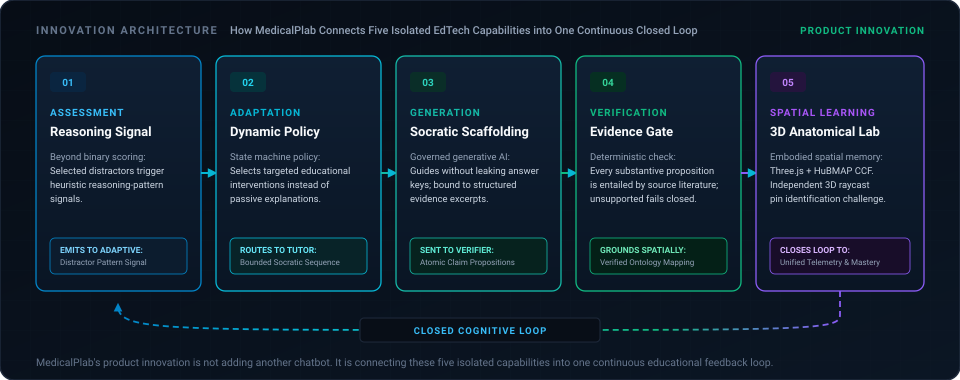
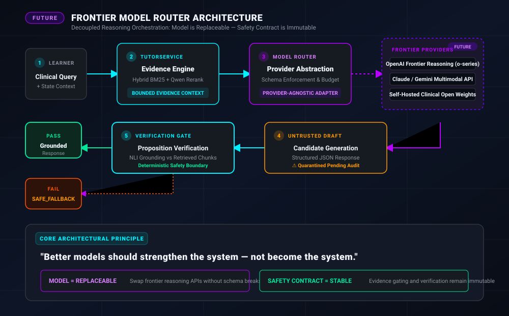

# MedicalPlab

### Adaptive Evidence-Grounded Medical Learning Platform

<p align="center">
  
</p>

> **MedicalPlab does not only answer students. It learns how students learn.**

Most medical learning platforms stop at answer correctness. MedicalPlab treats the learner interaction as a signal. It connects assessment, adaptive intervention, grounded generative tutoring, independent transfer, and interactive anatomy into one closed learning loop. The generative model is not the authority: retrieved evidence, deterministic state, structured actions, and verification define what the model is allowed to do.

<p align="center">
  <a href="https://www.python.org/"></a>
  <a href="https://fastapi.tiangolo.com/"></a>
  <a href="https://nextjs.org/"></a>
  <a href="https://threejs.org/"></a>
  <a href="#engineering-verification"></a>
  <a href="docs/mobile-handoff/API_CONTRACT.md"></a>
</p>

---

### Quick Navigation

[Choose Your Path](#choose-your-path) • [Why Different](#why-medicalplab-is-different) • [Signal Story](#from-signal-to-understanding) • [Signal Path](#signal-path) • [GenAI Core](#generative-ai-core) • [AI Systems](#ai-systems-at-a-glance) • [Intelligence Stack](#medicalplab-intelligence-stack) • [Product Experience](#product-experience) • [Adaptive & Socratic](#adaptive-learning--socratic-remediation) • [Grounded Tutor](#evidence-grounded-ai-tutor) • [Shared Evidence](#shared-evidence-engine) • [3D Anatomy](#spatial-3d-anatomy) • [AI & Anatomy Boundary](#ai-instruction-layer-vs-geometry-layer) • [Innovation Map](#innovation-map) • [Built Today](#built-today) • [Technology & Tooling](#technology--tooling) • [Engineering Verification](#engineering-verification) • [Mobile Integration](#mobile-integration) • [Clinical Governance](#clinical-licensing-governance) • [Current Status](#current-status-matrix) • [Future Roadmap](#future-intelligence-roadmap) • [Quick Start](#quick-start) • [Deployment](#deployment) • [Repository Structure](#repository-structure) • [Demo Runbook](docs/demo/FINAL_DEMO_RUNBOOK.md) • [Mentor Briefing](docs/handoff/MENTOR_START_HERE.md)

---

## Choose Your Path

Select your discipline to access the authoritative specifications, codebases, and entry points immediately:

| Audience | Key Questions Answered | Primary Starting Point |
| :--- | :--- | :--- |
| **Mentor / Judge** | What is MedicalPlab? Why is it differentiated? What is built today vs future vision? | [Mentor Quick Briefing](docs/handoff/MENTOR_START_HERE.md) &bull; [Demo Runbook](docs/demo/FINAL_DEMO_RUNBOOK.md) |
| **Mobile Developer** | How do I integrate iOS/Android against the REST contract? Where is the OpenAPI spec? | [Mobile 10-Min Start](docs/mobile-handoff/START_HERE.md) &bull; [Client Examples](docs/mobile-handoff/CLIENT_EXAMPLES.md) &bull; [OpenAPI](docs/mobile-handoff/openapi.json) |
| **AI / Backend Engineer** | How does the Evidence Engine work? Where are the claim verification boundaries? | [Generative AI Core](#generative-ai-core) &bull; [AI Architecture](docs/AI_SYSTEM.md) &bull; [System Architecture](docs/ARCHITECTURE.md) |
| **Clinical Reviewer** | How is clinical literature verified? How is candidate PLAB exam content governed? | [Clinical Governance](#clinical-licensing-governance) &bull; [Clinical Safety](docs/CLINICAL_SAFETY.md) &bull; [Attribution](THIRD_PARTY_NOTICES_ANATOMY.md) |

---

## Why MedicalPlab Is Different

MedicalPlab is engineered around six fundamental architectural departures from conventional medical educational software:

### 1. Reasoning-Aware Learning
Instead of only recording whether an answer is right or wrong, selected distractors may map to heuristic reasoning-pattern signals. A mistake is treated as an educational hypothesis that routes bounded intervention, rather than an arbitrary deduction.

### 2. Evidence-Grounded Generative Tutoring
Medical explanations are retrieved from peer-reviewed literature, reranked by neural cross-encoders, generated under strict context constraints, and subjected to sentence-level claim verification before delivery. Unsupported claims fail-closed to safe guidance.

### 3. Independent Transfer Verification
Socratic dialogue alone does not certify competence. After remediation, the learner must solve an unprompted, held-out clinical transfer problem before learner state is updated.

### 4. Spatial Intelligence Grounding
3D anatomy is connected directly to the cognitive state rather than operating as an isolated cosmetic viewer. Spatial landmarks anchor basic-science concepts in canonical physical geometry.

### 5. AI / Scientific Asset Separation
Generative AI orchestrates educational scene actions (camera focus, structure highlight), but **never** generates or alters scientific anatomy geometry. Authority remains anchored in peer-reviewed HuBMAP Human Reference Atlas models.

### 6. Governance-First Clinical Content
Clinical examination questions undergo strict lifecycle control. Candidate PLAB questions cannot self-promote into released production curriculum without independent clinician review panel sign-off.

---

## From Signal to Understanding

The core narrative spine of MedicalPlab transforms a single diagnostic interaction into verified understanding:

```
Learner Selects Distractor
          │
          ▼
Heuristic Reasoning-Pattern Signal Identifies Potential Misconception
          │
          ▼
Adaptive Policy Routes Student to 3-Turn Socratic Remediation Drawer
          │
          ▼
Independent Held-Out Transfer Problem Verifies Conceptual Understanding
          │
          ▼
AI Tutor Provides Deeper Verified Evidence with PMC Citations
          │
          ▼
3D Anatomy Grounds Physiology in Physical Organ Architecture
          │
          ▼
Unified Learner Progress Updates Topic-Level Learner State
```

---

## Signal Path

The closed-loop architecture ensures that every learner interaction carries cognitive signal through the entire educational stack:

<p align="center">
  
</p>

| Stage | Cognitive Function | Pedagogical Mechanism |
| :--- | :--- | :--- |
| **1. Attempt** | Evaluated Clinical Scenario | Preclinical basic science or clinical question attempt |
| **2. Reasoning Signal** | Heuristic Pattern Identification | Selected distractors may map to heuristic reasoning-pattern signals |
| **3. Adaptive Intervention** | Dynamic Routing Policy | Recommends targeted remediation rather than passive scoring |
| **4. Socratic Remediation** | Dialogue Scaffolding | 3-turn Socratic sequence: Probe &rarr; Guide &rarr; Consolidate |
| **5. Independent Transfer** | Independent Transfer Evidence | Demonstrates transfer on an unseen held-out item before learner state update |
| **6. Grounded Tutor** | Verified Literature Inquiries | Explanations bounded to open-access PMC literature with proposition verification |
| **7. Spatial 3D Learning** | Anatomy Grounding | Interactive HuBMAP Human Reference Atlas models with deterministic raycast challenges |
| **8. Unified Progress** | Cross-Module Progress | Shared progress across preclinical tracks, tutor turns, and 3D spatial labs |

---

## Generative AI Core

> **"MedicalPlab uses generation as a controlled educational capability, not as an authority."**

The platform decouples generative fluency from medical authority. The generative model operates inside a deterministic verification container where context is bounded by retrieved evidence, claims are verified before output, and pedagogical decisions follow an explicit state machine.

<p align="center">
  
</p>

### Pipeline A: Evidence-Grounded Reasoning
1. **Learner Clinical Query:** The student poses a mechanistic question during practice.
2. **Hybrid Evidence Retrieval:** Lexical BM25 search and dense retrieval query indexed open-access PMC literature.
3. **Neural Reranking:** In-domain cross-encoders rerank chunks for clinical relevance and topical precision.
4. **Context Bounding & Rights Gate:** Chunks are validated for open-access licensing (CC-BY) and assembled into a bounded prompt context.
5. **Generative Reasoning Draft:** The generative provider drafts an explanatory response strictly constrained to the provided context.
6. **Proposition Claim Verification:** Statements are segmented into atomic propositions and verified for entailment against retrieved evidence chunks.
7. **Supported Output or Safe Fallback:** If verified, the response is delivered with citations. If unsupported claims exist, the system deterministically executes `SAFE_FALLBACK`.

### Pipeline B: Adaptive Pedagogical Actions
In parallel, learner interactions emit progress events into the **Adaptive Policy Engine**. The engine evaluates topic-level learner state, error history, and reasoning hypotheses to emit structured actions:
* **Socratic Prompts:** Guiding questions that probe mechanism without disclosing the answer key.
* **Tutor Interventions:** Mechanistic deep dives when persistent misconceptions emerge.
* **3D Scene Guidance:** Camera position and structure highlighting actions dispatched to the client Three.js canvas.
* **Next Best Step:** Curriculum sequencing recommendations.

---

## AI Systems at a Glance

MedicalPlab organizes its AI capabilities into four distinct operational disciplines, all anchored by a unified verification boundary:

```
┌─────────────────┐      ┌─────────────────┐      ┌─────────────────┐      ┌─────────────────┐
│     GROUND      │      │     REASON      │      │      ADAPT      │      │       ACT       │
├─────────────────┤      ├─────────────────┤      ├─────────────────┤      ├─────────────────┤
│ Evidence RAG    │      │ Bounded Context │      │ State Tracking  │      │ Socratic Steps  │
│ BM25 + RRF      │ ───► │ Structured JSON │ ───► │ Heuristic Rules │ ───► │ Tutor Response  │
│ Rights Gating   │      │ Draft Reasoner  │      │ Policy Routing  │      │ 3D Scene Action │
└─────────────────┘      └─────────────────┘      └─────────────────┘      └─────────────────┘
         ▲                                                                          │
         │                         VERIFY (FAIL-CLOSED)                             │
         └──────────────────────────────────────────────────────────────────────────┘
           Proposition Entailment Audit • Raycast Geometry Scoring • Rights Check
```

* **GROUND:** Open-access PMC retrieval, Reciprocal Rank Fusion (RRF), license rights verification.
* **REASON:** In-context generative explanations, reasoning-pattern identification, dialogue formulation.
* **ADAPT:** Topic-level state machines, distractor hypothesis mapping, recommendation heuristics.
* **ACT:** Structured scene actions for Three.js, multi-turn Socratic prompts, held-out transfer items.
* **VERIFY:** Proposition-level NLI verification, deterministic raycasting, answer-key protection. Nothing substantive is served without passing verification.

---

## MedicalPlab Intelligence Stack

| Layer | Functional Role | Operational Mechanics | Authoritative Guarantees |
| :--- | :--- | :--- | :--- |
| **Adaptive Intelligence** | Cognitive diagnostic routing | Distractor taxonomy mapping, heuristic reasoning signals, topic-level learner state | Wrong answer &ne; confirmed defect; signals are provisional hypotheses |
| **Generative Intelligence** | Pedagogical dialogue & explanation | In-context clinical explanations, multi-turn Socratic scaffolding, structured scene payloads | Generation is bounded by evidence; no unconstrained medical generation |
| **Evidence Intelligence** | Evidence retrieval & verification | Hybrid BM25 + dense retrieval, neural reranking, proposition entailment verification | Fail-closed `SAFE_FALLBACK`; only rights-approved CC-BY sources served |
| **Spatial Intelligence** | Physical anatomical grounding | Three.js renderer, HuBMAP HRA canonical CCF geometry, deterministic raycasting | AI directs camera/highlights; scientific geometry is fixed and immutable |
| **Learning Intelligence** | Cross-Module Progress | Unified cross-module learner progress across questions, tutor sessions, and 3D challenges | Held-out transfer items provide independent evidence of transfer |

> **Governance Boundary:** Cohort-level learning intelligence and aggregate reasoning-gap analytics are **educator-facing only**. They are never exposed as automated student-facing diagnostic recommendations.

---

## Product Experience

Real interfaces captured from the certified MedicalPlab demonstration:

<p align="center">
  
</p>

**FIG. 01 — LEARNING HUB**  
*The central student command center unifying curriculum tracks, continuous competence tracking, and recommended adaptive interventions.*

<p align="center">
  
</p>

**FIG. 02 — UNIVERSITY & SOCRATIC REMEDIATION**  
*Curricular renal physiology question with multi-turn Socratic remediation that scaffolds learner reasoning without leaking the answer key.*

<p align="center">
  
</p>

**FIG. 03 — GROUNDED TUTOR SAFE FALLBACK**  
*When candidate evidence is insufficient for proposition verification, the system falls closed into content-neutral procedural Socratic guidance.*

<p align="center">
  
</p>

**FIG. 04 — SPATIAL 3D ANATOMY CHALLENGE**  
*Three.js anatomy workspace with independent Left Renal Artery identification evaluated deterministically by the backend scoring engine.*

<p align="center">
  
</p>

**FIG. 05 — UNIFIED PROGRESS**  
*Unified learner progress recording question accuracy, remediation completions, transfer problem success, and spatial anatomy challenge scores.*

---

## Adaptive Learning & Socratic Remediation

Selected distractors may map to heuristic reasoning-pattern signals. In MedicalPlab, an incorrect answer is **not** a confirmed misconception; it represents a provisional reasoning-pattern signal and heuristic educational hypothesis that routes the learner to targeted Socratic scaffolding.

<p align="center">
  
</p>

The remediation dialogue is separated from learner state updates by an architectural firewall:

1. **Probe:** The preceptor prompts the learner to explain the physiological principle behind their choice.
2. **Guide:** Target clues highlight the specific mechanistic distinction without disclosing the answer.
3. **Consolidate:** The learner summarizes the reconciled concept in their own terms.
4. **Independent Transfer Firewall:** Remediation dialogue scaffolds understanding. A held-out transfer item provides independent evidence of transfer before learner state is updated.

<details>
<summary>Under the hood: Adaptive State Machine & Reasoning Signal Heuristics</summary>

```
[Student Attempt]
       │
       ▼
[Distractor Analysis Engine] ──► Evaluates selected option against distractor taxonomy
       │
       ├─► Correct ──► Increment streak, advance difficulty tier
       │
       └─► Distractor Identified (e.g., Substrate vs Product Confusion)
              │
              ▼
       [Remediation State Machine]
              │
              ├── State: PROBE (Prompt student for physiological rationale)
              ├── State: GUIDE (Offer progressive hints level 1–3)
              └── State: CONSOLIDATE (Validate student mechanistic summary)
                     │
                     ▼
       [Held-Out Transfer Gate]
              │
              ├── Pass ──► Update topic-level learner state (+1 Transfer demonstrated)
              └── Fail ──► Retain topic in priority queue for review
```

* Heuristic pattern identification operates deterministically via rule-matched distractor dictionaries (`Data/university/distractor_taxonomy.json`).
* Student progress records are isolated per topic (`raas_mechanisms`, `glomerular_filtration_barrier`) and persisted across sessions.
</details>

---

## Evidence-Grounded AI Tutor

The MedicalPlab Tutor is built specifically to address hallucination in medical education. It does not generate unconstrained text.

<p align="center">
  
</p>

*Captured from the live MedicalPlab student practice experience during post-submission mechanistic analysis.*

1. **Query:** Student asks a mechanistic or clinical question.
2. **Retrieve:** Shared Evidence Engine queries the indexed PubMed Central open-access basic-science corpus.
3. **Rerank & Rights Gate:** Candidates are reranked and filtered through the source rights gate to verify approved open-access / Creative Commons licenses.
4. **Bounded Generation:** Generative provider drafts an explanation constrained to retrieved excerpts.
5. **Post-Generation Verification:** Every proposition is checked for entailment against source chunks. If support is insufficient, the system safely falls closed to procedural Socratic guidance (`SAFE_FALLBACK`).

<details>
<summary>Under the hood: Verification Gate & Evidence Provenance</summary>

```python
# Verification Contract:
class TutorPostVerifier:
    def verify(self, draft_message: str, candidate_chunks: list[Chunk]) -> VerificationResult:
        propositions = self.segmenter.extract_propositions(draft_message)
        unsupported = []
        for prop in propositions:
            entailed = self.claim_verifier.verify(prop, candidate_chunks)
            if not entailed:
                unsupported.append(prop)
        
        if len(unsupported) > 0:
            return VerificationResult(status="SAFE_FALLBACK", fallback_applied=True)
        return VerificationResult(status="SUPPORTED", fallback_applied=False)
```

* **Evidence-Grounded Verifier:** Responses are served as Evidence Supported only after the verifier confirms support for substantive medical propositions against the active retrieved evidence.
* **Fail-Closed Fallback:** When candidate support is insufficient or out of scope, the system safely triggers content-neutral procedural Socratic guidance (`SAFE_FALLBACK`) with zero substantive medical claims.
* **Citation Traceability:** Citations include PMCID, DOI, author metadata, exact chunk identifiers, and licensing provenance (e.g., `CC BY 4.0`, `CC BY 3.0`).
</details>

---

## Shared Evidence Engine

MedicalPlab employs a shared evidence architecture across both Socratic tutoring and clinical case discussions:

<p align="center">
  
</p>

* **Unified Retrieval:** A single authoritative retrieval engine serves both University and Clinical tracks.
* **License Firewall:** Rights-approved open-access / Creative Commons evidence sources are admitted only after source-level license verification, with license provenance preserved per document.
* **No Direct LLM Path:** The adaptive engine and question modules never call an unconstrained LLM directly; all generation routes through the verification and rights pipeline.

---

## Spatial 3D Anatomy

Medical understanding requires spatial grounding. The MedicalPlab 3D Anatomy Lab renders canonical CCF models from the NIH HuBMAP Human Reference Atlas.

<p align="center">
  
</p>

*Captured from the live MedicalPlab Three.js anatomy experience using licensed HuBMAP Human Reference Atlas assets.*

* **Exploration:** Smooth orbit, pan, and zoom with canonical camera presets (`Overview`, `Anterior Hilum`, `Internal View`).
* **Socratic Grounding:** Selecting physical structures (capsule, renal artery, renal vein, pelvis) triggers contextual basic-science lessons.
* **Deterministic Scoring:** The learner is challenged to identify structures independently. Raycasted clicks are verified against anatomical ontology IDs (`UBERON:0002113`, `UBERON:0001120`, `UBERON:0001121`).

<details>
<summary>Under the hood: Deterministic Challenge Verification & Coordinate Framing</summary>

```json
// Canonical Challenge Verification Flow:
POST /api/v1/anatomy/session/{session_id}/challenge
Payload: {
  "learner_id": "learner_42",
  "selected_structure_id": "renal_artery_left"
}

// Server Response (Deterministic Evaluation):
{
  "session": {
    "session_id": "anat_sess_01",
    "learner_id": "learner_42",
    "learning_objective": "RENAL_BLOOD_FLOW_AND_HILUM",
    "lesson_state": "CHALLENGE_ACTIVE",
    "challenge_state": "COMPLETED",
    "challenge_result": "CORRECT"
  },
  "is_correct": true,
  "target_structure_id": "renal_artery_left",
  "selected_structure_id": "renal_artery_left",
  "tutor_feedback": "Correct. You have accurately identified the Left Renal Artery.",
  "scene_actions": [
    {
      "action": "HIGHLIGHT_STRUCTURE",
      "structure_id": "renal_artery_left",
      "duration_ms": 1500
    }
  ]
}
```

* All anatomical structures use the HuBMAP Common Coordinate Framework (CCF v1.3 / v2.0) registered to anatomical reference standards.
* Geometry is immutable and loaded directly from verified GLB assets.
</details>

---

## AI Instruction Layer vs Geometry Layer

A fundamental principle of MedicalPlab is architectural separation of AI agency and medical truth:

<p align="center">
  
</p>

> **AI DOES NOT GENERATE ANATOMY GEOMETRY.**  
> The 3D anatomical meshes are immutable scientific assets licensed from the HuBMAP Human Reference Atlas. The AI layer is strictly restricted to structured scene orchestration (`FOCUS_STRUCTURE`, `HIGHLIGHT_STRUCTURE`, `ISOLATE_STRUCTURE`, `SHOW_RELATION`, `RESET_SCENE`).

---

## Innovation Map

MedicalPlab connects five core engineering pillars into a cohesive, closed-loop educational system:

<p align="center">
  
</p>

```
Assessment ───────► Produces Heuristic Reasoning Signal
      │
Adaptive Layer ───► Determines Targeted Scaffolding Policy
      │
Generative Layer ─► Synthesizes Socratic Clues & Explanations
      │
Evidence Layer ───► Gates, Grounds, and Verifies Claims
      │
Spatial 3D Layer ─► Physically Grounds Organ Relationships
      │
Progress Layer ───► Closes the Cross-Module Progress Loop
```

---

## Built Today

MedicalPlab maintains complete transparency regarding current implementation status vs future research horizons:

| Capability Pillar | Built Today (Authoritative Implementation) | Status Marker |
| :--- | :--- | :---: |
| **Preclinical Curriculum** | 6 validated renal physiology questions with full distractor reasoning taxonomy | `CURRENT` |
| **Adaptive Engine** | Distractor-matched reasoning signals with dynamic intervention routing | `CURRENT` |
| **Socratic Remediation** | Bounded 3-turn Socratic sequence: Probe &rarr; Guide &rarr; Consolidate | `CURRENT` |
| **Independent Transfer** | Held-out transfer item gating before transfer evidence is recorded | `CURRENT` |
| **Evidence-Grounded Tutor**| Hybrid BM25 + dense retrieval, neural reranking, claim verification, safe fallback | `CURRENT` |
| **Interactive 3D Anatomy**| Canonical HuBMAP HRA left kidney model with Three.js orbit and inspection presets | `CURRENT` |
| **Guided Spatial Tours** | Pre-programmed Left Renal Vein and hilar anatomical inspections | `CURRENT` |
| **Deterministic Spatial Challenge** | Left Renal Artery identification challenge with backend raycast verification | `CURRENT` |
| **Unified Learner Progress** | Cross-module progress integration across questions, remediation, and 3D tasks | `CURRENT` |
| **PLAB Exam Governance** | 36 candidate questions isolated under Preview QA; Golden released = 0 | `CURRENT` |
| **Mobile Integration Baseline** | Frozen REST contract with OpenAPI 3.1.0, Postman collections, and client guides | `CURRENT` |

---

## Technology & Tooling

### Verified Core Stack
<p align="center">
  <a href="https://skillicons.dev">
    
  </a>
</p>

### AI Systems & Machine Learning
<p align="center">
  
  
  
  
  
  
</p>

### Architecture & Standards
* **Backend:** Python 3.11+, FastAPI, Pydantic v2, SQLite (module-owned pilot storage), Uvicorn.
* **Frontend:** Next.js 16 (App Router), React 19, TypeScript, Tailwind CSS, Lucide Icons.
* **3D Rendering:** Three.js 0.183+, WebGL 2.0, glTF 2.0 Loader, OrbitControls, Raycaster.
* **Contract & QA:** OpenAPI 3.1.0, Postman Collections, Pytest, Chrome DevTools Protocol (CDP).

---

## Engineering Verification

MedicalPlab functionality is certified through continuous deterministic testing, contract drift auditing, and production builds:

```
===================== CERTIFIED QUALITY GATE STATUS =====================
- Backend Integration Tests:       23 / 23 PASS (tests/integration/)
- Mobile API Contract Tests:       12 / 12 PASS (test_mobile_api_contract.py)
- OpenAPI Drift Verification:      PASS (43 paths, 44 operations matching)
- Frontend Production Build:       PASS (Next.js 16.3.4, React 19, Turbopack)
- Documentation Link Audit:        PASS (35 docs checked, 0 broken links)
- Security & Secret Scan:          PASS (1,128 files audited, 0 leaks)
=========================================================================
```

Enforced Verifier Guarantees:
* **Proposition-Level Claim Verification:** Generative tutor drafts are decomposed into atomic statements and checked against retrieved active evidence chunks. If support is insufficient, the system safely triggers fail-closed procedural fallback (`SAFE_FALLBACK`).
* **Deterministic 3D Anatomy Scoring:** Raycast clicks are evaluated deterministically on the backend against verified HuBMAP CCF anatomical structure identifiers.
* **Answer Key Protection:** Pre-submission Socratic scaffolding never leaks correct options or distractor keys.

```bash
# Run backend integration tests:
python -m pytest tests/integration/ -q -p no:cacheprovider

# Run mobile contract certification:
python -m pytest tests/integration/test_mobile_api_contract.py -q

# Run runtime OpenAPI drift check:
python Scripts/verify_mobile_contract_drift.py
```

---

## Mobile Integration

MedicalPlab provides a frozen mobile API contract for rapid cross-platform client integration (Flutter, React Native, iOS, Android):

* **Pilot Identity:** Learner identity partitioning via `X-User-Id` header (classified as demo learner identity; `X-User-Id` is NOT production cryptographic authentication; `MOBILE_PRODUCTION_AUTH_READY = NO`).
* **Authoritative Contract:** All request schemas, responses, and error handling follow [docs/mobile-handoff/API_CONTRACT.md](docs/mobile-handoff/API_CONTRACT.md).
* **Onboarding Guide:** Complete 10-minute setup in [docs/mobile-handoff/START_HERE.md](docs/mobile-handoff/START_HERE.md).
* **Code Examples:** Production-ready client snippets in Flutter and React Native in [docs/mobile-handoff/CLIENT_EXAMPLES.md](docs/mobile-handoff/CLIENT_EXAMPLES.md).
* **Checklist:** Integration pre-flight validation in [docs/mobile-handoff/INTEGRATION_CHECKLIST.md](docs/mobile-handoff/INTEGRATION_CHECKLIST.md).
* **Specification:** Frozen OpenAPI specification at [docs/mobile-handoff/openapi.json](docs/mobile-handoff/openapi.json).

<details>
<summary>Under the hood: Canonical Mobile Endpoints</summary>

```
# Preclinical University Curriculum
GET  /api/v1/university/subjects
GET  /api/v1/university/topics
GET  /api/v1/university/question
POST /api/v1/university/answer

# Adaptive Learning Engine
GET  /api/v1/adaptive/recommendation
GET  /api/v1/adaptive/state

# Socratic Remediation & Transfer
POST /api/v1/remediation/start
POST /api/v1/remediation/turn
GET  /api/v1/remediation/session/{session_id}/transfer
POST /api/v1/remediation/session/{session_id}/transfer

# Evidence-Grounded AI Tutor
POST /api/v1/tutor/chat

# Spatial 3D Anatomy
POST /api/v1/anatomy/session/start
POST /api/v1/anatomy/session/{session_id}/challenge

# Unified Learner Progress
GET  /api/v1/learner/progress
```
</details>

---

## Clinical Licensing Governance

MedicalPlab implements explicit clinical content governance to ensure candidate safety and pedagogical accuracy:

<p align="center">
  
</p>

| Metric | Authoritative Repository Status |
| :--- | :--- |
| **University Production Questions** | **6 items** (`UNI-RENAL-001` to `006`, Active Production) |
| **PLAB Preview QA Candidates** | **36 items** (Staged for formal clinical review) |
| **PLAB Golden Released Curriculum** | **0 items** (Promotion gate strictly enforced) |
| **PLAB Public Release Ready** | **NO** (`PLAB_PUBLIC_RELEASE_READY = False`) |
| **Golden Clinician Signoff Required** | **YES** (`PLAB_GOLDEN_PROMOTION_REQUIRED = True`) |

> **Governance Boundary:** The 36 clinical PLAB questions in this repository are candidate items undergoing clinician review. They are not released as public examination curriculum until approved by a clinician review panel.

---

## Current Status Matrix

| Component / Layer | Status | Operational Details |
| :--- | :---: | :--- |
| **Core Product Engineering** | `CLOSED` | Frozen stable baseline; no breaking schema modifications |
| **Cognitive Anatomy Visuals** | `READY` | Hero motion, signal path, AI boundary, governance visuals accepted |
| **Generative AI Core** | `READY` | Grounded RAG, neural reranking, claim verification active |
| **Adaptive Learning Engine** | `READY` | Distractor hypothesis heuristics, 3-turn Socratic remediation |
| **Evidence-Grounded AI Tutor** | `READY` | Shared Evidence Engine, rights gating, fail-closed fallback |
| **Spatial 3D Anatomy** | `READY` | HuBMAP HRA renal model, guided tours, deterministic artery pin challenge |
| **Mobile API Contract** | `READY` | 43 paths, 44 operations; 0 OpenAPI contract drift |
| **Mobile Developer Docs** | `READY` | Quick-start guide, Dart/TS client examples, integration checklist |
| **Mentor / Evaluator Briefing** | `READY` | 2-minute executive briefing and comprehensive demo runbook |
| **Automated CI Quality Gate** | `PASS` | 5 CI jobs passing (integration, contract, drift, frontend, links) |
| **Cloud Run Staging Deployment** | `BLOCKED_GCP` | Requires GCP project ID and Service Account secrets configuration |
| **Frontend ↔ Staging Sync** | `UNVERIFIED` | Local frontend verified; cloud staging pending GCP provisioning |
| **Public Production Auth** | `NO` | `X-User-Id` synthetic partition only; not cryptographic auth |
| **PLAB Public Exam Release** | `NO` | Candidate items gated behind Preview QA; clinician signoff required |
| **Offline Sync Support** | `NO` | Online REST API client architecture; local persistence not supported |

---

## Future Intelligence Roadmap

The roadmap distinguishes what is built and verified today from future research and institutional expansion horizons:

<p align="center">
  
</p>

### Horizon 1: Multi-Organ Spatial Anatomy *(Future / Not Implemented)*
Extend HuBMAP Human Reference Atlas 3D anatomical integration beyond renal structures into:
* **Cardiovascular System:** Coronary vasculature, cardiac chambers, valvular hemodynamics.
* **Respiratory System:** Bronchial tree, alveolar-capillary membrane, pulmonary perfusion.
* **Hepatic & Digestive System:** Portal venous circulation, biliary tree, hepatic lobules.
* **Neuroanatomy:** Cerebral arterial circle (Circle of Willis), ventricular system, cranial nerves.

### Horizon 2: Multimodal Generative Learning *(Future / Research)*
Integrate educational multimodal reasoning strictly for teaching and student inquiry (non-diagnostic):
* **Electrocardiogram (ECG) Interpretation:** Step-by-step Socratic rhythm and axis analysis.
* **Diagnostic Imaging Explanations:** Radiograph and ultrasound anatomical landmark identification.
* **Histopathology Reasoning:** Tissue architecture and cellular morphology education.

### Horizon 3: Frontier Model Router Orchestration *(Future / Design)*
Decouple generative intelligence behind a provider-agnostic model router while preserving the MedicalPlab safety contract:

<p align="center">
  
</p>

* **Model Provider Abstraction:** Plug-and-play routing across frontier reasoning models (e.g., OpenAI o-series, Claude, Gemini, open weights).
* **Core Principle:** *"Better models should strengthen the system — not become the system."*
* **Immutable Safety Boundary:** Frontier models may increase reasoning depth, but **never** bypass evidence retrieval, rights gating, proposition verification, or fail-closed fallback.

### Horizon 4: Institutional Learning Platform *(Future / Enterprise)*
* **Enterprise Authentication:** University Single Sign-On (SAML / OAuth 2.0 / OIDC).
* **Faculty Review Portal:** Collaborative workflows for clinician panel question authoring and sign-off.
* **LMS Interoperability:** LTI 1.3 integration for Canvas, Blackboard, and Moodle.
* **Native Mobile Applications:** iOS and Android native apps with durable cloud learner synchronization.

---

## Quick Start

### Prerequisites
* Python 3.11 or 3.12
* Node.js 20+ and npm 10+
* Google Chrome (for automated browser testing)

### 1. Start Authoritative Backend
```powershell
# Windows PowerShell
$env:PYTHONPATH="src;."
$env:MEDICALPLAB_RUNTIME_MODE="pilot"
$env:MEDICALPLAB_PLAB_PREVIEW_QA="1"
$env:MEDICALPLAB_PHASE_2B_ENABLED="1"
$env:MEDICALPLAB_ANATOMY_3D_ENABLED="1"
$env:ALLOWED_ORIGINS="http://localhost:3000,http://127.0.0.1:3000"

python -m uvicorn production_main:app --host 127.0.0.1 --port 8000 --workers 1
```

```bash
# macOS / Linux Bash
export PYTHONPATH="src:."
export MEDICALPLAB_RUNTIME_MODE="pilot"
export MEDICALPLAB_PLAB_PREVIEW_QA="1"
export MEDICALPLAB_PHASE_2B_ENABLED="1"
export MEDICALPLAB_ANATOMY_3D_ENABLED="1"
export ALLOWED_ORIGINS="http://localhost:3000,http://127.0.0.1:3000"

python -m uvicorn production_main:app --host 127.0.0.1 --port 8000 --workers 1
```

### 2. Start Frontend Web Application
```bash
cd frontend
npm install
npm run build
npm run start -- -p 3000
```
Open [http://localhost:3000](http://localhost:3000) in your browser.

---

## Deployment

### Containerization & Cloud Run
MedicalPlab backend is packaged as a containerized FastAPI application via [Dockerfile](Dockerfile):

```bash
# Build production container:
docker build -t medicalplab-backend:latest .

# Run locally:
docker run -p 8000:8000 \
  -e MEDICALPLAB_RUNTIME_MODE=pilot \
  -e MEDICALPLAB_PLAB_PREVIEW_QA=1 \
  medicalplab-backend:latest
```

### Staging Persistence Truth
* Current module-owned persistence utilizes local SQLite storage.
* In containerized environments like Google Cloud Run, local container filesystem state resets with instance lifecycles.
* For deterministic demonstration and mobile pilot testing, set `max-instances = 1`.
* Durable shared database persistence is an enterprise roadmap item (Horizon 4).

---

## Repository Structure

```
MedicalPlab/
├── .github/
│   ├── workflows/              # CI & Cloud Run deployment workflows
│   └── PULL_REQUEST_TEMPLATE.md# Pull request template with safety checks
├── src/medicalplab/            # Core backend logic & services
│   ├── adaptive/               # Adaptive learning engine & state machine
│   ├── anatomy/                # 3D anatomy session & deterministic scoring
│   ├── evidence_engine/        # Shared RAG, rights gate, & claim verifier
│   ├── plab/                   # Governed PLAB clinical preparation & Preview QA
│   ├── remediation/            # Multi-turn Socratic remediation & transfer gate
│   ├── tutor/                  # Evidence-grounded tutor & citation verification
│   └── university/             # Preclinical curriculum & distractor taxonomy
├── frontend/                   # Next.js 16 + React 19 web application
│   ├── src/app/                # App router (/practice, /tutor, /anatomy, /progress)
│   ├── src/features/anatomy/   # Three.js viewport, camera presets, raycaster
│   ├── src/components/         # Reusable UI components & Socratic drawers
│   └── public/models/anatomy/hra/renal/ # HRA CCF 3D GLB assets & provenance.json
├── docs/                       # Architectural documentation & specifications
│   ├── readme-assets/          # Cognitive Anatomy GIFs, SVGs, and diagrams
│   ├── demo/final-showcase/    # Certified demonstration gallery & runbook
│   ├── handoff/                # Mentor & team briefing documents
│   └── mobile-handoff/         # Frozen mobile contract, OpenAPI, Postman, & guides
├── Data/                       # Curricular data & verified evidence corpus
│   ├── university/             # Preclinical questions & distractor taxonomy
│   ├── raw/renal_v1/           # PubMed Central open-access basic-science XMLs
│   └── metadata/               # Source license manifest & rights verification
├── tests/                      # Automated unit, integration, and contract test suites
├── Scripts/                    # Verification scripts (OpenAPI drift, link audits)
├── CONTRIBUTING.md             # Contribution guidelines & clinical safety boundaries
├── SECURITY.md                 # Security policy, pilot identity, & vulnerability triage
├── production_main.py          # Authoritative FastAPI entrypoint
└── README.md                   # Product showcase documentation
```

---

## Demo Runbook

To conduct an end-to-end evaluation of MedicalPlab:

1. **Step 1: Learning Hub (`/`)** — Present the unified student command center and curriculum tracks.
2. **Step 2: Preclinical MCQ & Remediation (`/practice?track=university`)** — Select *Renal physiology &rarr; RAAS mechanisms*, choose distractor `[B] Angiotensin II`, observe heuristic pattern detection, and walk through the 3-turn Socratic remediation drawer.
3. **Step 3: Held-Out Transfer Assessment** — Solve the independent transfer problem to demonstrate transfer on an unseen item and trigger streak advancement.
4. **Step 4: Evidence-Grounded AI Tutor (`/tutor`)** — Ask a physiological mechanism question, show sentence-level proposition verification, and inspect verified PMC citations with document-level license provenance.
5. **Step 5: Spatial 3D Anatomy Lab (`/anatomy`)** — Showcase canonical Three.js camera transitions, select the Left Renal Vein, and complete the independent Left Renal Artery pin challenge with deterministic backend scoring.
6. **Step 6: Unified Progress (`/progress`)** — Verify that preclinical accuracy, transfer successes, tutor queries, and 3D anatomy interactions reflect in the unified cross-module learner progress.

*For complete step-by-step click targets, consult the [Final Demo Runbook](docs/demo/FINAL_DEMO_RUNBOOK.md).*

---

## Data Licensing & Attribution

* **Anatomical Models:** NIH HuBMAP Human Reference Atlas (HRA) 3D Reference Organs. Licensed under [Creative Commons Attribution 4.0 International (CC BY 4.0)](https://creativecommons.org/licenses/by/4.0/). See [THIRD_PARTY_NOTICES_ANATOMY.md](THIRD_PARTY_NOTICES_ANATOMY.md).
* **Medical Evidence Corpus:** Extracted from open-access basic-science and renal physiology articles in PubMed Central (PMC). Rights-approved open-access / Creative Commons evidence sources are admitted only after source-level license verification, with license provenance preserved per document.
* **Clinical Questions:** University questions authored for foundational medical physiology education. PLAB candidate items are maintained under Preview QA governance and require formal clinician review panel Golden promotion before public release.

---

## Team & Mentor Handoff

* **Mentor & Evaluator Briefing:** [docs/handoff/MENTOR_START_HERE.md](docs/handoff/MENTOR_START_HERE.md)
* **Team Cross-Discipline Handoff:** [docs/handoff/TEAM_HANDOFF.md](docs/handoff/TEAM_HANDOFF.md)
* **Mobile Integration Guide:** [docs/mobile-handoff/START_HERE.md](docs/mobile-handoff/START_HERE.md) &bull; [API Contract](docs/mobile-handoff/API_CONTRACT.md)
* **Demonstration Runbook:** [docs/demo/FINAL_DEMO_RUNBOOK.md](docs/demo/FINAL_DEMO_RUNBOOK.md)
* **Tagged Release Snapshot:** [`v1.0.0-startup-demo`](https://github.com/AdhamElsayedAI/MedicalPlab/releases/tag/v1.0.0-startup-demo)
