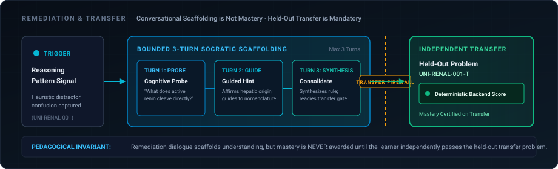

# MedicalPlab

### Adaptive Evidence-Grounded Medical Learning Platform

<p align="center">
  
</p>

> **MedicalPlab does not only answer students. It learns how students learn.**

MedicalPlab connects assessment, adaptive remediation, verified medical evidence, interactive licensed anatomy, and learner progress into one continuous closed-loop learning cycle.

[](https://www.python.org/)
[](https://fastapi.tiangolo.com/)
[](https://nextjs.org/)
[](https://threejs.org/)
[](#engineering-verification)
[-success.svg)](#engineering-verification)
[](docs/mobile-handoff/API_CONTRACT.md)

---

### Quick Navigation
[Signal Path](#signal-path) • [Differentiation](#three-pillar-differentiation) • [Product Experience](#product-experience) • [Adaptive Remediation](#adaptive-learning--socratic-remediation) • [Grounded Tutor](#evidence-grounded-ai-tutor) • [3D Anatomy](#spatial-3d-anatomy) • [AI & Anatomy Boundary](#ai-instruction-layer-vs-geometry-layer) • [Evidence Engine](#shared-evidence-engine) • [PLAB Governance](#clinical-licensing-governance) • [Quick Start](#quick-start) • [Demo Runbook](docs/demo/FINAL_DEMO_RUNBOOK.md) • [Team Handoff](docs/handoff/TEAM_HANDOFF.md)

---

## Signal Path

The MedicalPlab closed-loop architecture ensures that every learner interaction carries cognitive signal through the entire educational stack:

<p align="center">
  
</p>

| Stage | Cognitive Function | Pedagogical Mechanism |
| :--- | :--- | :--- |
| **1. Attempt** | Evaluated Clinical Scenario | Preclinical basic science or clinical question attempt |
| **2. Reasoning Signal** | Heuristic Pattern Identification | Selected distractors may map to heuristic reasoning-pattern signals |
| **3. Adaptive Intervention** | Dynamic Routing Policy | Recommends targeted remediation rather than passive scoring |
| **4. Socratic Remediation** | Dialogue Scaffolding | 3-turn Socratic sequence: Probe &rarr; Guide &rarr; Consolidate |
| **5. Independent Transfer** | Independent Transfer Evidence | Demonstrates transfer on an unseen held-out item before learner state update |
| **6. Grounded Tutor** | Verified Literature Inquiries | Answers grounded in rights-approved open-access and Creative Commons medical literature |
| **7. Spatial 3D Learning** | Anatomy Grounding | Interactive HuBMAP Human Reference Atlas models with deterministic challenges |
| **8. Unified Progress** | Longitudinal Telemetry | Shared telemetry across preclinical tracks, tutor turns, and 3D spatial labs |

---

## Three-Pillar Differentiation

```
Traditional Medical EdTech:
Question ──► Correct / Incorrect ──► Generic Static Explanation

MedicalPlab Cognitive Anatomy:
Attempt ──► Reasoning Signal ──► Adaptive Intervention ──► Socratic Remediation ──► Independent Transfer ──► Grounded Support ──► Spatial Learning ──► Unified Progress
```

* **ADAPTIVE — MedicalPlab reacts to evidence of how the learner is reasoning.**  
  A student's mistake is not treated as a random failure. It triggers an educational hypothesis that adapts subsequent difficulty and initiates guided Socratic inquiry.
* **GROUNDED — Medical explanations are supported and verified against retrieved evidence.**  
  Explanations are bound to open-access medical literature from PubMed Central. Bounded drafts undergo sentence-level proposition verification; unsupported statements fail closed to safe Socratic guidance.
* **SPATIAL — Learning extends beyond text into interactive licensed anatomy.**  
  Medical knowledge requires physical spatial awareness. The 3D Anatomy Lab runs canonical CCF models from the NIH HuBMAP Human Reference Atlas with deterministic raycast verification.

---

## Product Experience

Real interfaces captured from the certified MedicalPlab demonstration:

<p align="center">
  
</p>

**FIG. 01 — LEARNING HUB**  
*The central student command center unifying curriculum tracks, continuous competence tracking, and recommended adaptive interventions.*

<p align="center">
  
</p>

**FIG. 02 — UNIVERSITY & SOCRATIC REMEDIATION**  
*Curricular renal physiology question with multi-turn Socratic remediation that scaffolds learner reasoning without leaking the answer key.*

<p align="center">
  
</p>

**FIG. 03 — GROUNDED TUTOR SAFE FALLBACK**  
*When candidate evidence is insufficient for proposition verification, the system falls closed into content-neutral procedural Socratic guidance.*

<p align="center">
  
</p>

**FIG. 04 — SPATIAL 3D ANATOMY CHALLENGE**  
*Three.js anatomy workspace with independent Left Renal Artery identification evaluated deterministically by the backend scoring engine.*

<p align="center">
  
</p>

**FIG. 05 — UNIFIED PROGRESS**  
*Unified competence telemetry recording question accuracy, remediation completions, transfer problem success, and spatial anatomy challenge scores.*

---

## Adaptive Learning & Socratic Remediation

Selected distractors may map to heuristic reasoning-pattern signals. In MedicalPlab, an incorrect answer is **not** a confirmed misconception; it represents a provisional reasoning-pattern signal and heuristic educational hypothesis that routes the learner to targeted Socratic scaffolding.

<p align="center">
  
</p>

The remediation dialogue is separated from learner state updates by an architectural firewall:

1. **Probe:** The preceptor prompts the learner to explain the physiological principle behind their choice.
2. **Guide:** Target clues highlight the specific mechanistic distinction without disclosing the answer.
3. **Consolidate:** The learner summarizes the reconciled concept in their own terms.
4. **Independent Transfer Firewall:** Remediation dialogue scaffolds understanding. A held-out transfer item provides independent evidence of transfer before learner state is updated.

<details>
<summary>Under the hood: Adaptive State Machine & Reasoning Signal Heuristics</summary>

```
[Student Attempt]
       │
       ▼
[Distractor Analysis Engine] ──► Evaluates selected option against distractor taxonomy
       │
       ├─► Correct ──► Increment streak, advance difficulty tier
       │
       └─► Distractor Identified (e.g., Substrate vs Product Confusion)
              │
              ▼
       [Remediation State Machine]
              │
              ├── State: PROBE (Prompt student for physiological rationale)
              ├── State: GUIDE (Offer progressive hints level 1–3)
              └── State: CONSOLIDATE (Validate student mechanistic summary)
                     │
                     ▼
       [Held-Out Transfer Gate]
              │
              ├── Pass ──► Update learner mastery telemetry (+1 Transfer demonstrated)
              └── Fail ──► Retain topic in priority queue for review
```

* Heuristic pattern identification operates deterministically via rule-matched distractor dictionaries (`Data/university/distractor_taxonomy.json`).
* Student mastery records are isolated per topic (`raas_mechanisms`, `glomerular_filtration_barrier`) and persisted across sessions.
</details>

---

## Evidence-Grounded AI Tutor

The MedicalPlab Tutor is built specifically to address hallucination in medical education. It does not generate unconstrained text.

<p align="center">
  
</p>

*Captured from the live MedicalPlab student practice experience during post-submission mechanistic analysis.*

1. **Query:** Student asks a mechanistic or clinical question.
2. **Retrieve:** Shared Evidence Engine queries the indexed PubMed Central open-access basic-science corpus.
3. **Rerank & Rights Gate:** Candidates are reranked and filtered through the source rights gate to verify approved open-access / Creative Commons licenses.
4. **Bounded Generation:** Generative provider drafts an explanation constrained to retrieved excerpts.
5. **Post-Generation Verification:** Every proposition is checked for entailment against source chunks. If support is insufficient, the system safely falls closed to procedural Socratic guidance (`SAFE_FALLBACK`).

<details>
<summary>Under the hood: Verification Gate & Evidence Provenance</summary>

```python
# Verification Contract:
class TutorPostVerifier:
    def verify(self, draft_message: str, candidate_chunks: list[Chunk]) -> VerificationResult:
        propositions = self.segmenter.extract_propositions(draft_message)
        unsupported = []
        for prop in propositions:
            entailed = self.claim_verifier.verify(prop, candidate_chunks)
            if not entailed:
                unsupported.append(prop)
        
        if len(unsupported) > 0:
            return VerificationResult(status="SAFE_FALLBACK", fallback_applied=True)
        return VerificationResult(status="SUPPORTED", fallback_applied=False)
```

* **Evidence-Grounded Verifier:** Responses are served as Evidence Supported only after the verifier confirms support for substantive medical propositions against the active retrieved evidence.
* **Fail-Closed Fallback:** When candidate support is insufficient or out of scope, the system safely triggers content-neutral procedural Socratic guidance (`SAFE_FALLBACK`) with zero substantive medical claims.
* **Citation Traceability:** Citations include PMCID, DOI, author metadata, exact chunk identifiers, and licensing provenance (e.g., `CC BY 4.0`, `CC BY 3.0`).
</details>

---

## Spatial 3D Anatomy

Medical understanding requires spatial grounding. The MedicalPlab 3D Anatomy Lab renders canonical CCF models from the NIH HuBMAP Human Reference Atlas.

<p align="center">
  
</p>

> *Captured from the live MedicalPlab Three.js anatomy experience using licensed HuBMAP Human Reference Atlas assets.*

* **Exploration:** Smooth orbit, pan, and zoom with canonical camera presets (`Overview`, `Anterior Hilum`, `Internal View`).
* **Socratic Grounding:** Selecting physical structures (capsule, renal artery, renal vein, pelvis) triggers contextual basic-science lessons.
* **Deterministic Scoring:** The learner is challenged to identify structures independently. Raycasted clicks are verified against anatomical ontology IDs (`UBERON:0002113`, `UBERON:0001120`, `UBERON:0001121`).

<details>
<summary>Under the hood: Deterministic Challenge Verification & Coordinate Framing</summary>

```json
// Canonical Challenge Verification Flow:
POST /api/v1/anatomy/session/{session_id}/challenge
Payload: {
  "learner_id": "learner_42",
  "selected_structure_id": "renal_artery_left"
}

// Server Response (Deterministic Evaluation):
{
  "session": {
    "session_id": "anat_sess_01",
    "learner_id": "learner_42",
    "learning_objective": "RENAL_BLOOD_FLOW_AND_HILUM",
    "lesson_state": "CHALLENGE_ACTIVE",
    "challenge_state": "COMPLETED",
    "challenge_result": "CORRECT"
  },
  "is_correct": true,
  "target_structure_id": "renal_artery_left",
  "selected_structure_id": "renal_artery_left",
  "tutor_feedback": "Correct. You have accurately identified the Left Renal Artery.",
  "scene_actions": [
    {
      "action": "HIGHLIGHT_STRUCTURE",
      "structure_id": "renal_artery_left",
      "duration_ms": 1500
    }
  ]
}
```

* All anatomical structures use the HuBMAP Common Coordinate Framework (CCF v1.3 / v2.0) registered to anatomical reference standards.
* Geometry is immutable and loaded directly from verified GLB assets.
</details>

---

## AI Instruction Layer vs Geometry Layer

A fundamental principle of MedicalPlab is architectural separation of AI agency and medical truth:

<p align="center">
  
</p>

> **AI DOES NOT GENERATE ANATOMY GEOMETRY.**  
> The 3D anatomical meshes are immutable scientific assets licensed from the HuBMAP Human Reference Atlas. The AI layer is strictly restricted to structured scene orchestration (`FOCUS_STRUCTURE`, `HIGHLIGHT_STRUCTURE`, `ISOLATE_STRUCTURE`, `SHOW_RELATION`, `RESET_SCENE`).

---

## Shared Evidence Engine

MedicalPlab employs a shared evidence architecture across both Socratic tutoring and clinical case discussions:

<p align="center">
  
</p>

* **Unified Retrieval:** A single authoritative retrieval engine serves both University and Clinical tracks.
* **License Firewall:** Rights-approved open-access / Creative Commons evidence sources are admitted only after source-level license verification, with license provenance preserved per document.
* **No Direct LLM Path:** The adaptive engine and question modules never call an unconstrained LLM directly; all generation routes through the verification and rights pipeline.

---

## Clinical Licensing Governance

MedicalPlab implements explicit clinical content governance to ensure candidate safety and pedagogical accuracy:

<p align="center">
  
</p>

| Metric | Authoritative Repository Status |
| :--- | :--- |
| **University Production Questions** | **6 items** (`UNI-RENAL-001` to `006`, Active Production) |
| **PLAB Preview QA Candidates** | **36 items** (Staged for formal clinical review) |
| **PLAB Golden Released Curriculum** | **0 items** (Promotion gate strictly enforced) |
| **PLAB Public Release Ready** | **NO** (`PLAB_PUBLIC_RELEASE_READY = False`) |
| **Golden Clinician Signoff Required** | **YES** (`PLAB_GOLDEN_PROMOTION_REQUIRED = True`) |

> **Governance Boundary:** The 36 clinical PLAB questions in this repository are candidate items undergoing clinician review. They are not released as public examination curriculum until approved by a clinician review panel.

---

## Engineering Verification

MedicalPlab functionality is certified through continuous deterministic testing and real-browser headless Chrome DevTools Protocol automation:

```
===================== CERTIFIED VERIFICATION STATUS =====================
- Frontend Production Build:       PASS (Next.js 16.3.4, React 19)
- Cross-Module Integration Tests:  23 / 23 PASS (Scenario A–H closed loops)
- Mobile API Contract Tests:       12 / 12 PASS (Canonical route certification)
- Real-Browser E2E Acceptance:     PASS (Headless Chrome CDP Desktop/Tablet/Mobile)
-------------------------------------------------------------------------
- Previously certified full-backend regression baseline: 379 / 379 PASS
- PLAB candidate clean-checkout baseline:                 87 / 87 PASS
=========================================================================
```

Enforced Verifier Guarantees:
- **Proposition-Level Claim Verification:** Generative tutor drafts are decomposed into atomic statements and checked against retrieved active evidence chunks. If support is insufficient, the system safely triggers fail-closed procedural fallback (`SAFE_FALLBACK`).
- **Deterministic 3D Anatomy Scoring:** Raycast clicks are evaluated deterministically on the backend against verified HuBMAP CCF anatomical structure identifiers.
- **Answer Key Protection:** Pre-submission Socratic scaffolding never leaks correct options or distractor keys.

```bash
# Run cross-module integration tests:
pytest tests/integration/test_phase_6_cross_module.py -v

# Run mobile API contract certification:
pytest tests/integration/test_mobile_api_contract.py -v
```

---

## Mobile Integration

MedicalPlab provides a frozen mobile API contract for rapid cross-platform client integration (Flutter, React Native, iOS, Android):

* **Pilot Identity:** Learner identity partitioning via `X-User-Id` header (classified as demo learner identity; `X-User-Id` is NOT production cryptographic authentication; `MOBILE_PRODUCTION_AUTH_READY = NO`).
* **Authoritative Contract:** All request schemas, responses, and error handling follow [docs/mobile-handoff/API_CONTRACT.md](docs/mobile-handoff/API_CONTRACT.md).
* **Specification:** Frozen OpenAPI specification available at [docs/mobile-handoff/openapi.json](docs/mobile-handoff/openapi.json).

<details>
<summary>Under the hood: Canonical Mobile Endpoints</summary>

```
# Preclinical University Curriculum
GET  /api/v1/university/subjects
GET  /api/v1/university/topics
GET  /api/v1/university/question
POST /api/v1/university/answer

# Adaptive Learning Engine
GET  /api/v1/adaptive/recommendation
GET  /api/v1/adaptive/state

# Socratic Remediation & Transfer
POST /api/v1/remediation/start
POST /api/v1/remediation/turn
GET  /api/v1/remediation/session/{session_id}/transfer
POST /api/v1/remediation/session/{session_id}/transfer

# Evidence-Grounded AI Tutor
POST /api/v1/tutor/chat

# Spatial 3D Anatomy
POST /api/v1/anatomy/session/start
POST /api/v1/anatomy/session/{session_id}/challenge

# Learner Progress Telemetry
GET  /api/v1/learner/progress
```

See [docs/mobile-handoff/START_HERE.md](docs/mobile-handoff/START_HERE.md) and [docs/mobile-handoff/API_CONTRACT.md](docs/mobile-handoff/API_CONTRACT.md) for full request/response schemas, TypeScript SDK, and curl examples.
</details>

---

## Quick Start

### Prerequisites
* Python 3.11 or 3.12 (with virtual environment)
* Node.js 20+ and npm 10+
* Google Chrome or Chromium (for running headless browser verification)

### 1. Start Authoritative Backend (Preview QA Enabled)

```powershell
# Windows PowerShell
$env:PYTHONPATH="src;."
$env:MEDICALPLAB_RUNTIME_MODE="pilot"
$env:MEDICALPLAB_PLAB_PREVIEW_QA="1"
$env:MEDICALPLAB_PHASE_2B_ENABLED="1"
$env:MEDICALPLAB_ANATOMY_3D_ENABLED="1"
$env:ALLOWED_ORIGINS="http://localhost:3000,http://127.0.0.1:3000"

python -m uvicorn production_main:app --host 127.0.0.1 --port 8000 --workers 1
```

```bash
# macOS / Linux Bash
export PYTHONPATH="src:."
export MEDICALPLAB_RUNTIME_MODE="pilot"
export MEDICALPLAB_PLAB_PREVIEW_QA="1"
export MEDICALPLAB_PHASE_2B_ENABLED="1"
export MEDICALPLAB_ANATOMY_3D_ENABLED="1"
export ALLOWED_ORIGINS="http://localhost:3000,http://127.0.0.1:3000"

python -m uvicorn production_main:app --host 127.0.0.1 --port 8000 --workers 1
```

### 2. Start Production Frontend Application

```bash
cd frontend
npm install
npm run build
npm run start -- -p 3000
```

Open [http://localhost:3000](http://localhost:3000) in your browser.

*(Optional Development Mode: `npm run dev`)*

---

## Repository Structure

```
MedicalPlab/
├── src/medicalplab/            # Core backend logic & services
│   ├── adaptive/               # Adaptive learning engine & state machine
│   ├── anatomy/                # 3D anatomy session & deterministic scoring
│   ├── evidence_engine/        # Shared RAG, rights gate, & claim verifier
│   ├── plab/                   # Governed PLAB clinical preparation & Preview QA
│   ├── remediation/            # Multi-turn Socratic remediation & transfer gate
│   ├── tutor/                  # Evidence-grounded tutor & citation verification
│   └── university/             # Preclinical curriculum & distractor taxonomy
├── frontend/                   # Next.js 16 + React 19 web application
│   ├── src/app/                # App router (/practice, /tutor, /anatomy, /progress)
│   ├── src/features/anatomy/   # Three.js viewport, camera presets, raycaster
│   ├── src/components/         # Reusable UI components & Socratic drawers
│   └── public/models/anatomy/hra/renal/ # HRA CCF 3D GLB assets & provenance.json
│       ├── VH_M_Kidney_L.glb
│       ├── VH_M_Ureter_L.glb
│       ├── VH_M_Blood_Vasculature_Kidney.glb
│       └── provenance.json
├── docs/                       # Architectural documentation & specifications
│   ├── readme-assets/          # Cognitive Anatomy GIFs, SVGs, and diagrams
│   ├── demo/final-showcase/    # Certified demonstration gallery & runbook
│   └── mobile-handoff/         # Frozen mobile contract, OpenAPI & guides
├── Data/                       # Curricular data & verified evidence corpus
│   ├── university/             # Preclinical questions & distractor taxonomy
│   ├── raw/renal_v1/           # PubMed Central open-access basic-science XMLs
│   └── metadata/               # Source license manifest & rights verification
├── tests/                      # Automated unit, integration, and contract test suites
├── production_main.py          # Authoritative FastAPI entrypoint
└── README.md                   # Product showcase documentation
```

---

## Demo Runbook

To demonstrate MedicalPlab to mentors, judges, or prospective partners:

1. **Step 1: Learning Hub (`/`)** — Present the unified student command center and curriculum tracks.
2. **Step 2: Preclinical MCQ & Remediation (`/practice?track=university`)** — Select *Renal physiology &rarr; RAAS mechanisms*, deliberately choose distractor `[B] Angiotensin II`, demonstrate heuristic pattern detection, and walk through the 3-turn Socratic remediation drawer.
3. **Step 3: Held-Out Transfer Assessment** — Solve the independent transfer problem to demonstrate transfer on an unseen item and trigger streak advancement.
4. **Step 4: Evidence-Grounded AI Tutor (`/tutor`)** — Ask a physiological mechanism question, show sentence-level proposition verification, and inspect verified PMC citations with document-level license provenance.
5. **Step 5: Spatial 3D Anatomy Lab (`/anatomy`)** — Showcase canonical Three.js camera transitions, select the Left Renal Vein, and complete the independent Left Renal Artery pin challenge with deterministic backend scoring.
6. **Step 6: Unified Progress (`/progress`)** — Verify that preclinical accuracy, transfer successes, tutor queries, and 3D anatomy mastery reflect in the longitudinal learner telemetry.

*For complete step-by-step click targets, consult the [Final Demo Runbook](docs/demo/FINAL_DEMO_RUNBOOK.md).*

---

## Roadmap

- [x] **Phase 1: Preclinical Renal Baseline** — Curricular questions, Socratic remediation, HuBMAP HRA 3D anatomy, PMC evidence grounding.
- [x] **Phase 2: Mobile Contract Freeze** — Cross-platform OpenAPI specifications, pilot identity protocol, and sample client SDKs.
- [ ] **Phase 3: Multi-Organ Spatial Expansion** — Integrating HuBMAP cardiac, hepatic, and pulmonary reference vasculature.
- [ ] **Phase 4: Clinician Review Panel Golden Promotion** — Formal clinician review panel and promotion of the 36 candidate PLAB items into public release.
- [ ] **Phase 5: Institutional LMS Integration** — LTI 1.3 / FHIR educational interoperability for university medical schools.

---

## Data Licensing & Attribution

* **Anatomical Models:** NIH HuBMAP Human Reference Atlas (HRA) 3D Reference Organs. Licensed under [Creative Commons Attribution 4.0 International (CC BY 4.0)](https://creativecommons.org/licenses/by/4.0/).
* **Medical Evidence Corpus:** Extracted from open-access basic-science and renal physiology articles in PubMed Central (PMC). Rights-approved open-access / Creative Commons evidence sources are admitted only after source-level license verification, with license provenance preserved per document.
* **Clinical Questions:** University questions authored for foundational medical physiology education. PLAB candidate items are maintained under Preview QA governance and require formal clinician review panel Golden promotion before public release.

---

## Team Handoff

* **Product & Architecture:** [docs/handoff/TEAM_HANDOFF.md](docs/handoff/TEAM_HANDOFF.md)
* **Mobile Developers:** [docs/mobile-handoff/START_HERE.md](docs/mobile-handoff/START_HERE.md) & [docs/mobile-handoff/API_CONTRACT.md](docs/mobile-handoff/API_CONTRACT.md)
* **Demonstration Team:** [docs/demo/FINAL_DEMO_RUNBOOK.md](docs/demo/FINAL_DEMO_RUNBOOK.md)
* **Release Baseline:** Tagged release snapshot [`v1.0.0-startup-demo`](https://github.com/AdhamElsayedAI/MedicalPlab/releases/tag/v1.0.0-startup-demo)
