# MedicalPlab

### Adaptive Evidence-Grounded Medical Learning Platform

MedicalPlab connects adaptive medical education, bounded Socratic remediation, evidence-grounded AI tutoring, interactive 3D anatomy, and governed clinical exam preparation into one longitudinal learning experience.

> MedicalPlab does not only answer students. It learns how students learn.

[](https://www.python.org/)
[](https://fastapi.tiangolo.com/)
[](https://nextjs.org/)
[](https://react.dev/)
[](https://www.typescriptlang.org/)
[](https://threejs.org/)
[]()
[-success.svg)]()
[](docs/mobile-handoff/START_HERE.md)
[]()

---

### Navigation
[Product Demo](#running-the-certified-demo) • [Architecture](#ai-architecture) • [Mobile API](#mobile-app-integration) • [Demo Runbook](docs/demo/FINAL_DEMO_RUNBOOK.md) • [Team Handoff](docs/handoff/TEAM_HANDOFF.md) • [Release Notes](RELEASE_NOTES.md)

---

## Product Hero

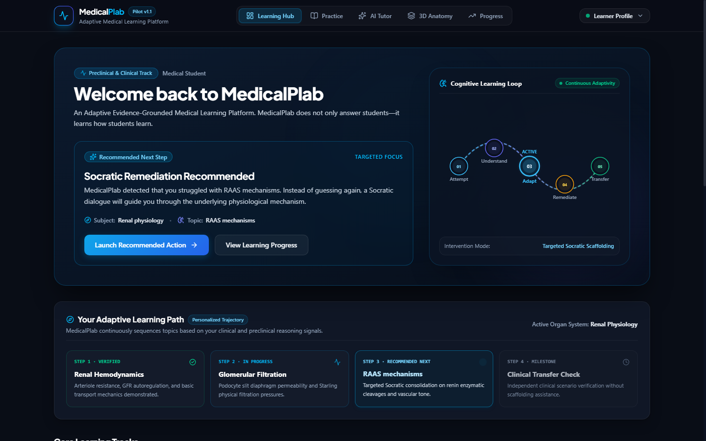

<p align="center">
  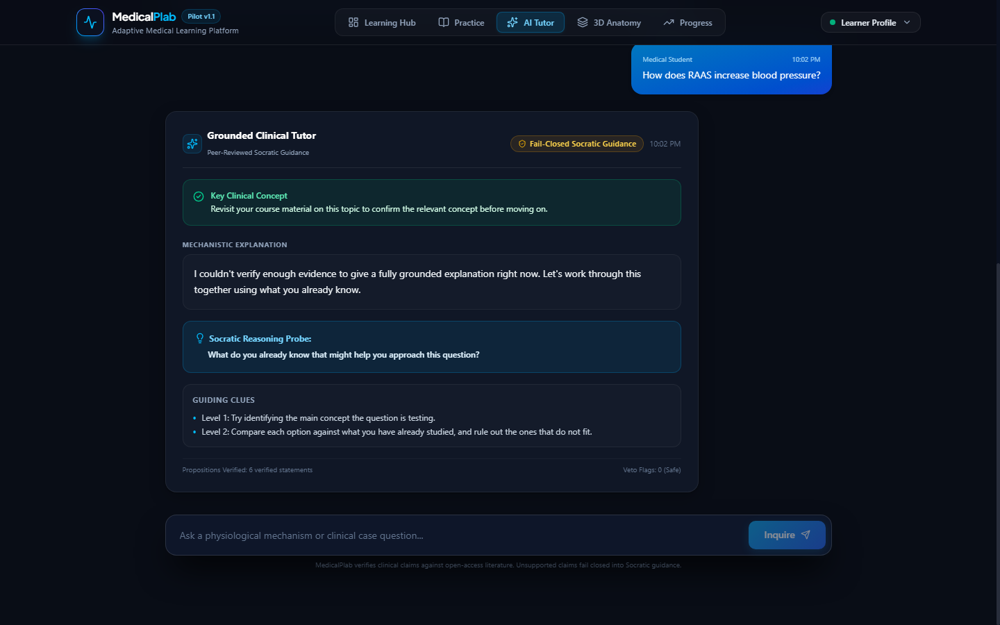
  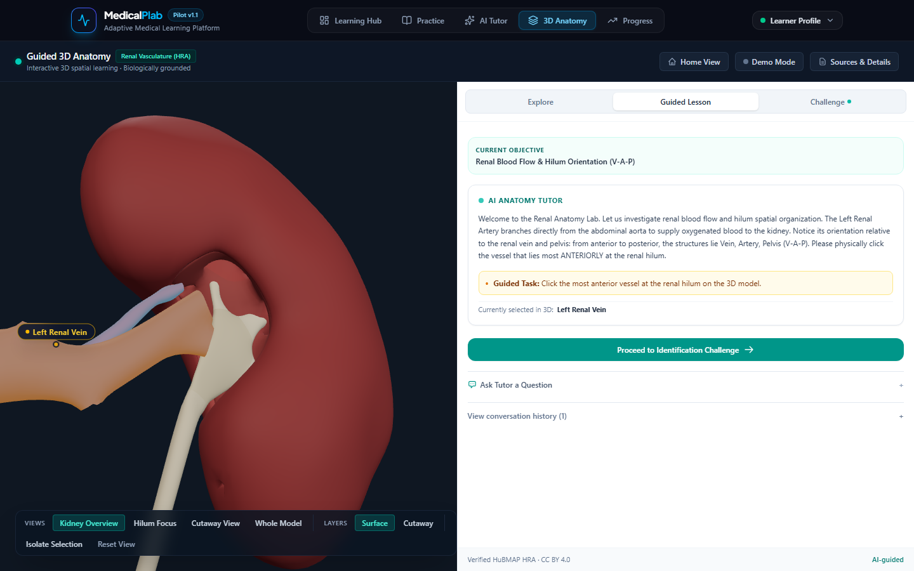
  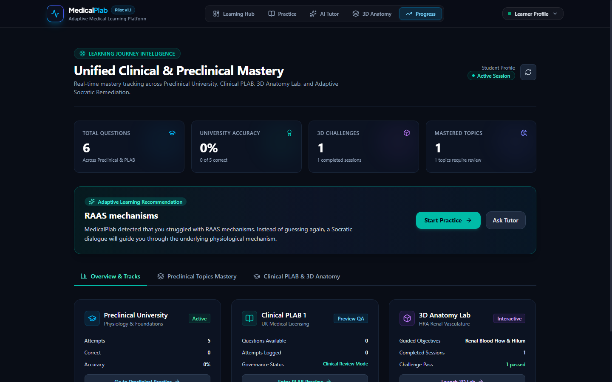
</p>

*Complete gallery available in the [Certified Showcase Gallery](docs/demo/final-showcase/README.md).*

---

## What is MedicalPlab?

MedicalPlab is an adaptive clinical edtech platform designed to address the foundational disconnect in digital medical education: the gap between practicing multiple-choice questions, understanding basic-science mechanisms, and mastering clinical decision-making.

MedicalPlab is not an unconstrained medical chatbot, a static question bank, or an isolated 3D viewer. It is a single, coherent learning intelligence system that unifies:
1. **Preclinical Medical Education:** Curricular basic-science modules with mechanistic distractor analysis.
2. **Cognitive Reasoning Remediation:** Multi-turn Socratic remediation that scaffolds learner reasoning without giving away answers.
3. **Evidence-Grounded Clinical Tutoring:** Generative clinical dialogue strictly bound to peer-reviewed medical literature with automated claim verification.
4. **Spatial 3D Anatomy:** Interactive organ models powered by the HuBMAP Human Reference Atlas with deterministic challenge scoring.
5. **Governed Clinical Exam Preparation:** Fail-closed clinical licensing preparation requiring formal clinician promotion before content release.

---

## The Problem

Traditional medical education software suffers from critical systemic limitations:

- **Static question banks score correctness, not reasoning:** When a student picks a wrong answer, standard platforms display a red box and a generic explanation. They cannot determine *why* the student failed—such as confusing an enzyme's substrate with its downstream product.
- **Generic generative LLMs pose patient-safety risks:** Unconstrained large language models hallucinate plausible-sounding medical advice, invent non-existent clinical trials, and lack deterministic citation provenance.
- **Assessment and remediation operate in silos:** Students quiz themselves on one website, read disconnected textbook passages on another, and study anatomy in isolation, leaving cognitive gaps unaddressed.
- **Anatomy applications lack longitudinal learner integration:** 3D anatomy tools typically function as passive anatomical atlases rather than active challenge environments bound to learner mastery telemetry.
- **Clinical exam preparation lacks explicit governance:** Licensing questions are frequently scraped, unverified, or published without clinical oversight, exposing candidates to outdated or incorrect clinical guidelines.

---

## How MedicalPlab Learns With the Student

MedicalPlab implements a closed-loop cognitive learning loop that detects reasoning gaps and intervenes at the conceptual level:

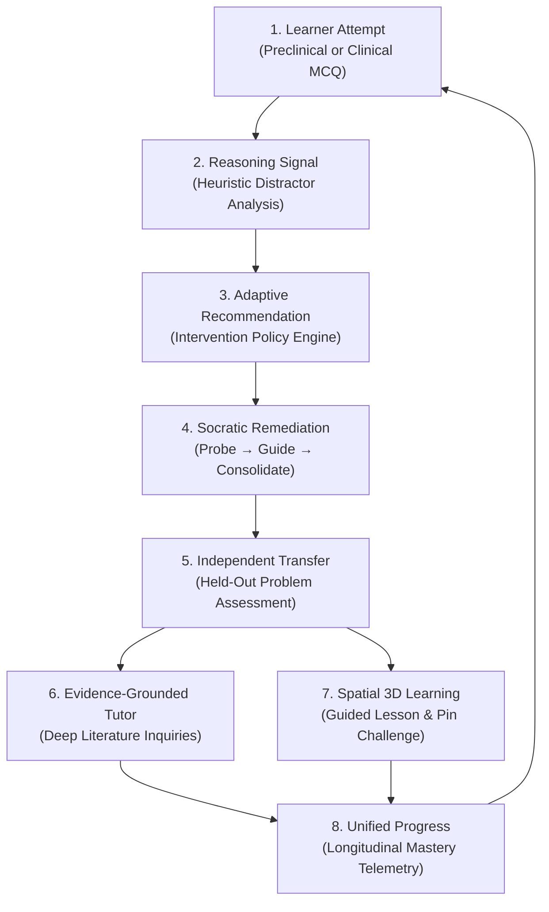

> **Important Pedagogical Boundary:** A wrong answer is **not** a confirmed misconception or rigid defect. In MedicalPlab, incorrect options trigger *heuristic reasoning-pattern signals*—provisional hypotheses that qualify the learner for bounded Socratic remediation. Mastery is only certified when the learner solves an independent held-out transfer item.

---

## Current Pilot / Demo Capabilities

### 1. Preclinical University Learning
- Curricular renal physiology module covering Glomerular Filtration Barrier and RAAS Mechanisms.
- 6 production questions (`UNI-RENAL-001` through `006`) with zero pre-submission answer leakage.
- Detailed distractor analysis explaining *why* alternatives are incorrect.

### 2. Adaptive Learning Engine
- Authoritative backend learner state profiling with zero client-side calculation.
- Dynamic recommendation engine targeting foundational knowledge gaps.
- Real-time event ingestion across University, Remediation, and Anatomy tracks.

### 3. Socratic Remediation
- Bounded 3-turn Socratic dialogue structure (`PROBE` → `GUIDE` → `CONSOLIDATE`).
- Prevents cognitive abandonment while actively guiding the student toward the mechanism.
- Mandatory held-out transfer problem (`UNI-RENAL-001-T`) verified by backend scoring.

### 4. Evidence-Grounded AI Tutor
- Powered by `TutorService` and the Shared Evidence Engine.
- Multi-channel BM25 retrieval, reciprocal rank fusion, and neural reranking over PubMed Central Open Access literature.
- Automated proposition extraction, directional entailment check, and fail-closed `SAFE_FALLBACK`.

### 5. Guided 3D Anatomy Lab
- Authentic HuBMAP Human Reference Atlas (HRA) 3D renal vasculature and organ models.
- Guided anatomical pathway: Left Renal Vein (`renal_vein_left`).
- Independent spatial pin challenge: Left Renal Artery (`renal_artery_left`), scored deterministically via canonical backend route (`POST /api/v1/anatomy/session/{session_id}/challenge`).

### 6. Unified Learner Progress
- Single authoritative endpoint (`GET /api/v1/learner/progress`) aggregating University attempts, Adaptive state, Anatomy challenge passes, and PLAB status.

### 7. Governed PLAB Preview QA
- 36 candidate questions available under Preview QA for internal engineering and mentor demonstration.
- Explicit governance banner: candidate questions require clinician panel review before release.
- Zero pre-answer metadata or leakage.

---

## Product Experience

| Stage | Visual Demonstration | Key Innovation |
|---|---|---|
| **Learning Hub** |  | Ambient motion, dynamic Cognitive Loop SVG animation, runtime truth badges. |
| **Preclinical Practice** | 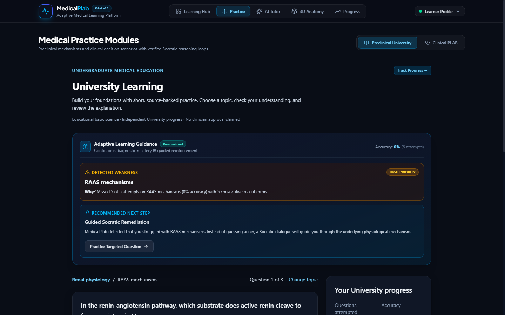 | Option B distractor triggers mechanistic analysis without pre-submission leakage. |
| **Socratic Remediation** | 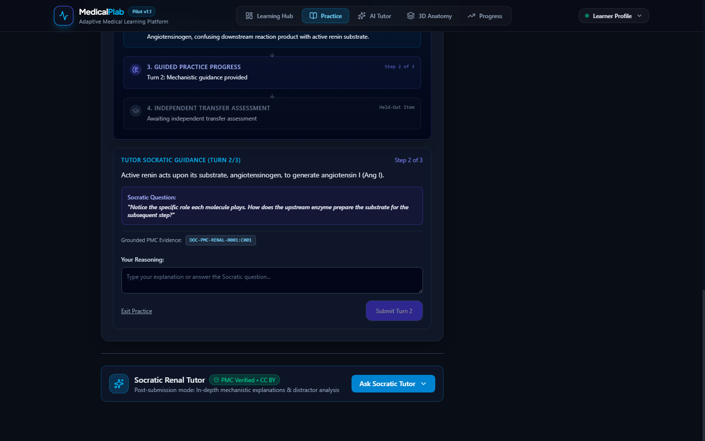 | Multi-turn dialogue guides the student without revealing the direct answer. |
| **Held-Out Transfer** | 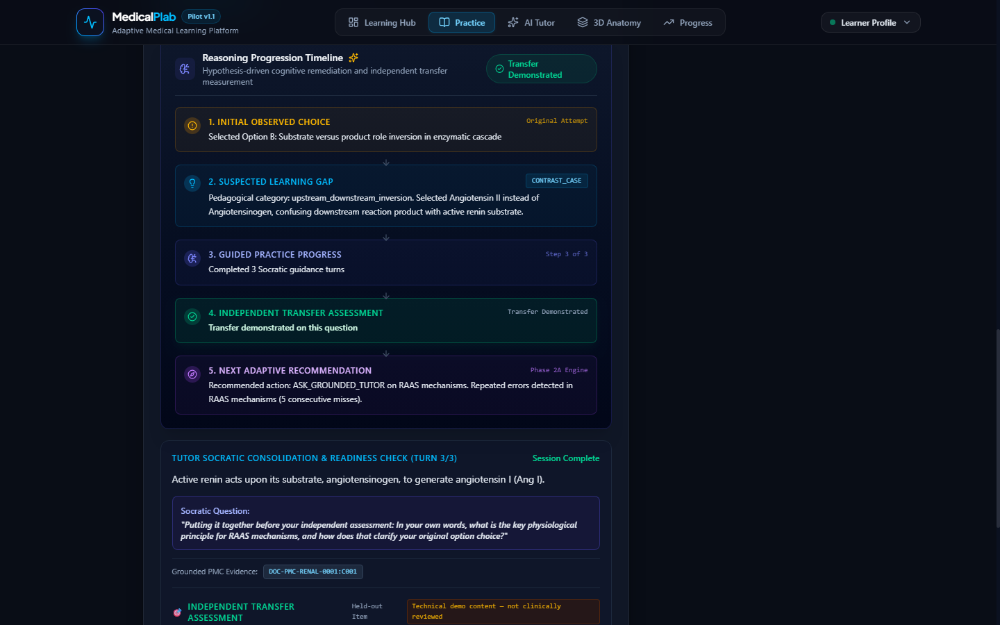 | Unseen transfer item evaluates conceptual transfer under novel clinical phrasing. |
| **Grounded AI Tutor** |  | Verifiable citations with exact chunk IDs, verbatim quotes, and CC-BY license provenance. |
| **Safe Fallback Guard** |  | Fail-closed protection: out-of-scope queries trigger verified non-factual pedagogical fallback. |
| **3D Spatial Anatomy** |  | Authentic HuBMAP HRA reference meshes with camera preset animations. |
| **Anatomy Challenge** | 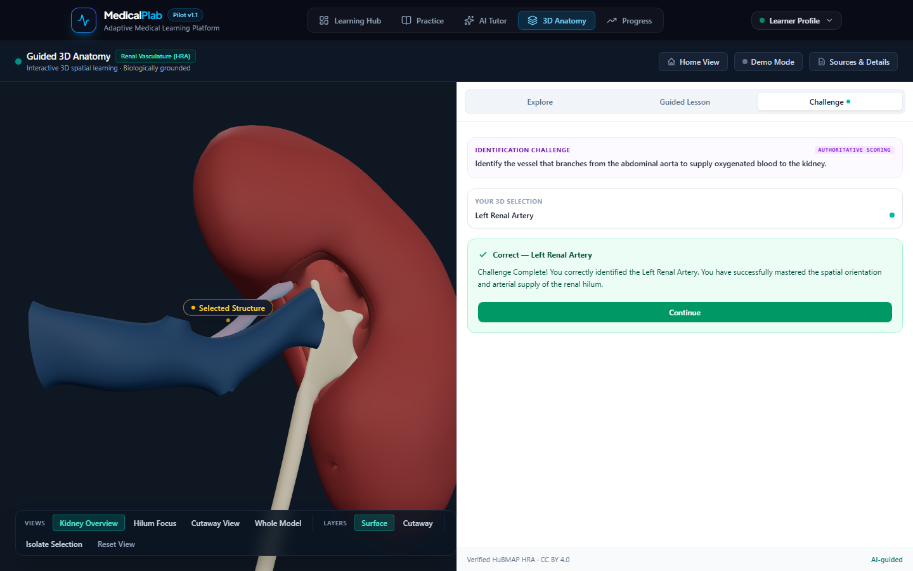 | Deterministic 3D pin challenge evaluated directly by the authoritative backend. |
| **Unified Progress** |  | Real-time aggregated learner dashboard spanning all learning tracks. |
| **PLAB Governance** | 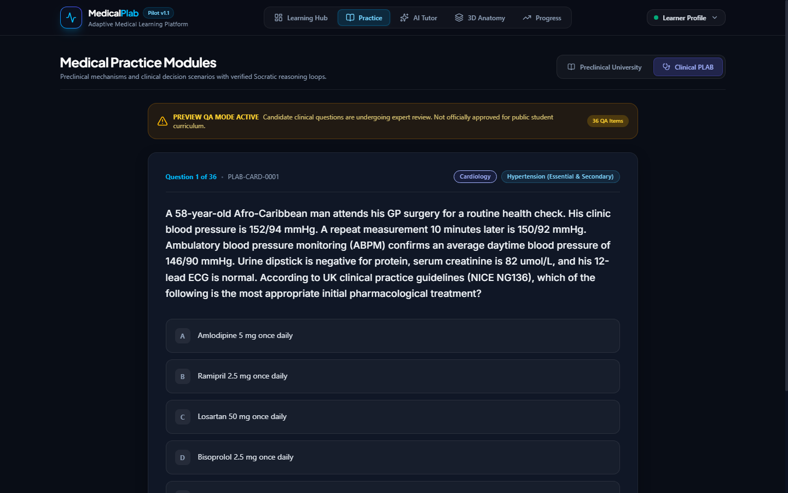 | Strict Preview QA warning banner; candidate content quarantined from production. |

*See [docs/demo/final-showcase/README.md](docs/demo/final-showcase/README.md) for the high-resolution gallery.*

---

## AI Architecture

MedicalPlab enforces strict architectural invariants to ensure safety and clinical credibility:

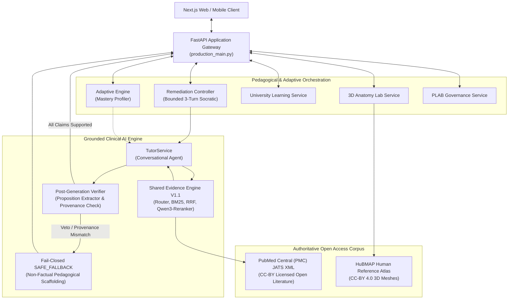

> **Strict Architectural Invariant:** The Adaptive Layer never calls generative language models directly. All clinical explanations and Socratic responses route through `TutorService` and the `Shared Evidence Engine` where every substantive proposition is verified before rendering.

---

## Evidence-Grounded by Design

In clinical education, **retrieval relevance is not claim support**. Just because a passage is retrieved does not mean the generated text accurately represents it.

MedicalPlab’s evidence pipeline enforces:
1. **Clinical Query Processing:** Normalizes medical acronyms and preserves negation.
2. **Deterministic Document Routing:** Prunes out-of-specialty articles before ranking.
3. **Multi-Route Candidate Retrieval:** Field-aware BM25 (title, headings, text) fused via Reciprocal Rank Fusion ($k=60$).
4. **Neural Reranking:** Cross-encoder inference evaluating query-chunk contextual entailment.
5. **Post-Generation Proposition Verification:**
   - Deconstructs AI draft responses into atomic propositions.
   - Verifies citation provenance: every quote must be a character-exact match inside the allowed retrieved chunks.
   - Clinical safety vetoes: rejects unauthorized drug dosages, definitive patient treatment assertions, or cure claims.
   - Automatic fail-closed fallback: if any proposition is unsupported, the response transitions to `SAFE_FALLBACK`.

---

## Interactive 3D Anatomy

MedicalPlab does **not** use AI to generate synthetic 3D human anatomy geometry. Generating biological meshes with AI creates inaccurate anatomical relations that endanger medical learning.

Instead:
- Meshes are scientifically verified assets authored by medical illustrators for the **NIH HuBMAP Consortium** (Common Coordinate Framework CCF v1.3 / v2.0, licensed under Creative Commons Attribution 4.0 International).
- Generative AI is restricted to **educational scene composition**: emitting structured scene actions (`HIGHLIGHT`, `ISOLATE`, `FLY_TO_CAMERA`, `SET_SURFACE_MODE`).
- Three.js executes deterministic camera trajectories and material properties in the client browser.
- Challenge evaluation is performed deterministically by the authoritative backend (`POST /api/v1/anatomy/session/{session_id}/challenge`).

*See [THIRD_PARTY_NOTICES_ANATOMY.md](THIRD_PARTY_NOTICES_ANATOMY.md) for full licensing details.*

---

## PLAB Governance

MedicalPlab maintains an uncompromised distinction between preview candidate content and released clinical examinations:

| Dimension | Preview QA Mode | Strict Production Mode |
|---|---|---|
| **Environment Variable** | `MEDICALPLAB_PLAB_PREVIEW_QA=1` | `MEDICALPLAB_PLAB_PREVIEW_QA=0` (or unset) |
| **Target Audience** | Internal engineering, mentor demos, faculty review | Live medical candidates & institutional users |
| **Available Items** | 36 candidate questions | **0 Golden released items** (fail-closed empty state) |
| **Status Banner** | Amber `PREVIEW QA` warning banner displayed | Informative empty state explaining peer review |
| **Release Readiness** | `PLAB_PUBLIC_RELEASE_READY = NO` | `PLAB_GOLDEN_PROMOTION_REQUIRED = YES` |

Candidate questions are never represented as clinician-approved exam materials until formal expert clinician panel sign-off occurs.

---

## Mobile App Integration

The MedicalPlab backend API contract is **frozen** and ready for native mobile client consumption (iOS, Android, React Native):

- **Quick Start for Mobile:** [`docs/mobile-handoff/START_HERE.md`](docs/mobile-handoff/START_HERE.md)
- **Developer Handoff Specification:** [`docs/mobile-handoff/MOBILE_DEVELOPER_HANDOFF.md`](docs/mobile-handoff/MOBILE_DEVELOPER_HANDOFF.md)
- **Endpoint Quick Matrix:** [`docs/mobile-handoff/API_CONTRACT.md`](docs/mobile-handoff/API_CONTRACT.md)
- **OpenAPI 3.1.0 Contract:** [`docs/mobile-handoff/openapi.json`](docs/mobile-handoff/openapi.json)
- **Postman Artifacts:**
  - Collection: [`MedicalPlab.mobile.postman_collection.json`](docs/mobile-handoff/MedicalPlab.mobile.postman_collection.json)
  - Environment: [`MedicalPlab.mobile.postman_environment.json`](docs/mobile-handoff/MedicalPlab.mobile.postman_environment.json)

> **Pilot Identity Invariant:** All learner requests must supply the `X-User-Id` HTTP header. This provides identity-partitioning across sessions for pilot and demo integrations. It is **not** cryptographic production authentication (`MOBILE_PRODUCTION_AUTH_READY = NO`).

---

## Quick Start

### Prerequisites
- Python 3.11 or 3.12 (virtualenv recommended)
- Node.js 20+ or 22+ (npm 10+)
- Google Chrome or modern Chromium browser

### 1. Start the Authoritative Backend (Terminal 1)
```powershell
# Windows PowerShell
$env:PYTHONPATH="src;."
$env:MEDICALPLAB_RUNTIME_MODE="pilot"
$env:MEDICALPLAB_PLAB_PREVIEW_QA="1"
$env:MEDICALPLAB_PHASE_2B_ENABLED="1"
$env:MEDICALPLAB_ANATOMY_3D_ENABLED="1"
$env:ALLOWED_ORIGINS="http://localhost:3000,http://127.0.0.1:3000"

python -m uvicorn production_main:app --host 127.0.0.1 --port 8000 --workers 1
```

```bash
# macOS / Linux Bash
export PYTHONPATH="src:."
export MEDICALPLAB_RUNTIME_MODE="pilot"
export MEDICALPLAB_PLAB_PREVIEW_QA="1"
export MEDICALPLAB_PHASE_2B_ENABLED="1"
export MEDICALPLAB_ANATOMY_3D_ENABLED="1"
export ALLOWED_ORIGINS="http://localhost:3000,http://127.0.0.1:3000"

python -m uvicorn production_main:app --host 127.0.0.1 --port 8000 --workers 1
```

### 2. Start the Production Frontend (Terminal 2)
```bash
cd frontend
npm install
npm run build
npm run start -- -p 3000
```

### 3. Verify Health & Availability
- Backend Health: `http://127.0.0.1:8000/health` (`{"status":"healthy","runtime_mode":"pilot"}`)
- Backend Readiness: `http://127.0.0.1:8000/ready` (`{"status":"ready"}`)
- Frontend Application: `http://localhost:3000`

---

## Running the Certified Demo

For live mentor, judge, and team walkthroughs, consult the step-by-step master runbook:
👉 **[`docs/demo/FINAL_DEMO_RUNBOOK.md`](docs/demo/FINAL_DEMO_RUNBOOK.md)**  
*(Contingency procedures: [`docs/demo/DEMO_FAILURE_RECOVERY.md`](docs/demo/DEMO_FAILURE_RECOVERY.md))*

### Scripted 3m 40s Demo Walkthrough:
1. **Home Hub (`0:00 – 0:30`):** Cognitive Loop animation, clinical styling, system badges.
2. **University Practice (`0:30 – 1:00`):** `UNI-RENAL-001` Option B (reasoning distractor).
3. **Socratic Remediation (`1:00 – 2:00`):** 3-turn Socratic dialogue & held-out transfer item (`UNI-RENAL-001-T` Option A).
4. **Evidence-Grounded Tutor (`2:00 – 2:45`):** RAAS mechanism inquiry with verifiable PMC citations & SAFE_FALLBACK guard.
5. **3D Spatial Anatomy (`2:45 – 3:30`):** Guided tour of Left Renal Vein & challenge on Left Renal Artery.
6. **Progress & Governance (`3:30 – 3:40`):** Unified learner dashboard & PLAB Preview QA boundary.

---

## Engineering Verification

The MedicalPlab platform is verified across unit, integration, contract, and browser test suites:

| Verification Suite | Result | Details |
|---|---|---|
| **Frontend Production Build** | **PASS** | `npm run build`: 0 TypeScript errors, 0 build errors, 11/11 pages prerendered. |
| **Integration Test Suite** | **PASS (23/23)** | `python -m pytest tests/integration/ -q -p no:cacheprovider` |
| **Mobile API Contract Tests** | **PASS (12/12)** | `python -m pytest tests/integration/test_mobile_api_contract.py -q` |
| **Historical Backend Baseline** | **PASS (379/379)** | Certified full backend regression baseline. |
| **PLAB Clean Checkout Probe** | **PASS (87/87)** | Clean-checkout reproducibility verified. |
| **Backend Functional Diff** | **0** | Zero functional drift across `src/`, `tests/`, and `Data/`. |
| **Browser CDP Certification** | **PASS** | Real headless Chrome CDP certified across all 9 learner journey steps. |

---

## Technology Stack

| Domain | Technology | Key Components |
|---|---|---|
| **Frontend** | Next.js 16.3.4, React 19, TypeScript | Turbopack, App Router, Lucide, Tailwind CSS |
| **Spatial 3D** | Three.js 0.183+ | WebGL, HuBMAP CCF Reference Meshes, Orbit Controls |
| **Backend** | FastAPI 0.115+, Python 3.12/3.11 | Asynchronous ASGI, Uvicorn, Pydantic v2 |
| **AI & Retrieval** | Custom BM25, Qwen3-Reranker, BKT | Reciprocal Rank Fusion, Proposition Segmenter, Post-Verifier |
| **Persistence** | SQLite, JSON Schema | Module-scoped pilot stores, bit-for-bit SHA-256 manifests |
| **Testing** | Pytest, Chrome DevTools Protocol | Automated contract verification, headless CDP E2E execution |

---

## Repository Structure

```
MedicalPlab/
├── frontend/               # Next.js 16 / React 19 modern medical web client
│   ├── src/app/            # App Router pages (/, /university, /tutor, /anatomy, /progress, /practice)
│   └── src/features/       # Modular features (anatomy Three.js viewport, learning rails)
├── src/medicalplab/        # Core Python backend package
│   ├── adaptive/           # Bayesian mastery profiling & recommendation engine
│   ├── anatomy/            # 3D anatomy session management & challenge verification
│   ├── evidence_engine/    # Canonical RAG retrieval, RRF, and neural reranking
│   ├── plab/               # Clinical exam governance & blocker quarantine
│   ├── remediation/        # Bounded 3-turn Socratic remediation controller
│   └── tutor/              # Grounded conversational tutor & post-generation verifier
├── Data/                   # Public-safe runtime data (PMC open-access literature, question banks)
├── tests/                  # Pytest test suites (integration, mobile contract, anatomy, tutor)
├── docs/                   # Comprehensive architectural & clinical documentation
│   ├── demo/               # Certified showcase gallery, demo runbook & failure recovery
│   ├── handoff/            # Central multi-role team handoff guide
│   └── mobile-handoff/     # Frozen OpenAPI 3.1.0 spec, Postman collection & quick start
├── reports/                # Engineering acceptance reports & quality audits
├── production_main.py      # Authoritative pilot/production FastAPI entrypoint
├── main.py                 # Local developer & exploration entrypoint
├── LICENSE                 # MIT Open Source License
└── RELEASE_NOTES.md        # Official Startup Demo Release notes
```

---

## Release Status

| Deliverable | Status | Assessment |
|---|---|---|
| **Core Backend Engineering** | **CLOSED** | Fully implemented, tested, and frozen. |
| **Mobile API Handoff** | **READY** | OpenAPI 3.1.0 and Postman collections certified with zero contract drift. |
| **Premium UI / UX** | **READY** | Visual acceptance passed across Desktop, Tablet, and Mobile. |
| **Final Product E2E Journey** | **PASS** | Complete 9-step learner loop verified in real browser CDP. |
| **Mentor Demo Reliability** | **READY** | Scripted ~3m 40s runbook and recovery guide verified. |
| **Team Handoff** | **READY** | Role-based handoff guides available in `docs/handoff/TEAM_HANDOFF.md`. |
| **Mobile Team Integration** | **READY** | Ready for consumption via `docs/mobile-handoff/START_HERE.md`. |
| **Public Production Auth** | **NOT READY** | `MOBILE_PRODUCTION_AUTH_READY = NO` (Synthetic `X-User-Id` used for pilot). |
| **PLAB Public Golden Release** | **NOT READY** | `PLAB_PUBLIC_RELEASE_READY = NO` (Requires clinician panel promotion). |
| **Offline Synchronization** | **NOT SUPPORTED** | `OFFLINE_SYNC_SUPPORTED = NO` (Local runtime supported, multi-device cloud sync not supported). |

---

## Roadmap

> **Notice:** The following features are planned future research directions and are **NOT** current capabilities of the v1.0.0 startup demo release.

- **Multimodal Medical Learning:** Incorporating clinical medical imaging (ECG waveforms, chest radiographs, ultrasound) into the Socratic tutoring loop.
- **Extended 3D Anatomy Systems:** Expanding beyond renal vasculature to cardiovascular, pulmonary, and neuroanatomical reference systems from HuBMAP HRA.
- **Formal Clinician Feedback Portal:** Web-based review interface enabling accredited physicians to audit candidate items and approve Golden promotions directly.
- **Longitudinal Curriculum Sequencing:** Multi-specialty preclinical learning tracks (Cardiovascular, Respiratory, Gastrointestinal) integrated into Bayesian knowledge tracing.
- **Native Mobile Experience:** Dedicated iOS and Android client applications consuming the frozen `/api/v1` REST contract.
- **Institutional Production Authentication:** Enterprise SSO (SAML / OAuth2 / OIDC), role-based clinical access controls, and encrypted multi-tenant persistence.

---

## Data, Evidence & Attribution

- **3D Anatomical Digital Objects:** Derived from the **HuBMAP Human Reference Atlas (HRA) CCF 3D Reference Object Library**, published by the NIH HuBMAP Consortium / CNS at Indiana University. Licensed under Creative Commons Attribution 4.0 International (CC BY 4.0).
- **Ontology & Terminology Crosswalks:** BodyParts3D, Database Center for Life Science (DBCLS), licensed under CC BY 4.0.
- **Medical Literature:** Open Access articles sourced from PubMed Central (PMC) in full compliance with Creative Commons CC-BY licensing terms.
- **Software License:** MedicalPlab software is released under the **MIT License**. See [`LICENSE`](LICENSE) for terms.
