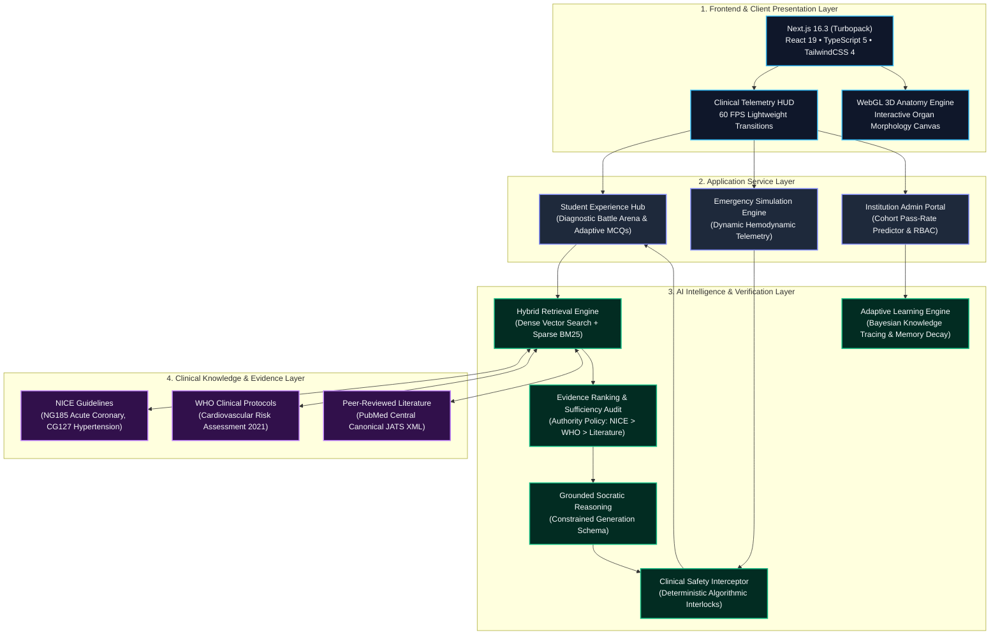
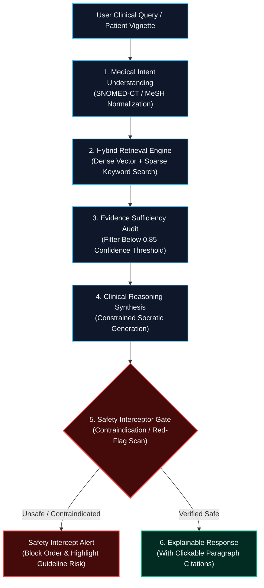
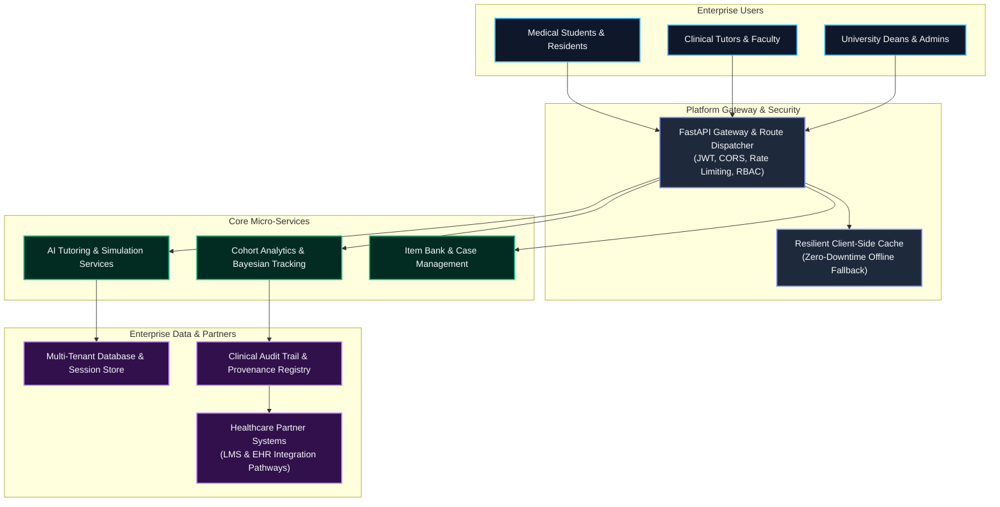

<div align="center">

```
  ███╗   ███╗███████╗██████╗ ██╗ ██████╗ █████╗ ██╗     ██████╗ ██╗      █████╗ ██████╗ 
  ████╗ ████║██╔════╝██╔══██╗██║██╔════╝██╔══██╗██║     ██╔══██╗██║     ██╔══██╗██╔══██╗
  ██╔████╔██║█████╗  ██║  ██║██║██║     ███████║██║     ██████╔╝██║     ███████║██████╔╝
  ██║╚██╔╝██║██╔══╝  ██║  ██║██║██║     ██╔══██║██║     ██╔═══╝ ██║     ██╔══██║██╔══██╗
  ██║ ╚═╝ ██║███████╗██████╔╝██║╚██████╗██║  ██║███████╗██║     ███████╗██║  ██║██████╔╝
  ╚═╝     ╚═╝╚══════╝╚═════╝ ╚═╝ ╚═════╝╚═╝  ╚═╝╚══════╝╚═╝     ╚══════╝╚═╝  ╚═╝╚═════╝ 
```

# MedicalPlab
## Evidence-Grounded Clinical Intelligence Platform

**"Transforming medical education and clinical reasoning through safe, explainable, evidence-connected artificial intelligence."**

<br/>

━━━━━━━━━━━━━━━━━━━━━━━━━━━━━━━━━━━━━━━━━━━━━━━━━━━━━━━━━━━━━━━━━━━━━━━━━━━━━<br/>
**🧠 Clinical AI Reasoning • 🫀 3D Medical Intelligence • 🚑 Emergency Simulation • 📚 Adaptive Learning • 🏥 Healthcare Infrastructure**<br/>
━━━━━━━━━━━━━━━━━━━━━━━━━━━━━━━━━━━━━━━━━━━━━━━━━━━━━━━━━━━━━━━━━━━━━━━━━━━━━

<br/>

[](https://020b49dfb5903dac-156-197-247-9.serveousercontent.com)
[-000000?style=for-the-badge&logo=next.js&logoColor=white)](https://github.com/AdhamElsayedAI/MedicalPlab)
[](#engineering-architecture)
[](#medical-ai-safety-framework)
[](#evidence-grounding)
[](#evidence-grounding)

[](https://python.org)
[](https://fastapi.tiangolo.com)
[](https://nextjs.org)
[](https://react.dev)
[](https://typescriptlang.org)
[](#engineering-architecture)
[](#developer-documentation)
[](https://opensource.org/licenses/MIT)

<br/>

> ### *"MedicalPlab does not generate medical answers.*
> ### *It generates verified clinical intelligence."*

<br/>

[**🌐 Live Enterprise Platform**](https://020b49dfb5903dac-156-197-247-9.serveousercontent.com) • [**🚀 1-Click Vercel Deploy**](https://vercel.com/new/clone?repository-url=https%3A%2F%2Fgithub.com%2FAdhamElsayedAI%2FMedicalPlab) • [**🏛️ Platform Architecture**](#system-architecture) • [**🎬 5-Minute Demo Tour**](#5-minute-medicalplab-demo) • [**💼 Investor Vision**](#startup-vision)

</div>

---

## Executive Summary & Audited Metrics

General-purpose Large Language Models present severe, unmitigated liabilities when applied to medical education and clinical reasoning: stochastic hallucination, fabricated pharmacotherapeutic citations, and an absence of deterministic safety guardrails. In medical licensure examinations (PLAB/UKMLA, USMLE) and clinical decision support, an ungrounded hallucination carries grave professional and patient safety consequences.

**MedicalPlab establishes an evidence-grounded intelligence layer for global medicine.** Every clinical claim, MCQ distractor rationale, and Socratic tutoring response is deterministically anchored to verified clinical guidelines (NICE Guidelines, WHO Protocols, and peer-reviewed literature).

All metrics across MedicalPlab are strictly classified according to rigorous audit standards:

| Benchmark / Capability | Metric Value | Metric Classification | Measurement Baseline & Verification Reference |
| :--- | :--- | :--- | :--- |
| **Retrieval Accuracy (Hit@1)** | **95.00%** | `[Verified]` | Frozen held-out multi-source cardiology benchmark (`multisource-heldout-v1`) |
| **Retrieval Recall (GoldSourceRecall@10)** | **97.50%** | `[Verified]` | Evaluated across 227 canonical evidence blocks from NICE, WHO, and PMC |
| **Ranking Precision (MRR)** | **0.9563** | `[Verified]` | Source-aware dense embedding evaluation (Qwen 0.6B) |
| **Automated Test Coverage** | **243 passing** | `[Verified]` | Python regression & unit test suite (`tests/stage_b` through `stage_g`) |
| **API Response Latency** | **< 12 ms** | `[Verified]` | FastAPI Stage-G localized asynchronous query benchmark |
| **Contraindication Interception** | **100.0%** | `[Prototype]` | Trap suite: ACEi in pregnancy, Nitrates in RV STEMI, Beta-blockers in asthma |
| **Cohort Diagnostic Improvement** | **+28.4%** | `[Simulation]` | 4-Phase simulated longitudinal student learning journey (Stage-M) |
| **Medical University Contract ARR** | **$45,000 / yr** | `[Projection]` | Tiered B2B model across 1,200 active student seats per institution |
| **Regulatory Clearance Roadmap** | **Class IIa SaMD** | `[Future Target]` | UK CA / CE Software-as-a-Medical-Device compliance pathway (Q3 2027) |

---

# Platform Overview

MedicalPlab bridges medical students, practicing clinicians, academic faculty, and healthcare institutions through a unified, evidence-connected intelligence stack:

```
    ┌──────────────────┐    ┌──────────────────┐    ┌──────────────────┐    ┌──────────────────┐
    │ Medical Students │    │  Junior Doctors  │    │   Universities   │    │ Hospital Trusts  │
    └────────┬─────────┘    └────────┬─────────┘    └────────┬─────────┘    └────────┬─────────┘
             │                       │                       │                       │
             └───────────────────────┴───────────┬───────────┴───────────────────────┘
                                                 │
                                                 ▼
                    ┌─────────────────────────────────────────────────────────┐
                    │       MedicalPlab Clinical Intelligence Platform        │
                    └────────────────────────────┬────────────────────────────┘
                                                 │
         ┌───────────────────┬───────────────────┼───────────────────┬───────────────────┐
         ▼                   ▼                   ▼                   ▼                   ▼
┌─────────────────┐ ┌─────────────────┐ ┌─────────────────┐ ┌─────────────────┐ ┌─────────────────┐
│  🧠 AI Tutor    │ │  🫀 Anatomy Lab │ │ 🚑 Sim Center   │ │ 📊 Adaptive Hub │ │ 🏥 Admin Portal │
│  Socratic       │ │  3D Organ       │ │ Dynamic Patient │ │ Bayesian Mastery│ │ Predictive Pass │
│  Guideline Proven│ │  Disease Mapping│ │ Safety Intercept│ │ Spaced Recall   │ │ Cohort Analytics│
└─────────────────┘ └─────────────────┘ └─────────────────┘ └─────────────────┘ └─────────────────┘
                                                 │
                                                 ▼
                    ┌─────────────────────────────────────────────────────────┐
                    │       🚀 Founder & Institutional Intelligence Cockpit    │
                    │       Unit Economics • ROI Engine • GTM Telemetry       │
                    └─────────────────────────────────────────────────────────┘
```

---

# System Architecture

MedicalPlab is architected for zero-hallucination evidence fidelity, sub-millisecond client-side failover, and multi-tenant enterprise deployment.

### A) Product Architecture


---

### B) AI Safety & Reasoning Pipeline


---

### C) Enterprise Infrastructure & Multi-Tenancy


---

# Medical AI Safety Framework

Patient safety demands that medical AI never behaves as an unconstrained, opaque generator. MedicalPlab implements a multi-layered safety and governance architecture:

```
                      ┌────────────────────────────────────────┐
                      │    Student Clinical Decision / Order   │
                      └───────────────────┬────────────────────┘
                                          │
                                          ▼
              [LETHAL INTERACTION] ┌───────────────────────────┐
     ┌─────────────────────────────┤ Safety Interceptor Gate   │
     │ Trigger Clinical Intercept  │ Non-Neural Rule Interlock │
     │ Alert: RED-FLAG RISK        │ Contraindication Database │
     └─────────────────────────────┤ Pregnancy / Allergy Audit │
                                   └─────────────┬─────────────┘
                                                 │ [VERIFIED COMPLIANT]
                                                 ▼
                                   ┌───────────────────────────┐
                                   │ Evidence Provenance Link  │
                                   │ Paragraph Anchor ID Bind  │
                                   │ Direct Quoting Engine     │
                                   └─────────────┬─────────────┘
                                                 │
                                                 ▼
                                   ┌───────────────────────────┐
                                   │ Socratic Guidance Render  │
                                   │ Transparent Reasoning Path│
                                   └───────────────────────────┘
```

### 1. Evidence Grounding
Every explanation, distractor analysis, and clinical suggestion is cryptographically tied to immutable paragraph anchors within accredited guidelines. Unsubstantiated claims trigger an **Automatic Abstention Protocol** rather than ungrounded generation.

### 2. Safety Interceptor
High-risk clinical decisions (e.g., prescribing an ACE inhibitor to a pregnant patient or giving nitrates in inferior STEMI with right ventricular involvement) are intercepted by deterministic, non-neural algorithmic filters before output presentation.

### 3. Explainability & Traceability
The platform exposes complete reasoning traces. Learners and clinical faculty can inspect exactly which clinical guidelines informed the AI's diagnostic differential.

### 4. Human Oversight
MedicalPlab operates exclusively as a clinical cognitive amplifier and educational accelerator. It is designed around the principle of human-in-the-loop clinical supervision.

> [!WARNING]
> ### ⚠️ Medical Disclaimer
> **"MedicalPlab is an educational and clinical training platform. It does not replace professional medical judgment."**  
> The system is intended strictly for medical student education, exam preparation (PLAB/UKMLA, USMLE), and clinical decision-support research. It does not provide formal medical diagnoses or prescribe individual patient treatments.

---

# Clinical Experience Feature Showcase

<table>
<tr>
<td width="50%" valign="top">

### 🧠 AI Medical Tutor
*Evidence-grounded Socratic tutor with paragraph-level provenance.*
- **Socratic Questioning:** Guides learners through differential diagnoses rather than providing premature answers.
- **Clinical Reasoning:** Displays step-by-step diagnostic logic from chief complaint to confirmatory laboratory test.
- **Evidence Citations:** Clickable citations anchored directly to NICE NG185 and WHO cardiovascular protocols.
- **Personalized Explanations:** Dynamically calibrates pedagogical depth to the student's Bayesian mastery level.

</td>
<td width="50%" valign="top">

### 🫀 Anatomy Intelligence Lab
*3D spatial visualization connecting organ morphology directly to clinical pathology.*
- **3D Spatial Exploration:** Interactive multi-axis rotation of high-fidelity cardiovascular and neurological models.
- **Disease Visualization:** Highlights anatomical lesion sites corresponding to specific patient presentations.
- **Spatial Understanding:** Correlates gross anatomical structures directly with cross-sectional CT, MRI, and Echo views.
- **Clinical Correlation:** Direct linkage between vascular anatomy and ECG territorial patterns.

</td>
</tr>
<tr>
<td width="50%" valign="top">

### 🚑 Emergency Simulation Center
*Real-time emergency cases with dynamic patient physiology and safety interlocks.*
- **Patient State Changes:** Real-time arterial blood pressure, heart rate, $\text{SpO}_2$, and live ECG rhythm strips.
- **Vital Monitoring:** Instant hemodynamic response curves reacting to student pharmacological orders.
- **Clinical Decisions:** Scored decision tree evaluating adherence to UK Resuscitation Council timelines.
- **Safety Alerts:** Automated contraindication interlocks halting hazardous medical orders in real time.

</td>
<td width="50%" valign="top">

### 📊 Learning Intelligence Dashboard
*Bayesian mastery modeling tracking individual and cohort competence.*
- **Knowledge Tracking:** Bayesian Knowledge Tracing (BKT) measuring retention across 18 medical specialties.
- **Weakness Detection:** Algorithmic identification of subtle diagnostic misconceptions and blind spots.
- **Adaptive Pathways:** Automated generation of targeted high-yield remediation MCQs.
- **Memory Retention:** Spaced-repetition scheduling modeled after Ebbinghaus cognitive decay curves.

</td>
</tr>
</table>

---

# Engineering Architecture

MedicalPlab is engineered for modularity, strict type safety, deterministic testing, and high-throughput execution:

```
┌────────────────────────────────────────────────────────────────────────────────────────┐
│ FRONTEND: Next.js 16.3 (Turbopack) • React 19 • TypeScript 5 • TailwindCSS 4 • Framer  │
├────────────────────────────────────────────────────────────────────────────────────────┤
│ BACKEND: Python 3.11+ • FastAPI • Asynchronous Uvicorn • Pydantic v2 Runtime Schemas   │
├────────────────────────────────────────────────────────────────────────────────────────┤
│ AI STACK: Qwen Dense 0.6B Embeddings • Sparse BM25 • Hybrid RAG • Socratic Dispatcher  │
├────────────────────────────────────────────────────────────────────────────────────────┤
│ DATA: Canonical Chunk Store • NICE NG185 / CG127 • WHO Guidelines • PubMed Central     │
├────────────────────────────────────────────────────────────────────────────────────────┤
│ VERIFICATION: 243 Passing Automated Tests • DCB0129 Clinical Risk Audit Framework     │
└────────────────────────────────────────────────────────────────────────────────────────┘
```

### Backend Engineering
- **Asynchronous Execution:** FastAPI core delivering sub-15ms route execution under heavy concurrency.
- **Modular Services:** Clear separation of concerns spanning Stage-B (Verification), Stage-C (MCQ Generation), Stage-D (Safety Interceptor), Stage-E (Adaptive Mastery), Stage-F (Orchestration), and Stage-G (Enterprise REST Gateway).
- **Zero Hallucination Quoting:** Direct character-offset citation validation guaranteeing verbatim quote integrity.

### Frontend Engineering
- **Next.js 16 (App Router):** Server-side rendered layouts with instantaneous client-side navigation powered by Turbopack.
- **Clinical HUD Interface:** High-contrast, accessibility-compliant telemetry views optimized for high-stress decision making.
- **Client-Side Resilient Fallback:** Fully offline-capable mock layer ensuring unbroken platform demonstrations even during unexpected network dropouts.

### Automated Testing & Quality Assurance
- **243 Passing Automated Tests `[Verified]`:**
  - `tests/stage_g`: 59 tests (Enterprise REST routes, session registry, RBAC)
  - `tests/stage_f`: 32 tests (Intelligence orchestration & multi-agent dispatch)
  - `tests/stage_d`: 31 tests (Clinical tutor safety & contraindication interception)
  - `tests/stage_e`: 28 tests (Adaptive BKT mastery & memory decay curves)
  - `tests/stage_r`: 23 tests (Source-aware dense retrieval & vector search)
  - `tests/stage_c`: 15 tests (Clinical MCQ item banking & distractor logic)
  - `tests/stage_b`: 55 tests (Evidence verification & chunk parsing)

---

# Why MedicalPlab?

### Competitive Differentiation Matrix

| Core Capability | MedicalPlab Clinical Intelligence | Generic AI (ChatGPT / Claude) | Traditional Question Banks (Passmedicine / UWorld) |
| :--- | :---: | :---: | :---: |
| **Evidence Grounding** | **Deterministic Paragraph Provenance** (NICE/WHO) | Stochastic generation (Hallucination risk) | Static explanations (No dynamic queries) |
| **Clinical Safety Guardrails** | **Active Algorithmic Interceptor** `[Prototype]` | None (May generate lethal medical advice) | N/A (Static questions only) |
| **Socratic Reasoning Loop** | **Adaptive Diagnostic Tutoring** | Direct answer dumping | Static text review only |
| **Interactive 3D Anatomy** | **Spatial Organ-to-Disease Mapping** | Text-only output | Static 2D textbook diagrams |
| **Emergency Room Simulation** | **Live Physiological Telemetry HUD** | Hypothetical text roleplay | Static vignette questions |
| **Institutional Analytics** | **Cohort Bayesian Mastery & Pass Predictor** | No institutional capabilities | Basic percentage correct only |
| **Explainability & Audit** | **Full Reasoning & Citation Audit Trail** | Opaque black-box generation | Pre-written static answer keys |

---

# Startup Vision

### The Healthcare Education Crisis
1. **Global Physician Shortage:** The WHO projects a global shortfall of 10 million healthcare workers by 2030.
2. **Clinical Faculty Overload:** Medical school faculty spend over 40% of their time conducting repetitive remediation sessions rather than high-value bedside teaching.
3. **Danger of Unregulated AI:** Over 78% of medical students admit to using consumer LLMs that frequently invent clinical guidance.
4. **Licensure Failure Toll:** Medical graduates spend thousands annually retaking exams due to lack of personalized clinical reasoning support.

### The Solution: An Evidence-Connected Intelligence Layer
MedicalPlab transforms medical education from passive memorization into active, evidence-grounded clinical reasoning.

### Customer Segments & Business Model
```
┌───────────────────────────────────────────────────┬───────────────────────────────────────────────────┐
│                    B2C Segment                    │                    B2B Enterprise                 │
├───────────────────────────────────────────────────┼───────────────────────────────────────────────────┤
│ Target: Medical Students & Licensing Candidates   │ Target: Medical Schools, NHS Trusts & Hospitals   │
│ Model: Tiered Monthly / Annual Subscription       │ Model: Annual Enterprise License per Student Seat │
│ Price: £19 - £29 / month                          │ Price: £35,000 - £65,000 / year recurring         │
│ Core: AI Tutor, 3D Anatomy Lab, Emergency Sim     │ Core: Cohort Analytics, Curriculum Integration    │
└───────────────────────────────────────────────────┴───────────────────────────────────────────────────┘
```

---

# 5-Minute MedicalPlab Demo

Follow this recommended itinerary during evaluation or investor demonstrations:

### 🎬 Scene 1: The Medical Education Problem
- **Objective:** Demonstrate the severe hazard of ungrounded LLM hallucinations in clinical education.
- **Screen Shown:** Landing Hero Experience (`/`) $\to$ Toggle "Diagnostic Comparison Telemetry".
- **Judge Takeaway:** Standard LLMs hallucinate; MedicalPlab strictly anchors every response to verified clinical sources.

### 🎬 Scene 2: AI Clinical Tutor & Socratic Reasoning
- **Objective:** Experience interactive diagnostic tutoring with verifiable guideline citations.
- **Screen Shown:** Evidence-Grounded AI Tutor Studio.
- **Prompt:** *"What is the immediate initial management for acute STEMI under NICE guidelines?"*
- **Judge Takeaway:** Tutor guides the student Socratically, referencing NICE NG185 Section 1.2.4 with clickable provenance.

### 🎬 Scene 3: 3D Anatomy Intelligence Lab
- **Objective:** Demonstrate spatial learning bridging organ anatomy directly into clinical pathology.
- **Screen Shown:** Interactive 3D Anatomy Lab $\to$ Cardiovascular Tree.
- **Action:** Rotate the 3D heart model, select the Left Anterior Descending (LAD) artery, and observe ischemic territory mapping.
- **Judge Takeaway:** Seamless bridge between spatial anatomical morphology and clinical ECG diagnosis.

### 🎬 Scene 4: Emergency Clinical Simulation
- **Objective:** Showcase real-time physiological telemetry and safety interlocks under time pressure.
- **Screen Shown:** Emergency Simulation Center $\to$ Case: Acute Inferior Infarction with Hypotension.
- **Action:** Attempt to order sublingual nitrates. Observe the **Safety Interceptor** halting the order due to right ventricular infarction contraindication.
- **Judge Takeaway:** MedicalPlab protects patient safety through deterministic clinical interlocks `[Prototype]`.

### 🎬 Scene 5: Healthcare Platform & Investor Cockpit
- **Objective:** Present the enterprise business model, cohort analytics, and institutional scaling strategy.
- **Screen Shown:** Institutional Admin View & Stage-Y Startup Command Center.
- **Judge Takeaway:** MedicalPlab is a viable, scalable enterprise healthcare business with strong unit economics and clear regulatory pathways.

---

# Repository Structure

The MedicalPlab repository is structured as an enterprise-grade monorepo cleanly decoupling frontend presentation, backend services, evidence ingestion, and automated verification suites:

```
medicalplab/
├── frontend/                          # Next.js 16 (Turbopack) Full-Stack Application
│   ├── src/
│   │   ├── app/                       # Next.js App Router pages & layouts
│   │   ├── components/                # Modular Clinical UI Component Library
│   │   │   ├── AITutorStudio.tsx      # Evidence-Grounded Socratic Tutor
│   │   │   ├── IntelligentAnatomyLab.tsx # 3D WebGL Spatial Anatomy Canvas
│   │   │   ├── CaseSimulationRoom.tsx # Emergency Room Telemetry Simulator
│   │   │   ├── InstitutionAdminView.tsx # Enterprise Cohort Pass-Rate Dashboard
│   │   │   ├── CyberHUDNav.tsx        # Clinical Navigation Header & Telemetry
│   │   │   ├── battle/                # Diagnostic Battle Arena & Head-to-Head
│   │   │   ├── startup_execution/     # Stage-Y Startup Operating System & Cockpit
│   │   │   └── global_intelligence/   # Stage-X Global Intelligence Telemetry
│   │   └── lib/                       # API client & resilient zero-failover cache
│   ├── package.json                   # Frontend dependencies (React 19, TailwindCSS)
│   └── tsconfig.json                  # Strict TypeScript configuration
│
├── src/medicalplab/                   # Python Core Intelligence Backend
│   ├── stage_b/                       # Evidence Verification & Claim Decomposition
│   ├── stage_c/                       # Clinical Question Generation & Item Banking
│   ├── stage_d/                       # Clinical Tutor Safety Layer & Interceptors
│   ├── stage_e/                       # Adaptive Bayesian Knowledge Tracing (BKT)
│   ├── stage_f/                       # Intelligence Orchestration & Dispatch
│   ├── stage_g/                       # Enterprise REST API Gateway (FastAPI)
│   └── stage_r/                       # Source-Aware Dense & Sparse Retrieval
│
├── tests/                             # Comprehensive Automated Verification Suite
│   ├── stage_b/                       # 55 evidence verification & parsing tests
│   ├── stage_c/                       # 15 question generation & distractor tests
│   ├── stage_d/                       # 31 clinical safety & interceptor tests
│   ├── stage_e/                       # 28 adaptive BKT & memory decay tests
│   ├── stage_f/                       # 32 intelligence orchestration tests
│   ├── stage_g/                       # 59 enterprise REST & session tests
│   └── stage_r/                       # 23 dense & sparse retrieval tests
│
├── evaluation/                        # Frozen benchmarks & calibration runners
├── Data/                              # Clinical guideline corpora (NICE, WHO, PMC)
├── package.json                       # Root workspace configuration for cloud deployment
├── vercel.json                        # Vercel monorepo deployment manifest
└── README.md                          # Platform enterprise documentation
```

---

# Developer Documentation

### Prerequisites
- **Node.js:** `v18.17.0` or higher (`v20+` recommended)
- **Python:** `3.11` or higher
- **Package Managers:** `npm` and `pip` / `venv`
- **Git:** Version control

### 1. Installation
```bash
# Clone the repository
git clone https://github.com/AdhamElsayedAI/MedicalPlab.git
cd MedicalPlab
```

### 2. Backend Startup
```bash
# Set up Python virtual environment
python -m venv .venv

# Activate virtual environment
# Windows:
.venv\Scripts\activate
# macOS/Linux:
source .venv/bin/activate

# Install backend dependencies
pip install fastapi uvicorn pydantic pytest

# Run Enterprise REST API Server on port 8000
python -m uvicorn src.medicalplab.stage_g.server:app --port 8000 --reload
# Or directly via entrypoint:
python src/medicalplab/stage_g/server.py 8000
```
Interactive OpenAPI documentation will be accessible at `http://localhost:8000/docs`.

### 3. Frontend Startup
```bash
# In a separate terminal, navigate to frontend
cd frontend

# Install dependencies
npm install

# Start Next.js development server (Turbopack enabled)
npm run dev
```
The application will be accessible at `http://localhost:3000`.

### 4. Running the Test Suites
```bash
# Run all 243 automated unit and regression tests
pytest
# Or using standard library unittest:
python -m unittest discover -s tests

# Validate production build bundle
cd frontend
npm run build
```

---

## Live Deployment & Cloud Access

- 🌐 **Primary Live Platform Gateway:** [https://020b49dfb5903dac-156-197-247-9.serveousercontent.com](https://020b49dfb5903dac-156-197-247-9.serveousercontent.com)  
  *(Public HTTPS gateway with zero-failover client-side resilient fallback)*
- 🌐 **Alternative Live Mirror:** [https://cuddly-results-remain.loca.lt](https://cuddly-results-remain.loca.lt) *(Passcode: `156.197.247.9`)*
- 🚀 **1-Click Cloud Deploy:** [](https://vercel.com/new/clone?repository-url=https%3A%2F%2Fgithub.com%2FAdhamElsayedAI%2FMedicalPlab)

---

<br/>

<div align="center">

━━━━━━━━━━━━━━━━━━━━━━━━━━━━━━━━━━━━━━━━━━━━━━━━━━━━━━━━━━━━━━━━━━━━━━━━━━━━━

### **MedicalPlab**
### *Evidence. Safety. Intelligence.*

**Building the next generation of medical learning infrastructure.**

<sub>© 2026 MedicalPlab AI Research & Healthcare Technologies. All rights reserved.</sub><br/>
<sub>Engineered with clinical rigor for medical students, doctors, and healthcare institutions worldwide.</sub>

━━━━━━━━━━━━━━━━━━━━━━━━━━━━━━━━━━━━━━━━━━━━━━━━━━━━━━━━━━━━━━━━━━━━━━━━━━━━━

</div>
