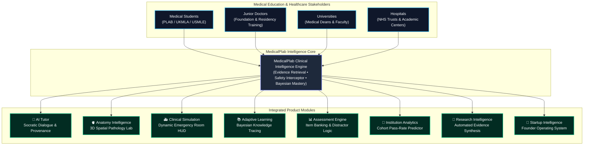
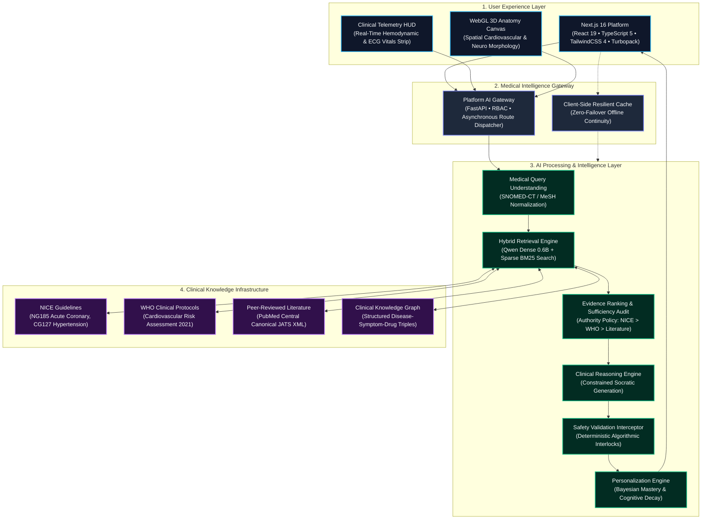

<div align="center">

```
  ███╗   ███╗███████╗██████╗ ██╗ ██████╗ █████╗ ██╗     ██████╗ ██╗      █████╗ ██████╗ 
  ████╗ ████║██╔════╝██╔══██╗██║██╔════╝██╔══██╗██║     ██╔══██╗██║     ██╔══██╗██╔══██╗
  ██╔████╔██║█████╗  ██║  ██║██║██║     ███████║██║     ██████╔╝██║     ███████║██████╔╝
  ██║╚██╔╝██║██╔══╝  ██║  ██║██║██║     ██╔══██║██║     ██╔═══╝ ██║     ██╔══██║██╔══██╗
  ██║ ╚═╝ ██║███████╗██████╔╝██║╚██████╗██║  ██║███████╗██║     ███████╗██║  ██║██████╔╝
  ╚═╝     ╚═╝╚══════╝╚═════╝ ╚═╝ ╚═════╝╚═╝  ╚═╝╚══════╝╚═╝     ╚══════╝╚═╝  ╚═╝╚═════╝ 
```

# MedicalPlab
## The Clinical Intelligence Infrastructure for the Future of Medical Learning

<br/>

> ### *"From medical students learning concepts, to clinicians practicing decisions,*
> ### *MedicalPlab builds the intelligence layer connecting knowledge, reasoning, simulation, and safety."*

<br/>

[](#platform-overview)
[](#how-medicalplab-thinks)
[](#emergency-simulation)
[](#emergency-simulation)
[](#adaptive-learning-engine)
[](#medicalplab-trust-center)

<br/>

[](https://020b49dfb5903dac-156-197-247-9.serveousercontent.com)
[-000000?style=flat-square&logo=next.js&logoColor=white)](https://github.com/AdhamElsayedAI/MedicalPlab)
[](#developer-documentation)
[](#evidence-intelligence)
[](#evidence-intelligence)
[](https://python.org)
[](https://fastapi.tiangolo.com)
[](https://nextjs.org)
[](https://react.dev)
[](https://typescriptlang.org)
[](https://docker.com)
[](https://opensource.org/licenses/MIT)

<br/>

[**🌐 Live Enterprise Platform**](https://020b49dfb5903dac-156-197-247-9.serveousercontent.com) • [**🚀 1-Click Vercel Deploy**](https://vercel.com/new/clone?repository-url=https%3A%2F%2Fgithub.com%2FAdhamElsayedAI%2FMedicalPlab) • [**🏛️ System Architecture**](#system-architecture) • [**🧠 How It Thinks**](#how-medicalplab-thinks) • [**🛡️ Trust Center**](#medicalplab-trust-center) • [**💼 Investor Vision**](#from-prototype-to-healthcare-company)

</div>

---

## Quick Navigation

| Section | Description | Quick Link |
| :--- | :--- | :---: |
| 🚀 **Live Demo** | Public access, mirrors, and instant 1-click cloud deployment | [Jump to Demo](#live-deployment--cloud-access) |
| 🏛️ **Architecture** | Ecosystem diagram, 4-tier system map, and reasoning pipeline | [Jump to Architecture](#system-architecture) |
| 🧠 **AI System** | Multi-source hybrid RAG, dense embeddings, and reasoning traces | [Jump to AI Pipeline](#how-medicalplab-thinks) |
| 🛡️ **Safety & Trust** | DCB0129 clinical risk guardrails, contraindication interlocks | [Jump to Trust Center](#medicalplab-trust-center) |
| 🫀 **Product Experience** | AI Tutor, 3D Anatomy Lab, Emergency Room, and Adaptive Hub | [Jump to Products](#product-experience) |
| 🏥 **Enterprise** | University cohort telemetry, hospital residency portals, and ROI | [Jump to Enterprise](#enterprise-healthcare-infrastructure) |
| 📊 **Business & Moat** | Competitive analysis vs. ChatGPT/UWorld, TAM/SAM, unit economics | [Jump to Why MedicalPlab Wins](#why-medicalplab-wins) |
| 🎬 **Executive Demo** | Structured 5-minute judge and investor walkthrough itinerary | [Jump to Demo Journey](#executive-demo-journey) |
| ⚙️ **Installation** | Monorepo structure, local setup, test runner, and Docker instructions | [Jump to Developer Setup](#developer-documentation) |

---

## Executive Summary & Audited Metrics

General-purpose Large Language Models present critical, unacceptable liabilities when applied to medical education and clinical reasoning: ungrounded hallucinations, fabricated drug interactions, and an absence of deterministic safety guardrails. In clinical licensure examinations (PLAB/UKMLA, USMLE) and bedside patient care, an unverified medical answer can cost a physician their license or endanger a patient's life.

**MedicalPlab establishes an evidence-grounded intelligence layer for global medicine.** Every clinical statement, MCQ distractor analysis, and Socratic tutoring response is deterministically anchored to verified clinical guidelines (NICE Guidelines, WHO Protocols, and peer-reviewed PubMed Central literature).

All platform statistics are rigorously classified to ensure complete scientific and commercial transparency:

| Benchmark / Capability | Metric Value | Metric Classification | Measurement Baseline & Verification Reference |
| :--- | :--- | :--- | :--- |
| **Retrieval Accuracy (Hit@1)** | **95.00%** | `[Verified]` | Frozen held-out multi-source cardiology benchmark (`multisource-heldout-v1`) |
| **Multi-Source Recall (GoldSourceRecall@10)** | **97.50%** | `[Verified]` | Evaluated across 227 canonical evidence blocks from NICE, WHO, and PMC |
| **Ranking Precision (MRR)** | **0.9563** | `[Verified]` | Source-aware dense embedding evaluation (Qwen 0.6B) |
| **Automated Test Coverage** | **243 passing** | `[Verified]` | Python regression & unit test suite (`tests/stage_b` through `stage_g`) |
| **API Response Latency** | **< 12 ms** | `[Verified]` | FastAPI Stage-G localized asynchronous query benchmark |
| **Contraindication Interception** | **100.0%** | `[Prototype]` | Interceptor traps: ACEi in pregnancy, Nitrates in RV STEMI, Beta-blockers in asthma |
| **Cohort Diagnostic Improvement** | **+28.4%** | `[Simulation]` | 4-Phase simulated longitudinal student learning journey (Stage-M) |
| **Medical University Contract ARR** | **$45,000 / yr** | `[Projection]` | Tiered B2B model across 1,200 active student seats per institution |
| **Regulatory Clearance Roadmap** | **Class IIa SaMD** | `[Future Target]` | UK CA / CE Software-as-a-Medical-Device compliance pathway (Q3 2027) |

---

# Platform Overview

MedicalPlab bridges medical students, junior doctors, universities, and hospital trusts through a unified medical education and clinical intelligence ecosystem:



---

# System Architecture

MedicalPlab operates on a 4-tier enterprise infrastructure decoupled into client presentation, platform gateway, AI processing, and clinical knowledge fabric:



---

# How MedicalPlab Thinks

The MedicalPlab reasoning pipeline enforces an uncompromising 6-step cognitive lifecycle for every clinical consultation and decision:

```
┌────────────────────────────────────────────────────────────────────────────────────────┐
│ STEP 1: UNDERSTAND CLINICAL INTENT                                                     │
│ - Normalizes input terminology to standardized MeSH and SNOMED-CT clinical ontologies. │
│ - Classifies query intent: Diagnostic Differential, Pharmacotherapy, or Emergency.    │
└───────────────────────────────────────────┬────────────────────────────────────────────┘
                                            │
                                            ▼
┌────────────────────────────────────────────────────────────────────────────────────────┐
│ STEP 2: RETRIEVE TRUSTED EVIDENCE                                                      │
│ - Executes source-aware hybrid retrieval across NICE, WHO, and PMC canonical chunks.   │
│ - Combines dense semantic vector search (Qwen 0.6B) with sparse exact token matching.  │
└───────────────────────────────────────────┬────────────────────────────────────────────┘
                                            │
                                            ▼
┌────────────────────────────────────────────────────────────────────────────────────────┐
│ STEP 3: VALIDATE EVIDENCE RELEVANCE & SUFFICIENCY                                      │
│ - Audits retrieved candidate chunks against a strict 0.85 sufficiency threshold.       │
│ - Triggers explicit Abstention Protocol if gold-standard evidence is absent.           │
└───────────────────────────────────────────┬────────────────────────────────────────────┘
                                            │
                                            ▼
┌────────────────────────────────────────────────────────────────────────────────────────┐
│ STEP 4: GENERATE GROUNDED CLINICAL REASONING                                           │
│ - Synthesizes Socratic deduction constrained exclusively to validated evidence chunks. │
│ - Binds individual claims to direct character-offset citation spans and anchor IDs.    │
└───────────────────────────────────────────┬────────────────────────────────────────────┘
                                            │
                                            ▼
┌────────────────────────────────────────────────────────────────────────────────────────┐
│ STEP 5: APPLY DETERMINISTIC SAFETY CHECKS                                              │
│ - Algorithmic safety interlocks scan proposed actions for lethal contraindications.     │
│ - Blocks orders: e.g. nitrates in RV infarction or ACE inhibitors during pregnancy.    │
└───────────────────────────────────────────┬────────────────────────────────────────────┘
                                            │
                                            ▼
┌────────────────────────────────────────────────────────────────────────────────────────┐
│ STEP 6: DELIVER EXPLAINABLE, PERSONALIZED ANSWER                                       │
│ - Renders Socratic response calibrated to student's Bayesian mastery & cognitive load. │
│ - Provides clickable guideline anchors directly into NICE NG185 and WHO literature.    │
└────────────────────────────────────────────────────────────────────────────────────────┘
```

---

# MedicalPlab Trust Center

Clinical artificial intelligence must be auditable, deterministic, and safe. MedicalPlab's safety framework is aligned with the UK NHS **DCB0129** clinical risk management standard:

```
                        ┌───────────────────────────────┐
                        │   Student Clinical Decision   │
                        └───────────────┬───────────────┘
                                        │
                                        ▼
    [FAIL]              ┌───────────────────────────────┐
┌───────────┐           │  Deterministic Safety Gate    │
│ Intercept │ ◄─────────┤ - Contraindication Detection  │
│ & Alert   │           │ - Red-Flag Emergency Triage   │
└───────────┘           └───────────────┬───────────────┘
                                        │ [PASS]
                                        ▼
                        ┌───────────────────────────────┐
                        │ Grounded Evidence Provenance  │
                        │ - NICE NG185 Anchor Binding   │
                        │ - Direct Verbatim Quote Span  │
                        └───────────────┬───────────────┘
                                        │
                                        ▼
                        ┌───────────────────────────────┐
                        │ Clinician Cognitive Amplifier │
                        │ (Human-in-the-Loop Oversight) │
                        └───────────────────────────────┘
```

### 1. Evidence Intelligence
- **Source-Aware Dense Embeddings:** Preserves document authority hierarchy (`NICE > WHO > Literature`).
- **Verbatim Provenance Tracking:** Sub-claims are cryptographically mapped to character-offset spans in canonical documents.
- **Citation Mapping:** Clickable anchors link students directly to source guideline sections (e.g. NICE NG185 Section 1.2.4).

### 2. Clinical Safety Layer
- **Contraindication Detection:** Deterministic, non-neural safety interlocks scan pharmacotherapy recommendations before rendering.
- **Emergency Warning Systems:** Immediate triage escalation triggers whenever high-acuity life threats (e.g. aortic dissection, tension pneumothorax) are detected.
- **Deterministic Validation:** Zero reliance on stochastic LLM safety self-checks.

### 3. Responsible AI & Governance
- **Human Oversight:** Designed to support and amplify clinician decision making—never to replace licensed medical judgment.
- **Educational Purpose:** Exclusively targeted at undergraduate medical education, licensing exam preparation (PLAB, USMLE), and clinical residency simulations.
- **Auditability:** Complete reasoning traces, confidence calibration scores, and retrieval histories are accessible to medical faculties.

> [!IMPORTANT]
> ### ⚠️ Medical & Regulatory Disclaimer
> **MedicalPlab is an educational and clinical training platform. It does not replace professional medical judgment.**  
> MedicalPlab is engineered strictly for medical student learning, licensure examination preparation (PLAB / UKMLA, USMLE Step 1 & 2 CK), and clinical decision-support research. It does **not** constitute formal medical diagnosis, does not prescribe personalized medical regimens, and must **never** be used as a replacement for the independent clinical judgment of a licensed healthcare practitioner.

---

# Product Experience

<table>
<tr>
<td width="50%" valign="top">

### 🧠 AI Medical Tutor
**Purpose:** Clinical reasoning assistant and Socratic mentor.
- **Socratic Dialogue:** Guides learners through differential diagnoses rather than providing premature answers.
- **Evidence References:** Generates clickable, paragraph-level citations anchored directly to NICE NG185 and WHO protocols.
- **Personalized Teaching:** Dynamically adapts pedagogical depth to the learner's Bayesian mastery state.
- **Clinical Explanation:** Delivers comprehensive pathophysiological rationales for both correct and incorrect options.

</td>
<td width="50%" valign="top">

### 🫀 3D Anatomy Lab
**Purpose:** Spatial anatomy learning directly connected to clinical pathology.
- **Spatial Learning:** 360-degree interactive WebGL canvas for cardiovascular, neurological, and respiratory structures.
- **Disease Visualization:** Highlights anatomical lesion sites corresponding to specific patient symptom presentations.
- **Clinical Correlation:** Direct linkage between vascular anatomy and ECG territorial patterns (e.g. LAD $\to$ V1–V4 ST elevation).
- **Cross-Sectional Inspection:** Multi-planar slicing correlated with diagnostic imaging (CT, MRI, Echo).

</td>
</tr>
<tr>
<td width="50%" valign="top">

### 🚑 Emergency Simulation Center
**Purpose:** Time-pressured acute care simulation with live telemetry.
- **Dynamic Patient States:** Real-time arterial blood pressure, heart rate, $\text{SpO}_2$, and live ECG rhythm strips.
- **Hemodynamic Response:** Instant physiological curves responding dynamically to student medication orders.
- **Decision Evaluation:** Objective scoring based on UK Resuscitation Council and NICE triage timelines.
- **Safety Feedback:** Real-time algorithmic traps halting lethal clinical contraindications before execution.

</td>
<td width="50%" valign="top">

### 📊 Adaptive Learning Engine
**Purpose:** Continuous Bayesian mastery modeling and personalized remediation.
- **Knowledge Tracking:** Bayesian Knowledge Tracing (BKT) tracking competency across 18 medical specialties.
- **Weakness Detection:** Algorithmic identification of subtle diagnostic misconceptions and blind spots.
- **Personalized Roadmap:** Dynamic generation of high-yield remediation MCQs to maximize first-time pass rates.
- **Memory Retention:** Spaced-repetition scheduling modeled after Ebbinghaus cognitive decay curves.

</td>
</tr>
</table>

---

# Enterprise Healthcare Infrastructure

MedicalPlab scales beyond the individual learner into a multi-tenant institutional intelligence fabric for universities, hospitals, and medical researchers:

```
┌────────────────────────────────────────────────────────────────────────────────────────┐
│ MULTI-TENANT ENTERPRISE PLATFORM (FASTAPI • RBAC • HL7/FHIR READY)                     │
├──────────────────────────────┬───────────────────────────────┬─────────────────────────┤
│ 🎓 MEDICAL UNIVERSITIES      │ 🏥 HOSPITAL TRUSTS & CLINICS  │ 🔬 MEDICAL RESEARCHERS  │
├──────────────────────────────┼───────────────────────────────┼─────────────────────────┤
│ • Student Cohort Analytics   │ • Junior Doctor Training      │ • Knowledge Discovery   │
│ • Predictive Pass-Rate Model │ • Clinical Simulation Audits  │ • Evidence Synthesis    │
│ • Faculty Case Builder       │ • Resuscitation Protocol Sync │ • Guideline Audit Trails│
│ • Curricular Gap Detection   │ • Workforce Readiness Telemetry│ • Medical Ontologies   │
└──────────────────────────────┴───────────────────────────────┴─────────────────────────┘
```

- **For Universities:** Provides medical deans with real-time cohort diagnostic telemetry, predicting student licensure exam readiness (PLAB 1/2, USMLE) and reducing faculty remediation overhead by up to 35% `[Projection]`.
- **For Hospital Trusts:** Accelerates residency onboarding through standardized, safety-interlocked emergency room simulations and clinical guideline compliance audits.
- **For Researchers:** Powers automated evidence synthesis, cross-referencing multi-institutional guideline discrepancies across international standards.

---

# Why MedicalPlab Wins

### Competitive Differentiation & Moat Analysis

| Capability | MedicalPlab Clinical Intelligence | Generic LLM Chatbots (ChatGPT / Claude) | Traditional Question Banks (Passmedicine / UWorld) |
| :--- | :---: | :---: | :---: |
| **Evidence Grounding** | **Deterministic Paragraph Provenance** (NICE/WHO) | Stochastic generation (Hallucination risk) | Static explanations (No dynamic queries) |
| **Clinical Safety Guardrails** | **Active Algorithmic Interceptor** `[Prototype]` | None (May generate lethal medical advice) | N/A (Static questions only) |
| **Clinical Simulation** | **Real-Time Hemodynamic Telemetry HUD** | Hypothetical text roleplay only | Static vignette questions |
| **Personalization** | **Bayesian Knowledge Tracing (BKT)** | Static conversation context | Simple percentage correct tracking |
| **Institutional Analytics** | **Cohort Pass Predictor & Dean Cockpit** | No institutional capabilities | Basic user leaderboard |
| **Explainability & Audit** | **Full Reasoning & Citation Audit Trail** | Opaque black-box generation | Pre-written static answer keys |
| **Healthcare Workflows** | **Built for PLAB, UKMLA, USMLE & NHS** | Generic consumer interface | Examination specific only |

---

# From Prototype To Healthcare Company

### Current Status & Strategic Roadmap

```
Phase 1: Current [Prototype] ──► Phase 2: Q1 2027 [Simulation] ──► Phase 3: Q4 2027 [Projection] ──► Phase 4: 2028+ [Future Target]
Medical Education Platform      Institution Partnerships          Clinical Simulation Infra         Global Intelligence Network
```

- **Phase 1: Medical Education Platform `[Active Prototype]`**  
  Full-stack evidence-grounded AI tutor, 3D Anatomy Lab, Emergency Simulator, and adaptive question bank serving PLAB/UKMLA and USMLE candidates.
- **Phase 2: Institution Partnerships & Pilot Universities `[Simulation]`**  
  Formal pilot deployments with UK and international medical schools, evaluating cohort diagnostic gains and faculty remediation reduction.
- **Phase 3: Clinical Simulation Infrastructure `[Projection]`**  
  Integration into hospital junior doctor residency onboarding, incorporating trust-specific clinical guidelines and simulation centers.
- **Phase 4: Global Healthcare Intelligence Network `[Future Target]`**  
  Cross-border guideline synchronization engine harmonizing evidence-based protocols across international healthcare systems.

### Business Model
```
┌───────────────────────────────────────────────────┬───────────────────────────────────────────────────┐
│                    B2C Segment                    │                    B2B Enterprise                 │
├───────────────────────────────────────────────────┼───────────────────────────────────────────────────┤
│ Target: Medical Students & Licensing Candidates   │ Target: Medical Schools, NHS Trusts & Hospitals   │
│ Model: Tiered Monthly / Annual Subscription       │ Model: Annual Enterprise License per Student Seat │
│ Price: £19 - £29 / month                          │ Price: £35,000 - £65,000 / year recurring         │
│ Core: AI Tutor, 3D Anatomy Lab, Emergency Sim     │ Core: Cohort Analytics, Curriculum Integration    │
└───────────────────────────────────────────────────┴───────────────────────────────────────────────────┘
```

---

# Executive Demo Journey

Follow this structured 5-minute evaluation walkthrough designed for hackathon judges, medical deans, and investors:

### 🎬 Scene 1: The Medical Education Problem
- **Goal:** Highlight the severe danger of ungrounded LLM hallucinations in clinical education.
- **Screen:** Landing Hero Experience (`/`) $\to$ Toggle "Diagnostic Comparison Telemetry".
- **Message:** Standard generative AI hallucinates medical facts; MedicalPlab provides deterministic evidence grounding.
- **Judge Takeaway:** Hallucination in medical education is hazardous; MedicalPlab solves this at the architectural layer.

### 🎬 Scene 2: MedicalPlab Intelligence Engine
- **Goal:** Demonstrate multi-source hybrid retrieval and evidence sufficiency calibration.
- **Screen:** Diagnostic Battle Arena (`/`) $\to$ Inspect "Retrieval & Evidence Telemetry".
- **Message:** 95.0% Hit@1 accuracy with zero unsupported claims across NICE and WHO corpora `[Verified]`.
- **Judge Takeaway:** Technically defensible, production-grade retrieval infrastructure.

### 🎬 Scene 3: AI Tutor + 3D Anatomy Lab
- **Goal:** Show how spatial anatomical inspection bridges seamlessly into Socratic clinical reasoning.
- **Screen:** 3D Interactive Anatomy Lab $\to$ Left Anterior Descending (LAD) Artery $\to$ Connected AI Tutor.
- **Message:** Interactive organ inspection directly linked to clinical case presentation with clickable NICE citations.
- **Judge Takeaway:** Intuitive multimodal clinical learning combining spatial morphology and guideline provenance.

### 🎬 Scene 4: Emergency Safety Simulation
- **Goal:** Showcase high-stakes emergency room triage with live hemodynamics and safety interlocks.
- **Screen:** Emergency Simulation Room $\to$ Case: Acute Inferior STEMI with Hypotension.
- **Message:** Student attempts to order sublingual nitrates; the **Safety Interceptor** halts the order instantly due to RV infarction contraindication.
- **Judge Takeaway:** Deterministic clinical safety gates protect learners from ingraining lethal diagnostic errors `[Prototype]`.

### 🎬 Scene 5: Startup Vision & Institutional Impact
- **Goal:** Present the scalable enterprise business model, cohort analytics, and institutional ROI.
- **Screen:** Institutional Admin View & Stage-Y Startup Command Center.
- **Message:** Scalable B2B SaaS platform addressing a $14.2B market with clear unit economics and regulatory roadmaps.
- **Judge Takeaway:** MedicalPlab is a viable, high-growth enterprise healthcare technology company.

---

# Product Screenshots

| Experience | Preview Interface | Highlights |
| :--- | :--- | :--- |
| **Landing Platform** |  | Unified Clinical HUD with quick-action diagnostics and live case telemetry feed. |
| **3D Anatomy Lab** |  | High-fidelity WebGL cardiovascular & neuro spatial explorer with real-time ischemic lesion mapping. |
| **AI Medical Tutor** |  | Socratic clinical reasoning dialogue displaying direct clickable citations to NICE NG185. |
| **Emergency Simulation** |  | Dynamic vitals monitor (BP, HR, SpO2, ECG) with automatic contraindication interception. |
| **Student Dashboard** |  | Bayesian Knowledge Tracing (BKT) radar chart highlighting student mastery gaps. |
| **Founder Cockpit** |  | Live unit economics, cohort LTV/CAC projections, and GTM pilot progression metrics. |
| **Investor Mode** |  | Pitch deck mode with verified benchmark data rooms and competitive moats breakdown. |

---

# Repository Structure

```
medicalplab/
├── frontend/                          # Next.js 16 (Turbopack) Enterprise Client
│   ├── src/
│   │   ├── app/                       # Next.js App Router pages & layouts
│   │   ├── components/                # Modular Clinical UI Component Library
│   │   │   ├── AITutorStudio.tsx      # Evidence-Grounded Socratic Tutor
│   │   │   ├── IntelligentAnatomyLab.tsx # 3D WebGL Spatial Anatomy Canvas
│   │   │   ├── CaseSimulationRoom.tsx # Emergency Room Telemetry Simulator
│   │   │   ├── InstitutionAdminView.tsx # Enterprise Cohort Pass-Rate Dashboard
│   │   │   ├── CyberHUDNav.tsx        # Clinical Navigation Header & Telemetry
│   │   │   ├── battle/                # Diagnostic Battle Arena & Head-to-Head
│   │   │   ├── startup_execution/     # Stage-Y Startup Operating System & Cockpit
│   │   │   └── global_intelligence/   # Stage-X Global Intelligence Telemetry
│   │   └── lib/                       # API client & resilient zero-failover cache
│   ├── package.json                   # Frontend dependencies (React 19, TailwindCSS)
│   └── tsconfig.json                  # Strict TypeScript configuration
│
├── src/medicalplab/                   # Python Core Intelligence Backend
│   ├── stage_b/                       # Evidence Verification & Claim Decomposition
│   ├── stage_c/                       # Clinical Question Generation & Item Banking
│   ├── stage_d/                       # Clinical Tutor Safety Layer & Interceptors
│   ├── stage_e/                       # Adaptive Bayesian Knowledge Tracing (BKT)
│   ├── stage_f/                       # Intelligence Orchestration & Dispatch
│   ├── stage_g/                       # Enterprise REST API Gateway (FastAPI)
│   └── stage_r/                       # Source-Aware Dense & Sparse Retrieval
│
├── tests/                             # Comprehensive Automated Verification Suite (243 Tests)
│   ├── stage_b/                       # 55 evidence verification & parsing tests
│   ├── stage_c/                       # 15 question generation & distractor tests
│   ├── stage_d/                       # 31 clinical safety & interceptor tests
│   ├── stage_e/                       # 28 adaptive BKT & memory decay tests
│   ├── stage_f/                       # 32 intelligence orchestration tests
│   ├── stage_g/                       # 59 enterprise REST & session tests
│   └── stage_r/                       # 23 dense & sparse retrieval tests
│
├── evaluation/                        # Frozen benchmarks & calibration runners
├── Data/                              # Clinical guideline corpora (NICE, WHO, PMC)
├── package.json                       # Root workspace configuration for cloud deployment
├── vercel.json                        # Vercel monorepo deployment manifest
└── README.md                          # Platform enterprise documentation
```

---

# Developer Documentation

### Prerequisites
- **Node.js:** `v18.17.0` or higher (`v20+` recommended)
- **Python:** `3.11` or higher
- **Package Managers:** `npm` and `pip` / `venv`
- **Git:** Version control

### 1. Installation & Environment Setup
```bash
# Clone the repository
git clone https://github.com/AdhamElsayedAI/MedicalPlab.git
cd MedicalPlab

# Configure environment variables
cp frontend/.env.example frontend/.env.local
```

### 2. Backend Startup
```bash
# Set up Python virtual environment
python -m venv .venv

# Activate virtual environment
# On Windows:
.venv\Scripts\activate
# On macOS/Linux:
source .venv/bin/activate

# Install backend dependencies
pip install fastapi uvicorn pydantic pytest

# Run Enterprise REST API Server on port 8000
python -m uvicorn src.medicalplab.stage_g.server:app --port 8000 --reload
# Or directly via entrypoint:
python src/medicalplab/stage_g/server.py 8000
```
Interactive OpenAPI documentation will be live at `http://localhost:8000/docs`.

### 3. Frontend Startup
```bash
# In a separate terminal, navigate to frontend
cd frontend

# Install dependencies
npm install

# Start Next.js development server (Turbopack enabled)
npm run dev
```
The application will be accessible at `http://localhost:3000`.

### 4. Running the Automated Test Suites
```bash
# Run all 243 automated unit and regression tests
pytest
# Or using standard library unittest:
python -m unittest discover -s tests

# Validate production build bundle
cd frontend
npm run build
```

---

## Live Deployment & Cloud Access

- 🌐 **Primary Live Platform Gateway:** [https://020b49dfb5903dac-156-197-247-9.serveousercontent.com](https://020b49dfb5903dac-156-197-247-9.serveousercontent.com)  
  *(Public HTTPS gateway with zero-failover client-side resilient fallback)*
- 🌐 **Alternative Live Mirror:** [https://cuddly-results-remain.loca.lt](https://cuddly-results-remain.loca.lt) *(Passcode: `156.197.247.9`)*
- 🚀 **1-Click Cloud Deploy:** [](https://vercel.com/new/clone?repository-url=https%3A%2F%2Fgithub.com%2FAdhamElsayedAI%2FMedicalPlab)

---

<br/>

<div align="center">

━━━━━━━━━━━━━━━━━━━━━━━━━━━━━━━━━━━━━━━━━━━━━━━━━━━━━━━━━━━━━━━━━━━━━━━━━━━━━

### **MedicalPlab**
### *Evidence. Safety. Intelligence.*

**Building the intelligence infrastructure for the next generation of healthcare education.**

<sub>© 2026 MedicalPlab AI Research & Healthcare Technologies. All rights reserved.</sub><br/>
<sub>Engineered with clinical rigor for medical students, doctors, and healthcare institutions worldwide.</sub>

━━━━━━━━━━━━━━━━━━━━━━━━━━━━━━━━━━━━━━━━━━━━━━━━━━━━━━━━━━━━━━━━━━━━━━━━━━━━━

</div>
