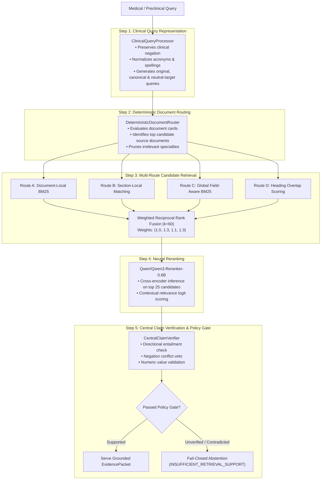

# MedicalPlab — AI Architecture & Clinical Intelligence Framework

## 1. What is Genuinely AI vs Deterministic Logic?

Medical education and clinical safety cannot tolerate unconstrained, hallucinating generative language models. MedicalPlab explicitly separates the AI stack into specialized functional tiers:

```
┌────────────────────────────────────────────────────────────────────────┐
│                        AI & Algorithmic Taxonomy                       │
├──────────────────────────┬─────────────────────────────────────────────┤
│ Functional Tier          │ Technology & Implementation                 │
├──────────────────────────┼─────────────────────────────────────────────┤
│ 1. Generative AI         │ Socratic vignette generation, explanation   │
│                          │ rendering, contextual learner feedback      │
├──────────────────────────┼─────────────────────────────────────────────┤
│ 2. Information Retrieval │ Multi-channel candidate retrieval:          │
│                          │ • Deterministic document-local routing      │
│                          │ • Heading-local section matching            │
│                          │ • Field-aware BM25 (title 1.0, heading 2.0) │
│                          │ • Weighted Reciprocal Rank Fusion (RRF)     │
├──────────────────────────┼─────────────────────────────────────────────┤
│ 3. Neural Reranking      │ Qwen/Qwen3-Reranker-0.6B cross-encoder      │
│                          │ (evaluates query-chunk contextual entailment)│
├──────────────────────────┼─────────────────────────────────────────────┤
│ 4. Deterministic Safety  │ Central Claim Verifier:                     │
│                          │ • Polarity / negation mismatch detection    │
│                          │ • Numeric / dosage discrepancy veto         │
│                          │ • High-risk clinical trap fail-closed gate  │
├──────────────────────────┼─────────────────────────────────────────────┤
│ 5. Adaptive Mastery      │ Bayesian Knowledge Tracing (BKT):           │
│                          │ • Prior knowledge, transit, slip & guess    │
│                          │ • Dynamic difficulty & weak topic selection │
├──────────────────────────┼─────────────────────────────────────────────┤
│ 6. Human Review Boundary │ Strict rule: software cannot self-approve    │
│                          │ medical truth. GMC clinician sign-off is   │
│                          │ mandatory for licensing golden promotion.   │
└──────────────────────────┴─────────────────────────────────────────────┘
```

---

## 2. Canonical RAG & Evidence Engine V1.1

The canonical retrieval engine (`MEDICALPLAB_EVIDENCE_ENGINE_V1_1`) enforces a 5-step pipeline:



---

## 3. Verified DEV Cross-Validation Metrics

The Evidence Engine V1.1 was rigorously evaluated across a 5-fold cross-validation split on 99 DEV queries grounded in the accredited open-access renal corpus (`Data/processed/renal_v1/`, 2,192 chunks):

| Metric | V1 Baseline | V1.1 Selected | Delta (Improvement) | Notes |
| :--- | :---: | :---: | :---: | :--- |
| **MRR** | `0.7476` | **`0.8144`** | `+0.0668` | Mean Reciprocal Rank across 5 deterministic folds |
| **Hit@1** | `0.6768` | **`0.7576`** | `+0.0808` | Top passage exactly matches gold evidence |
| **Hit@3** | `0.7879` | **`0.8384`** | `+0.0505` | Gold evidence in top 3 |
| **Hit@5** | `0.7879` | **`0.8485`** | `+0.0606` | Gold evidence in top 5 |
| **Hit@10** | `0.8485` | **`0.9091`** | `+0.0606` | Gold evidence in top 10 |
| **NDCG@10** | `0.6417` | **`0.7061`** | `+0.0644` | Normalized Discounted Cumulative Gain |
| **Doc Hit@1** | `0.8283` | **`0.8586`** | `+0.0303` | Top document routing accuracy |
| **CandidateRecall@50** | `0.9495` | **`0.9697`** | `+0.0202` | High-recall candidate generation pool |
| **Product-Served Unsupported DEV Cases** | `0 / 37` | **`0 / 37`** | `0.00% false support` | Zero ungrounded claims served to users |

### Runtime Latency & Performance (CUDA, NVIDIA RTX 3060 Laptop GPU)
- **Warm p50 Latency:** `951.18 ms`
- **Warm p95 Latency:** `1160.31 ms`
- **Warm Mean Latency:** `934.68 ms`
- **Cold Startup Time:** `10.83 s` (one-time index load and card initialization)

> [!IMPORTANT]
> **Evaluation Protocol Note:** All reported performance figures reflect **cross-validated DEV performance** on the 99-query in-corpus pool. The dataset lineage records: `NO_UNSPENT_UNBIASED_FINAL_HOLDOUT_AVAILABLE`. We explicitly refrain from claiming final unseen holdout performance to maintain total scientific honesty.

---

## 4. Student Adaptive Learning: Bayesian Knowledge Tracing (BKT)

Student comprehension is tracked using a 4-parameter Bayesian Knowledge Tracing model implemented in `src/medicalplab/stage_e/`:
- **$P(L_0)$ (Initial Knowledge):** Probability student enters knowing the concept.
- **$P(T)$ (Transition):** Probability student acquires knowledge during a step ($0.15$).
- **$P(G)$ (Guess):** Probability student answers correctly without knowing ($0.25$ for 4-option MCQs).
- **$P(S)$ (Slip):** Probability student makes a mistake despite knowing ($0.10$).

When an attempt is recorded:
$$P(L_t \mid \text{Obs}_t) = \begin{cases}
\frac{P(L_t) \cdot (1 - P(S))}{P(L_t) \cdot (1 - P(S)) + (1 - P(L_t)) \cdot P(G)} & \text{if correct} \\
\frac{P(L_t) \cdot P(S)}{P(L_t) \cdot P(S) + (1 - P(L_t)) \cdot (1 - P(G))} & \text{if incorrect}
\end{cases}$$

Knowledge updates dynamically feed the **Recommendation Engine**, routing students toward their weakest topics (e.g., beginner mastery) before advancing.
