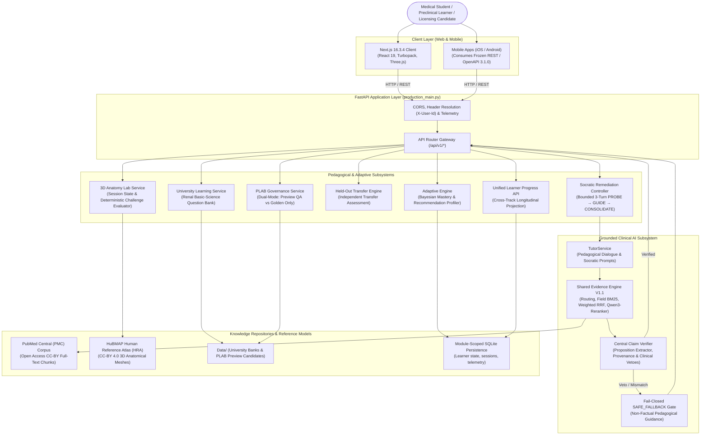

# MedicalPlab — System Architecture & Technical Design

## 1. Architectural Overview

MedicalPlab is an adaptive, evidence-grounded medical learning and clinical intelligence platform. It seamlessly unifies preclinical basic science, cognitive reasoning diagnosis, Socratic remediation, evidence-verified clinical tutoring, interactive 3D anatomy, and governed clinical licensing preparation into a single longitudinal learner experience.



---

## 2. Technology Stack & Versions

| Layer | Component | Version / Technology | Architectural Role |
| :--- | :--- | :--- | :--- |
| **Frontend Web** | Next.js | `16.3.4` (Turbopack) | Server Components, static prerendering, client hydration |
| **UI Library** | React | `19.2.8` | Declarative UI state, reactive learning components |
| **Styling & Motion** | TailwindCSS / CSS | `4.x` / Vanilla CSS | Modern clinical dark mode, responsive layouts |
| **3D Visualization** | Three.js | `0.183+` | WebGL canvas, HuBMAP HRA mesh rendering, orbit controls |
| **Backend Framework** | FastAPI | `0.115+` (Python 3.12/3.11) | Asynchronous ASGI, typed Pydantic contracts |
| **ASGI Server** | Uvicorn | `0.34+` | Production async event loop |
| **Lexical Retrieval** | Custom BM25 | Pure Python / NumPy | Field-aware title (1.0), heading (2.0), body (1.0) |
| **Neural Reranking** | Qwen3-Reranker | `Qwen/Qwen3-Reranker-0.6B` | Cross-encoder contextual relevance verification |
| **Claim Verification** | CentralClaimVerifier | Deterministic Rule Engine | Polarity, numeric consistency, directional entailment, citations |
| **Student Modeling** | Bayesian Knowledge Tracing | Custom BKT | Dynamic mastery updates, weak topic recommendations |
| **Mobile Integration** | OpenAPI 3.1.0 / Postman | REST/JSON contract | Frozen mobile API handoff |

---

## 3. Core Product Subsystems

### 1. Preclinical University Track
- **Focus:** Preclinical undergraduate medical education.
- **Current MVP:** Renal Physiology (Glomerular filtration barrier & RAAS mechanisms).
- **Taxonomy:** Subject → Topic → Question → Feedback → Explanation → Adaptive Update.
- **Contract Invariant:** Zero answer key leakage in question payloads (`options` dict without correct key metadata).

### 2. Adaptive Learning & Reasoning Signals
- **Focus:** Closed-loop learner modeling and recommendation.
- **Principle:** Wrong answer $\neq$ diagnosed misconception. Incorrect answers trigger heuristic reasoning-pattern signals.
- **Contract:** Dynamic mastery profiling driven by backend persistence with zero client-side calculation.

### 3. Socratic Remediation & Held-Out Transfer
- **Focus:** Guided cognitive remediation without answer leakage.
- **Protocol:** Bounded 3-turn controller (`PROBE` → `GUIDE` → `CONSOLIDATE`).
- **Transfer Invariant:** Held-out problem (`UNI-RENAL-001-T`) evaluated by backend scoring to certify conceptual transfer.

### 4. Grounded AI Tutor & Evidence Invariant
- **Focus:** Conversational clinical learning with zero hallucination.
- **Invariant:** Adaptive Layer $\rightarrow$ `TutorService` $\rightarrow$ `Shared Evidence Engine` $\rightarrow$ Verification $\rightarrow$ Grounded Response / `SAFE_FALLBACK`.
- **Fail-Closed Gate:** Out-of-scope queries or provenance mismatches automatically fall back to procedural non-factual guidance.

### 5. Generative 3D Anatomy Lab
- **Focus:** Spatial anatomical learning and deterministic identification testing.
- **Assets:** Scientifically licensed HuBMAP Human Reference Atlas (HRA) 3D reference objects.
- **Contract:** Challenge submission evaluated via canonical endpoint: `POST /api/v1/anatomy/session/{session_id}/challenge`.

### 6. PLAB Clinical Licensing Governance
- **Focus:** High-stakes licensing examinations (UK GMC PLAB 1 / MLA).
- **Dual-Mode Governance:**
  - `MEDICALPLAB_PLAB_PREVIEW_QA=1`: 36 candidate questions for internal review and mentor demos with prominent warning banner.
  - `MEDICALPLAB_PLAB_PREVIEW_QA=0`: Fail-closed empty state (`GOLDEN_ONLY`: 0 released questions) until formal clinician panel promotion.

### 7. Unified Learner Progress
- **Focus:** Consolidated longitudinal telemetry across all learning tracks.
- **Contract:** Driven by `GET /api/v1/learner/progress`, unifying University attempts, Adaptive state, Anatomy challenge passes, and PLAB review metrics.

---

## 4. API Entrypoint Specialization

1. **`production_main.py` (Authoritative Pilot & Production Entrypoint)**:
   - Requires `MEDICALPLAB_RUNTIME_MODE=pilot` or `production`.
   - Enforces data integrity manifests on startup; fails closed if files are missing or modified.
   - Enforces clinical PLAB governance and mounts all authoritative `/api/v1` routes.

2. **`main.py` (Local Development Entrypoint)**:
   - Provides developer ergonomics, backwards-compatible exploration routes, and synthetic test harnesses.

---

## 5. Security, Privacy & Integrity Invariants

- **No Live Secrets:** Repository contains zero hardcoded API keys, passwords, or production tokens.
- **Synthetic Learner Partitioning:** Mobile and pilot requests use the `X-User-Id` header for session isolation. This is an integration partitioning protocol, not cryptographic production authentication (`MOBILE_PRODUCTION_AUTH_READY = NO`).
- **Cryptographic Reproducibility:** Every question and evidence chunk is tracked with SHA-256 digests. Line-ending normalization (`UTF8_LF_CANONICAL_TEXT`) ensures cross-platform cryptographic reproducibility.
- **No Private Publisher Redistribution:** Public repository tracks only open-access PMC literature (CC-BY) and public-safe synthetic verification fixtures.

---

## 6. Repository Architecture

```
MedicalPlab/
├── src/medicalplab/        # Tier 1: Core Product Code (Backend & AI Engine)
├── frontend/               # Tier 1: Core Product Code (Next.js 16 Web Client)
├── Data/                   # Tier 2: Active Runtime Data (Public-Safe Evidence & Question Banks)
├── evaluation/             # Tier 3: Research & Reproducibility (Benchmarks & Splits)
├── models/                 # Tier 3: Research & Reproducibility (Frozen Classifiers & Hashes)
├── notebooks/              # Tier 3: Research & Reproducibility (Colab Demonstration)
├── deploy/                 # Tier 4: Deployment Infrastructure (Cloud Run Automations)
├── cloudbuild.yaml         # Tier 4: Deployment Infrastructure (Google Cloud Build)
├── Dockerfile              # Tier 4: Deployment Infrastructure (Container Definition)
├── render.yaml             # Tier 4: Deployment Infrastructure (Render Blueprint)
├── Scripts/                # Tier 5: Developer Tooling & Engineering Utilities
├── examples/               # Tier 5: Schema Examples & Pipeline Loaders
├── configs/ & schemas/     # Tier 5: Formal Data Contracts with SHA-256 Sidecars
├── docs/                   # Tier 6: Documentation (Architecture, Demo, Mobile Handoff, Team Handoff)
├── reports/                # Tier 6: Release Acceptance & Audit Reports
└── tests/                  # Tier 7: Automated Verification Suite (Integration, Mobile Contract, Unit)
```
