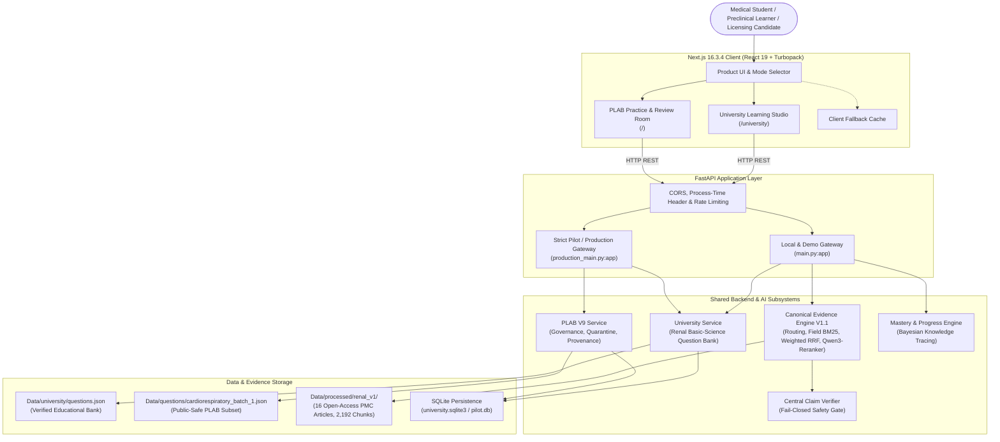

# MedicalPlab — System Architecture & Technical Design

## 1. Architectural Overview

MedicalPlab is an evidence-grounded medical education and clinical intelligence platform built on two distinct, architecturally decoupled product lanes:
1. **University Learning**: Preclinical undergraduate medical education focusing on mechanistic physiology and basic-science comprehension (Renal Physiology MVP: Glomerular filtration barrier & RAAS mechanisms).
2. **PLAB / Licensing Preparation**: High-stakes licensing examination preparation (UK GMC PLAB 1 / MLA) enforcing strict cryptographic source provenance, automated blocker taxonomy, and mandatory GMC clinician review boundaries.



---

## 2. Technology Stack & Versions

| Layer | Component | Version / Technology | Architectural Role |
| :--- | :--- | :--- | :--- |
| **Frontend Framework** | Next.js | `16.3.4` (Turbopack) | Server Components, fast hydration, client resilience |
| **UI Library** | React | `19.2.8` | Declarative UI state, reactive learning components |
| **Frontend Styling** | TailwindCSS | `4.x` | Modern, responsive medical UI tokens |
| **Icons & Animation** | Lucide / Framer Motion | `1.42.0` / `13.2.0` | Polished micro-interactions and status indicators |
| **Backend Framework** | FastAPI | `0.115+` (Python 3.12/3.11) | Asynchronous ASGI, typed Pydantic contracts |
| **ASGI Server** | Uvicorn | `0.34+` | Production async event loop |
| **Lexical Retrieval** | Custom BM25 | Pure Python / NumPy | Field-aware title (1.0), heading (2.0), body (1.0) |
| **Neural Reranking** | Qwen3-Reranker | `Qwen/Qwen3-Reranker-0.6B` | Cross-encoder contextual relevance verification |
| **Claim Verification** | CentralClaimVerifier | Deterministic Rule Engine | Polarity, numeric consistency, directional entailment |
| **Student Modeling** | Bayesian Knowledge Tracing | Custom BKT | Dynamic mastery updates, weak topic recommendations |
| **Containerization** | Docker | Multi-stage, non-root | Google Cloud Run, HF Spaces, portable deployment |

---

## 3. Product Lanes & Architectural Boundaries

### Lane 1: University Learning
- **Focus:** Preclinical undergraduate medical education.
- **Current MVP:** Renal Physiology (Glomerular filtration barrier & RAAS mechanisms).
- **Taxonomy:** Subject -> Topic -> Question -> Feedback -> Explanation -> Mastery.
- **Contract:** Zero answer key leakage in question payloads (`options` dict without correct key).
- **Safety Status:** `VERIFIED_EDUCATIONAL`. Fail-closed on missing fields or broken encodings.

### Lane 2: PLAB / Licensing Preparation
- **Focus:** High-stakes licensing examinations (UK GMC PLAB 1 / MLA).
- **Governance:** 9-point blocker taxonomy (Blockers A through I).
- **Safety Policy:**
  - 24 out of 36 questions quarantined due to strict evidence/distractor blockers.
  - 0 questions published as "Golden" without GMC clinician sign-off.
  - Complete character-exact span containment in accredited clinical guidelines.

---

## 4. API Entrypoint Specialization

1. **`main.py` (Local & Demo Gateway)**:
   - Provides full developer ergonomics, CORS, Socratic chat (`/ai/chat`), University endpoints (`/api/v1/university/*`), direct evidence queries (`/api/v1/evidence/query`), and student analytics (`/student/*`).
   - Serves as the primary local development and hackathon judge evaluation entrypoint.

2. **`production_main.py` (Strict Fail-Closed Deployment/Pilot Entrypoint)**:
   - Requires `MEDICALPLAB_RUNTIME_MODE=pilot` or `production`.
   - Enforces data integrity manifests on startup; fails closed if files are missing or modified.
   - Strictly validates PLAB governance counts before serving questions without implying external clinical certification.

---

## 5. Security, Privacy & Integrity Invariants

- **No Live Secrets:** Repository contains zero hardcoded API keys, passwords, or production tokens. Pointers use `.env.example`.
- **No Private Publisher Redistribution:** Full proprietary publisher guideline text remains in the private canonical evidence vault (`plab-evidence-final-v9`); the public repository tracks only open-access PMC literature and public-safe synthetic verification fixtures.
- **Cryptographic Reproducibility:** Every question and evidence chunk is tracked with SHA-256 digests. Line-ending normalization (`UTF8_LF_CANONICAL_TEXT`) ensures cross-platform cryptographic reproducibility.

---

## 6. Repository Architecture

*Note: This section defines the structural engineering layout of the codebase, distinct from the runtime system architecture in Section 1.*

The repository is structured into six functional tiers designed for 10-second comprehension by senior engineers, mentors, and technical judges:

```
MedicalPlab/
├── src/medicalplab/        # Tier 1: Core Product Code (Backend & AI Engine)
├── frontend/               # Tier 1: Core Product Code (Web Client)
├── Data/                   # Tier 2: Active Runtime Data (Public-Safe Evidence & Banks)
├── evaluation/             # Tier 3: Research & Reproducibility (Benchmarks & Splits)
├── models/                 # Tier 3: Research & Reproducibility (Frozen Classifiers & Hashes)
├── notebooks/              # Tier 3: Research & Reproducibility (Colab Demonstration)
├── deploy/                 # Tier 4: Deployment Infrastructure (Cloud Run Automations)
├── cloudbuild.yaml         # Tier 4: Deployment Infrastructure (Google Cloud Build)
├── Dockerfile              # Tier 4: Deployment Infrastructure (Container Definition)
├── render.yaml             # Tier 4: Deployment Infrastructure (Render Blueprint)
├── Scripts/                # Tier 5: Developer Tooling & Utilities (Ingestion & Pipelines)
├── examples/               # Tier 5: Developer Tooling & Utilities (Schema Examples & Loaders)
├── package.json            # Tier 5: Developer Tooling & Utilities (Root Script Wrapper)
└── tests/                  # Tier 6: Test Architecture (Automated Verification Suite)
```

### 1. Core Product Code
- **`src/medicalplab/`**: The core Python package housing the Canonical Evidence Engine V1.1 (`evidence_engine/`), University Preclinical Track (`university/`), PLAB V9 Governance & Licensing Service (`plab/`), and modular pipeline stages (`stage_b` through `stage_r`).
- **`frontend/`**: The Next.js 16.3.4 / React 19 web application deployed to Vercel, providing modern UI components for University learning and PLAB practice.

### 2. Active Runtime Data
- **`Data/`**: Public-safe runtime assets required by the containerized service and AI engine. Contains 16 full-text open-access PMC articles (`Data/raw/` and `Data/processed/`), the 6-question Renal Physiology educational bank (`Data/university/`), the public-safe PLAB question fixture (`Data/questions/`), and corpus license manifests (`Data/metadata/`).

### 3. Research & Scientific Reproducibility
- **`evaluation/`**: Ground-truth datasets, heldout evaluation splits, and benchmark inputs. Referenced directly by immutable governance tests (`tests/renal/test_renal_v4_1.py`) and development benchmark suites.
- **`models/`**: Frozen classifier weights (`.pkl`) accompanied by bit-for-bit SHA-256 sidecars (`.pkl.sha256`) asserted by cryptographic firewall tests.
- **`notebooks/`**: Minimal Colab reproducibility demonstration (`stage_b_colab.ipynb`) illustrating interactive Stage-B tokenization and evidence scoring.

### 4. Deployment Infrastructure
- **`Dockerfile`**: Multi-stage, unprivileged non-root container configuration powering Google Cloud Run and local container execution.
- **`cloudbuild.yaml`**: Google Cloud Build pipeline specification for automated container build, SHA tagging, and Cloud Run deployment.
- **`.github/workflows/deploy-cloud-run.yml`**: Production CI/CD workflow triggering Cloud Run deployments upon merged changes to `main`.
- **`deploy/`**: PowerShell and Bash automation scripts for developer deployment to Google Cloud Run.
- **`render.yaml`**: Supported PaaS blueprint for Render web service deployments.

### 5. Developer Tooling & Engineering Utilities
- **`Scripts/`**: Active data ingestion tools, PMC XML extractors, benchmark suites, and milestone freeze utilities. Retained at root because critical test modules and subprocess pipelines import them directly.
- **`examples/`**: Schema payload examples (`chunk.example.json`, `question.example.json`, etc.) and lightweight pipeline verification scripts (`test_loader.py`, `test_pipeline.py`).
- **`configs/` & `schemas/`**: Formal JSON Schema data contracts (`schemas/`) and executable configuration files (`configs/`) with cryptographic SHA sidecars.
- **`package.json`**: Root command wrapper forwarding `npm run dev`, `build`, and `lint` commands directly to `frontend/`.

### 6. Test Architecture
- **`tests/`**: Comprehensive Pytest suite organized into functional domains:
  - `tests/test_canonical_rag.py` & `tests/test_evidence_engine_v2.py`: RAG retrieval, ranking, and claim verification.
  - `tests/university/`: University contract invariants, zero answer key leakage, and BKT tracking.
  - `tests/plab/v9/`: PLAB V9 cryptographic oracle, span containment, and blocker taxonomy.
  - `tests/plab/test_pilot_acceptance.py`: Strict fail-closed production readiness probe.
  - `tests/renal/`: Historical milestone firewall tests asserting immutable SHA-256 sidecars and heldout splits.

