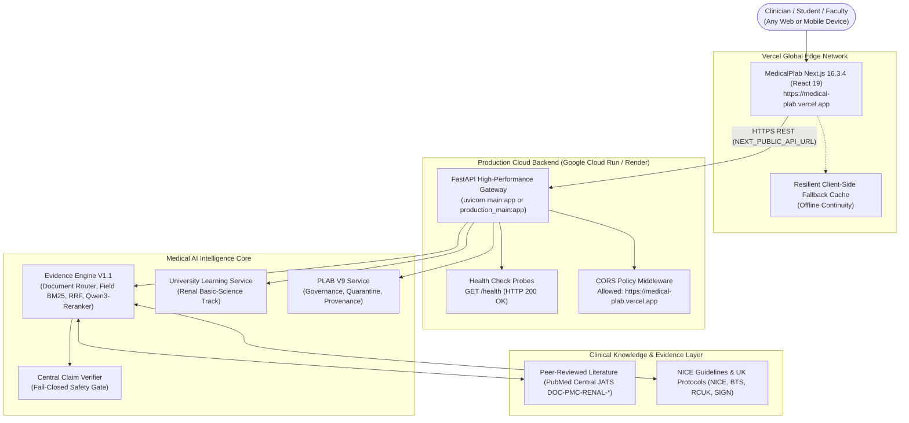

# MedicalPlab — Production Deployment Guide

This guide documents the production deployment architecture, container build procedures, environment variable configurations, and automated operational verification for the MedicalPlab ecosystem.

---

## 1. Production Architecture Overview

MedicalPlab decouples high-performance client presentation from clinical AI reasoning and evidence verification:



---

## 2. Entrypoints: `main.py` vs `production_main.py`

MedicalPlab provides two explicit, specialized FastAPI entrypoints:

| Dimension | `main.py` | `production_main.py` |
| :--- | :--- | :--- |
| **Intended Environment** | Local development, interactive demos, judges | Strict pilot & institutional production |
| **Runtime Mode** | Flexible demo runtime | Requires `MEDICALPLAB_RUNTIME_MODE=pilot` or `production` |
| **Socratic AI Chat (`/ai/chat`)** | Enabled (grounded with Evidence Engine V1.1) | Fails closed on unverified inquiries |
| **Data Manifest Check** | Logged on startup | Strict blocker: aborts startup on mismatch |
| **PLAB Governance Gate** | Serves review questions in preview mode | Strictly serves 0 questions if Golden count is 0 |
| **University Track** | Active (`/api/v1/university/*`) | Active (`/api/v1/university/*`) |
| **Start Command** | `uvicorn main:app --host 0.0.0.0 --port $PORT` | `uvicorn production_main:app --host 0.0.0.0 --port $PORT` |

---

## 3. Supported Deployment Pathways

### Pathway A: Google Cloud Run (Primary Recommended)

The repository includes a production Dockerfile and automated deployment scripts:

1. **Automated Shell Deployment**:
   ```bash
   # Using PowerShell:
   .\deploy\deploy_cloud_run.ps1 -ProjectId "YOUR_GCP_PROJECT_ID" -Region "us-central1"
   
   # Using Bash:
   bash ./deploy/deploy_cloud_run.sh YOUR_GCP_PROJECT_ID us-central1
   ```

2. **Automated CI/CD via GitHub Actions**:
   `.github/workflows/deploy-cloud-run.yml` automatically builds the container image using Google Cloud Build (`cloudbuild.yaml`) and deploys to Cloud Run on push to main branches.

### Pathway B: Docker Standalone

Build and run the non-root container locally or on any container platform:

```bash
# Build production container image
docker build -t medicalplab-api:latest .

# Run container with environment variables
docker run -d \
  -p 8000:8000 \
  -e PORT=8000 \
  -e ALLOWED_ORIGINS="http://localhost:3000,https://medical-plab.vercel.app" \
  -e MEDICALPLAB_RUNTIME_MODE=pilot \
  --name medicalplab \
  medicalplab-api:latest
```

### Pathway C: Render PaaS

The repository includes a declarative `render.yaml`:
1. Connect your GitHub repository to [Render.com](https://render.com).
2. Render detects `render.yaml` automatically.
3. Deploys `production_main:app` with automated health checking on `/health`.

### Pathway D: Hugging Face Spaces (Docker SDK)

1. Create a new Space on [Hugging Face](https://huggingface.co/new-space) choosing the **Docker** SDK.
2. Push repository files or configure Git sync.
3. The Space will expose the API on port `7860` (override with `PORT=7860`).

---

## 4. Environment Variables Reference

| Variable | Default | Required | Description |
| :--- | :--- | :---: | :--- |
| `PORT` | `8000` | No | Listening port for Uvicorn ASGI server |
| `ALLOWED_ORIGINS` | `https://medical-plab.vercel.app,http://localhost:3000` | No | Comma-separated list of allowed CORS origins |
| `MEDICALPLAB_RUNTIME_MODE` | `pilot` | For `production_main.py` | Runtime mode: `demo`, `pilot`, or `production` |
| `MEDICALPLAB_DATA_ROOT` | `./Data` | No | Root path to public-safe medical data and manifests |
| `MEDICALPLAB_PLAB_PREVIEW_QA` | `false` | No | When `true`, allows preview of unapproved PLAB questions for internal QA |
| `MEDICALPLAB_UNIVERSITY_DB` | `Data/persistence/university.sqlite3` | No | SQLite database path for University learner progress |

---

## 5. Health Probes & Verification

Verify the deployed service:

```bash
# 1. Health Probe (returns 200 OK with uptime and platform info)
curl -s http://localhost:8000/health | jq .

# 2. Production Readiness Probe (production_main.py only)
curl -s http://localhost:8000/ready | jq .

# 3. Direct Canonical Evidence Engine Query
curl -s -X POST http://localhost:8000/api/v1/evidence/query \
  -H "Content-Type: application/json" \
  -d '{"query": "What is the function of podocytes?", "mode": "UNIVERSITY"}' | jq .
```
