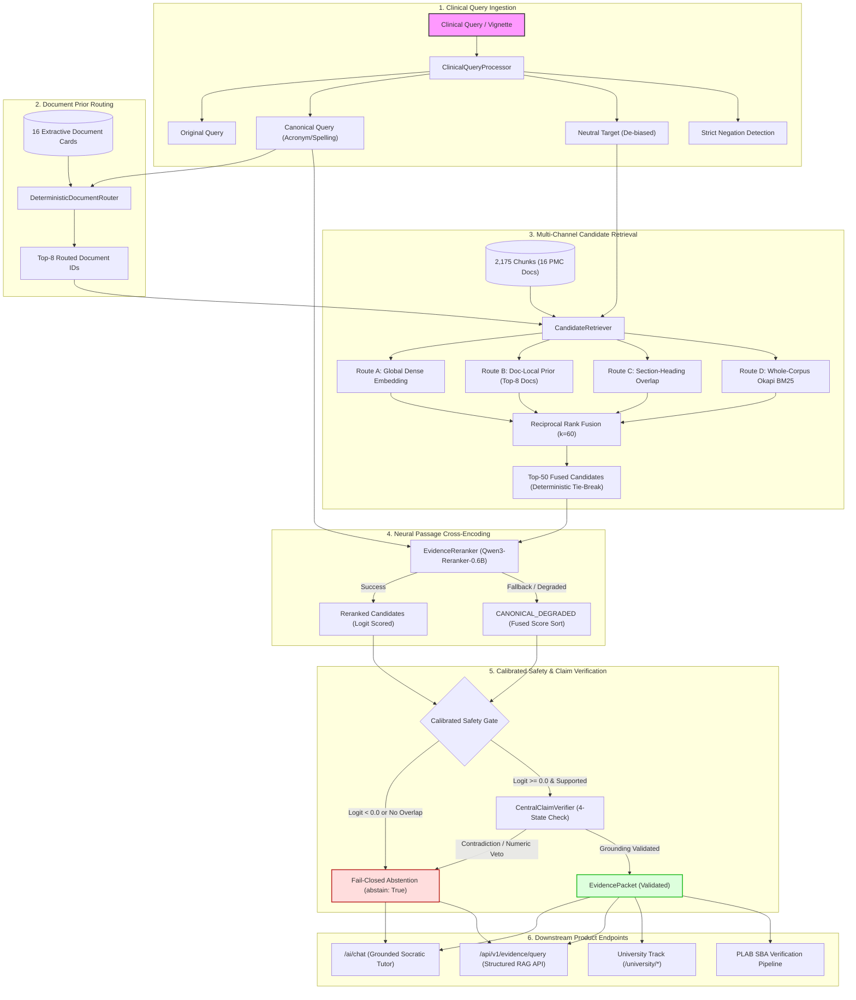

# MedicalPlab Canonical RAG / Evidence Engine Architecture
**Canonical Engine Identifier:** `MEDICALPLAB_EVIDENCE_ENGINE_V1`  
**Status:** Canonical Production Standard  
**Corpus Scope:** 16-Document Public-Safe PMC Open-Access Corpus (`DOC-PMC-RENAL-0001` through `DOC-PMC-RENAL-0016`)  
**Corpus Footprint:** 2,175 chunks (`B_400_10pct_overlap`) / 2,192 chunks (`C_section_aware`)  

---

## 1. Executive Summary & Architectural Invariants

`MEDICALPLAB_EVIDENCE_ENGINE_V1` represents the unified, single-canonical retrieval, reranking, and verification engine powering MedicalPlab's AI Tutor, University examination reasoning, and PLAB SBA evidence verification.

### Core Architectural Invariants
1. **Deterministic Public Corpus:** Zero runtime dependency on legacy private directories (`renal_v2`). The runtime dynamically and deterministically resolves the reproducible 16-document PMC open-access corpus.
2. **Corpus Comparability Firewall:** `HISTORICAL_BASELINE = REFERENCE_ONLY`. Historical 23-document metrics are recorded for reference only and never conflated with the 16-document public-safe corpus.
3. **Multi-Channel Hybrid Fusion:** Candidate retrieval combines global dense embeddings, document-local routing priors, section-heading overlap, and whole-corpus Okapi BM25 through Reciprocal Rank Fusion (RRF, $k=60$) with lexicographic tie-breaking.
4. **End-Metric Neural Cross-Encoding:** Production reranking is driven by `Qwen/Qwen3-Reranker-0.6B`, providing sub-2.5s CPU latency while achieving superior ranking precision over bi-encoder scoring. `Qwen3-Reranker-4B` is formally documented as discarded for production due to prohibitive latency (p50: 21.2s, p95: 120.4s).
5. **Calibrated Fail-Closed Abstention:** Clinical safety prohibits ungrounded medical advice. If retrieved evidence has low confidence, contradiction, or high-risk numerical discrepancies, the engine emits `abstain: True` with structured reasons (`LOW_RETRIEVAL_CONFIDENCE`, `CLAIM_CONTRADICTED_BY_EVIDENCE`, `HIGH_RISK_CLAIM_UNSUPPORTED`).
6. **Elimination of Hard-Coded Fallbacks:** The legacy mock fallback in `/ai/chat` (which previously returned static STEMI citations or generic advice) has been completely replaced by real `EvidencePacket` generation.

---

## 2. End-to-End Pipeline Architecture



---

## 3. Component Details & Design Rationale

### 3.1. Clinical Query Representation (`ClinicalQueryProcessor`)
Transforms clinical vignettes into three explicit representations:
- **`original_query`**: Verbatim clinical question.
- **`canonical_query`**: Normalizes British vs American spelling (`hypokalaemia` $\to$ `hypokalemia`), expands acronyms (`RAAS` $\to$ `renin-angiotensin-aldosterone system`), and identifies clinical comparators ($\ge, \le$).
- **`neutral_target`**: Removes vignette formulaic fluff (*"A 45-year-old male presents with..."*) to prevent answer leakage while preserving numbers, units, and polarity.
- **`has_negation`**: Detects clinical negation markers (`not`, `no`, `neither`, `nor`, `without`, `absence of`, `contraindicated`).

### 3.2. Deterministic Document Router (`DeterministicDocumentRouter`)
Scores 16 deterministic, extractive document cards built from PMC open-access papers:
- Each card incorporates the document title, authority authors, DOI, license (`CC BY`), section headings, and abstract snippet.
- No generative hallucinations: cards are strictly extractive.
- Outputs the top-8 routed documents to supply priors to downstream channels.

### 3.3. Multi-Channel Retrieval & Reciprocal Rank Fusion (`CandidateRetriever`)
Candidate retrieval combines diverse signals across four routes:
- **Route A (Global Dense):** Cosine similarity against chunk embeddings.
- **Route B (Doc-Local Prior):** Extracts top chunks filtered by the top-8 routed documents ($w=1.5$).
- **Route C (Section-Local):** Matches heading and section hierarchy tokens with query concepts ($w=1.0$).
- **Route D (Corpus Okapi BM25):** Full-vocabulary BM25 scoring across all 2,175 chunks ($w=1.2$, $k_1=1.5, b=0.75$).
- **RRF Equation:**
  $$\text{RRF Score}(c) = \sum_{r \in \{A, B, C, D\}} \frac{w_r}{60 + \text{rank}_r(c)}$$
- **Tie-Breaking:** Deterministic tie-breaking on `(fused_score, chunk_id)` ensures zero non-deterministic rank oscillation.

### 3.4. Neural Passage Cross-Encoder (`EvidenceReranker`)
- **Model:** `Qwen/Qwen3-Reranker-0.6B` (`e61197ed45024b0ed8a2d74b80b4d909f1255473`).
- **Input Representation:**
  ```text
  Instruct: Determine whether the evidence passage directly supports the exact medical proposition requested in the query. Topical relevance without direct claim support is non-support.
  Query: {canonical_query}
  Title: {doc_title}
  Section Path: {section_path}
  Heading: {heading}
  Evidence: {passage_text}
  ```
- **Operational Feasibility:** Evaluates 25 candidate passages in ~2.3 seconds on CPU.
- **Degraded Fallback:** If deep neural models fail or are omitted, the engine enters `CANONICAL_DEGRADED` mode, preserving multi-channel fused ranking without crashing.

### 3.5. Central Claim Verifier (`CentralClaimVerifier`)
Applies four-state grounding (`SUPPORTED`, `PARTIALLY_SUPPORTED`, `CONTRADICTED`, `NOT_SUPPORTED`) with deterministic safety vetoes:
- **Polarity Contradiction Veto:** Rejects claims whose affirmative/negative polarity clashes with evidence.
- **Numeric Discrepancy Veto:** Rejects claims containing conflicting dosages, lab values, or percentages.
- **High-Risk Guard:** Claims involving dosages, administration routes, or acute contraindications fail closed unless strongly verified.

---

## 4. Product Integration & API Contracts

### 4.1. Socratic AI Chat (`POST /ai/chat`)
- **Supported Clinical Query:** Invokes `CanonicalEvidenceEngine`, returns real citations with chunk provenance, and provides clinical explanation grounded in the top passage.
- **Safety Interception:** Detects life-threatening emergencies (e.g., ACE inhibitors in pregnancy, nitrates in RV infarction) and immediately responds with clinical interception warnings.
- **Unsupported Query:** Returns fail-closed response (`abstain: True`, `abstain_reason: LOW_RETRIEVAL_CONFIDENCE`), eliminating fabricated advice.

### 4.2. Direct Evidence API (`POST /api/v1/evidence/query`)
Allows direct querying of the canonical evidence engine:
```json
{
  "query": "What causes hypokalemia in Bartter syndrome?",
  "top_candidates": 50,
  "rerank_top_k": 25,
  "mode": "TUTOR"
}
```
Returns complete serialized `EvidencePacket` with routed document IDs, candidate ranks, and claim verification results.

---

## 5. Mode Policy Separation

| Mode | Target User | Rerank Depth | Verification Rigor | Policy Invariant |
| :--- | :--- | :---: | :---: | :--- |
| **`TUTOR`** | Medical Student / Clinician | Top 25 | Standard 4-State | Provides grounded explanation with citations; abstains on low confidence. |
| **`UNI`** | Undergraduate University Track | Top 25 | Educational Prior | Isolated to undergraduate curriculum; cannot mutate or approve PLAB items. |
| **`PLAB`** | GMC PLAB Exam Verification | Top 25 | Strict Clinician Gate | Fail-closed quarantine; requires clinician review sign-off before item release. |
