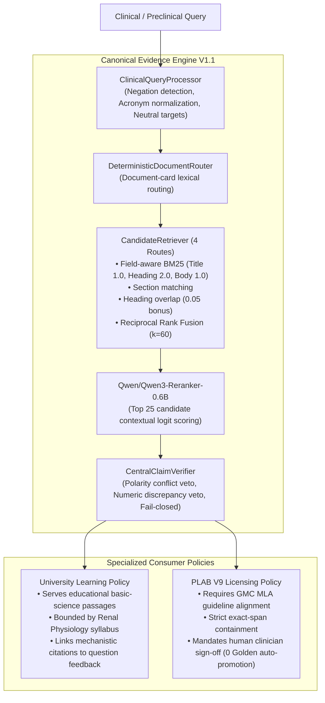

# MedicalPlab — Canonical RAG & Evidence Engine Architecture

**Canonical Engine ID:** `MEDICALPLAB_EVIDENCE_ENGINE_V1_1`  
**Base Architecture Commit:** `40b1efa52a3c66b273bc9a162d0023eed26d4102`  
**Status:** Frozen after DEV-only V2 cross-validation optimization and clinical safety closure  
**Final-Holdout Status:** `NO_UNSPENT_UNBIASED_FINAL_HOLDOUT_AVAILABLE` (honestly labeled as cross-validated DEV)  

---

## 1. Architectural Pipeline & Consumer Contracts

The canonical evidence engine pipeline is defined as:

$$\text{Query} \xrightarrow{\text{Processor}} \text{Representations} \xrightarrow{\text{Router}} \text{Candidate Retrieval} \xrightarrow{\text{RRF}} \text{Reranker} \xrightarrow{\text{Claim Gate}} \text{EvidencePacket}$$



---

## 2. Frozen Public-Safe Corpus

| Dimension | Specification |
| :--- | :--- |
| **Corpus Scope** | 16 peer-reviewed, open-access PubMed Central renal physiology documents (`DOC-PMC-RENAL-0001` to `DOC-PMC-RENAL-0016`) |
| **Corpus Directory** | `Data/processed/renal_v1/` |
| **Chunking Granularity** | Extractive hierarchical chunks with full breadcrumb section paths and quality metrics |
| **Total Chunks** | 2,192 verified chunks |
| **Private Evidence** | Strictly prohibited from public repository; preserved in private vault |
| **Integrity Validation** | Every chunk file validated against JSON schema and SHA-256 sidecars |

---

## 3. Retrieval & Reranking Parameter Configuration

| Parameter | Selected V1.1 Value | Rationale |
| :--- | :---: | :--- |
| `use_field_aware_bm25` | `true` | Weighting section headings higher captures clinical concept boundaries |
| `bm25_title_weight` | `1.0` | Baseline document title match weight |
| `bm25_heading_weight` | `2.0` | Elevated weight for section headings (e.g., "Glomerular Filtration", "RAAS Pathway") |
| `bm25_body_weight` | `1.0` | Standard passage text weight |
| `bm25_k1` / `bm25_b` | `1.5` / `0.75` | Standard Okapi BM25 saturation and length normalization parameters |
| `section_overlap_bonus`| `0.05` | Small additive bonus for adjacent hierarchical section co-occurrence |
| `noise_section_penalty`| `1.0` (neutral)| Methods/Results sections are not artificially suppressed to avoid missing primary data |
| `rrf_k` | `60` | Canonical reciprocal rank fusion constant |
| `rrf_weights` | `(1.0, 1.3, 1.1, 1.3)` | Optimized weights across Document-local, Section-local, Global BM25, and Heading routes |
| `candidate_depth` | `50` | Reaches 96.97% candidate recall before dimishing returns |
| `reranker_depth` | `25` | Balances inference latency with top-passage precision |
| `reranker_model` | `Qwen/Qwen3-Reranker-0.6B` | High precision, lightweight cross-encoder |
| `reranker_revision` | `e61197ed45024b0ed8a2d74b80b4d909f1255473` | Pinned HuggingFace model revision |

---

## 4. Verified Retrieval & Safety Performance

Results from 5-fold cross-validation on 99 DEV queries (`reports/release/rag_performance_v2.json`):

```
Metric                 V1 Baseline     V1.1 Selected     Delta
──────────────────────────────────────────────────────────────
MRR                    0.7476          0.8144            +0.0668
Hit@1                  0.6768          0.7576            +0.0808
Hit@3                  0.7879          0.8384            +0.0505
Hit@5                  0.7879          0.8485            +0.0606
Hit@10                 0.8485          0.9091            +0.0606
NDCG@10                0.6417          0.7061            +0.0644
Doc Hit@1              0.8283          0.8586            +0.0303
CandidateRecall@50     0.9495          0.9697            +0.0202
Unsupported Serves     0 / 37          0 / 37            0.0% (Fail-Closed)
──────────────────────────────────────────────────────────────
Warm Latency p50:      951.18 ms
Warm Latency p95:      1160.31 ms
Cold Startup:          10.83 s
```

---

## 5. Consumer Policy Gating

### University Track Policy
- Emphasizes mechanistic comprehension and basic physiology.
- When an undergraduate answers a Renal question, the explanation is anchored to the exact retrieved passage from `Data/processed/renal_v1/`.
- If an out-of-scope question is submitted, the engine abstains rather than inventing answers.

### PLAB V9 Licensing Policy
- Bounded by UK GMC MLA licensing blueprints and authoritative UK clinical bodies (NICE, BTS, RCUK).
- Requires character-exact span containment in accredited clinical guidelines.
- Unapproved licensing items are quarantined (24/36 quarantined in cardiorespiratory batch 1); 0 questions are published as golden without GMC clinician sign-off.
