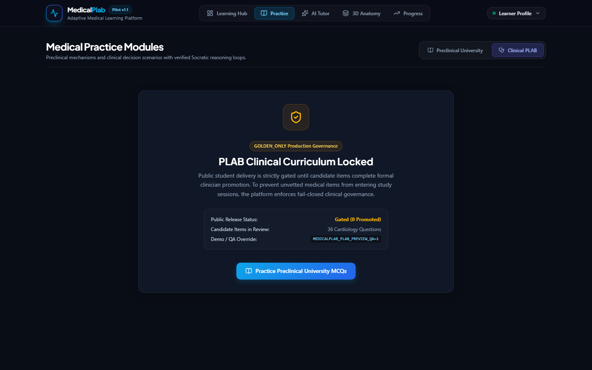

# MedicalPlab — Certified Product Showcase Gallery
**High-Fidelity Visual Documentation of the End-to-End Learner Journey**

All screenshots in this directory were captured directly from real browser execution (Google Chrome via Chrome DevTools Protocol) connecting to the authoritative FastAPI backend (`production_main:app`) and Next.js 16 production server.

---

### 1. Home / Learning Hub

*Figure 1: Premium clinical learning hub featuring ambient particle motion, dynamic Cognitive Loop animation, runtime truth badges, and strictly separated Future Intelligence roadmap.*

---

### 2. Preclinical University Practice

*Figure 2: Interactive renal physiology item (`UNI-RENAL-001`). Option B distractor selected, triggering immediate mechanistic distractor analysis without pre-submission leakage.*

---

### 3. Socratic Remediation

*Figure 3: Multi-turn bounded Socratic dialogue (`PROBE` → `GUIDE` → `CONSOLIDATE`). The AI guides the learner to identify the upstream substrate without answering for them.*

---

### 4. Held-Out Transfer Assessment

*Figure 4: Independent held-out transfer problem (`UNI-RENAL-001-T`) evaluating whether the learner can apply the remediated concept to a novel clinical scenario. Deterministically backend-scored.*

---

### 5. Evidence-Grounded AI Tutor

*Figure 5: Conversational AI Tutor grounded in peer-reviewed PubMed Central literature. Expandable drawer displays exact chunk IDs, verbatim quotes, and CC-BY license metadata.*

---

### 6. Tutor Safe Fallback (Fail-Closed Safety)

*Figure 6: Demonstration of fail-closed clinical safety. When an ungrounded or out-of-scope query is submitted, the tutor transitions to SAFE_FALLBACK with zero hallucinated clinical claims.*

---

### 7. Guided 3D Spatial Anatomy

*Figure 7: Interactive 3D renal vasculature using scientifically validated HuBMAP Human Reference Atlas (HRA) models. Guided target (`renal_vein_left`) highlighted with anatomical context.*

---

### 8. Deterministic 3D Anatomy Challenge

*Figure 8: Independent spatial anatomy challenge. Learner identifies the Left Renal Artery (`renal_artery_left`), verified deterministically via backend evaluation (`POST /api/v1/anatomy/session/{session_id}/challenge`).*

---

### 9. Unified Learner Progress

*Figure 9: Comprehensive longitudinal progress dashboard integrating preclinical University attempts, adaptive mastery state, 3D anatomy challenges, and governed PLAB status.*

---

### 10. PLAB Candidate Bank (Preview QA)

*Figure 10: PLAB candidate item bank with explicit Preview QA governance banner. All 36 candidate questions require clinician panel promotion before Golden production release.*

---

### 11. Strict PLAB Production State (Golden-Only Fail-Closed)

*Figure 11: Production fail-closed state (`MEDICALPLAB_PLAB_PREVIEW_QA=0`). Renders an informative empty state with 0 released questions until expert clinician panel promotion occurs.*
