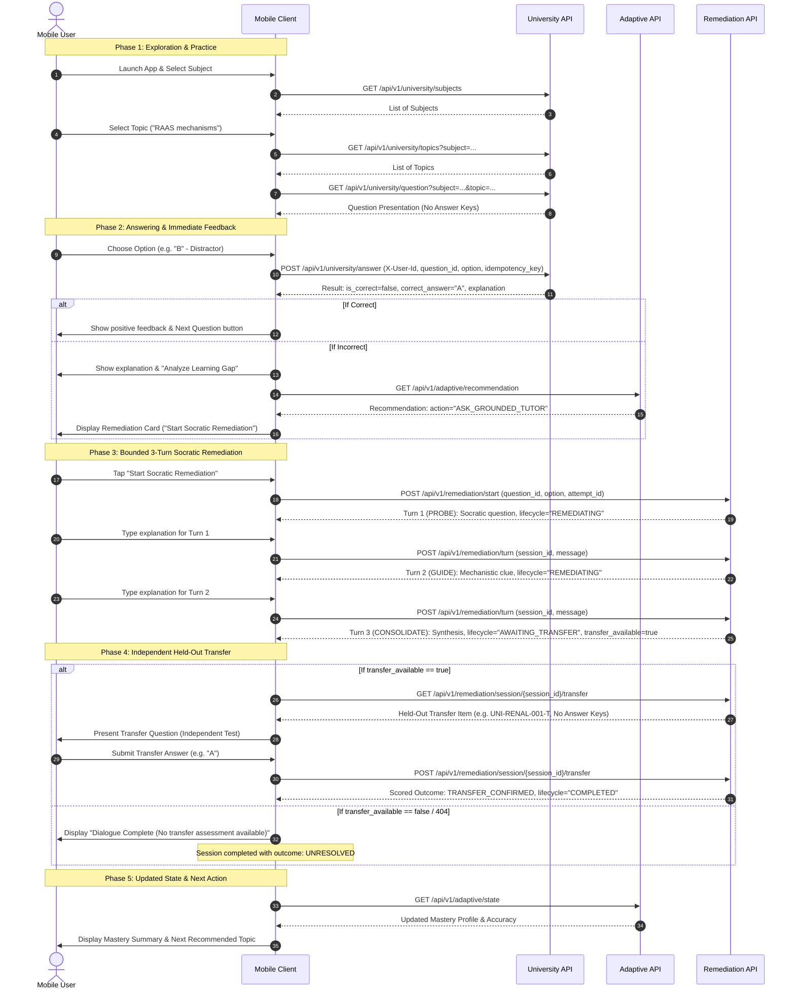

# MedicalPlab Mobile Learning Flow & State Machine

This guide defines the authoritative end-to-end student learning journey, UI navigation logic, and state machine transitions for the MedicalPlab mobile app.

---

## 1. End-to-End Learning Flow Diagram



---

## 2. Core Educational Invariants for Mobile UI

Mobile developers must uphold two fundamental pedagogical principles enforced by the backend:

### 1. Conversation Completion $\ne$ Mastery
- A student completing all 3 turns of Socratic dialogue does **not** demonstrate mastery.
- Reaching Turn 3 merely transitions the session state to `AWAITING_TRANSFER`.
- The mobile UI **must not** display "Mastered!" or "Topic Solved!" at the end of Turn 3. It must clearly state: *"Dialogue complete. Confirm your understanding on an independent question."*

### 2. Qualified Independent Transfer is Mandatory
- Only correct, unassisted performance on a held-out transfer item produces `outcome: "TRANSFER_CONFIRMED"`.
- If the student requests assistance during transfer (`was_assisted: true`), the attempt is disqualified from `TRANSFER_CONFIRMED`.
- If no transfer item exists for the question (e.g. `UNI-RENAL-003`), the session concludes as `outcome: "UNRESOLVED"`, ensuring zero false mastery inflation.

---

## 3. Mobile UI State Machine

The client UI should track the following state transitions based on server responses:

| State | Trigger / Event | Available Mobile UI Actions | Next Backend Endpoint |
| :--- | :--- | :--- | :--- |
| `IDLE` | App launch | Browse subjects / select topic | `GET /api/v1/university/subjects` |
| `QUESTION_ACTIVE` | Question received | Select option A-E, tap Submit | `POST /api/v1/university/answer` |
| `FEEDBACK_INCORRECT` | Answer evaluated as false | Read explanation, View Adaptive Recommendation | `GET /api/v1/adaptive/recommendation` |
| `REMEDIATION_TURN_1` | Remediation started | Read Probe, input message, tap "Send Turn 1" | `POST /api/v1/remediation/turn` |
| `REMEDIATION_TURN_2` | Turn 1 answered | Read Clue, input message, tap "Send Turn 2" | `POST /api/v1/remediation/turn` |
| `REMEDIATION_TURN_3` | Turn 2 answered | Read Synthesis, transition to transfer | `GET /remediation/session/{id}/transfer` |
| `TRANSFER_ASSESSMENT` | Transfer item received | Answer independent item, tap "Submit Assessment" | `POST /remediation/session/{id}/transfer` |
| `SESSION_COMPLETED` | Transfer scored / abandoned | View outcome badge, return to topics | `GET /api/v1/adaptive/state` |
| `TERMINAL_FALLBACK` | Safety fallback triggered | Read safe message, return to topics | `GET /api/v1/university/topics` |

---

## 4. Authoritative Backend Responses

At every transition, the backend response is authoritative. The mobile app should update its local UI state directly from the response fields:

### A. Turn Progression Response (`RemediationTurnResponse`)
```typescript
interface RemediationTurnResponse {
  session_id: string;
  turn_number: 1 | 2 | 3;
  max_turns: 3;
  is_complete: boolean;
  lifecycle_state: "CREATED" | "REMEDIATING" | "AWAITING_TRANSFER" | "COMPLETED";
  outcome: "TRANSFER_CONFIRMED" | "TRANSFER_NOT_CONFIRMED" | "UNRESOLVED" | "ABANDONED" | "SAFETY_FALLBACK" | null;
  remediation_status: "PROBING" | "GUIDING" | "CONFIRMING" | "RESOLVED" | "UNRESOLVED";
  tutor_message: string;
  socratic_probe: string | null;
  citations: Array<{ source: string; excerpt: string }>;
  transfer_available: boolean;
  timeline: {
    guided_practice: string;
    transfer_result: string;
    status: string;
  };
}
```

### UI Navigation Rules from Response:
1. If `lifecycle_state === "REMEDIATING"`:
   - Render `tutor_message` and `socratic_probe`.
   - Render input text box for student's next turn.
   - Show progress indicator: `Turn ${turn_number} of 3`.
2. If `lifecycle_state === "AWAITING_TRANSFER"`:
   - Dialogue is finished.
   - If `transfer_available === true`: Present button **"Take Transfer Assessment"** which calls `GET /api/v1/remediation/session/{session_id}/transfer`.
   - If `transfer_available === false`: Display notice that transfer assessment is not available for this question, and offer **"Return to Topic"**.
3. If `lifecycle_state === "COMPLETED"`:
   - Hide all turn input fields and text boxes.
   - If `outcome === "SAFETY_FALLBACK"`: Show safety notification card (see below).
   - If `outcome === "TRANSFER_CONFIRMED"`: Show success badge ("Concept Transfer Verified!").
   - If `outcome === "TRANSFER_NOT_CONFIRMED"`: Show review recommendation ("Additional Practice Needed").
   - If `outcome === "ABANDONED"`: Show exit banner.

---

## 5. Alternative Terminal: SAFETY_FALLBACK

If the Evidence Engine detects groundedness issues, retrieval errors, or verifier vetoes:
1. Backend response has:
   - `lifecycle_state`: `"COMPLETED"`
   - `outcome`: `"SAFETY_FALLBACK"`
   - `transfer_available`: `false`
   - `tutor_message`: Canonical safe fallback message:
     > *"I couldn't verify enough evidence to give a fully grounded explanation right now. Let's work through this together using what you already know."*
2. **Mobile Requirement:**
   - **Do NOT** show the transfer assessment button.
   - **Do NOT** allow the student to type further turns.
   - Display a fallback banner with options: *"Return to Topics"* or *"Try Another Question"*.

---

## 6. Student Exit / Abandonment Flow

If the student chooses to exit remediation early (e.g. taps "Exit Remediation" or back button):
1. Send `POST /api/v1/remediation/session/{session_id}/abandon`.
2. The server transitions the session immediately to:
   - `lifecycle_state`: `"COMPLETED"`
   - `outcome`: `"ABANDONED"`
   - `is_complete`: `true`
3. Clear active remediation session state from local mobile view and navigate to topic list.
