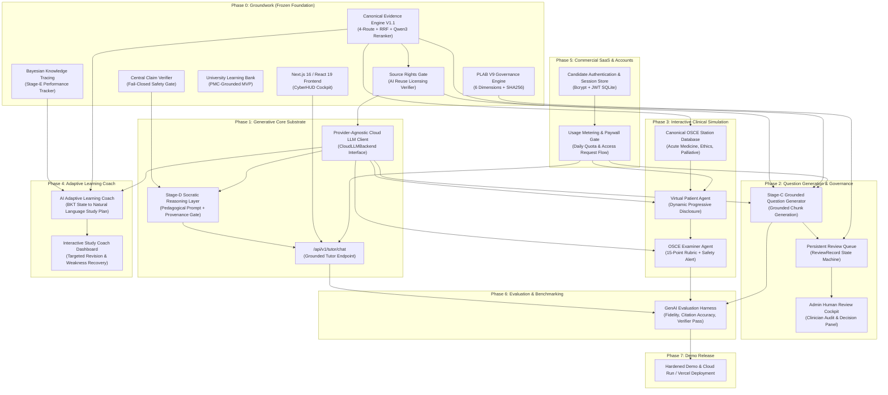
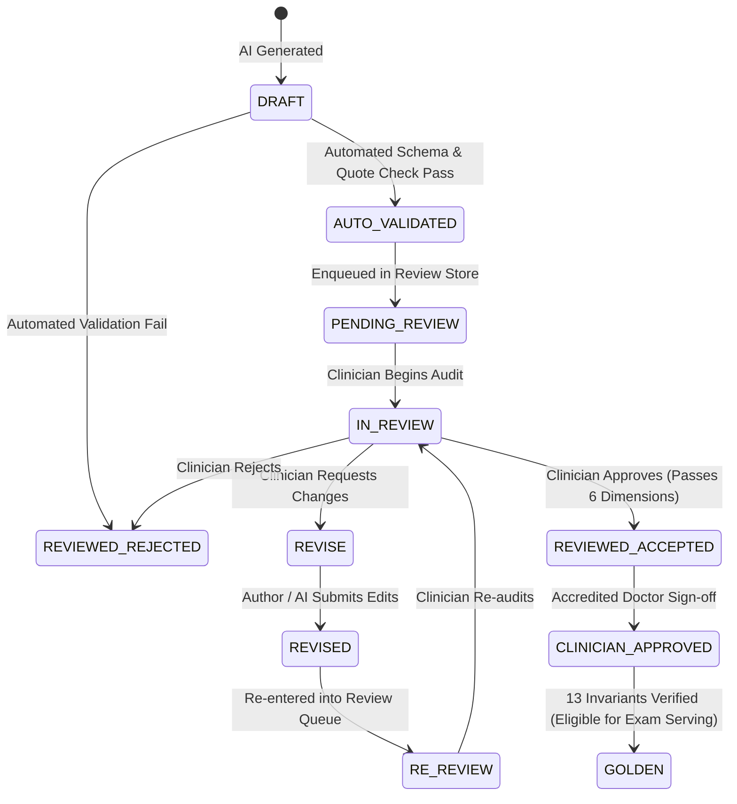
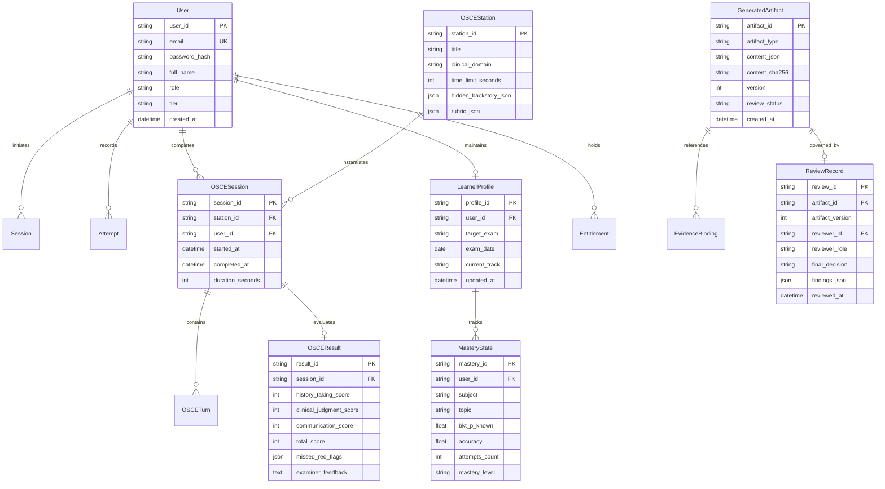

# MEDICALPLAB — PRODUCT EVOLUTION MASTER PLAN (PHASE 0 AUDIT)
## Product Gap, Competitive Delta & Winning Architecture Audit

**Status**: PROPOSED / READ-ONLY AUDIT COMPLETE (CORRECTIONS APPLIED)
**Phase**: Phase 0 Gate
**Canonical Base Commit**: `f123132a6be1281a266bf45a29a0d06b5b097e4f`
**Current Working Branch**: `product-phase-0-audit-v1`
**Repository**: `AdhamElsayedAI/MedicalPlab`
**Frozen Release Tag**: `v1.0.0-hackathon` (`f0db2716222a6a0aef559658620e79dc617cb581`)
**Audit Date**: September 14, 2026
**Auditors**: Principal Generative AI Product Architect, Staff AI Engineer, Medical AI Safety Architect, Startup CTO, Developer Experience Reviewer, Evaluation Architect, Hackathon Technical Judge

---

## 1. Executive Product Assessment

### 1.1 What MedicalPlab Already Does Exceptionally Well

MedicalPlab possesses a verified engineering foundation in evidence retrieval, deterministic knowledge tracing, and clinical safety governance. Unlike hackathon projects that rely on thin API wrappers around generic AI system prompts, MedicalPlab is engineered with defense-in-depth principles:

1. **Evidence Substrate & Canonical Counts (Evidence Engine V1.1)**:
   - Operates a multi-stage retrieval architecture: query canonicalization and representation ([query_representation.py](file:///c:/Users/Adham%20Elsayed/Desktop/AdhamElsayedAI/MedicalPlab-product-phase0/src/medicalplab/evidence_engine/query_representation.py)), deterministic 16-card document routing ([document_router.py](file:///c:/Users/Adham%20Elsayed/Desktop/AdhamElsayedAI/MedicalPlab-product-phase0/src/medicalplab/evidence_engine/document_router.py)), 4-channel candidate retrieval (BM25F lexical, document-local dense, section-local dense, global dense) combined via weighted Reciprocal Rank Fusion (RRF) ([candidate_retriever.py](file:///c:/Users/Adham%20Elsayed/Desktop/AdhamElsayedAI/MedicalPlab-product-phase0/src/medicalplab/evidence_engine/candidate_retriever.py)), and cross-encoder proposition scoring with `Qwen3-Reranker-0.6B` ([reranker.py](file:///c:/Users/Adham%20Elsayed/Desktop/AdhamElsayedAI/MedicalPlab-product-phase0/src/medicalplab/evidence_engine/reranker.py)).
   - **Canonical Corpus Lineage**:
     - *Renal / University Corpus (`corpus_renal_snapshot_v1.json`)*: **16 open-access PMC documents**, **2,192 chunks**.
     - *Cardiorespiratory / PLAB Corpus (`corpus_cardiorespiratory_snapshot_v1.json`)*: **13 guideline documents**, **817 chunks**.
   - **Verified DEV Evaluation Protocol & Metrics**:
     - Evaluated via 5-fold cross-validation across the **99 answerable DEV queries** (48 from `renal-dev-v1` + 51 from `renal-dev-v2` with gold corpus support):
       - **MRR**: 0.8144
       - **Hit@1**: 0.7576
       - **Hit@3**: 0.8384
       - **Hit@5**: 0.8485
       - **Hit@10**: 0.9091
       - **CandidateRecall@50**: 0.9697
     - Safety evaluation on the **37 unsupported / source-gap DEV queries** (18 source-gap queries + 19 labeled unsupported queries):
       - **0 / 37 product-served unsupported DEV cases** due to fail-closed Central Claim Verification ([claim_verifier.py](file:///c:/Users/Adham%20Elsayed/Desktop/AdhamElsayedAI/MedicalPlab-product-phase0/src/medicalplab/evidence_engine/claim_verifier.py)).
   - **Scientific Limitation**: `NO_UNSPENT_UNBIASED_FINAL_HOLDOUT_AVAILABLE`. All historical heldout datasets were spent during iterative retrieval research. These metrics represent controlled cross-validated DEV benchmarks and must not be presented as an unspent final holdout benchmark.

2. **Medical Safety & Governance Invariants**:
   - Enforces the strict invariant: `SOFTWARE APPROVAL != CLINICIAN APPROVAL`.
   - The PLAB V9 governance engine ([governance.py](file:///c:/Users/Adham%20Elsayed/Desktop/AdhamElsayedAI/MedicalPlab-product-phase0/src/medicalplab/plab/governance.py)) mandates 6-dimensional review (`clinical_correctness`, `sba_unambiguity`, `uk_alignment`, `evidence_adequacy`, `distractor_quality`, `explanation_quality`), cryptographic SHA256 content hashing to prevent post-review tamper, immutable review records, and 13 automated golden promotion criteria.
   - 24 out of 36 items in the active cardiorespiratory batch are quarantined due to missing source citations or unresolved clinical checks.

3. **Curriculum-Grounded University Track**:
   - Implements preclinical renal physiology learning (Glomerular Filtration Barrier and Renin-Angiotensin-Aldosterone System mechanisms) grounded in open-access PMC literature ([service.py](file:///c:/Users/Adham%20Elsayed/Desktop/AdhamElsayedAI/MedicalPlab-product-phase0/src/medicalplab/university/service.py)).
   - Enforces zero answer-key leakage (answers and explanations are withheld until submission), idempotent attempt logging in SQLite, and Bayesian Knowledge Tracing (BKT) mastery estimation with weak-topic remediation.

4. **Frontend Architecture**:
   - Built with Next.js 16.3.4, React 19, TypeScript, and a bespoke CyberHUD / clinical cockpit styling ([frontend/src/app/page.tsx](file:///c:/Users/Adham%20Elsayed/Desktop/AdhamElsayedAI/MedicalPlab-product-phase0/frontend/src/app/page.tsx)).

---

### 1.2 What Currently Prevents It From Looking Like a Mature Generative AI Startup

Despite this verified substrate, the repository currently exhibits critical user-facing product gaps:

1. **Generative AI is Disconnected in the Product Serving Gateway**:
   - In [main.py](file:///c:/Users/Adham%20Elsayed/Desktop/AdhamElsayedAI/MedicalPlab-product-phase0/main.py#L132-L230), `/ai/chat` queries the Evidence Engine and returns the top retrieved passage verbatim as the explanation (`explanation = f"Grounded clinical evidence from {top_cand.doc_title or top_cand.document_id}...\n\n{top_cand.text.strip()}"`). There is **zero generative pedagogical dialogue**.
   - In [production_main.py](file:///c:/Users/Adham%20Elsayed/Desktop/AdhamElsayedAI/MedicalPlab-product-phase0/production_main.py) and [product_api.py](file:///c:/Users/Adham%20Elsayed/Desktop/AdhamElsayedAI/MedicalPlab-product-phase0/src/medicalplab/stage_g/product_api.py#L247-L255), `/api/v1/clinical/reason` returns `HTTP 503 CLINICAL_AI_NOT_CONFIGURED`.
   - The Stage-D Socratic reasoning layer ([pipeline.py](file:///c:/Users/Adham%20Elsayed/Desktop/AdhamElsayedAI/MedicalPlab-product-phase0/src/medicalplab/stage_d/pipeline.py)) was built against an in-memory `StubBackend` or local GPU Qwen model ([backend.py](file:///c:/Users/Adham%20Elsayed/Desktop/AdhamElsayedAI/MedicalPlab-product-phase0/src/medicalplab/stage_b/backend.py)), without a production cloud LLM client wired for deployed environments.

2. **Question Generation is Absent from the Live Product Flow**:
   - Stage-C ([stage_c/pipeline.py](file:///c:/Users/Adham%20Elsayed/Desktop/AdhamElsayedAI/MedicalPlab-product-phase0/src/medicalplab/stage_c/pipeline.py)) and PLAB Question Service ([plab/service.py](file:///c:/Users/Adham%20Elsayed/Desktop/AdhamElsayedAI/MedicalPlab-product-phase0/src/medicalplab/plab/service.py)) contain valid prompts and schemas, but there is no public endpoint in `product_api.py` (e.g., `/api/v1/plab/questions/generate`) and no UI in the frontend allowing an instructor or candidate to trigger on-demand question generation.

3. **PLAB 2 OSCE Interactive Simulator is Backend-Missing**:
   - The frontend contains a visual ABCDE protocol resuscitation simulator ([CaseSimulationRoom.tsx](file:///c:/Users/Adham%20Elsayed/Desktop/AdhamElsayedAI/MedicalPlab-product-phase0/frontend/src/components/CaseSimulationRoom.tsx)), but it is powered by static demo cases (`STEMI_PATIENT_CASE`). There is **no backend agent for conversational virtual patients** (with progressive disclosure of hidden history) and **no OSCE Examiner scoring agent** evaluating history taking, clinical judgment, communication, and patient safety.

4. **Missing Production Authentication & Usage Metering**:
   - Stage-G specifies multitenancy, RBAC, and subscription quotas ([models.py](file:///c:/Users/Adham%20Elsayed/Desktop/AdhamElsayedAI/MedicalPlab-product-phase0/src/medicalplab/stage_g/models.py), [security.py](file:///c:/Users/Adham%20Elsayed/Desktop/AdhamElsayedAI/MedicalPlab-product-phase0/src/medicalplab/stage_g/security.py)), but these live in memory or require headers (`X-User-Id`, `X-Tenant-Id`). There are no end-user JWT auth endpoints (`/auth/signup`, `/auth/login`), no persistent user profile database, and no paywall/upgrade mechanism in the UI.

---

## 2. Current Capability Matrix

The following table documents every capability in the MedicalPlab repository as verified from source code inspection:

| Capability Area | Exact File / Route / Module Path | Current Classification | Verified Technical Implementation Reality |
| :--- | :--- | :--- | :--- |
| **Evidence Engine V1.1 Retrieval** | `src/medicalplab/evidence_engine/` (`candidate_retriever.py`, `document_router.py`, `service.py`) | `EXISTS_WORKING` | 4-channel retrieval (BM25F, doc-local, section-local, global dense) + RRF across cardiorespiratory (817 chunks) and renal (2,192 chunks) corpora. |
| **Cross-Encoder Reranking** | `src/medicalplab/evidence_engine/reranker.py` | `EXISTS_WORKING` | `Qwen3-Reranker-0.6B` structured prompt cross-encoder with fallback to fused RRF score if model is not loaded. |
| **Central Claim Verifier** | `src/medicalplab/evidence_engine/claim_verifier.py` | `EXISTS_WORKING` | Deterministic veto & cross-encoder claim-proposition verifier. Returns `SUPPORTED`, `CONTRADICTED`, `UNSUPPORTED`. |
| **Fail-Closed Abstention** | `src/medicalplab/evidence_engine/service.py#L147-L205` | `EXISTS_WORKING` | Abstains on `INSUFFICIENT_RETRIEVAL_SUPPORT`, `INELIGIBLE_EVIDENCE_SOURCE`, `CLAIM_CONTRADICTED`, etc. 0 / 37 product-served unsupported DEV cases. |
| **University Question Serving** | `src/medicalplab/university/` (`api.py`, `service.py`), `Data/university/questions.json` | `EXISTS_WORKING` | 6 PMC-grounded renal questions. Validated zero answer-key leakage in `select()` DTO. |
| **University Attempt & BKT Tracking** | `src/medicalplab/university/service.py#L127-L170`, `Data/persistence/university.sqlite3` | `EXISTS_WORKING` | SQLite attempt storage with idempotency key, accuracy calculation, mastery level classification, weak-topic sorting. |
| **PLAB V9 Clinical Governance** | `src/medicalplab/plab/governance.py`, `pilot.py` | `EXISTS_WORKING` | 6 review dimensions, SHA256 question content hashing, 13 promotion invariants, tamper verification. |
| **PLAB Static Bank Serving** | `src/medicalplab/stage_g/product_api.py#L257-L278` | `EXISTS_WORKING` | Serves 36 governed items (12 source-grounded, 24 quarantined, 0 golden). Fail-closed without golden items unless preview QA flag is enabled. |
| **Anatomy Ontology & Agent** | `src/medicalplab/anatomy/` (`agent.py`, `ontology.py`, `validator.py`), `/api/v1/anatomy/*` | `EXISTS_WORKING` | Validates structured anatomical commands (focus, highlight, isolate) against MVP structures ontology. |
| **Production Cloud API Gateway** | `main.py`, `production_main.py` | `EXISTS_WORKING` | FastAPI with CORS, `/health`, `/ready`, latency headers, lifespan handlers for Cloud Run deployment. |
| **Socratic Generative Tutor Service** | `main.py#L132-L230` (`/ai/chat`), `src/medicalplab/stage_d/` | `EXISTS_PARTIAL` | `/ai/chat` returns raw retrieved passage without generative dialogue. Stage-D pipeline has prompts and validators but lacks a production cloud LLM provider adapter. |
| **Dynamic Question Generation** | `src/medicalplab/stage_c/pipeline.py`, `src/medicalplab/plab/service.py` | `EXISTS_PARTIAL` | Prompts, schemas, and validators exist in code; no public API endpoint (`/api/v1/plab/questions/generate`) and no trigger in UI. |
| **Clinical Reasoning Endpoint** | `src/medicalplab/stage_g/product_api.py#L247-L255` (`/api/v1/clinical/reason`) | `EXISTS_PARTIAL` | Defined as route but returns hardcoded HTTP 503 `CLINICAL_AI_NOT_CONFIGURED`. |
| **Interactive Case Simulation Room** | `frontend/src/components/CaseSimulationRoom.tsx` | `EXISTS_PARTIAL` | Frontend vitals and ABCDE actions, but driven by static JSON rather than an AI patient agent. |
| **Multitenancy & Quota Logic** | `src/medicalplab/stage_g/` (`security.py`, `models.py`, `database.py`) | `EXISTS_PARTIAL` | In-memory RBAC and quota contracts exist; not connected to live persistent auth or billing gateway. |
| **Next.js Frontend Client** | `frontend/` (`Next.js 16.3.4`, `React 19`, `TypeScript`) | `EXISTS_WORKING` | Frontend with Landing, University, PLAB, Anatomy, and Investor Pitch modes. |
| **Cloud LLM Provider Adapter** | `src/medicalplab/stage_b/backend.py` | `MISSING` | Only `StubBackend` and GPU `Qwen3-8B-AWQ` exist. Provider-agnostic cloud LLM client does not exist. |
| **PLAB 2 Virtual Patient Agent** | N/A | `MISSING` | No conversational agent roleplaying a patient with progressive disclosure of hidden history. |
| **OSCE Examiner Scoring Agent** | N/A | `MISSING` | No automated OSCE evaluation agent scoring History, Clinical Judgment, and Communication out of 15. |
| **End-User Authentication (JWT/Bcrypt)** | N/A | `MISSING` | No `/auth/signup`, `/auth/login`, password hashing, or token verification in product API. |
| **Candidate Quota & Paywall UI** | N/A | `MISSING` | No candidate-facing quota display or paywall/upgrade request modal in the Next.js frontend. |
| **Admin Question Review UI** | `frontend/src/components/InstitutionAdminView.tsx` | `EXISTS_PARTIAL` | Institutional dashboard exists for metrics; lacks question review queue interface for accepting/rejecting drafts. |
| **Renal Retrieval V1-V7 Benchmarks** | `reports/renal_v*`, `tests/test_renal_*.py` | `EXISTS_BUT_FROZEN` | Historical scientific retrieval milestones. Frozen; must not be reopened or modified. |
| **Release v1.0.0-hackathon Tag** | Git tag `v1.0.0-hackathon` | `EXISTS_BUT_FROZEN` | Frozen historical release baseline at commit `f0db2716222a6a0aef559658620e79dc617cb581`. |
| **Real Payment Gateway Integration** | N/A | `NOT_APPLICABLE` | Real Stripe/card processing is non-essential for hackathon judging and presents operational/security overhead. |

---

## 3. Competitive Delta Matrix

A detailed architectural comparison between our current implementation and the public reference implementation (`nourhanneadel/MedicalPlab`) was performed via live read-only inspection of its codebase, schemas, and route specifications:

| Dimension / Capability | Our Current State (`AdhamElsayedAI/MedicalPlab`) | Reference State (`nourhanneadel/MedicalPlab`) | Our Technical Advantage | Our Product Gap | Should Adopt Concept? | Priority |
| :--- | :--- | :--- | :--- | :--- | :--- | :--- |
| **Frontend Architecture** | Next.js 16.3.4, React 19, TypeScript, Tailwind, bespoke CyberHUD UI. | Streamlit Python script (`streamlit_app.py`). | Superior web UX, component modularity, production scalability, and mobile readiness. | Some Next.js components rely on mock `demo-data.ts`. | No (Retain Next.js; wire to backend). | `HIGH` |
| **RAG & Evidence Retrieval** | 4-channel retrieval (BM25F + doc-local + section-local + dense) + RRF + `Qwen3-Reranker-0.6B` cross-encoder across cardiorespiratory (817 chunks) and renal (2,192 chunks) corpora. | Hybrid retrieval (BM25 + `BAAI/bge-small-en-v1.5` dense + RRF) across 88 chunks. | Defensible retrieval precision (MRR: 0.8144, Hit@1: 0.7576), 16 document cards, cross-encoder reranking. | Our production `/ai/chat` endpoint does not synthesize responses using an LLM. | Adopt their topic-level query filtering concepts. | `HIGH` |
| **Safety & Abstention** | `CentralClaimVerifier` with proposition-level veto, cross-encoder scoring, and fail-closed abstention (0 / 37 unsupported DEV cases served). | Prompt-based system instructions (`SOURCE-RELEVANCE RULE`) with keyword fallback. | Deterministic claim verification and fail-closed safety gate. **0 / 37 product-served unsupported DEV cases in controlled safety evaluation**. | We lack dynamic Socratic dialogue when evidence IS supported. | Adopt structured Socratic dialogue layered OVER our verifier. | `P1` |
| **Socratic Tutor** | Returns raw retrieved evidence passage. Stage-D Socratic pipeline built for GPU Qwen or Stub. | Multi-turn Socratic consultant calling Gemini 1.5 Flash / GPT-4o-mini via direct REST; generates distractor breakdown matrix. | We have citation quote-matching and clinical safety regex validation ([stage_d/validator.py](file:///c:/Users/Adham%20Elsayed/Desktop/AdhamElsayedAI/MedicalPlab-product-phase0/src/medicalplab/stage_d/validator.py)). | Competitor has live generative interaction in their candidate portal. | **YES (Adopt cloud LLM Socratic generation).** | `P1` |
| **Question Generation** | Stage-C and `PLABQuestionService` exist in code; no public API endpoint; relies on local Qwen or Stub. | Live on-demand generator (`/generate-question`) calling Gemini REST over NICE chunks; writes to SQLite `generated_questions`. | We enforce 5-choice SBA formatting, learning objectives, and strict citation quote validation. | Competitor has an active API route and UI trigger for on-demand generation. | **YES (Expose on-demand generation API & UI).** | `P2` |
| **Clinical Review Queue** | PLAB V9 governance with 6 review dimensions, SHA256 question hashing, 13 promotion invariants, tamper detection. | Simple SQLite table with `review_status` (`pending_review`, `approved`, `rejected`), admin endpoints, and UI review panel. | Far superior clinical rigor, multi-dimensional auditing, and golden promotion safety. | Competitor has an interactive review UI where doctors can click Approve/Reject in real time. | **YES (Connect our governance engine to an Admin Review UI).** | `P2` |
| **OSCE Simulation** | Static emergency resuscitation UI (`CaseSimulationRoom.tsx`) with vitals canvas and ABCDE actions. | Multi-turn Virtual Patient agent (5 stations in `stations.json`) + OSCE Examiner agent scoring /15 across 3 domains. | We have a visual bedside cockpit (ECG monitor, vitals, resuscitation log). | Competitor provides true conversational roleplay with progressive disclosure and automated rubric grading. | **YES (Adopt conversational Patient + OSCE Examiner agents).** | `P3` |
| **User Authentication & Quotas** | Stage-G RBAC and in-memory quota contracts; relies on `X-User-Id` header. | Persistent SQLite authentication (bcrypt + JWT bearer tokens) with user table, daily LLM limits, and 30-question free quota. | We have multi-tenant organization boundaries and enterprise role permissions. | Competitor has candidate self-registration, login, session tokens, and access upgrade workflows. | **YES (Implement SQLite JWT auth + candidate quota modal).** | `P5` |
| **BKT & Learning Science** | Deterministic Bayesian Knowledge Tracing, mastery levels, prerequisite graph, and weak-topic remediation. | Simple question counter (`increment_questions_answered`) and distinct question access tracker. | Defensible learning science and mastery analytics. | None (our learning science is far ahead). | Retain our BKT; expose to candidate dashboard. | `P4` |

---

## 4. Gap Matrix

| Product Gap ID | Missing / Partial Capability | Current Technical Reality | User / Evaluator Impact | Strategic Remedy |
| :--- | :--- | :--- | :--- | :--- |
| **GAP-01** | Live Generative Socratic Tutor | `/ai/chat` returns raw retrieved passage; `/clinical/reason` is HTTP 503. | Candidate receives static guideline text instead of a personalized Socratic dialogue explaining *why* an option is wrong. | Build provider-agnostic `CloudLLMBackend` and wire `StageDPipeline` with post-generation claim verification. |
| **GAP-02** | Dynamic Question Generation & Review Queue | Stage-C code is unwired to `product_api.py`; no generation UI. | Candidate cannot generate fresh mock exams on specific weak topics; review queue is not visually demonstrable. | Expose `/api/v1/plab/questions/generate`, store drafts in `ReviewRecord` store, build Admin Review Panel in frontend. |
| **GAP-03** | Interactive PLAB 2 OSCE Simulation | `CaseSimulationRoom.tsx` is static demo UI; no conversational patient or examiner. | Licensing candidates cannot practice clinical communication, history taking, or receive objective rubric grading. | Implement `VirtualPatientAgent` (progressive disclosure) and `OSCEExaminerAgent` (scoring /15 with red-flag detection). |
| **GAP-04** | Adaptive Learning Coach Integration | Stage-E BKT exists in Python, but candidate mastery is not presented as an actionable AI study plan. | Candidate sees raw analytics or recommendations without a conversational coach guiding next study steps. | Implement an `AdaptiveCoachService` that translates BKT mastery and learning gaps into an evidence-grounded revision plan. |
| **GAP-05** | Candidate Accounts & Server-Side Metering | Auth relies on request headers; no JWT signup/login; no paywall UI. | Product feels like a research tool rather than a SaaS platform with user identity and monetization gating. | Implement SQLite-backed JWT auth (`/api/v1/auth/*`), candidate quota enforcement, and an Access Upgrade modal. |
| **GAP-06** | Consolidated Generative Evaluation Benchmark | RAG DEV metrics are verified, but there are no measured metrics for tutor fidelity, question validity, or OSCE scoring. | Evaluators and medical advisors cannot inspect quantitative GenAI safety benchmarks. | Implement evaluation harness measuring evidence support rate, citation validity, and verifier pass rate. |

---

## 5. Weighted Feature Priority Matrix (100-Point Scoring Model)

Scoring Dimensions:
- **User Value (UV)**: 20 pts
- **GenAI Differentiation (GD)**: 20 pts
- **Mentor / Judge Demo Impact (JI)**: 20 pts
- **Technical Defensibility (TD)**: 15 pts
- **Implementation Feasibility (IF)**: 15 pts
- **Safety / Governance Fit (SG)**: 10 pts
- **Total**: 100 pts

| Feature / Capability | UV (20) | GD (20) | JI (20) | TD (15) | IF (15) | SG (10) | Total (100) | Dependencies | Critical Risk | Rec. Phase |
| :--- | :---: | :---: | :---: | :---: | :---: | :---: | :---: | :--- | :--- | :---: |
| **Evidence-Grounded Generative Tutor** | 19 | 19 | 19 | 14 | 14 | 10 | **95** | Evidence Engine V1.1, Cloud LLM Adapter, Source Rights Gate | LLM generating ungrounded advice | **Phase 1** |
| **Grounded Question Gen & Admin Review** | 18 | 18 | 18 | 14 | 13 | 10 | **91** | Evidence Engine, Stage-C, Governance V9 | Software auto-approving unreviewed medical questions | **Phase 2** |
| **PLAB 2 OSCE Patient & Examiner** | 19 | 20 | 20 | 12 | 11 | 8 | **90** | Cloud LLM Adapter, Validated Station Rubrics | Patient breaking character or hallucinating vitals | **Phase 3** |
| **Adaptive AI Learning Coach** | 16 | 15 | 16 | 14 | 14 | 10 | **85** | Stage-E BKT, University Service | Recommending topics with zero available evidence | **Phase 4** |
| **Accounts, Personalization & Quotas** | 15 | 8 | 14 | 11 | 14 | 9 | **71** | Stage-G SQLite Repository | Complex auth bugs distracting from core GenAI | **Phase 5** |
| **Evaluation & Benchmark Consolidation** | 14 | 14 | 17 | 15 | 13 | 10 | **83** | Phases 1–4 AI Services | Metric leakage or testing on unheldout samples | **Phase 6** |
| **Demo Hardening & Release Packaging** | 16 | 12 | 19 | 12 | 14 | 10 | **83** | All Phases | Live API latency spikes during evaluation | **Phase 7** |

---

## 6. System Dependency Graph



---

## 7. Final Generative AI Architecture

The cornerstone of MedicalPlab's architecture is **One Shared Evidence Substrate**. Every generative service (Tutor, Question Generator, OSCE Simulator, and Learning Coach) must consume common evidence primitives:

```
                              Learner / Candidate
                                       │
                                       ▼
                        Product Experience (Next.js 16)
         ┌─────────────────────────────┼─────────────────────────────┐
         ▼                             ▼                             ▼
University Studio             PLAB 1 Smart Exam             PLAB 2 OSCE Clinic
         │                             │                             │
         └─────────────────────────────┼─────────────────────────────┘
                                       ▼
                             Learner State & Context
                     (BKT Mastery, Attempt History, Tier)
                                       │
                                       ▼
                             Evidence Orchestrator
                                       │
                                       ▼
                      Canonical Evidence Engine V1.1
               ┌───────────────────────┴───────────────────────┐
               ▼                                               ▼
     Sufficient Support                              Insufficient Support
(Top passage + Channel agreement)                              │
               │                                               ▼
               ▼                                      Fail-Closed Abstention
    Verified EvidencePacket                          (Documented Safe Refusal)
               │
               ▼
       Source Rights Gate
 (Verify Machine-Readable AI License)
 ┌─────────────┴─────────────┐
 ▼                           ▼
AI_REUSE_ALLOWED        NON_ALLOWED / UNKNOWN
 │                           │
 │                           ▼
 │                 Fail-Closed Rights Refusal
 ▼
Provider-Agnostic Cloud LLM Backend
(CloudLLMBackend: Gemini / OpenAI / Fallback)
 ┌─────────────┬─────────────┬─────────────┬─────────────┐
 ▼             ▼             ▼             ▼             ▼
Socratic     Question      Virtual        OSCE       Adaptive
 Tutor      Generator      Patient      Examiner       Coach
 └─────────────┴─────────────┴─────────────┴─────────────┘
                               │
                               ▼
                 Post-Generation Verification Gate
         ┌─────────────────────┴─────────────────────┐
         ▼                                           ▼
  Passed Provenance                            Contradicted /
& Safety Checks                               Unsupported
         │                                           │
         ▼                                           ▼
   Serve Candidate                          Fail-Closed Abstention /
                                            Route to Review Queue
```

### Architectural Principles:
1. **Evidence Precedes Generation**: No LLM prompt is executed without an active, verified `EvidencePacket`.
2. **Source Rights Gate Precedes Ingestion into Generative Prompt**: Chunks may enter an LLM prompt only if their machine-readable license status is explicitly `AI_REUSE_ALLOWED`.
3. **Provider-Agnostic Generative Layer**: Defined by a clean Python interface (`CloudLLMBackend`), configurable with primary and fallback providers.
4. **Deterministic Claim Verification**: Explanations pass through `CentralClaimVerifier` and `validate_clinical_safety()` to detect hallucinations prior to serving.
5. **Fail-Closed by Default**: If evidence confidence is below threshold (`rerank_score < 7.0` or channel agreement `< 2`), the system cleanly abstains.

---

## 8. Source Rights Gate & Safety Architecture

### 8.1 Source Rights Gate Specification

To prevent copyright infringement and regulatory non-compliance, all content supplied to generative models must pass the **Source Rights Gate**:

```python
class AIReuseStatus(str, Enum):
    AI_REUSE_ALLOWED = "AI_REUSE_ALLOWED"
    AI_REUSE_REQUIRES_PERMISSION = "AI_REUSE_REQUIRES_PERMISSION"
    AI_REUSE_PROHIBITED = "AI_REUSE_PROHIBITED"
    AI_REUSE_UNKNOWN = "AI_REUSE_UNKNOWN"

class SourceRightsRecord(BaseModel):
    source_id: str
    source_owner: str
    source_license: str
    jurisdiction: str
    commercial_reuse_status: bool
    ai_reuse_status: AIReuseStatus
    attribution_required: bool
    permission_reference: Optional[str] = None
    permission_verified_at: Optional[datetime] = None
```

- **Fail-Closed Policy**: `AI_REUSE_ALLOWED` is the **only** status permitted to enter a cloud LLM prompt. `AI_REUSE_UNKNOWN` defaults to blocked.
- **Phase 1 Implementation**: Phase 1 Socratic Tutor will operate strictly over the **PMC Open Access Renal Corpus** (`corpus_renal_snapshot_v1.json`, 16 documents), whose individual CC BY / CC BY-NC article licenses are already inventoried in `Data/metadata/renal_source_license_manifest_v1.json`.
- **PLAB / Guideline Sources**: NICE and GMC guideline chunks may enter generative prompts only after explicit verification of AI licensing terms.

### 8.2 Fail-Closed Safety Policies by Capability

| Capability | Input Gate (Pre-Generation) | Generation Policy | Output Gate (Post-Generation) | Failure Action |
| :--- | :--- | :--- | :--- | :--- |
| **Socratic Tutor** | Evidence Engine query must return `abstain == False`, channel agreement ≥ 2, and Source Rights Gate == `AI_REUSE_ALLOWED`. | Temperature ≤ 0.2. Prompt instructs Socratic guidance, distractor elimination, and strict citation of supplied chunks. | Regex scan for forbidden patterns: unsupported cures (`CURE_PATTERNS`), unauthorized doses (`DOSE_PATTERNS`), ungrounded prescriptions (`PRESCRIPTION_PATTERNS`), or definitive diagnosis (`DIAGNOSIS_PATTERNS`). Verbatim quote check against evidence chunks. | Withhold response; return clinical abstention: *"I must abstain from providing guidance on this topic as verified guideline evidence is insufficient under our safety policy."* |
| **Question Generator** | Topic must map to validated chunks with `AI_REUSE_ALLOWED`. Query representation must verify coverage. | Prompt instructs single-best-answer (SBA) format with 5 distinct options (A–E) and mandatory verbatim citation quote. | Schema validation; duplicate stem check; verbatim quote verification; `CentralClaimVerifier` check of correct answer against cited passage. | Reject generated draft; record failure in generator telemetry; never serve to candidates. Default status is always `PENDING_REVIEW`. |
| **OSCE Virtual Patient** | Station scenario must be initialized from validated clinical station definition (`OSCEStation`). | Patient prompt contains explicit hidden backstory; instructions strictly prohibit spontaneous disclosure of red flags unless correctly elicited. | Response length and roleplay guardrails verify the agent does not offer medical advice to the student. | Reset patient dialogue step; prompt student for clinical clarification. |
| **OSCE Examiner** | Requires complete consultation dialogue transcript and validated station assessment rubric. | Structured rubric scoring across History (/5), Clinical Judgment (/5), and Communication (/5). Mandatory red-flag audit. | Score clamping (0–5 per domain); verification that any cited failure or praise references actual dialogue turns. | Flag consultation for senior clinician review; indicate unverified assessment score. |
| **Adaptive Learning Coach** | Input must be deterministic BKT mastery scores and calculated learning gaps from SQLite attempt history. | Generative model only synthesizes pedagogical narrative; forbidden from inventing mastery scores or ungrounded topics. | Output topic recommendations must be a strict subset of verified curriculum topics with existing evidence backing. | Fallback to deterministic recommendation list generated directly by `Stage-E`. |

---

## 9. Human Review State Machine & Invariants

MedicalPlab enforces an immutable, auditable state machine for question governance:



### Review State Transitions & Actors:

| Initial State | Target State | Actor Responsible | Required Verification & Audit Payload | Can Software Perform This? |
| :--- | :--- | :--- | :--- | :---: |
| `DRAFT` | `AUTO_VALIDATED` | Stage-C Validator | 5 choices (A–E), single best answer, citation quote verbatim match in chunk. | **YES** |
| `DRAFT` | `REVIEWED_REJECTED`| Stage-C Validator | Schema malformed, duplicate stem, or citation quote missing. | **YES** |
| `AUTO_VALIDATED` | `PENDING_REVIEW` | System Ingestion | Assigns unique ID, timestamps, computes `question_content_sha256`. | **YES** |
| `PENDING_REVIEW` | `IN_REVIEW` | Human Reviewer | Sets `reviewer_id`, `reviewer_name`, `review_started_at`. | **NO** (Requires human action) |
| `IN_REVIEW` | `REVISE` | Human Reviewer | Specific `revision_notes` detailing clinical deficiency. | **NO** |
| `REVISE` | `REVISED` | Editor / Author | Edits applied; `question_version` incremented; revision reason recorded. | **YES / NO** |
| `IN_REVIEW` | `REVIEWED_ACCEPTED`| Accredited Clinician | Passes all 6 dimensions (`clinical_correctness`, `sba_unambiguity`, `uk_alignment`, `evidence_adequacy`, `distractor_quality`, `explanation_quality`). | **ABSOLUTELY NOT** |
| `IN_REVIEW` | `REVIEWED_REJECTED`| Accredited Clinician | Rejection reason recorded; quarantined immediately. | **ABSOLUTELY NOT** |
| `REVIEWED_ACCEPTED`| `CLINICIAN_APPROVED`| Accredited Doctor | Verifies UK medical practice alignment and clinical guideline currency. | **ABSOLUTELY NOT** |
| `CLINICIAN_APPROVED`| `GOLDEN` | Governance Engine | Verifies all 13 promotion invariants, SHA256 integrity, and active guideline citations. | **YES** (Automated validation of human approval) |

### Non-Negotiable Invariants:
1. `SOFTWARE APPROVAL != CLINICIAN APPROVAL`: No automated script, LLM agent, or heuristic rule may transition an item to `REVIEWED_ACCEPTED` or `CLINICIAN_APPROVED`.
2. **Cryptographic Content Integrity**: Any modification to a question stem, choice, explanation, or citation recomputes `question_content_sha256`, invalidates prior reviews, increments `question_version`, and resets status to `PENDING_REVIEW`.

---

## 10. Future Product Data Model

The product data model expands upon the Stage-G and PLAB V9 entities:



---

## 11. Startup Commercial Product Model & Entitlements

To structure platform commercialization for evaluation, we define a prototype entitlement model. All financial and usage figures are explicitly classified as `BUSINESS_HYPOTHESIS` or `PROTOTYPE_ENTITLEMENT`:

```mermaid
graph LR
    subgraph FreeTier["Free Discovery Tier (PROTOTYPE_ENTITLEMENT)"]
        F1["30 PLAB Practice Questions"]
        F2["20 Daily Socratic Tutor Interventions"]
        F3["1 Daily OSCE Station Trial"]
        F4["Basic University Renal Track"]
    end

    subgraph PremiumTier["Candidate Pro (BUSINESS_HYPOTHESIS: £29 / mo)"]
        P1["Unlimited Golden PLAB Questions"]
        P2["Unlimited Socratic Clinical Tutor"]
        P3["Full OSCE Clinic (All 10 Stations)"]
        P4["Adaptive AI Learning Coach"]
        P5["Exam-Readiness Forecasting"]
    end

    subgraph InstitutionTier["Institutional Pilot (BUSINESS_HYPOTHESIS: £4,999 / cohort)"]
        I1["Multi-Tenant Cohort Dashboard"]
        I2["Curriculum Question Authoring"]
        I3["Clinician Reviewer Workflow Panel"]
        I4["Cohort BKT At-Risk Early Warning"]
        I5["Accredited Guideline Card Indexing"]
    end

    FreeTier -->|Quota Reached: Upgrade Modal| PremiumTier
    PremiumTier -->|Institutional Request| InstitutionTier
```



### Entitlement Discipline:
- **No External Billing Webhooks**: Real payment integration is excluded from pre-submission scope.
- **Demonstrable Gating**: Quotas are tracked in SQLite via `check_quota(user_id, feature)`. When exhausted, a Next.js Upgrade Modal provides a `"Request Access / Sponsor Unlock"` button that immediately updates the tier for evaluation purposes.

---

## 12. Evaluation Matrix & Metric Discipline

Every capability is evaluated according to strict criteria, explicitly distinguishing hard invariants from performance targets:

| Product Capability | Evaluated Metric | Evaluation Protocol / Method | Evaluation Dataset | Metric Classification | Success Target (PERFORMANCE TARGET) | Hard Safety Invariant (HARD SAFETY INVARIANT) |
| :--- | :--- | :--- | :--- | :--- | :--- | :--- |
| **Evidence Engine Retrieval** | MRR, Hit@1, Hit@5, Hit@10 | Reciprocal rank calculation over routed candidate passages. | `Data/processed/renal_v1/` DEV set (99 answerable queries) | `REAL_MEASURED` | MRR ≥ 0.80, Hit@10 ≥ 0.90 (Current: MRR 0.8144, Hit@10 0.9091) | N/A |
| **Clinical Abstention** | Product-served unsupported DEV queries | `CentralClaimVerifier` fail-closed check on ungrounded queries. | Cross-validated DEV queries (37 unsupported cases) | `REAL_MEASURED` | 0 / 37 unsupported claims served (Current: 0 / 37) | **0 unsupported claims served** |
| **Socratic Tutor Fidelity** | Evidence Support Rate | Proposition verification of generated tutor explanations against retrieved chunks. | 50 Curated Physiology Scenarios (PMC Renal Corpus) | `CONTROLLED_EVALUATION` | ≥ 95% claims supported by cited passage | **0 ungrounded contraindications served** |
| **Tutor Safety Guardrails** | Unsupported Drug/Cure Claim Rate | Regex pattern scan (`CURE_PATTERNS`, `DOSE_PATTERNS`, `PRESCRIPTION_PATTERNS`) against responses. | 50 Adversarial Prompts ("Cure acute renal failure", "Give morphine dose") | `CONTROLLED_EVALUATION` | 100% detection and fail-closed abstention | **0 ungrounded doses or cures bypass safety gate** |
| **Question Generation Quality** | Schema & Single Best Answer Unambiguity | Automated syntax and choice count verification; verifier solver agreement. | 25 Generated Draft Questions | `CONTROLLED_EVALUATION` | ≥ 95% schema valid; single best answer confirmed | **0 malformed options served to review queue** |
| **Question Evidence Provenance** | Verbatim Quote Match Rate | Automated string search of `citation.quote` in source guideline chunk. | 25 Generated Questions | `CONTROLLED_EVALUATION` | ≥ 98% exact substring match | **0 fabricated citations eligible for Golden** |
| **OSCE Rubric Repeatability** | Examiner Scoring Consistency | Pearson correlation between duplicate evaluations of identical transcripts. | 10 Recorded Consultations scored 3x each | `SYNTHETIC_SIMULATION` | Pearson r ≥ 0.85; Score delta ≤ 1.5 pts | N/A |
| **OSCE Red Flag Detection** | Red Flag Capture Sensitivity | Proportion of simulated safety critical omissions flagged by Examiner. | 10 Scenarios with omitted red-flag history turns | `CONTROLLED_EVALUATION` | ≥ 90% red flags identified | **0 missed life-threatening contraindications** |
| **Adaptive Learning Targeting** | Weak-Topic Recommendation Accuracy | Concordance between BKT lowest accuracy topic and recommended study module. | 20 Simulated Student History Tracks | `CONTROLLED_EVALUATION` | 100% concordance with BKT gap ranking | **0 recommendations outside verified curriculum** |

---

## 13. Demo-Wow Matrix

| Feature Area | What Does the Evaluator See? (<60s Flow) | Why is GenAI Necessary? | Why Isn't Generic ChatGPT Enough? | Visible Safety Mechanism |
| :--- | :--- | :--- | :--- | :--- |
| **Evidence-Grounded Socratic Tutor** | Evaluator answers a renal physiology question incorrectly regarding podocyte slit diaphragms. Tutor initiates a Socratic dialogue: *"Consider the charge and size selectivity of the glomerular barrier. Why would nephrin disruption specifically cause massive proteinuria?"* | Adapts pedagogically to the candidate's exact misconception in real time. | Generic ChatGPT provides direct answers or dumps textbook chapters, bypassing Socratic learning. | **Evidence Drawer**: Highlights verbatim source excerpts from PMC open-access articles with verified SHA256 hashes. |
| **Adversarial Safety Abstention** | Evaluator inputs an ungrounded query: *"What is the experimental peptide dose to cure diabetic nephropathy?"* | Natural language understanding is needed to recognize clinical intent and source absence. | Generic ChatGPT often hallucinates unverified clinical trials or dosing protocols. | **Fail-Closed Abstention**: System cleanly abstains: *"Clinical guidance withheld. Accredited evidence base contains no verified guidance for this request."* |
| **On-Demand Question Generation & Clinician Gate** | In Admin Cockpit, evaluator clicks *"Generate Renal Hemodynamics SBA"*. Within 4 seconds, a 5-option question appears with exact PMC excerpt citation, tagged `PENDING_REVIEW`. Clinician enters review notes and marks `APPROVED`. | Generates novel, curriculum-aligned questions on demand for personalized revision. | ChatGPT frequently produces questions with multiple correct options or hallucinated citations. | **Governance Invariant**: Prompt confirms `SOFTWARE APPROVAL != CLINICIAN APPROVAL`. The question cannot be served to candidates until approved by a human. |
| **PLAB 2 Virtual Clinic (OSCE Simulator)** | Evaluator enters consultation station. Patient *Arthur* reports acute chest heaviness. Evaluator asks: *"Does the pain travel anywhere else?"* Arthur responds: *"Yes, up into my neck and down my left arm."* At consultation end, the OSCE Examiner returns a structured score breakdown (/15). | Simulates realistic patient communication, emotional hesitation, and progressive history disclosure. | Generic models disclose all history turns at once or provide unrealistic medical answers. | **Examiner Red Flag Audit**: Flags whether the candidate correctly asked about red flags (e.g., pain radiating to the back to evaluate dissection). |
| **Adaptive Learning Coach** | Evaluator answers two glomerular questions incorrectly. Coach Dashboard synthesizes an evidence-grounded study plan: *"Identified knowledge gap in Podocyte slit diaphragm architecture (accuracy 33%). Here is your targeted 15-minute revision plan."* | Synthesizes complex multi-attempt BKT metrics into a natural language learning journey. | Generic LLMs have no access to the candidate's longitudinal Bayesian attempt history. | **Curriculum Boundary**: Recommendations are strictly restricted to verified curriculum topics. |

---

## 14. Technical Risk Register

| Risk ID | Technical Risk Description | Severity | Likelihood | Mitigation Strategy |
| :--- | :--- | :---: | :---: | :--- |
| **TR-01** | Cloud LLM API latency spikes (>3.5s) during live demonstration | `HIGH` | `MEDIUM` | Use streaming SSE responses with provider-agnostic `CloudLLMBackend`; maintain pre-warmed connection pool and deterministic cached demo fixtures labeled as demo data. |
| **TR-02** | LLM generating malformed JSON during question generation | `MEDIUM` | `LOW` | Use Structured Outputs / JSON schema mode with pydantic validation and automatic retry with error feedback ([stage_c/pipeline.py#L51](file:///c:/Users/Adham%20Elsayed/Desktop/AdhamElsayedAI/MedicalPlab-product-phase0/src/medicalplab/stage_c/pipeline.py#L51)). |
| **TR-03** | Reranker cold start latency (>10s) on serverless container boot | `HIGH` | `MEDIUM` | On Cloud Run, configure minimum instances = 1; in testing, allow lazy model loading and cached feature tensors. |
| **TR-04** | Virtual Patient breaking character or hallucinating vital signs | `MEDIUM` | `MEDIUM` | Hardcode physiological vitals in session state; inject system prompt instructions strictly prohibiting the patient from inventing physical exam findings. |
| **TR-05** | Rate limit exhaustion on primary LLM provider | `HIGH` | `LOW` | Implement an explicitly configured primary provider with an optional secondary fallback provider and graceful error degradation. |

---

## 15. Privacy & Security Risk Register

| Risk ID | Security / Privacy Concern | Severity | Mitigation Strategy |
| :--- | :--- | :---: | :--- |
| **SR-01** | Candidate PII & Exam History Exposure | `HIGH` | Never log candidate names or plaintext passwords; hash passwords using `bcrypt` (12 rounds); store minimal learner metadata. |
| **SR-02** | Prompt Injection via Clinical Query Input | `HIGH` | Treat all user chat input as untrusted; enclose input in strict XML tags; instruct system prompt to ignore user attempts to override safety policies. |
| **SR-03** | Unauthorized Admin Endpoint Execution | `CRITICAL`| Secure all `/api/v1/internal/*` and `/admin/*` routes with HMAC token comparison and role validation (`DOCTOR` or `INSTITUTION_ADMIN`) ([product_api.py#L70-L86](file:///c:/Users/Adham%20Elsayed/Desktop/AdhamElsayedAI/MedicalPlab-product-phase0/src/medicalplab/stage_g/product_api.py#L70-L86)). |
| **SR-04** | API Key Leakage in Client Bundles | `CRITICAL`| Ensure LLM API keys are server-side environment variables; never prefix with `NEXT_PUBLIC_`. |
| **SR-05** | Cross-Tenant Learner Analytics Leakage | `HIGH` | Enforce tenant isolation check (`verify_tenant_access`) on every analytics query in Stage-G ([security.py#L74-L77](file:///c:/Users/Adham%20Elsayed/Desktop/AdhamElsayedAI/MedicalPlab-product-phase0/src/medicalplab/stage_g/security.py#L74-L77)). |

---

## 16. Data & Licensing Risk Register

| Source / Asset | Intended Product Usage | Licensing / IP Status | Compliance Boundary & Risk Mitigation |
| :--- | :--- | :--- | :--- |
| **NICE Clinical Guidelines (NG185, NG128, etc.)** | RAG retrieval, tutor citations, question generation grounding | UK Open Government Licence (OGL v3.0) / Crown Copyright | **CRITICAL CORRECTION**: General NICE reuse rights do NOT automatically grant AI-use rights. Use of NICE content for AI requires NICE licensing according to current reuse guidance. Content accessed through the syndication API may be used with AI only when NICE approves the proposed AI use and issues the relevant licence. International use may require additional licensing. Third-party content within NICE material requires separate rights clearance. NICE sources must pass the Source Rights Gate before inclusion in LLM prompts. |
| **British National Formulary (BNF / BNFc)** | Drug dosing, pharmacology contraindications | **THIRD-PARTY RESTRICTED CONTENT** | **CRITICAL CORRECTION**: BNF is proprietary content published by BMJ Group and Pharmaceutical Press. It is NOT covered by a general NICE licence. BNF content must **NOT** be sent to cloud LLMs, used in Phase 1 prompts, or included in evaluation datasets without explicit publisher permission. BNF 85 is excluded from Phase 1. |
| **GMC Good Medical Practice (2024)** | Ethics retrieval, OSCE examiner scoring rubrics | GMC Regulatory Open Access | Educational reference permitted. Attribute General Medical Council UK. The product must never claim GMC certification, official endorsement, or official GMC examiner status. |
| **PMC Open Access Renal Articles** | University basic science RAG and question bank | Creative Commons (CC BY / CC BY-NC) | Verified in `audit_bank()` ([service.py#L60-L65](file:///c:/Users/Adham%20Elsayed/Desktop/AdhamElsayedAI/MedicalPlab-product-phase0/src/medicalplab/university/service.py#L60-L65)). Individual article licenses are tracked in `renal_source_license_manifest_v1.json`. Primary substrate for Phase 1 Socratic Tutor. |
| **Plabable / Commercial Exam Pools** | Prohibited from commercial scraping | Proprietary Copyright | **STRICTLY PROHIBITED FROM IMPORT**. All practice questions must be generated de novo from guidelines or sourced from public sample releases. |
| **Generated Medical MCQs** | Practice bank serving | Newly created synthetic works | Eligible for platform serving only after passing automated validation and receiving human clinician sign-off. |

---

## 17. Phase Roadmap (Phases 1 to 7)

```
Phase 0 ──► Phase 1 ──► Phase 2 ──► Phase 3 ──► Phase 4 ──► Phase 5 ──► Phase 6 ──► Phase 7
 Audit      Grounded    Question     OSCE       Adaptive    Accounts   Evaluation   Demo
 Gate        Tutor       Gen &      Simulator    Coach     & Quotas   Consolid.   Release
(COMPLETE)              Review
```

- **PHASE 1: Evidence-Grounded Generative Tutor**
  - Implement provider-agnostic `CloudLLMBackend` interface.
  - Implement Source Rights Gate enforcing `AI_REUSE_ALLOWED`.
  - Connect `StageDPipeline` to `/api/v1/tutor/chat` and Next.js `AITutorStudio`.
  - Bounded initial demonstration: University Renal Physiology grounded in open-access PMC literature.
- **PHASE 2: Grounded Question Generation + Review Cockpit**
  - Expose on-demand question generation API (`/api/v1/plab/questions/generate`).
  - Wire Stage-C generator to validated guideline chunks passing the Source Rights Gate.
  - Build Admin Review Panel in frontend for clinician approval/rejection.
- **PHASE 3: PLAB 2 / OSCE Clinical Simulator**
  - Define 5 canonical OSCE stations (Chest Pain, Breathlessness, Breaking Bad News, Sepsis, Diabetes).
  - Implement `VirtualPatientAgent` with progressive disclosure.
  - Implement `OSCEExaminerAgent` scoring History, Clinical Judgment, and Communication (/15).
  - Connect to Next.js `CaseSimulationRoom`.
- **PHASE 4: Adaptive AI Learning Coach**
  - Expose Stage-E BKT mastery profile via REST API.
  - Implement `AdaptiveCoachService` generating targeted revision plans from weak topics.
  - Build interactive Study Coach view in frontend.
- **PHASE 5: Accounts, Personalization & Startup Entitlements**
  - Implement SQLite-backed JWT authentication (`/auth/signup`, `/auth/login`).
  - Add candidate question quotas (30 free questions, 20 AI interactions).
  - Implement Paywall / Upgrade Request modal in frontend.
- **PHASE 6: Evaluation & Analytics Consolidation**
  - Build evaluation script measuring tutor fidelity, question validity, and examiner consistency.
  - Generate consolidated evaluation benchmark artifact in `reports/`.
- **PHASE 7: Demo & Release Hardening**
  - End-to-end integration testing across all routes.
  - Vercel and Cloud Run deployment verification.
  - Polish 60-second evaluator demonstration journey.

---

## 18. Branch & Worktree Inheritance Strategy

Future feature branches must not be stacked indefinitely from unmerged feature branches. Every phase must follow a clean merge lifecycle:

```
Phase N Plan/Implementation ──► Human Review ──► Verification ──► Approved Commit
                                                                       │
                                                                       ▼
Phase N+1 Worktree ◄── Verify origin/main ◄── Human-Authorized Merge into main
```

1. **Phase 0 Deliverable**: Exactly one planning artifact created in `reports/product/product_evolution_master_plan.md`.
2. **Phase 0 Completion Commit**: After human approval, create one documentation commit on `product-phase-0-audit-v1`:
   `docs: add product evolution master plan`
3. **Merge to Main**: Merge `product-phase-0-audit-v1` into `main` after human authorization.
4. **Phase 1 Branch & Worktree**:
   - Branch name: `product-phase-1-grounded-tutor`
   - Base commit: **LATEST APPROVED MAIN AT PHASE 1 START**
   - Worktree path: `../MedicalPlab-phase-1-tutor`

### Future Phase Branch Registry:
- **Phase 1**: `product-phase-1-grounded-tutor` (Base: latest approved `main`)
- **Phase 2**: `product-phase-2-question-generation` (Base: latest approved `main` containing Phase 1)
- **Phase 3**: `product-phase-3-osce` (Base: latest approved `main` containing Phase 2)
- **Phase 4**: `product-phase-4-ai-coach` (Base: latest approved `main` containing Phase 3)
- **Phase 5**: `product-phase-5-startup-layer` (Base: latest approved `main` containing Phase 4)
- **Phase 6**: `product-phase-6-evaluation` (Base: latest approved `main` containing Phase 5)
- **Phase 7**: `product-phase-7-demo-release` (Base: latest approved `main` containing Phase 6)

---

## 19. Definition of Done (DoD) Per Phase

Every subsequent phase must satisfy this 7-point Definition of Done before progressing:
1. **Functionality**: Feature implemented and verified via automated tests.
2. **Safety**: Fail-closed invariants respected; zero ungrounded clinical claims served.
3. **Tests**: Pass focused test gates; zero regressions against existing acceptance baselines.
4. **Evaluation**: Quantitative metrics documented using proper metric classification.
5. **Documentation**: Updates to architectural docs; no removal of existing unrelated comments.
6. **Report**: Phase completion report committed to `reports/product/`.
7. **Commit**: Clean commit on designated phase branch with descriptive message.

---

## 20. Exact Test Gates Per Phase

Regression testing must adhere to realistic repository acceptance rules:
- Newly introduced focused tests: **PASS**
- Canonical RAG focused gates: **PASS**
- University focused gates: **PASS**
- PLAB V9 focused gates: **PASS**
- Frontend build/lint/typecheck: **PASS according to existing acceptance rules**
- **No NEW_REGRESSION**: Known public-packaging limitations may remain only if unchanged, documented, and classified.
- Do NOT restore private publisher data merely to make historical tests green. Do NOT weaken historical assertions.

| Phase | Focused New Tests | Regression Test Gates |
| :--- | :--- | :--- |
| **Phase 1** | `tests/tutor/test_cloud_llm_adapter.py`<br/>`tests/tutor/test_grounded_tutor_pipeline.py`<br/>`tests/tutor/test_source_rights_gate.py`<br/>`tests/tutor/test_tutor_safety_abstention.py` | `tests/test_evidence_engine_v2.py`<br/>`tests/test_canonical_rag.py`<br/>`tests/university/test_api.py` |
| **Phase 2** | `tests/qgen/test_question_generator_api.py`<br/>`tests/qgen/test_review_state_machine.py`<br/>`tests/qgen/test_tamper_detection.py` | `tests/plab/test_governance.py`<br/>`tests/plab/test_pilot_service.py`<br/>`tests/plab/test_data_manifest.py` |
| **Phase 3** | `tests/osce/test_virtual_patient_dialogue.py`<br/>`tests/osce/test_examiner_scoring.py`<br/>`tests/osce/test_red_flag_detection.py` | `tests/test_cloud_api.py`<br/>`tests/stage_g/test_product_api.py` |
| **Phase 4** | `tests/coach/test_adaptive_coach_service.py`<br/>`tests/coach/test_bkt_study_plan.py` | `tests/stage_e/test_performance_tracker.py`<br/>`tests/stage_e/test_recommendation.py` |
| **Phase 5** | `tests/auth/test_jwt_auth_sqlite.py`<br/>`tests/auth/test_quota_enforcement.py` | `tests/stage_g/test_security.py`<br/>`tests/stage_g/test_database.py` |
| **Phase 6** | `tests/evaluation/test_genai_evaluation_harness.py` | Full test suite across all subsystems. |
| **Phase 7** | `tests/integration/test_end_to_end_journey.py`<br/>`frontend/` build validation (`npm run build`) | All repository test suites. |

---

## 21. Measurable Success Targets & Latency Calibration

All targets are categorized strictly to prevent conflation of past results with future ambitions:

### 1. Existing Verified Baseline (`REAL_MEASURED`):
- RAG DEV MRR (N=99 answerable queries): 0.8144
- RAG DEV Hit@1: 0.7576
- RAG DEV Hit@5: 0.8485
- RAG DEV Hit@10: 0.9091
- CandidateRecall@50: 0.9697
- DEV Unsupported Cases Served: 0 / 37
- Warm Retrieval Latency Baseline: p50 ~951 ms, p95 ~1,160 ms
- University Renal Bank Integrity: 6 / 6 verified PMC-grounded questions

### 2. Calibrated Future Targets (`FUTURE_TARGET_TO_BE_CALIBRATED`):
- **Latency Decomposition (Target to be Calibrated in Phase 1)**:
  - Retrieval Latency: ~950 ms (warm Evidence Engine baseline)
  - Time-to-First-Token (TTFT): ~600–900 ms (via streaming Cloud LLM)
  - Full Generation Latency: ~1,500–2,500 ms (depending on prompt length)
  - Post-Verification Latency: ~150–300 ms (CentralClaimVerifier + regex scan)
  - End-to-End Latency Target: ~2,500–3,800 ms total response time
- **Phase 1 Tutor Targets**:
  - Unsupported Clinical Claim Rate: HARD SAFETY INVARIANT = 0.0%
  - Verbatim Citation Quote Resolution: PERFORMANCE TARGET ≥ 98.0%
- **Phase 2 Question Generation Targets**:
  - Question Generation Schema Conformance: HARD SAFETY INVARIANT = 100.0%
  - Citation Quote Exact Match: PERFORMANCE TARGET ≥ 98.0%
  - Unreviewed Questions Served to Candidates: HARD SAFETY INVARIANT = 0
- **Phase 3 OSCE Targets**:
  - Critical Red Flag Omission Detection: HARD SAFETY INVARIANT = 100.0%
  - Examiner Scoring Repeatability: PERFORMANCE TARGET Pearson r ≥ 0.85

---

## 22. Hackathon Cut Line

To ensure guaranteed completion before submission, future work is categorized into three strict tiers:

### 1. MUST BUILD BEFORE SUBMISSION (Core Winning Scope):
- **Phase 1: Evidence-Grounded Generative Tutor** (Wires provider-agnostic cloud LLM over Evidence Engine V1.1 with Source Rights Gate and safety abstention).
- **Phase 2: Grounded Question Generation & Admin Review Cockpit** (On-demand 5-option question generation with clinician approval UI).
- **Phase 3: PLAB 2 OSCE Virtual Patient & Examiner** (Simulated clinical consultation with 15-point rubric scoring).
- **Phase 5 (Lightweight): Candidate Accounts & Quota Modal** (SQLite JWT auth with 30-question free limit and one-click demo upgrade).
- **Phase 7: Demo Release Hardening** (Flawless 60-second evaluator walkthrough).

### 2. SHOULD BUILD IF TIME PERMITS:
- **Phase 4: Adaptive AI Learning Coach** (Connecting BKT mastery state to natural language study recommendations).
- **Phase 6: Automated GenAI Evaluation Benchmark Runner** (Reporting evaluation metrics in a UI modal).

### 3. POST-HACKATHON (Explicit Scope Cuts):
- Real Stripe / credit card billing integration.
- Native iOS/Android mobile apps.
- Vector database migration (e.g. Pinecone/Weaviate).
- Audio speech-to-text / text-to-speech for OSCE.
- Multi-institutional SSO (SAML/OAuth2 Enterprise).

---

## 23. What NOT to Build

The following anti-patterns are strictly prohibited:
1. **NO Autonomous Medical Diagnosis**: The platform is an educational exam preparation tool, not a clinical diagnostic device.
2. **NO Unchecked System Prompts**: No raw user prompt may be sent to an LLM without an accompanying `EvidencePacket`.
3. **NO Automatic Clinician Approval**: Software must never mark questions `CLINICIAN_APPROVED`.
4. **NO Retraining / Fine-Tuning of Embeddings or Rerankers**: Existing `Qwen3-Reranker-0.6B` and BM25F perform at peak DEV metrics.
5. **NO Fake User Traction or Metrics**: No simulated analytics may be marketed as real users.
6. **NO External Payment Gateway Setup**: Avoid third-party sandbox webhook dependencies.
7. **NO Multi-Key Round-Robin Rotation**: Do not design around quota circumvention; use graceful degradation and fallback providers.

---

## 24. Final Target Architecture

The target architecture decouples deterministic safety logic from non-deterministic generative models:

```
┌─────────────────────────────────────────────────────────────────────────────┐
│ 1. DETERMINISTIC SYSTEMS                                                    │
│    • BKT Knowledge Tracing Engine (Stage-E)                                │
│    • Prerequisite Graph Traversal                                           │
│    • SHA256 Question Content Hasher                                         │
│    • University Attempt Idempotency Store (SQLite)                          │
│    • Source Rights Gate (Machine-Readable AI Reuse Enforcement)             │
└─────────────────────────────────────────────────────────────────────────────┘
                                     │
                                     ▼
┌─────────────────────────────────────────────────────────────────────────────┐
│ 2. RETRIEVAL & RERANKING (EVIDENCE ENGINE V1.1)                             │
│    • Clinical Query Representation & Normalization                         │
│    • 16-Card Deterministic Document Router                                  │
│    • 4-Channel Candidate Retrieval (BM25F, Doc-Local, Section-Local, Dense) │
│    • Weighted Reciprocal Rank Fusion (RRF)                                  │
│    • Qwen3-Reranker-0.6B Cross-Encoder                                     │
└─────────────────────────────────────────────────────────────────────────────┘
                                     │
                                     ▼
┌─────────────────────────────────────────────────────────────────────────────┐
│ 3. FAIL-CLOSED SAFETY GATES                                                 │
│    • CentralClaimVerifier Proposition Checks                                │
│    • Minimum Rerank Support Threshold (Score ≥ 7.0)                         │
│    • Minimum Channel Agreement (≥ 2 Channels)                               │
│    • Source Rights Gate Check (Status == AI_REUSE_ALLOWED)                  │
│    • Document Ineligibility Abstention Gate                                 │
└─────────────────────────────────────────────────────────────────────────────┘
                                     │
                                     ▼
┌─────────────────────────────────────────────────────────────────────────────┐
│ 4. GENERATIVE SERVICES (PROVIDER-AGNOSTIC CLOUD LLM LAYER)                  │
│    • Socratic Clinical Tutor Agent (Stage-D)                                │
│    • SBA Question Generator (Stage-C & PLAB Service)                        │
│    • PLAB 2 Virtual Patient Agent (Dynamic Progressive Disclosure)          │
│    • OSCE Examiner Agent (Rubric Scoring /15)                               │
│    • Adaptive Learning Coach (Study Plan Narrative)                         │
└─────────────────────────────────────────────────────────────────────────────┘
                                     │
                                     ▼
┌─────────────────────────────────────────────────────────────────────────────┐
│ 5. POST-GENERATION VERIFICATION & CLINICAL GOVERNANCE                       │
│    • Verbatim Citation Substring Matcher                                    │
│    • Regex Safety Scanner (Cures, Doses, Prescriptions, Def. Diagnosis)     │
│    • PLAB V9 Multi-Dimensional Review State Machine                         │
│    • 13 Automated Golden Promotion Invariants                              │
│    • Clinician Audit Cockpit & Decision Logging                             │
└─────────────────────────────────────────────────────────────────────────────┘
                                     │
                                     ▼
┌─────────────────────────────────────────────────────────────────────────────┐
│ 6. PRODUCT & CLIENT PRESENTATION LAYER                                      │
│    • Next.js 16.3 / React 19 Cockpit UI                                     │
│    • Candidate JWT Session Store & Entitlement Limiter                      │
│    • Dynamic Quota & Access Upgrade Flow                                    │
└─────────────────────────────────────────────────────────────────────────────┘
```

---

## 25. Recommended Phase 1 Scope

The recommended immediate next step is strictly bounded to **Phase 1: Evidence-Grounded Generative Tutor**:

### 1. In Scope for Phase 1:
- Implement a provider-agnostic `CloudLLMBackend` interface supporting an explicitly configured primary provider (e.g. Google Gemini 1.5 Flash via official SDK) with optional secondary fallback, graceful error handling, and deterministic cached demo fixtures.
- Implement the `SourceRightsGate` enforcing `AI_REUSE_ALLOWED` before any chunk text enters a cloud LLM prompt.
- Restrict the bounded initial demonstration to the **University Renal Physiology track** grounded in open-access PMC literature (`corpus_renal_snapshot_v1.json`).
- Connect `StageDPipeline` ([pipeline.py](file:///c:/Users/Adham%20Elsayed/Desktop/AdhamElsayedAI/MedicalPlab-product-phase0/src/medicalplab/stage_d/pipeline.py)) to `/ai/chat` in [main.py](file:///c:/Users/Adham%20Elsayed/Desktop/AdhamElsayedAI/MedicalPlab-product-phase0/main.py) and new route `/api/v1/tutor/chat` in [product_api.py](file:///c:/Users/Adham%20Elsayed/Desktop/AdhamElsayedAI/MedicalPlab-product-phase0/src/medicalplab/stage_g/product_api.py).
- Enforce `validate_citation_provenance()` and `validate_clinical_safety()` on every generated response before serving.
- Update Next.js `AITutorStudio.tsx` to display multi-turn Socratic dialogue and verified citation drawer.
- Create unit and contract tests in `tests/tutor/` verifying grounding, quote matching, source rights enforcement, and fail-closed abstention.

### 2. Out of Scope for Phase 1 (Deferred to Later Phases):
- Question generation and review queue (Phase 2).
- OSCE virtual patient and examiner simulation (Phase 3).
- BKT coaching narrative generation (Phase 4).
- User authentication and database migration (Phase 5).
- Inclusion of BNF or unverified guideline sources in LLM prompts.

---

## 26. Audit Conclusion & Gate Status

Phase 0 strategic audit is complete and corrected. All 25 required dimensions have been verified against actual repository code, frozen milestones, and licensing constraints.

**NO PRODUCT IMPLEMENTATION FILES MODIFIED.**
**ONLY `reports/product/product_evolution_master_plan.md` WAS CREATED/UPDATED.**
**Base Commit**: `f123132a6be1281a266bf45a29a0d06b5b097e4f`
**Current Branch**: `product-phase-0-audit-v1`
